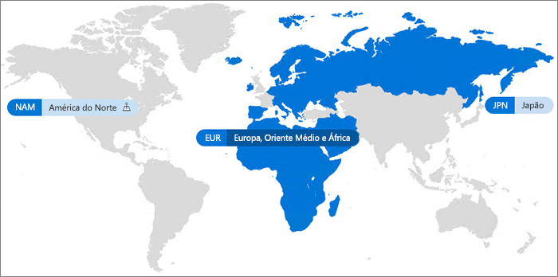

# Office 365 multigeográfico

Com o Office 365 multigeográfico, sua organização poderá expandir sua presença do Office 365 para várias regiões geográficas e/ou os países em seu locatário existente. Entre em contato com sua equipe de conta da Microsoft para inscrever sua empresa multinacional para o Office 365 multigeográfico.
  
Com o Office 365 multigeográfico, você pode provisionar e armazenar dados em repouso nas localizações geográficas escolhidas para atender aos requisitos de residência de dados e, ao mesmo tempo, dar vazão à sua implantação global a partir de experiências de produtividade modernas para a sua força de trabalho.

#### Vídeo: Apresentando o Office 365 multigeográfico

> [!VIDEO https://www.microsoft.com/videoplayer/embed/RE1Yk6B?autoplay=false]

Em um ambiente multigeográfico, seu locatário do Office 365 consiste em um local central (onde a assinatura do Office 365 originalmente foi provisionada) e um ou mais locais do satélite. Em um locatário multigeográfico, as informações sobre localizações geográficas, grupos e informações do usuário são dominadas no Azure Active Directory (AAD). Como as informações de locatário são dominadas centralmente e sincronizadas em cada localização geográfica, compartilhamento e experiências envolvendo qualquer pessoa da sua empresa contêm percepção global.

Observe que o Office 365 multigeográfico não foi desenvolvido para otimizar o desempenho, foi projetado para atender aos requisitos de residência de dados. Para saber mais sobre a otimização do desempenho do Office 365, confira [planejamento de rede e ajuste de desempenho do Office 365](https://support.office.com/article/e5f1228c-da3c-4654-bf16-d163daee8848) ou Fale com o suporte.

## Terminologia

Aqui estão os principais termos usados para descrever o Office 365 multigeográfico:

- **Uma localização central** -a localização geográfica onde seu locatário foi originalmente provisionado.
- **Administrador geográfico**, um administrador que pode administrar um ou mais locais do satélite especificado.
- **Geocódigo** -um código de três letras de uma localização geográfica determinada.
- **Localização geográfica** – uma localização geográfica pode ser usada em um locatário multigeográfico para hospedar dados, incluindo caixas de correio do Exchange e o OneDrive e sites do SharePoint.
- **Preferenciais de dados local (PDL)** a propriedade do usuário definido pelo administrador que indica onde a localização geográfica onde a caixa de correio do Exchange usuários e do OneDrive devem ser provisionadas. A PDL determina também onde os sites do SharePoint criados pelo usuário estão provisionados.
- **Localização de satélite** – As localizações geográficas em que as cargas de trabalho geográficas do Office 365 (SharePoint, OneDrive e Exchange) estão habilitadas em um locatário multigeográfico.
- **Locatário** – – a representação de uma organização no Office 365 que geralmente tem um ou mais domínios associados (por exemplo, contoso.com).

## Disponibilidade do Office 365 multigeográfico

A multigeografia do Office 365 atualmente é oferecida nos países e regiões seguintes:

[!INCLUDE [Office 365 Multi-Geo locations](includes/office-365-multi-geo-locations.md)]

## Introdução

Siga estas etapas para iniciar com o multigeográfico:

1. Trabalhe com a sua equipe de conta para adicionar o plano de serviço _Funcionalidades multigeográficas do Office 365_. Elas orientarão você ra adicionar o número de licenças necessárias. O recurso multigeográfico está disponível para clientes com um mínimo de 500 assinaturas do Office 365.

   Antes de começar a usar o Office 365 multigeográfico, a Microsoft precisa configurar seu locatário do Exchange Online para suporte multigeográfico. Esse processo de configuração único é disparado após você solicitar o plano de serviço *Funcionalidades Multigeográficas no Office 365* e as licenças aparecem em seu locatário. Você receberá notificações no [Centro de mensagens do Office 365](https://support.office.com/article/38FB3333-BFCC-4340-A37B-DEDA509C2093) depois que as licenças multigeográficas são aplicadas e você pode começar configurar e usar recursos do Office 365 multigeográfico.

2. Leia [planejar o ambiente multigeográfico](plan-for-multi-geo.md).

3. Saiba mais sobre [administrar um ambiente multigeográfico](administering-a-multi-geo-environment.md) e [como seus usuários terão o ambiente](multi-geo-user-experience.md).

4. Quando estiver pronto para configurar o Office 365 Multigeográfico, [configurar seu locatário multigeográfico](multi-geo-tenant-configuration.md).

5. [Configurar pesquisa](configure-search-for-multi-geo.md).

## Confira também

[Multigeográfico no Exchange Online e no OneDrive](https://Aka.ms/GoMultiGeo)

[Recursos multigeográficos no OneDrive e SharePoint Online](https://docs.microsoft.com/office365/enterprise/multi-geo-capabilities-in-onedrive-and-sharepoint-online-in-office-365)

[Recursos multigeográficos no Exchange Online](https://docs.microsoft.com/office365/enterprise/multi-geo-capabilities-in-exchange-online)

[Experiência da equipe em um ambiente multigeográfico](https://docs.microsoft.com/microsoftteams/teams-experience-o365odb-spo-multi-geo)
