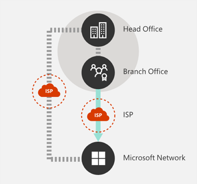
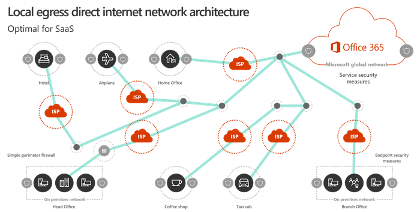

# Princípios de conectividade de rede do Office 365

Antes de começar a planejar sua rede para a conectividade de rede do Office 365, é importante compreender os princípios de conectividade para o gerenciamento seguro do tráfego do Office 365 e obter o melhor desempenho possível. Este artigo o ajudará a entender as orientações mais recentes para otimizar com segurança a conectividade de rede do Office 365.
  
As redes corporativas tradicionais são projetadas principalmente para fornecer aos usuários acesso a aplicativos e dados hospedados em datacenters da empresa operados com alta segurança de perímetro. O modelo tradicional pressupõe que os usuários acessarão aplicativos e dados de dentro do perímetro de rede corporativa, através de links WAN de filiais ou remotamente por conexões VPN. 
  
A adoção de aplicativos SaaS como o Office 365 transfere uma combinação de serviços e dados fora do perímetro da rede. Sem otimização, o tráfego entre usuários e aplicativos SaaS está sujeito à latência introduzida pela inspeção de pacotes, hairpins de rede, conexões inadvertidas para pontos de extremidade distantes geograficamente e outros fatores. Você pode garantir o melhor desempenho e a confiabilidade do Office 365, compreendendo e implementando as principais diretrizes de otimização.
  
Neste artigo, você aprenderá sobre:
  
- [Arquitetura do Office 365](office-365-network-connectivity-principles.md#BKMK_Architecture) como ela se aplica à conectividade do cliente à nuvem
- Conceitos e estratégias de [conectividade do Office 365](office-365-network-connectivity-principles.md#BKMK_Principles) atualizados para otimizar o tráfego de rede e a experiência do usuário final
- O [serviço Web de pontos de extremidade do Office 365](office-365-network-connectivity-principles.md#BKMK_WebSvc), que permite aos administradores de rede consumir uma lista estruturada de pontos de extremidade para uso na otimização de rede
- Novas orientações de otimização e [categorias de pontos de extremidade do Office 365](office-365-network-connectivity-principles.md#BKMK_Categories)
- [ComParando a segurança de perímetro de rede com segurança de ponto](office-365-network-connectivity-principles.md#BKMK_SecurityComparison)
- Opções de [otimização incremental](office-365-network-connectivity-principles.md#BKMK_IncOpt) para o tráfego do Office 365

## Arquitetura do Office 365

O Office 365 é uma nuvem de software (SaaS) distribuída que oferece cenários de produtividade e colaboração por meio de um conjunto variado de micro serviços e aplicativos, como o Exchange Online, o SharePoint Online, o Skype for Business Online, o Microsoft Teams, proteção do Exchange Online, Office Online e muitas outras. Embora aplicativos específicos do Office 365 possam ter seus recursos exclusivos como se aplicam à rede do cliente e à conectividade com a nuvem, todos eles compartilham algumas principais entidades, metas e padrões de arquitetura. Essas entidades e os padrões de arquitetura para a conectividade são típicos para muitas outras nuvens de SaaS e, ao mesmo tempo, ser muito diferentes dos modelos de implantação típicos de nuvens de plataforma como serviço e infraestrutura como serviço, como Microsoft Azure.
  
Um dos recursos arquitetônicos mais significativos do Office 365 (que é freqüentemente perdido ou mal interpretado pelos planejadores de rede) é que ele é um serviço distribuído verdadeiramente global, no contexto de como os usuários se conectam a ele. O local do locatário do Office 365 de destino é importante para entender a localidade de onde os dados do cliente são armazenados na nuvem, mas a experiência do usuário com o Office 365 não envolve a conexão direta com os discos que contêm os dados. A experiência do usuário com o Office 365 (incluindo desempenho, confiabilidade e outras características de qualidade importantes) envolve a conectividade por meio de uma conexão de front Doors de serviço altamente distribuído que são dimensionadas entre centenas de locais da Microsoft em todo o mundo. Na maioria dos casos, a melhor experiência do usuário é alcançada, permitindo que a rede do cliente encaminhe as solicitações do usuário para o ponto de entrada mais próximo do serviço do Office 365, em vez de se conectar ao Office 365 por meio de um ponto de saída em um local ou região central.
  
Para a maioria dos clientes, os usuários do Office 365 são distribuídos em vários locais. Para obter os melhores resultados, os princípios descritos neste documento devem ser examinados do ponto de vista de dimensionamento (sem escala), concentrando-se na otimização da conectividade para o ponto mais próximo de presença na rede global da Microsoft, e não à geográfico Localização do locatário do Office 365. Em essência, isso significa que, embora os dados do locatário do Office 365 possam ser armazenados em um local geográfico específico, a experiência do Office 365 para esse locatário permanece distribuída e pode estar presente em proximidade (rede) para cada local de usuário final que o locatário tem .
  
## Princípios de conectividade do Office 365

A Microsoft recomenda os seguintes princípios para obter a melhor conectividade e desempenho do Office 365. Use estes princípios de conectividade do Office 365 para gerenciar seu tráfego e obter o melhor desempenho ao se conectar ao Office 365.
  
O objetivo principal no design de rede deve ser minimizar a latência reduzindo o tempo de ida e volta (RTT) da sua rede para a rede global da Microsoft, o backbone de rede pública da Microsoft que interconecta todos os datacenters da Microsoft com baixa latência e pontos de entrada do aplicativo em nuvem espalhados pelo mundo. Você pode saber mais sobre a rede global da Microsoft em [como a Microsoft cria sua rede global rápida e confiável](https://azure.microsoft.com/en-us/blog/how-microsoft-builds-its-fast-and-reliable-global-network/).
  

### Identificar e diferenciar o tráfego do Office 365

  
A identificação do tráfego de rede do Office 365 é a primeira etapa na capacidade de diferenciar o tráfego de tráfego de rede genérico associado à Internet. A conectividade do Office 365 pode ser otimizada implementando uma combinação de abordagens como otimização de rota de rede, regras de firewall, configurações de proxy do navegador e bypass de dispositivos de inspeção de rede para determinados pontos de extremidade.
  
Diretrizes anteriores de otimização do Office 365 divididas os pontos de extremidade do Office **** 365 em duas categorias, obrigatórias e **opcionais**. Como pontos de extremidade foram adicionados para suportar novos serviços e recursos do Office 365, reorganizamos pontos de extremidade do Office 365 em três categorias: **otimizar**, **permitir** e **padrão**. As diretrizes para cada categoria se aplicam a todos os pontos de extremidade da categoria, facilitando a compreensão e a implementação de otimizações. 
  
Para obter mais detalhes sobre as categorias de ponto de extremidade do Office 365 e métodos de otimização, consulte a seção [novas categorias de ponto de extremidade do office 365](office-365-network-connectivity-principles.md#BKMK_Categories) .
  
Agora, a Microsoft publica todos os pontos de extremidade do Office 365 como um serviço da Web e fornece orientações sobre a melhor maneira de usar esses dados. Para obter mais informações sobre como buscar e trabalhar com os pontos de extremidade do Office 365, consulte o artigo sobre [URLs e intervalos de endereços IP do office 365](https://support.office.com/en-us/article/office-365-urls-and-ip-address-ranges-8548a211-3fe7-47cb-abb1-355ea5aa88a2?ui=en-US&amp;rs=en-US&amp;ad=US).
  

### Enviar conexões de rede de saída localmente

  
O DNS local e o egresso da Internet são fundamentais para reduzir a latência de conexão e garantir que as conexões de usuário sejam feitas para o ponto de entrada mais próximo dos serviços do Office 365. Em uma topologia de rede complexa, é importante implementar o egresso local de DNS e a Internet. Para obter mais informações sobre como o Office 365 roteia conexões de cliente para o ponto de entrada mais próximo, consulte o artigo [Client Connectivity](https://support.office.com/en-us/article/client-connectivity-4232abcf-4ae5-43aa-bfa1-9a078a99c78b).
  
Antes do surgimento de serviços em nuvem como o Office 365, a conectividade de Internet do usuário final como um fator de design na arquitetura de rede era relativamente simples. Quando os serviços de Internet e os sites são distribuídos em todo o mundo, a latência entre os pontos de egresso corporativos e qualquer ponto de extremidade de destino é basicamente uma função de distância geográfica.
  
Em uma arquitetura de rede tradicional, todas as conexões de saída da Internet atravessam a rede corporativa e saem de um local central. À medida que as ofertas de nuvem da Microsoft ficaram amadurecedas, uma arquitetura de rede distribuída voltada para a Internet se tornou crítica para o suporte a serviços em nuvem sensíveis à latência. A rede global da Microsoft foi projetada para acomodar requisitos de latência com a infraestrutura de porta frontal de serviço distribuído, uma malha dinâmica de pontos de entrada globais que roteia conexões de serviço de nuvem de entrada para o ponto de entrada mais próximo. Isso se destina a reduzir o tamanho da "última milha" para os clientes do Microsoft Cloud, reduzindo efetivamente a rota entre o cliente e a nuvem.
  
As WANs corporativas geralmente são projetadas para backhaul o tráfego de rede para um escritório central da empresa para inspeção antes da saída para a Internet, geralmente por meio de um ou mais servidores proxy. O diagrama a seguir ilustra essa topologia de rede.
  

  
Como o Office 365 é executado na rede global da Microsoft, que inclui servidores front-end em todo o mundo, muitas vezes haverá um servidor front-end próximo ao local do usuário. Ao fornecer egresso de Internet local e configurar servidores DNS internos para fornecer resolução de nomes locais para os pontos de extremidade do Office 365, o tráfego de rede destinado ao Office 365 pode se conectar aos servidores front-end do Office 365 o mais próximo possível do usuário. O diagrama abaixo mostra um exemplo de topologia de rede que permite que os usuários se conectem do escritório principal, filiais e locais remotos para acompanhar a rota mais curta para o ponto de entrada mais próximo do Office 365.
  

  
A redução do caminho de rede para os pontos de entrada do Office 365 dessa forma pode melhorar o desempenho de conectividade e a experiência de usuário final no Office 365 e também pode ajudar a reduzir o impacto de futuras alterações na arquitetura de rede do desempenho do Office 365 e segurança.
  
Além disso, as solicitações de DNS podem apresentar latência se o servidor DNS de resposta estiver distante ou ocupado. Você pode minimizar a latência de resolução de nome ao provisionar os servidores DNS locais em locais de filiais e garantir que eles sejam configurados para armazenar em cache os registros DNS de forma apropriada.
  
Embora a saída regional possa funcionar bem para o Office 365, o modelo de conectividade ideal seria sempre fornecer egresso de rede no local do usuário, independentemente se isso está na rede corporativa ou locais remotos, como casa, hotéis, lanchonetes e Aeroportos. Esse modelo de egresso direta local é representado no diagrama abaixo.
  

  
As empresas que adotaram o Office 365 podem aproveitar a arquitetura de porta frontal de serviço distribuído da rede global da Microsoft, garantindo que as conexões de usuário com o Office 365 tenham a rota mais curta possível para a entrada de rede global mais próxima casa. A arquitetura de rede de egresso local faz isso permitindo que o tráfego do Office 365 seja roteado através da saída mais próxima, independentemente do local do usuário.
  
A arquitetura de egresso local tem os seguintes benefícios em relação ao modelo tradicional:
  
- Oferece o melhor desempenho do Office 365, otimizando o tamanho da rota. As conexões de usuário final são direcionadas dinamicamente para o ponto de entrada mais próximo do Office 365 pela infraestrutura de porta frontal do serviço distribuído.
- Reduz a carga na infraestrutura de rede corporativa, permitindo a saída local.
- Protege as conexões em ambas as extremidades, aproveitando a segurança do ponto de extremidade do cliente e os recursos de segurança na nuvem.

### Evitar hairpins de rede

  
Como regra geral, a rota mais curta e direta entre o usuário e o ponto de extremidade mais próximo do Office 365 oferecerá o melhor desempenho. Um hairpin de rede ocorre quando o tráfego de WAN ou VPN vinculado a um determinado destino é direcionado primeiro para outro local intermediário (como pilha de segurança, agente de acesso à nuvem, do gateway Web baseado na nuvem), apresentando latência e redirecionamento potencial para um ponto de extremidade distante geograficamente. O hairpins de rede também pode ser causado por ineficiências de roteamento/emparelhamento ou de buscas de DNS de baixo (remoto).
  
Para garantir que a conectividade do Office 365 não esteja sujeita ao hairpins da rede, mesmo no caso de egresso local, verifique se o provedor de serviço de Internet usado para fornecer egresso de Internet para o local de usuário tem uma relação de emparelhamento direto com a rede global da Microsoft em Close Proximity para esse local. Você também pode configurar o roteamento de saída para enviar o tráfego confiável do Office 365 diretamente, em vez de fazer o proxy ou o encapsulamento por meio de uma nuvem de terceiros ou um fornecedor de segurança de rede baseado em nuvem que processa seu tráfego de Internet. A resolução de nomes DNS locais de pontos de extremidade do Office 365 ajuda a garantir que, além do roteamento direto, os pontos de entrada do Office 365 mais próximos estejam sendo usados para conexões de usuário.
  
Se você usar a rede baseada em nuvem ou serviços de segurança para o seu tráfego do Office 365, certifique-se de que o efeito grampeamento seja avaliado e seu impacto no desempenho do Office 365 seja compreendido. Isso pode ser feito examinando o número e os locais dos locais do provedor de serviços por meio dos quais o tráfego é encaminhado em relação ao número de seus escritórios de filial e pontos de emparelhamento da rede global da Microsoft, qualidade da relação de emparelhamento de rede de o provedor de serviços com seu ISP e a Microsoft e o impacto de desempenho da reentrada na infraestrutura do provedor de serviços.
  
Devido ao grande número de locais distribuídos com pontos de entrada do Office 365 e sua proximidade com os usuários finais, o roteamento do Office 365 para qualquer rede de terceiros ou provedor de segurança pode ter um impacto adverso nas conexões do Office 365 se a rede do provedor não estiver configurado para o emparelhamento do Office 365 ideal.
  

### Avaliar o bypass de proxies, dispositivos de inspeção de tráfego e tecnologias de segurança duplicadas

  
Os clientes corporativos devem revisar os métodos de segurança de rede e de redução de risco específicos para o tráfego de entrada do Office 365 e usar os recursos de segurança do Office 365 para reduzir a confiança no impacto intrusivo, no desempenho e na segurança de rede dispendiosa tecnologias para o tráfego de rede do Office 365.
  
A maioria das redes corporativas impõe a segurança de rede para o tráfego da Internet usando tecnologias como proxies, inspeção de SSL, inspeção de pacote e sistemas de prevenção contra perda de dados. Essas tecnologias oferecem uma redução de risco importante para solicitações de Internet genéricas, mas podem reduzir drasticamente o desempenho, a escalabilidade e a qualidade da experiência do usuário final quando aplicadas aos pontos de extremidade do Office 365.
  

#### Serviço Web de pontos de extremidade do Office 365

Os administradores do Office 365 podem usar um script ou uma chamada REST para consumir uma lista estruturada de pontos de extremidade do serviço Web de pontos de extremidade do Office 365 e atualizar as configurações de firewalls de perímetro e outros dispositivos de rede. Isso garantirá que o tráfego associado ao Office 365 seja identificado, Tratado de forma adequada e gerenciado de modo diferente do tráfego de rede de acordo com os sites genéricos e geralmente desconhecidos da Internet. Para obter mais informações sobre como usar o serviço Web de pontos de extremidade do Office 365, consulte o artigo sobre [URLs e intervalos de endereços IP do office 365](https://support.office.com/en-us/article/office-365-urls-and-ip-address-ranges-8548a211-3fe7-47cb-abb1-355ea5aa88a2?ui=en-US&amp;rs=en-US&amp;ad=US).
  
#### Scripts de PAC (configuração automática de proxy)

Os administradores do Office 365 podem criar scripts de PAC (configuração automática de proxy) que podem ser entregues a computadores do usuário via WPAD ou GPO. Os scripts de PAC podem ser usados para ignorar proxies para solicitações do Office 365 de usuários de WAN ou VPN, permitindo que o tráfego do Office 365 use conexões diretas com a Internet, em vez de atravessar a rede corporativa.
  
#### Recursos de segurança do Office 365

A Microsoft é transparente sobre a segurança de datacenter, a segurança operacional e a redução de riscos em torno dos servidores do Office 365 e dos pontos de extremidade de rede que representam. Os recursos internos de segurança do Office 365 estão disponíveis para reduzir o risco de segurança de rede, como prevenção contra perda de dados, antivírus, autenticação multiFator, caixa de bloqueio de cliente, proteção avançada contra ameaças, Office 365 Threat Intelligence, Office 365 Secure Pontuação, proteção do Exchange Online e segurança de DDOS de rede.
  
Para obter mais informações sobre o Microsoft datacenter e a segurança de rede global, consulte a [central de confiabilidade da Microsoft](https://www.microsoft.com/en-us/trustcenter/security).
  
## Novas categorias de pontos de extremidade do Office 365

Os pontos de extremidade do Office 365 representam um conjunto variado de endereços de rede e sub-redes. Os pontos de extremidade podem ser URLs, endereços IP ou intervalos IP e alguns pontos de extremidade são listados com portas TCP/UDP específicas. URLs podem ser um FQDN como *account.office.net* ou uma URL curinga como * \*. office365.com*.
  
> [!NOTE]
> Os locais dos pontos de extremidade do Office 365 dentro da rede não estão diretamente relacionados ao local dos dados de locatário do Office 365. Por esse motivo, os clientes devem examinar o Office 365 como um serviço distribuído e global e não devem tentar bloquear conexões de rede para pontos de extremidade do Office 365 com base nos critérios geográficos.
  
No nosso guia anterior para gerenciar o tráfego do Office 365, os pontos de extremidade foram organizados em **** duas categorias, obrigatórias e **opcionais**. Os pontos de extremidade dentro de cada categoria exigiam otimizações diferentes dependendo da criticalidade do serviço, e muitos clientes enfrentam desafios para justificar o aplicativo das mesmas otimizações de rede à lista completa de URLs e endereços IP do Office 365. 
  
No novo modelo, os pontos de extremidade são separados em três categorias, **otimizar**, **permitir** e **padrão**, fornecendo uma tabela dinâmica baseada em prioridades em que os esforços de otimização de rede devem ser focalizados para obter os melhores aprimoramentos de desempenho e retorno sobre o investimento. Os pontos de extremidade são consolidados nas categorias acima com base na confidencialidade da experiência de usuário efetiva para a qualidade da rede, o envelope de volume e desempenho de cenários e a facilidade de implementação. As otimizações recomendadas podem ser aplicadas da mesma maneira a todos os pontos de extremidade em uma determinada categoria.
  
- **Otimizar** pontos de extremidade é necessário para conectividade a cada serviço do Office 365 e representar mais de 75% de largura de banda, conexões e volume de dados do Office 365. Esses pontos de extremidade representam cenários do Office 365 que são mais confidenciais para desempenho da rede, latência e disponibilidade. Todos os pontos de extremidade são hospedados em datacenters da Microsoft. A taxa de alteração para os pontos de extremidade desta categoria deve ser muito menor do que os pontos de extremidade nas outras duas categorias. Esta categoria inclui um conjunto muito pequeno (na ordem de aproximadamente 10) de URLs de chave e um conjunto definido de sub-redes IP dedicadas às cargas de trabalho principais do Office 365, como o Exchange Online, o SharePoint Online, o Skype for Business Online e o Microsoft Teams.

    Uma lista condensada de pontos de extremidade críticos bem definidos deve ajudá-lo a planejar e implementar otimizações de rede de alto valor para esses destinos de forma mais rápida e fácil.

    exemplos de *otimização* de pontos de extremidade *https://outlook.office365.com* incluem *,\<https://\>locatário. sharepoint.com* e *\<https://\>locatário-my.sharepoint.com* .

    Os métodos de otimização incluem:

  - Bypass ou whitelist *otimiza* pontos de extremidade em dispositivos de rede e serviços que realizam interceptação de tráfego, descriptografia SSL, inspeção de pacote profunda e filtragem de conteúdo.
  - Ignorar dispositivos de proxy locais e serviços de proxy baseados em nuvem comumente usados para a navegação genérica na Internet.
  - Priorize a avaliação desses pontos de extremidade como totalmente confiáveis para sua infraestrutura de rede e sistemas de perímetro.
  - Priorize a redução ou a eliminação de inviabilização de WAN e facilite a saída direta com base na Internet para esses pontos de extremidade próximos aos usuários/locais de filiais.
  - Facilite a conectividade direta para esses pontos de extremidade de nuvem para usuários VPN implementando o túnel de divisão.
  - Verifique se os endereços IP retornados pela resolução de nomes DNS correspondem ao caminho de egresso de roteamento desses pontos de extremidade.
  - Priorize esses pontos de extremidade para a integração SD-WAN para roteamento de latência direta e mínima para o ponto de emparelhamento da Internet mais próximo da rede global da Microsoft.

- **Permite que** os pontos de extremidade sejam necessários para conectividade com serviços e recursos específicos do Office 365, mas não são tão sensíveis ao desempenho e à latência da rede que os da categoria *otimizar* . A superfície geral da rede desses pontos de extremidade do ponto de vista da contagem de largura de banda e de conexão também é significativamente menor. Esses pontos de extremidade são dedicados ao Office 365 e são hospedados em datacenters da Microsoft. Eles representam um amplo conjunto de serviços do Office 365 e suas dependências (na ordem de ~ 100 URLs) e devem mudar com uma taxa mais alta do que aqueles na categoria *otimizar* . Nem todos os pontos de extremidade desta categoria estão associados a sub-redes IP dedicadas definidas.

    Otimizações de rede para *permitir* pontos de extremidade podem melhorar a experiência do usuário do Office 365, mas alguns clientes podem optar por fazer o escopo dessas otimizações de forma mais estreita para minimizar as alterações em sua rede.

    Exemplos de *permitir* pontos de extremidade incluem *https://\*. Protection.Outlook.com* e *https://accounts.accesscontrol.windows.net*.

    Os métodos de otimização incluem:

  - Bypass ou whitelist *permite* pontos de extremidade em dispositivos de rede e serviços que realizam interceptação de tráfego, descriptografia SSL, inspeção de pacote profunda e filtragem de conteúdo.
  - Priorize a avaliação desses pontos de extremidade como totalmente confiáveis para sua infraestrutura de rede e sistemas de perímetro.
  - Priorize a redução ou a eliminação de inviabilização de WAN e facilite a saída direta com base na Internet para esses pontos de extremidade próximos aos usuários/locais de filiais.
  - Verifique se os endereços IP retornados pela resolução de nomes DNS correspondem ao caminho de egresso de roteamento desses pontos de extremidade.
  - Priorize esses pontos de extremidade para a integração SD-WAN para roteamento de latência direta e mínima para o ponto de emparelhamento da Internet mais próximo da rede global da Microsoft.

- **Os** pontos de extremidade padrão representam os serviços e dependências do Office 365 que não exigem otimização e que podem ser tratados por redes de clientes como tráfego de entrada da Internet normal. Observe que alguns pontos de extremidade nesta categoria podem não estar hospedados nos datacenters da Microsoft. Os exemplos *https://odc.officeapps.live.com* incluem *https://appexsin.stb.s-msn.com*e.

Para obter mais informações sobre as técnicas de otimização de rede do Office 365, consulte o artigo [Managing office 365](https://support.office.com/en-us/article/managing-office-365-endpoints-99cab9d4-ef59-4207-9f2b-3728eb46bf9a#ID0EAEAAA=0._Overview)endpoints.
  
## ComParando a segurança de perímetro de rede com segurança de ponto

O objetivo da segurança de rede tradicional é reforçar o perímetro da rede corporativa contra invasão e explorações mal-intencionadas. À medida que as organizações adotam o Office 365, alguns serviços e dados de rede são parcialmente ou completamente migrados para a nuvem. Como acontece com qualquer alteração fundamental na arquitetura de rede, esse processo requer uma reavaliação da segurança de rede que leva em conta os fatores emergentes:
  
- À medida que os serviços de nuvem são adotados, os serviços de rede e os dados são distribuídos entre os data centers locais e a nuvem, e a segurança de perímetro não é mais adequada por conta própria.
- Os usuários remotos se conectam aos recursos corporativos em datacenters locais e na nuvem de locais não controlados, como residências, hotéis e lanchonetes.
- Os recursos de segurança criados por finalidade estão cada vez mais incorporados aos serviços em nuvem e podem potencialmente complementar ou substituir sistemas de segurança existentes.

A Microsoft oferece uma ampla variedade de recursos de segurança do Office 365 e fornece orientação prescritiva para o emprego de práticas recomendadas de segurança que podem ajudar a garantir a segurança de dados e de rede do Office 365. As práticas recomendadas são as seguintes:
  
- **Usar a protocolo de autenticação multifator (MFA)** A MFA adiciona uma camada adicional de proteção a uma estratégia de senha forte, exigindo que os usuários reconheçam uma chamada telefônica, uma mensagem de texto ou uma notificação de aplicativo em seu telefone inteligente após a inserção correta da senha.

- **Usar o Office 365 Cloud app Security** Configurar políticas para controlar atividades anômalas e agir sobre ela. Configurar alertas com o Office 365 Cloud app Security para que os administradores possam examinar atividades de usuário incomuns ou arriscadas, como baixar grandes quantidades de dados, várias tentativas de entrada com falha ou conexões de endereços IP desconhecidos ou perigosos.

- **Configurar a DLP (prevenção contra perda de dados)** O DLP permite identificar dados confidenciais e criar políticas que ajudam a evitar que os usuários compartilhem acidentalmente ou intencionalmente os dados. A DLP funciona no Office 365, incluindo o Exchange Online, o SharePoint Online e o OneDrive para que os usuários possam permanecer em conformidade sem interromper o fluxo de trabalho.

- **Usar Lockbox de cliente** Como um administrador do Office 365, você pode usar o Lockbox do cliente para controlar como um engenheiro de suporte da Microsoft acessa seus dados durante uma sessão de ajuda. Nos casos em que o engenheiro exige acesso aos seus dados para solucionar problemas e corrigir um problema, o cliente de lockbox permite aprovar ou rejeitar a solicitação de acesso.

- **Usar a pontuação segura do Office 365** A pontuação segura é uma ferramenta de análise de segurança que recomenda o que você pode fazer para reduzir ainda mais o risco. A pontuação segura examina suas configurações e atividades do Office 365 e as compara a uma linha de base estabelecida pela Microsoft. Você receberá uma pontuação com base em como o alinhamento está com as práticas recomendadas de segurança.

Uma abordagem holística à segurança avançada deve incluir a consideração do seguinte:
  
- Deslocar a ênfase da segurança de perímetro em relação à segurança do ponto de extremidade aplicando recursos de segurança de cliente do Office e baseado em nuvem.
  - Reduzir o perímetro de segurança para o datacenter
  - Habilitar a confiança equivalente para dispositivos de usuário dentro do escritório ou em locais remotos
  - Foco em proteger o local dos dados e o local do usuário
  - As máquinas de usuário gerenciadas têm confiança maior com segurança de ponto de extremidade
- Gerenciar toda a segurança de informações de forma holística, sem se concentrar exclusivamente no perímetro
  - Redefina o WAN e a criação da segurança de rede de perímetro, permitindo que o tráfego confiável ignore os dispositivos de segurança e separando os dispositivos não gerenciados para redes Wi-Fi convidados.
  - Reduz os requisitos de segurança de rede da borda WAN corporativa
  - Alguns dispositivos de segurança de perímetro de rede, como firewalls, ainda são necessários, mas a carga é reduzida
  - Garante a egresso local do tráfego do Office 365
- Os aprimoramentos podem ser abordados em incrementos, conforme descrito na seção [otimização incremental](office-365-network-connectivity-principles.md#BKMK_IncOpt) . Algumas técnicas de otimização podem oferecer melhores taxas de custo/benefício, dependendo da arquitetura da rede, e você deve escolher otimizações que fazem mais sentido para sua organização.

Para obter mais informações sobre segurança e conformidade do Office 365, consulte o artigo [visão geral de segurança e conformidade no Office 365](https://support.office.com/en-us/article/overview-of-security-and-compliance-in-office-365-dcb83b2c-ac66-4ced-925d-50eb9698a0b2?ui=en-US&amp;rs=en-US&amp;ad=US).
  
## Otimização incremental

Nós representamos o modelo de conectividade de rede ideal para o SaaS anteriormente neste artigo, mas, para muitas organizações grandes, com arquiteturas de rede complexas históricas, não será prático fazer todas essas alterações diretamente. Nesta seção, discutimos várias alterações incrementais que podem ajudar a melhorar o desempenho e a confiabilidade do Office 365.
  
Os métodos que você usará para otimizar o tráfego do Office 365 irão variar dependendo da sua topologia de rede e dos dispositivos de rede que você implementou. Grandes empresas com vários locais e práticas de segurança de rede complexas precisarão desenvolver uma estratégia que inclua a maioria ou todos os princípios listados na seção [princípios de conectividade do Office 365](office-365-network-connectivity-principles.md#BKMK_Principles) , enquanto organizações menores podem apenas é necessário considerar um ou dois.
  
Você pode abordar a otimização como um processo incremental, aplicando cada método sucessivamente. A tabela a seguir lista os principais métodos de otimização em ordem de impacto na latência e confiabilidade para o maior número de usuários.
  
|**Método de otimização**|**Descrição**|**Impacto**|
|:-----|:-----|:-----|
|Resolução de DNS local e saída de Internet    |ProVisione servidores DNS locais em cada local e verifique se o Office 365 faz conexões de saída para a Internet o mais próximo possível do local do usuário.    | Minimizar latência     Melhorar a conectividade confiável para o ponto de entrada mais próximo do Office 365    |
|Adicionar pontos de saída regionais    |Se sua rede corporativa tiver vários locais, mas apenas um ponto de saída, adicione pontos de saída regionais para permitir que os usuários se conectem ao ponto de entrada do Office 365 mais próximo.    | Minimizar latência     Melhorar a conectividade confiável para o ponto de entrada mais próximo do Office 365    |
|Ignorar proxies e dispositivos de inspeção    |Configure navegadores com arquivos de PAC que enviam solicitações do Office 365 diretamente aos pontos de saída.    Configure roteadores de borda e firewalls para permitir tráfego do Office 365 sem inspeção.    | Minimizar latência     Reduzir a carga nos dispositivos de rede    |
|Habilitar conexão direta para usuários VPN    |Para usuários VPN, habilite conexões do Office 365 para se conectar diretamente a partir da rede do usuário, e não do túnel VPN, implementando o túnel de divisão.    | Minimizar latência     Melhorar a conectividade confiável para o ponto de entrada mais próximo do Office 365    |
|Migrar da WAN tradicional para o SD-WAN    |SD-WANs (redes de longa distância definidas pelo software) simplificam o gerenciamento de WAN e aprimoram o desempenho substituindo roteadores WAN tradicionais por dispositivos virtuais, semelhante à virtualização de recursos de computação usando VMs (máquinas virtuais).    | Melhorar o desempenho e a capacidade de gerenciamento do tráfego de WAN     Reduzir a carga nos dispositivos de rede    |
