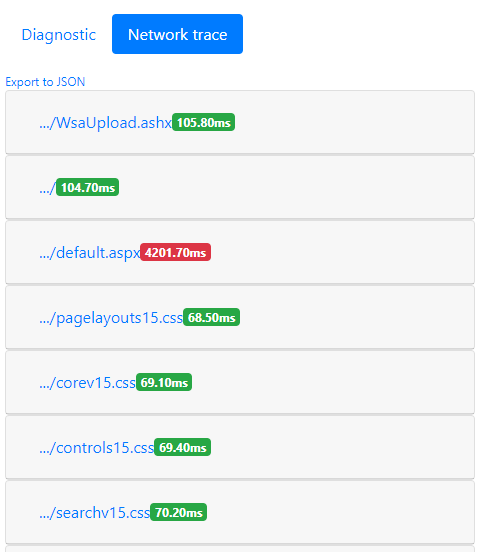

# Use a ferramenta de diagnóstico de página para o SharePoint Online

Este artigo descreve como você pode usar a ferramenta de diagnóstico de página para analisar o clássicas páginas de publicação e páginas em sites de equipe clássico, em relação a um subconjunto das práticas recomendadas no **SharePoint Online**. 
  
Sites de equipe que não têm a publicação ativada não podem fazer com o uso das CDNs mas todas as demais regras são aplicáveis. Publicação adiciona sobrecarga adicional, portanto, não ative publicação apenas para obter a funcionalidade CDN conforme impactará negativamente tempos de carregamento de página.

**Observação que V1.05 foi liberada portanto, a atualização de sua extensão, se você tiver instalado já**. Se você não souber qual versão você tem, em seguida, clique no link "Cerca" para verificar se ele.
  
> [!IMPORTANT]
> A ferramenta de diagnóstico de página não será executado em bibliotecas de documentos ou páginas de sistema, como a ferramenta foi projetada para examinar páginas do site do SharePoint. Uma página *AllItems* é uma página do sistema. Se você tentar executar a ferramenta em uma página do sistema, você receberá uma mensagem que lê, "Este aplicativo só deve ser executado nas páginas do SharePoint."   Isso não é um erro na ferramenta de forma que não há nenhum valor na avaliação bibliotecas ou páginas do sistema. Navegue até uma página do SharePoint não seja do sistema para usar a ferramenta. Caso isso aconteça em uma página do SharePoint, verifique a página mestre como vimos os clientes remover MetaTags o SharePoint e, em seguida, a página não é mais uma página do SharePoint. Se desejar fornecer comentários sobre a ferramenta por favor, clique na guia sobre e siga a [oferecer o link de comentários](https://go.microsoft.com/fwlink/?linkid=874109). 
  
## Instalar a ferramenta de diagnóstico de página

> [!IMPORTANT]
> Microsoft não lê os dados ou sites que você visita e não podemos capturar quaisquer informações pessoais, site ou fazer download de informações com esta ferramenta. A única informação registrada pela ferramenta é o nome do locatário, contagem e se a opção de registro em log de suporte é utilizada quando a ferramenta for executada da regra. Essas informações são para a Microsoft para analisar que desafios estão sendo apresentados pelos nossos clientes e garantir que a capacidade de registro em log de suporte não está sendo uso inadequada.

1. Usando um navegador Chrome, abra o [link para a ferramenta](https://chrome.google.com/webstore/detail/inahogkhlkbkjkkaleonemeijihmfagi) diretamente ou abra a pesquisa no [Chrome navegador WebStore](https://chrome.google.com/webstore/search/page%20diagnostics%20for%20sharepoint) e instalar a extensão do navegador. Revise a política de privacidade do usuário fornecidas na página descrição no repositório. Ao adicionar a ferramenta ao seu navegador, você verá o seguinte aviso de permissões.     Este aviso é in-loco, porque uma página pode conter o conteúdo de locais fora do SharePoint, dependendo da Web Parts e personalizações na página. Isso significa que a ferramenta lerá as solicitações e respostas quando clicar no botão Iniciar e apenas para a guia ativa do SharePoint onde a ferramenta está sendo executado. Essas informações são capturadas localmente pelo navegador da web e estará disponíveis por meio de exportação para o link JSON na ferramenta. **As informações não são enviadas a ou capturadas pela Microsoft.** (A ferramenta respeita o Microsoft Privacy política acessível [aqui](https://go.microsoft.com/fwlink/p/?linkid=857875).)  A funcionalidade de "Exportar para JSON" na ferramenta também é por que a permissão "Gerenciar seus downloads" é necessário. Siga as diretrizes de privacidade da empresa antes de compartilhamento do arquivo JSON fora da sua organização, como os resultados contêm URLs e que pode ser classificada como PII (informações de identificação pessoal).
    
2. (Isso é opcional) Se desejar usar a ferramenta no modo de incognito Chrome, navegue até a extensão e clique em **Permitir em incognito**.
    
3. Navegue até a página de publicação clássica do SharePoint no SharePoint Online que você gostaria de revisar. Podemos ter permitido para "carregamento com atraso" de itens nas páginas; Portanto, a **ferramenta não será interrompida automaticamente**. Você deseja interromper a coleção, você pode clicar em **Parar**. (Isto é por design para atender em todos os cenários de carga de página). Antes de clicar em **Parar**, certifique-se de que os dados de rastreamento de rede estão concluídos. Caso contrário, você terá um rastreamento parcial. Além disso, a ferramenta é uma extensão de navegador e abrir várias guias ou windows permitirá que apenas uma instância ativa da ferramenta a ser executada ao mesmo tempo. Esta é uma limitação das extensões no navegador. 
  
4. Clique em sobre o logotipo de extensão  para carregar a ferramenta e você serão apresentados com a seguinte janela pop-up extensão:   Iniciar e parar follow operações o conceito básico de quando você clica em coleta e iniciar que a página será recarregado começará.

Leia as seções a seguir para saber mais sobre as informações fornecidas na ferramenta.

## O que você verá a ferramenta de diagnóstico de página
    
1. No link **sobre** fornecerá orientações gerais e detalhes sobre a ferramenta, incluindo um link de volta para este artigo. Ele também inclui um link direto para recomendações de desempenho do SharePoint, um aviso de terceiros e uma opção para fornecer comentários sobre a ferramenta. 
    
2. Os detalhes de **ID de correlação, SPRequestDuration, SPIISLatency**, **tempo de carregamento de página**e **URL** são informativos e podem ser usados para fins de alguns. 
    
  - **CorrelationID** é um elemento importante ao trabalhar com as equipes de suporte da Microsoft, pois permite-los extrair dados de diagnósticos adicionais. 
    
  - **SPRequestDuration** é o tempo necessário para processar a página do servidor. Se esse tempo for longo, não necessariamente significa que o servidor estava executando mal, mas pode também refletem o número de chamadas e carregar enviados pela página para o servidor ex.: navegação estrutural, imagens grandes, muitas das chamadas de API poderiam contribuem para o tempo menor de servidor . 
    
  - **SPIISLatency** é o tempo em milissegundos gasto no servidor Web Front End quando ela recebe a solicitação para carregar a página. Este é um indicador da latência para iniciar o processamento de página e não inclui o tempo gasto para o aplicativo web responder. 
    
  - **Tempo de carregamento de página** é a hora registrada pela página desde o momento da solicitação até o momento em que a resposta foi recebida e lido pelo navegador. Nenhum tempo adicional é afetado pelo desempenho do computador e o tempo que leva para o navegador carregar. 
    
  - A **URL** (Uniform Resource Locator) é o endereço da web da página atual. 
    
3. Na [guia **Diagnóstico** ](#how-to-use-the-diagnostic-tab) listará as regras e se alguma deles estão marcados com um vermelho , e em seguida, existem problemas identificados na página. Cada regra tem seu próprio link "mais informações" que você clicar em se um item é vermelho. Isso levará você para os detalhes por trás essa regra e como corrigir o problema. 

4. Uma [guia de **rastreamento de rede** ](#how-to-use-the-network-trace-tab) fornece detalhes sobre a página Criar solicitações e respostas.

## Como usar a guia Diagnóstico

1. **Seleção executando como usuário padrão**  Verificar o desempenho da página não deve ser realizada quando logado como administrador, uma conta de serviço ou administrador do conjunto de sites ou qualquer conta com privilégios elevados. Funcionalidade e scripts adicionais são carregados especificamente para esses tipos de contas, portanto, os resultados não serão uma representação verdadeira de desempenho da página.
    
2. **Verificar solicitações no SharePoint**  A quantidade de dados e solicitações feitas ao servidor deve ser limitada como uma página sobrecarregada observarão desempenho ruim. Essa verificação verifica o número de solicitações sendo feita para SharePoint e informará quando as solicitações excedem 6 solicitações. A maioria das solicitações devem ser armazenados em cache e, portanto, não chamadas para cada carregamento de página. Cache deve ser configurado e utilizada pelo menos 15 minutos reduzir a quantidade de chamadas para uma página por cada usuário. Este é um problema comum e na maioria dos casos dados só muda diariamente mas a página verifica e busca dados de cada vez para cada página para cada usuário que geralmente é desnecessário.
    
3. **Verificar usando CDNs**  Redes de fornecimento de conteúdo (CDNs) foram fornecidas pela Microsoft e aqueles conhecido que aqui estão as redes conteúdo Online entrega do SharePoint. Há vários tipos disponíveis, bem como os diferentes serviços CDN como CDNs do SharePoint e, em seguida, CDNs no Windows Azure. [Use as orientações a seguir](https://go.microsoft.com/fwlink/?linkid=873250).
    
4. **Procurar tamanhos de imagem grande**  Imagens devem ser otimizadas para web utilizando o melhor tipos de web, como o PNG. Reprodução de imagens também deve ser utilizada e está disponível no SharePoint diretamente. Imagens / renderizações de imagem maiores do que 100kb será realçada como não otimizado para web. [Use as diretrizes a seguir para otimizar imagens](https://go.microsoft.com/fwlink/?linkid=873251).
    
5. **Verificar se há navegação estrutural**  Navegação estrutural originalmente foi projetada para uso no SharePoint on-Premises onde o cache de objetos poderia ser utilizada. Navegação estrutural não é recomendada para uso no SharePoint Online e deve ser alterada para navegação gerenciada ou um provedor personalizado. [Use a seguinte orientação para otimizar a navegação.](https://go.microsoft.com/fwlink/?linkid=873247)
    
6. **Verificar se há CBQ WebPart** (CBQ - conteúdo por Web Part de consulta)  Web Part de consulta de conteúdo gera uma carga elevada de SQL que atravessam todos os itens na consulta para cada carregamento de página, para cada usuário. Ao contrário de uma instalação local, não há nenhum cache disponível para limitar o número de consultas necessárias para preencher esta Web Part. Como tal, CBQ executa lentamente e afeta o desempenho geral da página é por isso que ele não deve ser utilizado. Use a Web Part de pesquisa de conteúdo (CSWP) como a substituição para a Web Part de consulta de conteúdo. [Use a seguinte orientação relacionada à Web Part de pesquisa de conteúdo](https://go.microsoft.com/fwlink/?linkid=873245).

## Como usar a guia de rastreamento de rede
    
A guia de **Rastreamento de rede** fornece informações detalhadas sobre as solicitações para criar a página, bem como as respostas recebidas. 

1. **Procure tempos de carregamento de item sinalizados como vermelho**. O desempenho de cada solicitação e resposta são codificado, de cor com base em seu impacto sobre o desempenho geral da página da seguinte maneira:
- Verde: \< 500 MS
- Amarelo: 500-1000 msegs
- Vermelho: \> 1000 msegs
  A imagem mostrada acima, o item vermelho refere-se à página padrão. Sempre aparecerá vermelho, a menos que a página for carregada no \< 1000 msegs (menor que 1 segundo).

2. **Tempos de carregamento de item de teste**. Em alguns casos não haverá nenhum indicador de cor ou tempo porque os itens já tiverem sido armazenados em cache pelo navegador. Para testar isso corretamente, abra a página, limpe o cache do navegador e, em seguida, clique em **Iniciar** se encontram que forçará uma carga de página "frio" e ser um reflexo true da carga de página inicial. Isso, em seguida, deve ser comparado à carga de página "passiva" conforme que também ajudarão a determinar quais itens estão sendo armazenado em cache na página. 
    
3. **Os detalhes relevantes compartilhar com outras pessoas que podem ajudar a investigar problemas**. Para compartilhar as informações fornecidas na ferramenta de com seus desenvolvedores ou uma pessoa do suporte técnico ou detalhes, clique em **Exportar para JSON** (conforme mostrado na imagem acima). Que permitirá que você baixe os resultados, visíveis com um visualizador de arquivos JSON.

> [!IMPORTANT]
> Esses resultados contêm URLs e que podem ser classificadas como PII (informações de identificação pessoal). Certifique-se de seguir as diretrizes da sua organização antes de distribuir essas informações. 

## Contratar com suporte da Microsoft
   
Incluímos um **recurso de nível de suporte da Microsoft** que só deve ser utilizado quando estiver trabalhando diretamente em um caso de suporte para o desempenho. Utilizando a esse recurso não fornecerá nenhum benefício para você quando usado sem nossa equipe de suporte. Na verdade fará a página executar significativamente mais lento e uso continuado do recurso poderá ser considerado "uso indevido" do serviço. Não há nenhuma informação adicional ao usar esse recurso na ferramenta conforme as informações adicionais são adicionadas para o registro no serviço. 

Nenhuma alteração é visível, exceto que você será notificado de que você habilitou e o desempenho da sua página será degradado significativamente por 2 - 3 vezes ao mesmo tempo, que é habilitado para um desempenho mais lento. Ele só será relevante para a página específica e dessa sessão ativa. Por esse motivo, isso deve ser usado com moderação e participando somente quando ativamente com nossa equipe de suporte.

### Para habilitar o recurso de nível de suporte da Microsoft

1. Abra a ferramenta de diagnóstico de página.
2. No teclado, pressione ALT-Shift-L. Isso exibirá a **Habilitar o log de nível de suporte**. 
3. Marque a caixa de seleção e clique em **Iniciar** para recarregar a página e gerar o registro detalhado para suporte analisar. 
  
Um elemento importante para que isso é a CorrelationID conforme a equipe de suporte serão então, utilizar esse número para extrair as informações necessárias. Copie a CorrelationID (na parte superior da ferramenta de diagnóstico de página) e fornecem que ao suporte em que eles não é possível executar o trabalho necessário sem o ID de completo.
    
## Tópicos relacionados

[Ajustar o desempenho do SharePoint Online](tune-sharepoint-online-performance.md)

[Ajustar o desempenho do Office 365](tune-office-365-performance.md)

[Redes de distribuição de conteúdo](content-delivery-networks.md)
