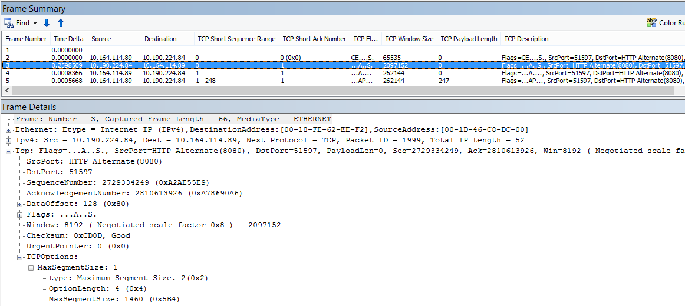

# Plano de solução de problemas de desempenho do Office 365

Você precisa saber as etapas a serem executadas para identificar e corrigir lento, cai e desempenho lento entre o SharePoint Online, o OneDrive for Business, o Exchange Online ou Skype para Business Online e o computador cliente? Antes de chamar suporte, este artigo pode ajudá-lo a solucionar problemas de desempenho do Office 365 e até mesmo corrigir alguns dos problemas mais comuns.
  
Este artigo é realmente um plano de ação de amostra que você pode usar para capturar dados valiosos sobre o seu problema de desempenho, como está ocorrendo. Alguns principais problemas também são incluídos neste artigo.
    
Se estiver familiarizado com o desempenho da rede e deseja fazer um planejamento de longo prazo para monitorar o desempenho entre computadores clientes e o Office 365, dê uma olhada no [ajuste de desempenho do Office 365 e solução de problemas - Admin e profissionais de TI](performance-tuning-using-baselines-and-history.md).
  
## Plano de ação para solução de problemas de desempenho de amostra

Este plano de ação contém duas partes; uma fase de preparação e uma fase de registro em log. Se você tiver um problema de desempenho conveniente e você precisará fazer a coleta de dados, você pode iniciar usando este plano imediatamente.
  
 **Preparar o computador cliente**
  
- Encontre um computador cliente que pode reproduzir o problema de desempenho. Este computador será usado durante o curso de solução de problemas.
    
- Anote as etapas que causar o problema de desempenho aconteça, portanto você está pronto quando chega o momento para testar.
    
- Instale as ferramentas para coletar e registrar informações:
    
  - Instale o [Netmon 3.4](https://www.microsoft.com/en-us/download/details.aspx?id=4865) (ou usar uma ferramenta de rastreamento de rede equivalente). 
    
  - Instale a edição de básica gratuita do [HTTPWatch](https://www.httpwatch.com/download/) (ou usar uma ferramenta de rastreamento de rede equivalente). 
    
  - Use um gravador de tela ou execute o gravador de etapas (PSR.exe) que vem com o Windows Vista e posterior, para manter um registro das etapas executadas durante o teste.
    
 **Problema de desempenho de log**
  
- Feche todos os navegadores da Internet não essenciais.
    
- Inicie o gravador de etapas ou outro gravador de tela.
    
- Inicie seu Netmon captura (ou a ferramenta de rastreamento de rede).
    
- Limpe o cache DNS no computador cliente da linha de comando, digitando ipconfig /flushdns.
    
- Iniciar uma nova sessão do navegador e ligue HTTPWatch.
    
- Opcional: Se você estiver testando o Exchange Online, execute a ferramenta Analisador de desempenho de cliente do Exchange no console de administração do Office 365.
    
- Reproduza as etapas exatas que causam o problema de desempenho.
    
- Pare o Netmon ou rastreamento da outra ferramenta.
    
- Na linha de comando, execute uma rota de rastreamento à sua assinatura do Office 365 digitando o seguinte comando e pressionando ENTER:
    
    `tracert \< *subscriptionname*  \>.onmicrosoft.com` 
    
- Pare o gravador de etapas e salvar o vídeo. Certifique-se de incluir a data e hora da captura e se ele demostra o desempenho BOM ou ruim.
    
- Salve os arquivos de rastreamento. Novamente, certifique-se de incluir a data e hora da captura e se ele demostra o desempenho BOM ou ruim.
    
Se você não estiver familiarizado com executando as ferramentas mencionadas neste artigo, não se preocupe porque fornecemos essas etapas em seguida. Se você estiver acostumados fazer esse tipo de rede capturando, poderá ignorar [como coletar as linhas de base](performance-tuning-using-baselines-and-history.md#how-to-collect-baselines), que descreve a filtragem e os logs de leitura. 
  
## Liberar o Cache de DNS primeiro

Por quê? Por liberação o cache de DNS, você está iniciando seus testes com uma área limpa. Limpando o cache, você está redefinindo o conteúdo de resolvedor DNS às entradas mais atualizadas. Lembre-se de que um flush não remove entradas do arquivo de HOSTs. Se você usar entradas do arquivo HOST extensivamente, você deve copiar essas entradas check-out para um arquivo em outro diretório e, em seguida, esvaziar o arquivo HOST.
  
 **Liberar o cache de resolução DNS**
  
1. Abra o prompt de comando (qualquer **Iniciar** \> **Executar** \> **cmd** ou a **tecla Windows** \> **cmd**).
    
2. Digite o seguinte comando e pressione ENTER:`ipconfig /flushdns`
    
## Netmon

Ferramenta de monitoramento de rede da Microsoft ([Netmon](https://www.microsoft.com/download/details.aspx?id=4865)) analisa pacotes, que é o tráfego, que passa entre computadores em redes. Usando o Netmon para rastrear o tráfego com o Office 365 pode capturar, modo de exibição e ler cabeçalhos de pacotes, identificar dispositivos intermediários, verifique as configurações de importantes em um hardware de rede, procure por pacotes ignorados e siga o fluxo de tráfego entre computadores no seu corporativo rede e o Office 365. Como o corpo real do tráfego é criptografado, ou seja, ele (viaja na porta 443 via SSL/TLS, você não pode ler os arquivos que estão sendo enviados. Em vez disso, você pode fazer um rastreamento não filtrado do caminho que leva o pacote que pode ajudar a rastrear o comportamento do problema.
  
Certifique-se de que você não aplicar um filtro neste momento. Em vez disso, execute as etapas e demonstrar o problema antes de finalizar o rastreamento e salvar.
  
Após instalar o Netmon 3.4, abra a ferramenta e siga estas etapas:
  
 **Dê um rastreamento Netmon e reproduzir o problema**
  
1. Inicie o Netmon 3.4.
    
    Existem três painéis na página **início** do: **Captura recentes**, **Selecione redes**e o guia de Introdução ao Microsoft Network Monitor 3.4 **. Aviso**. O painel Selecionar redes também fornecerá a você uma lista das redes padrão do qual você pode capturar. Certifique-se de que as placas de rede estão selecionadas aqui.
    
2. Clique em **Nova captura** na parte superior da página **inicial** . Adiciona uma nova guia ao lado da guia de página **Iniciar** denominada **capturar 1**.
    
    
  
3. Para aproveitar uma simple captura, clique em **Iniciar** na barra de ferramentas. 
    
4. Reproduza as etapas que apresentam um problema de desempenho.
    
5. Clique em **Parar** \> **arquivo** \> **Salvar como**. Lembre-se de dar a data e hora com o fuso horário e para mencionar se ele demostra incorreto ou bom desempenho.
    
## HTTPWatch

[HTTPWatch](https://www.httpwatch.com/download/) vem com cobrado e uma edição gratuita. A edição básica livre aborda tudo o que precisa para este teste. Tempo de carregamento de página e o tráfego de rede de monitores HTTPWatch direita da janela do navegador. HTTPWatch é um plug-in do Internet Explorer que descreve graficamente o desempenho. A análise pode ser salvo e exibida no HTTPWatch Studio. 
  
> [!NOTE]
> Se você usar outro navegador, como o Firefox, Google Chrome, ou se você não conseguir instalar HTTPWatch no Internet Explorer, abra uma nova janela de navegador e pressione a tecla F12 em seu teclado. Você deverá ver a ferramenta de desenvolvedor pop-up na parte inferior do seu navegador. Se você usar Opera, pressione CTRL + SHIFT + I para Web Inspector, clique na guia **rede** e concluir os testes descritos a seguir. As informações serão ligeiramente diferentes, mas os tempos de carregamento ainda serão exibidos em milissegundos. > HTTPWatch também é muito útil para problemas com tempos de carregamento de página do SharePoint Online. 
  
 **Execute HTTPWatch e reproduzir o problema**
  
1. HTTPWatch é um navegador plug-in, portanto, expondo a ferramenta no navegador é ligeiramente diferente para cada versão do Internet Explorer. Normalmente, você pode encontrar HTTPWatch sob a barra de comandos no navegador Internet Explorer.  Se você não vir o plug-in de HTTPWatch na janela do navegador, verificar a versão do navegador com um clique ajuda \> sobre ou, em versões posteriores do Internet Explorer, clique no símbolo de engrenagem e o Internet Explorer. Para iniciar a barra de **comandos** , clique com o botão de barra de menus no Internet Explorer e clique em **barra de comandos**. No passado, HTTPWatch tiver sido associada com os comandos e as barras de Explorer, então, depois que você instalar, se não vir imediatamente o ícone (até mesmo após a reinicialização) **Ferramentas**e suas barras de ferramentas para o ícone de seleção. Lembre-se de que as barras de ferramentas podem ser personalizadas e opções que podem ser adicionadas a eles. 
    
  
2. Inicie o HTTPWatch em uma janela do navegador Internet Explorer. Ele será exibido no navegador, na parte inferior da janela encaixado. Clique em **gravar**.
    
3. Reproduza exatas etapas envolvidas no problema de desempenho. Clique no botão **Parar** na HTTPWatch. 
    
4. **Salve** o HTTPWatch ou **Enviar por Email**. Lembre-se nomear o arquivo para que ele inclua informações de data e hora e uma indicação do se sua inspeção contém uma demonstração de desempenho BOM ou ruim.    
    Esta captura de tela é da versão profissional do HTTPWatch. Você pode abrir rastreamentos tomados na versão básica em um computador com uma versão profissional e lê-lo ali. Informações extras podem estar disponíveis do rastreamento da através desse método.
    
## Gravador de etapas de problema

Gravador de etapas ou PSR.exe, permite que você registre problemas enquanto eles estão ocorrendo. Ele é uma ferramenta muito útil e muito simples para executar.
  
 **Executar o gravador de etapas de problema (PSR.exe) para registrar seu trabalho**
  
1. Use **Iniciar** \> **Executar** \> digite **PSR.exe** \> **Okey**, ou então, clique na **Tecla Windows** \> digite **PSR.exe** \> e pressione ENTER. 
    
2. Quando a pequena janela PSR.exe for exibida, clique em **Iniciar gravar** e reproduzir as etapas que reproduza o problema de desempenho. Você pode adicionar comentários, conforme necessário, clicando em **Adicionar comentários**.
    
3. Quando tiver concluído as etapas, clique em **Parar o registro** . Se o problema de desempenho for uma renderização de página, aguarde a página seja processada antes de interromper a gravação. 
    
4. Clique em **Salvar**.
    

  
A data e hora é registrada para você. Isso vincula sua PSR aos seus Netmon trace e HTTPWatch em tempo e ajuda na solução de problemas de precisão. A data e hora do registro PSR podem mostrar que um minuto passadas entre o login e navegação da URL e a renderização parcial do site de administração, por exemplo.
  
## Leia suas rastreamentos

Não é possível ensinar tudo sobre a solução de problemas de desempenho e de rede que alguém precisa saber por meio de um artigo. Obtendo um bom desempenho leva de experiência e conhecimento dos como sua rede funciona e geralmente executa. Mas é possível arredondar para cima uma lista dos principais problemas e mostrar como ferramentas podem facilitam para eliminar os problemas mais comuns.
  
Se você quiser pegue habilidades lendo rastreamentos de rede para os sites do Office 365, não há nenhuma professor melhor que criando os rastreamentos de carregar páginas regularmente e adquirindo experiência lê-los. Por exemplo, quando você tem uma chance, carregar um serviço do Office 365 e o processo de rastreamento. Filtrar o rastreamento para o tráfego DNS ou pesquisar o FrameData para o nome do serviço do qual que você navegou. Verificar o rastreamento para ter uma ideia das etapas que ocorrem quando o serviço tiver sido carregada. Isso ajudará você a aprender qual normal deve se parecer com carga de página e no caso de solução de problemas, especialmente ao redor de desempenho, comparar os rastreamentos boas para ruim pode ensinar muito.
  
Netmon usa o Microsoft Intellisense no campo de filtro de exibição. IntelliSense ou conclusão de código inteligente, é que truques onde você digita em um período e todas as opções disponíveis são exibidas em uma caixa de seleção da lista suspensa. Se, por exemplo, você está preocupado com o dimensionamento de janela TCP, você pode encontrar seu caminho para um filtro (como `.protocol.tcp.window < 100`) por essa significa.
  

  
Netmon rastreamentos podem ter muito tráfego neles. Se você não experientes com lê-los, é provável que você pretende ficar sobrecarregado abrindo o rastreamento na primeira vez. A primeira coisa a fazer é separar o sinal de ruído de fundo no rastreamento. Você testarão o Office 365 e que é o tráfego que você deseja ver. Se você é usados para navegar pela rastreamentos, você talvez precise não desta lista.
  
O tráfego entre o cliente e o Office 365 viaja via TLS, o que significa que o corpo do tráfego seja criptografado e não pode ser lido em um rastreamento de Netmon genérico. Sua análise de desempenho não precisa saber as especificações das informações no pacote. Entretanto, é muito interessado em cabeçalhos de pacotes e as informações que eles contêm.
  
 **Dicas para obter um bom rastreamento**
  
- Sabe o valor do endereço IPv4 ou IPv6 do computador cliente. Você pode obter isso no prompt de comando, digitando **IPConfig** e pressionando ENTER. Saber que esse endereço permitirá a informar num relance se o tráfego no rastreamento diretamente envolve o computador cliente. Se houver um proxy conhecido, execute ping nele e obtenha o endereço IP. 
    
- Liberar o cache de resolução DNS e, se possível, feche todos os navegadores exceto aquela na qual você está executando os testes. Se você não conseguir fazer isso, por exemplo, se o suporte está usando alguns ferramenta baseada em navegador para ver a área de trabalho do computador cliente, esteja preparado para filtrar seu rastreamento.
    
- Em um rastreamento ocupado, localize o serviço Office 365 que você está usando. Se você nunca ou raramente visto seu tráfego antes, esta é uma etapa útil separando o problema de desempenho de outro ruído de rede. Há algumas maneiras de se fazer isso. Diretamente antes de seu teste, você pode usar ping ou PsPing, para a URL do serviço específico ( `ping outlook.office365.com` e/ou `psping -4 microsoft-my.sharepoint.com:443`, para obter exemplos). Você também pode localizar facilmente que PsPing em um rastreamento de Netmon (por seu nome de processo). Que fornecerá a você um ponto de partida procurando.
    
    Se estiver usando somente o rastreamento de Netmon no momento do problema, que é okey muito. Para orientar, se utilizar um filtro como `ContainsBin(FrameData, ASCII, "office")` ou `ContainsBin(FrameData, ASCII, "outlook")`. Você pode registrar o número do seu quadro do arquivo de rastreamento. Convém também rola o painel de resumo de quadro para a direita e procure a coluna de ID de conversa. Há um número indicado lá para a ID da conversa específica que você também pode registrar e examinar isoladamente posteriormente. Lembre-se remover esse filtro antes de aplicar qualquer outra filtragem.
    
> [!TIP]
> Netmon tem muito úteis filtros internos. Experimente o botão "Load Filter" na parte superior do painel de filtro de **exibição** . 
  

  

  
Familiarize-se com o tráfego e saiba como localizar as informações que necessárias. Por exemplo, saiba como determinar quais pacotes no rastreamento tem a primeira referência ao serviço do Office 365, que você está usando (como "Outlook").
    
Assumir o Office 365 Online do Outlook como exemplo, o tráfego começa semelhante a esta:
  
- Consulta de DNS padrão e a resposta de DNS para outlook.office365.com com correspondência QueryIDs. É importante observar o tempo de deslocamento para este turn-ao redor, bem como where no mundo o DNS globais do Office 365 envia a solicitação para resolução de nome. Idealmente, localmente possíveis, em vez de meia-way no mundo inteiro. (Isso pode ser seguido por alguns o login on-line do tráfego DNS.)
    
- Um HTTP GET Request cujo status relatar movido permanentemente (301)
    
- Tráfego de RWS incluindo RWS conectar solicitações e respostas de conectar. (Isso é Winsock remoto fazendo uma conexão para você.)
    
- Uma conversação SYN TCP e TCP SYN/confirmação. Muitas das configurações nesta conversa impacto no desempenho.
    
- Em seguida, uma série de tráfego TLS:TLS que é onde o handshake TLS e TLS certificado conversas ocorrem. (Se lembrar que os dados são criptografados via SSL/TLS).
    
Todas as partes do tráfego são importantes e conectado, mas pequenas partes do rastreamento contêm informações particularmente importantes em termos de desempenho solução de problemas, portanto, focaremos nessas áreas. Além disso, desde que fizemos suficiente Resolvendo problemas na Microsoft para compilar uma lista de dez primeiros dos problemas comuns de desempenho do Office 365, focaremos sobre esses problemas e como usar as ferramentas que temos apontá-los Avançar.
  
Se você não instalou-los tudo pronta, matriz a seguir torna o uso das várias ferramentas. Onde for possível. Links são fornecidos para os pontos de instalação. A lista inclui ferramentas de rastreamento de rede comuns como [Netmon](https://www.microsoft.com/en-us/download/details.aspx?id=4865) e [Wireshark](https://www.wireshark.org/), mas usar qualquer ferramenta de rastreamento que você se sente confortável com e no qual você acostumados à filtragem de tráfego de rede. Quando você estiver testando, lembre-se:
  
-  *Feche seus navegadores e teste com apenas um navegador em execução* - isso reduzirá o você capturar o tráfego geral. Torna para um rastreamento menos ocupado. 
    
-  *Liberar o cache de resolução DNS no computador cliente* - isso fornecerá a você uma área limpa Quando você inicia assuma sua captura, para um rastreamento mais limpo. 
    
## Alguns principais problemas

Alguns problemas comuns que você pode enfrentar e como localizá-los em seu rastreamento de rede.

### Dimensionamento de janelas TCP

Encontrado no SYN - SYN/ACK. herdada ou hardware de vencimento pode não tirar proveito de dimensionamento de janelas TCP.  Sem dimensionamento configurações adequadas janelas TCP, o buffer de 16 bits padrão em cabeçalhos TCP preenche em milissegundos.  Tráfego não pode continuar enviando até que o cliente recebe uma confirmação de que os dados originais foi recebidos, causando atrasos.

#### Ferramentas:

- Netmon
- Wireshark 

#### O que você está procurando:

Procure o SYN - SYN/confirmação tráfego em seu rastreamento de rede.  No Netmon, use um filtro como `tcp.flags.syn == 1`. Esse filtro é o mesmo em Wireshark.  

         
Observe que, para cada SYN, há um número de porta (SrcPort) de origem que corresponde a porta de destino (DstPort) da confirmação relacionada (SYN ACK). 

Para ver o valor de dimensionamento do Windows que é usado pelo sua conexão de rede, expanda primeiramente o SYN e relacionados SYN/ACK.  

  

### Configurações de tempo ocioso do TCP

Historicamente, a maioria das redes de perímetro são configurados para conexões transitórios, que significa conexões ociosas geralmente são encerrados. Sessões de ociosidade TCP podem ser finalizadas pelo proxies e firewalls mais de 100 a 300 segundos. Isso é problemático para o Outlook Online porque ele cria e usa conexões de longo prazo, independentemente de estarem ociosos ou não.  

Quando conexões são encerradas pelo proxy ou dispositivos de firewall, o cliente não é informada e uma tentativa de usar o Outlook Online significará um computador cliente tentará, repetidamente, reviver a conexão antes de fazer uma nova. Talvez você veja cai no produto, avisos ou desempenho lento no carregamento de página.

#### Ferramentas:

- Netmon
- Wireshark

#### O que procurar:

Netmon, examine o campo tempo deslocamento para um de ida e volta. Uma ida e volta é o tempo entre o cliente enviando uma solicitação para o servidor e recebe uma resposta de volta. Verificar entre o cliente e o ponto de saída (ex. cliente –\> Proxy), ou o cliente para o Office 365 (cliente –\> Office 365). Você pode ver isso em muitos tipos de pacotes. 

Por exemplo, o filtro na Netmon pode ser parecida com `.Protocol.IPv4.Address == 10.102.14.112 AND .Protocol.IPv4.Address == 10.201.114.12`, ou, no Wireshark, `ip.addr == 10.102.14.112 &amp;&amp; ip.addr == 10.201.114.12`.  

> [!TIP]
> Não sabe se o endereço IP em seu rastreamento pertence ao seu servidor DNS? Tente procurar na linha de comando. Clique em **Iniciar** \> **Executar** \> e digite **cmd**ou pressione a **Tecla Windows** \> e digite **cmd**. No prompt, digite `nslookup <the IP address from the network trace>`. Para testar, use o nslookup contra o endereço IP do seu próprio computador. > Para ver uma lista de intervalos IP da Microsoft, consulte [URLs do Office 365 e intervalos de endereços IP](https://technet.microsoft.com/en-us/library/hh373144.aspx). 

Se houver um problema, esperam longo tempo desloca apareça, neste caso (Outlook on-line), especialmente em pacotes TLS:TLS que mostram a passagem de dados do aplicativo (por exemplo, em Netmon você pode encontrar os pacotes de dados de aplicativo via `.Protocol.TLS AND Description == "TLS:TLS Rec Layer-1 SSL Application Data"`). Você deverá ver uma progressão tranquila no tempo entre a sessão. Se você vir longos atrasos ao atualizar sua Online do Outlook, isso pode ser causado por um alto grau de redefinições que estão sendo enviadas. 

### Latência/Round Trip tempo 

Latência é uma medida que pode ser alterados muito dependendo muitas variáveis, tais como atualizar os dispositivos de vencimento, a adição de um grande número de usuários a uma rede e a porcentagem da largura de banda geral consumida por outras tarefas em uma conexão de rede. 

Existem calculadoras de largura de banda para o Office 365 disponíveis nesta página [planejamento de rede e ajuste de desempenho para o Office 365](network-planning-and-performance.md) .  

Necessário para medir a velocidade de sua conexão ou largura de banda da conexão do seu ISP? Tente este site (ou sites como ela): [Site oficial do Speedtest](https://www.speedtest.net/)e [Pingtest](http://www.pingtest.net/).

#### Ferramentas:

- Ping
- PsPing
- Netmon
- Wireshark

#### O que procurar:

Para rastrear a latência em um rastreamento, você beneficiarão tendo registradas o endereço IP do computador cliente e o endereço IP do servidor DNS no Office 365. Isso é para fins de filtragem do rastreamento mais fácil. Se você conectar através de um proxy, você precisará seu endereço IP do computador cliente, o endereço IP/saída de proxy e o endereço IP de DNS do Office 365, para facilitar o trabalho.  

Uma solicitação de ping enviada para outlook.office365.com informará o nome do datacenter recebendo a solicitação, mesmo se o ping *pode* não ser capazes de se conectar para enviar pacotes ICMP consecutivos de marca comercial. Se você usar PsPing (uma ferramenta gratuita para download) e específicos a porta (443) e talvez para usar IPv4 (-4) receberá uma round-trip-tempo médio para pacotes enviados. Isso irá funcionar isso para outras URLs em serviços do Office 365, como `psping -4 yourSite.sharepoint.com:443`. Na verdade, você pode especificar um número de ping para obter um exemplo maior sua média, tente parecido com: `psping -4 -n 20 yourSite-my.sharepoint.com:443`.  

> [!NOTE]
> PsPing não enviar pacotes ICMP. Ele faz o ping com pacotes TCP por uma porta específica, então você pode usar qualquer um que você sabe para ser aberto. No Office 365, que usa o SSL/TLS, tente anexar porta: 443 para sua PsPing.

        

Se você tiver carregado página do Office 365 desempenho lenta enquanto efetua um rastreamento de rede, você deve filtrar um rastreamento Netmon ou Wireshark para `DNS`. Este é um dos IPs que queremos.  

Aqui estão as etapas a serem executadas para filtrar o Netmon para obter o endereço IP (e dê uma olhada na latência de DNS). Este exemplo usa outlook.office365.com, mas também pode usar a URL de um inquilino do SharePoint Online (hithere.sharepoint.com, por exemplo).  

1. Ping a URL `ping outlook.office365.com` e, nos resultados da, registre o nome e o endereço IP do servidor DNS a solicitação de ping foi enviada para. 
2. Rede rastrear abrindo a página, ou fazendo a ação que dá a você o problema de desempenho, ou, se você vir uma latência alta no ping, propriamente dito, rede de rastreamento-lo. 
3. Abra o rastreamento em Netmon e filtro para DNS (esse filtro também funciona em Wireshark, mas é sensível ao caso `-- dns`). Desde que você sabe o nome do servidor DNS do seu ping, você também pode filtrar mais Netmon rapidamente em semelhante a esta: `DNS AND ContainsBin(FrameData, ASCII, "namnorthwest")` , parecido com o seguinte no dns Wireshark e quadro contém "namnorthwest". Abra o pacote de resposta e, na janela de detalhes do quadro de Netmon, clique em DNS para expandir para obter mais informações. As informações de DNS, que você encontrará o endereço IP do servidor DNS que a solicitação foi para no Office 365 – você precisará esse endereço IP para a próxima etapa (a ferramenta PsPing). Remova o filtro, clique com botão direito na resposta do DNS, em resumo do quadro do Netmon \> localizar conversas \> DNS para ver a consulta DNS e resposta--lado a lado. 
4. Netmon, observe também a coluna tempo deslocamento entre a solicitação de DNS e a resposta. Na próxima etapa, fácil de instalar e uso [PsPing](https://technet.microsoft.com/en-us/sysinternals/jj729731.aspx) ferramenta muito prático, pois ICMP frequentemente estiver bloqueada no Firewalls, tanto porque PsPing modo elegante rastreia latência em milissegundos. PsPing conclui uma conexão TCP para um endereço e a porta (no nossa caso abra a porta 443). 
5. Instale o PsPing. 
6. Abra um prompt de comando (Iniciar \> executar \> digite cmd ou tecla Windows \> digite cmd) e altere o diretório para o diretório onde você instalou PsPing para executar o comando PsPing. Nos meus exemplos, você pode ver que eu feita uma pasta 'Perf' na raiz do C. Você pode fazer as mesmas para acesso rápido. 
7. Digite o comando de forma que você está fazendo sua PsPing com base no endereço IP do servidor DNS do Office 365 do seu rastreamento de Netmon anterior--Lembre-se de adicionar o número da porta.  Em outras palavras, `psping -n 20 132.245.24.82:445`. Isso proporcionam uma amostragem de 20 ping e médio a latência quando PsPing é interrompido. 

Se você vai para o Office 365 através de um servidor proxy, as etapas são um pouco diferentes. Você faria PsPing primeiro ao servidor de proxy para obter um valor de latência média em milissegundos para proxy/saída e de volta e um execute PsPing no proxy ou em um computador com uma conexão direta de Internet para obter o valor ausente (um para Office 365 e vice-versa).  

Se você optar por executar PsPing do proxy, você terá dois valores de milissegundo: o computador cliente para servidor proxy ou ponto de saída e o servidor proxy para o Office 365. E pronto! Bem, Gravando valores, mesmo assim.  

Se você executar PsPing em outro computador cliente que tenha uma conexão direta com a Internet, ou seja, sem um proxy, você terá dois valores de milissegundo: o computador cliente para servidor proxy ou ponto de saída e o computador cliente para o Office 365. Subtrair nesse caso, o valor do computador cliente para o ponto de saída ou de servidor proxy do valor do computador cliente para o Office 365, você terá os números de tempo de resposta do computador cliente para o ponto de saída ou de servidor proxy e do proxy server ou saída aponte para Offi CE 365. 

No entanto, se você puder localizar um computador cliente no local afetado que está conectado diretamente ou ignora o proxy, você pode optar por ver se o problema lá reproduz começar com e testar a usá-la, depois disso. 

Latência, como visto em um rastreamento de Netmon, milissegundos esses extras podem adicionar para cima, se houver suficiente deles em qualquer sessão de determinado.  

> [!NOTE]
> Seu endereço IP pode ser diferente do que o IPs mostrado aqui, por exemplo, que seu ping pode retornar algo mais como 157.56.0.0/16 ou um intervalo semelhante. Para obter uma lista de intervalos usados pelo Office 365, confira [URLs do Office 365 e intervalos de endereços IP](https://technet.microsoft.com/en-us/library/hh373144.aspx). 

Lembre-se expandir todos os nós (há um botão na parte superior para que isso) se você quiser procurar, por exemplo, 132.245.

### Autenticação de proxy

Isso se aplica apenas a você se você vai por meio de um servidor proxy. Caso contrário, pule essas etapas. Quando funcionando corretamente, a autenticação de proxy deverá ocorrer em milissegundos, consistentemente. Você não deve ver intermitente desempenho ruim durante os períodos de uso (por exemplo).  

Se a autenticação de Proxy for ativado, cada vez que fizer uma nova conexão de TCP para o Office 365 para obter mais informações, você precisa passar por um processo de autenticação em segundo plano. Portanto, por exemplo, quando você alterna de calendário para email no Outlook Online, você irá autenticar. E no SharePoint Online, se uma página exibe a mídia ou dados de vários sites ou locais, você irá autenticar para cada conexão TCP diferente que é necessária para processar os dados.  

No Outlook Online, você pode enfrentar tempos de carregamento lento sempre que você alterna entre a sua caixa de correio e calendário ou lenta página tiver sido carregada no SharePoint Online. No entanto, há outros sintomas não listadas aqui. 

Autenticação de proxy é uma configuração no seu servidor de proxy de saída. Se ele está causando um problema de desempenho com o Office 365, você deve consultar sua equipe da rede.  

#### Ferramenta: 

- Netmon
- Wireshark 

#### O que procurar:

Proxy autenticação ocorre sempre que uma nova sessão do TCP deve ser girada para cima, comumente para solicitar informações ou arquivos do servidor, ou fornecer informações. Por exemplo, talvez você veja a autenticação de proxy em torno de solicitações HTTP GET ou HTTP POST. Se você deseja visualizar os quadros de onde você estiver autenticando solicitações em seu rastreamento, adicione a coluna 'NTLMSSP resumo' Netmon e filtro para `.property.NTLMSSPSummary`. Para ver quanto tempo a autenticação está demorando, adicione a coluna de tempo Delta. 

Para adicionar uma coluna a Netmon: 
1. Clique com botão direito em uma coluna como descrição. 
2. Clique em Escolher colunas. 
3. Localize NTLMSSP resumo e Delta de tempo na lista e clique em Adicionar. 
4. Mova as novas colunas no lugar antes ou para trás na coluna Descrição para que possa ler lado a lado.
5. Clique em OK. 

Mesmo se você não adicionar a coluna, o filtro Netmon funcionará. Mas sua solução de problemas será muito mais fácil se você pode ver qual estágio da autenticação estiver em. 

Quando estiver presente procurando de instâncias de autenticação de Proxy, certifique-se estudar a todos os quadros onde há um desafio NTLM ou uma mensagem de autenticar. Se necessário, clique com o botão a informação específica de tráfego e localizar conversas \> TCP. Lembre-se dos valores de tempo Delta nessas conversas. 

        

Um segundo quatro atraso na autenticação de proxy, como visto no Wireshark. A coluna **delta de tempo do quadro exibido anterior** foi feita via clicando duas vezes o campo do mesmo nome nos detalhes do quadro e selecionando Add como coluna.          

### Desempenho do DNS

Nome resolução funciona melhor e mais rapidamente quando ele ocorre mais próximo país do cliente quanto possível. 

Se a resolução de nomes DNS está ocorrendo no exterior, ele pode adicionar segundos para carregar páginas. Idealmente, a resolução de nomes acontece em 100ms em. Se não, você deve fazer mais investigação. 

> [!TIP]
> Não tem certeza como funciona a conectividade do cliente no Office 365? Dê uma olhada o documento de referência de conectividade de cliente [aqui](https://technet.microsoft.com/en-us/library/dn741250.aspx).           

#### Ferramentas: 

- Netmon
- Wireshark
- PsPing

#### O que procurar:
Analisar o desempenho do DNS é geralmente outro trabalho para um rastreamento de rede. No entanto, PsPing também é útil para exilados in ou check-out, uma causa possível. 

O tráfego DNS se baseia em TCP e UDP solicitações e respostas são claramente marcadas com uma ID que ajudarão a correspondência de uma solicitação específica com sua resposta específicos. Você verá DNS tráfego quando, por exemplo, SharePoint Online usa um nome de rede ou uma URL em uma página da web. Como regra geral, a maioria desse tráfego, exceto quando transferindo zonas, executa sobre UDP. 

Em Netmon e Wireshark, o filtro de forma mais básico que permitirá que você examine o tráfego DNS é simplesmente `dns`. Certifique-se de usar letras minúsculas ao especificar o filtro. Lembre-se a liberar seu cache de resolução DNS antes de começar a reproduzir o problema no computador cliente. Por exemplo, se você tiver uma carga de página do SharePoint Online lenta da Home page, você deve fechar todos os navegadores, abra um novo navegador, iniciar o rastreamento, liberar seu cache de resolução DNS e navegue até o site do SharePoint Online. Depois que a página inteira resolve, você deve parar e salve o rastreamento.

Você deseja examinar o tempo de deslocamento aqui. E pode ser útil adicionar a coluna **Tempo Delta** à Netmon que pode ser feito ao concluir estas etapas: 
1. Clique com botão direito em uma coluna como descrição. 
2. Clique em Escolher colunas. 
3. Localize o intervalo de tempo na lista e clique em Adicionar. 
4. Mova a nova coluna no lugar antes ou para trás na coluna Descrição para que possa ler lado a lado.
5. Clique em OK. 

Se você encontrar uma consulta de interesse, considere isolando-clicando nessa consulta no painel de detalhes do quadro, escolhendo **Localizar conversas** \> **DNS**. Observe que o painel de conversas de rede conduz à direita para a conversa específica em seu log do tráfego UDP. 

        

Em Wireshark, você pode fazer uma coluna para o tempo DNS. Seu rastreamento (ou abrir um rastreamento) no Wireshark e filtrar por `dns`, ou, mais Felizmente, `dns.time`. Clique em qualquer consulta DNS e, no painel mostrando detalhes, expanda o `Domain Name System (response)` detalhes. Você verá um campo de tempo (por exemplo, ` [Time: 0.001111100 seconds] `. Neste momento do mouse em e selecione **Aplicar como coluna**. Isso fornecerá a você uma coluna de **tempo** para a classificação mais rápidos do seu rastreamento. Clique em nova coluna para classificar por decrescente valores para ver quais DNS chamada demorou por mais tempo para resolver. 

[Uma procura do SharePoint Online filtrada no Wireshark por dns.time (minúsculas), com o tempo dos detalhes transformado em uma coluna e classificado em ordem crescente.](media/1439dcc2-12ff-4ee2-9ef3-1484cf79c384.PNG)

Se você gostaria de fazer mais investigação do tempo de resolução de DNS, tente uma PsPing contra a porta DNS usada pelo TCP (por exemplo, `psping <IP address of DNS server>:53`). Ainda assim, você vê um problema de desempenho? Se fizer isso, o problema é mais provável de ser uma rede ampla emitir que um problema de específicos do aplicativo de DNS que você está atingindo para fazer a resolução. Ele também vale mencionar, novamente, que um ping para outlook.office365.com informará onde a resolução de nomes DNS para o Outlook Online está sendo realizada (por exemplo, outlook-namnorthwest.office365.com).  Se o problema parece para estar DNS específico, talvez seja necessário entrar em contato com seu departamento de TI ser analisado encaminhadores DNS para investigar esse problema e configurações de DNS. 

### Escalabilidade de proxy

Serviços como o Outlook Online no Office 365 concedem clientes várias conexões de longo prazo. Portanto, cada usuário poderá usar mais conexões que exigem uma duração mais longa.  

> [!TIP]
> Você precisa planejar a utilização de largura de banda porque você está prestes a adicionar muito usuários para o Office 365? Tente a [Planejar a utilização de largura de banda da Internet para o Office 365](https://technet.microsoft.com/en-us/library/hh852542.aspx). Existem calculadoras de largura de banda disponível lá.

#### Ferramenta:
 
Matemática  

#### O que procurar: 

Não há nenhum rastreamento de rede ou a ferramenta de solução de problemas específicos para isso. Em vez disso, ele é baseado em cálculos de largura de banda dado limitações e outras variáveis.  

### Tamanho de segmento máximo TCP

Encontrado no SYN - SYN/ACK.  Fazer essa verificação em qualquer rastreamento de rede de desempenho feitos para garantir que os pacotes TCP são configurados para executar a quantidade máxima de dados possível. 

O objetivo é ver um MSS de 1460 bytes para a transmissão de dados. Se você estiver atrás de um proxy ou você estiver usando NAT, lembre-se de executar esse teste do cliente para o proxy/saída/NAT e do proxy/saída/NAT para o Office 365 para obter os melhores resultados! Estas são as sessões TCP diferentes.

#### Ferramenta: 

Netmon

#### O que procurar:

Tamanho de segmento TCP Max (MSS) é outro parâmetro do handshake três vias no rastreamento de rede, isso significa que você encontrará os dados que necessários no SYN - pacote de SYN/confirmação. MSS é realmente simples para ver. 

Abra o rastreamento de rede qualquer desempenho, você tem e encontrar a conexão que você está curioso para saber ou que demonstra o problema de desempenho. 

> [!NOTE]
> Se você estiver procurando em um rastreamento e precisa encontrar o tráfego relevantes à sua conversa, filtre pelo IP do cliente ou o IP do servidor proxy ou ponto de saída ou ambos. Vai diretamente, você precisará fazer o ping a URL que você estiver testando o endereço IP do Office 365 no rastreamento e filtro por ele. 

Olhando o rastreamento quando? Tente usar filtros para orientar você mesmo. No Netmon, execute uma pesquisa com base na URL de, tais como `Containsbin(framedata, ascii, "sphybridExample")`, anote o número do quadro. 

Em Wireshark usar algo como `frame contains "sphybridExample"`. Se você observar que você encontrou o tráfego remoto Winsock (RWS) (ele pode ser exibido como um [PSH, confirmação] em Wireshark), lembre-se de que se conecta RWS podem ser vistos em breve antes relevante SYN - SYN ACKs, conforme discutido anteriormente. 

Neste ponto, você pode registrar o número do quadro, descartar o filtro, clique em todo o tráfego na janela de conversas de rede na Netmon a ser analisado SYN. o mais próximo 

Importante: se você não receber qualquer uma das informações de endereço IP no momento do rastreamento, localizando sua URL no rastreamento (parte do `sphybridExample-my.sharepoint.com`, por exemplo), fornecerá a você endereços IP para filtrar por. 

Localize a conexão no rastreamento que você está interessado em ver. Você pode fazer isso, verificando o rastreamento, filtrando por endereços IP ou selecionando IDs específicas de conversa usando a janela de conversas de rede no Netmon. Depois de localizar o pacote SYN, expanda TCP (em Netmon) ou Transmission Control Protocol (em Wireshark) no painel de detalhes do quadro. Expanda MaxSegementSize e opções de TCP. Localize o quadro de confirmação-SYN relacionado e expanda TCP opções e MaxSegmentSize. O menor dos dois valores será seu tamanho máximo de segmento. Nesta figura, posso fazer uso da coluna Netmon chamado solucionar TCP interna.  

A coluna interna está na parte superior do painel de **Detalhes do quadro** . (Para voltar para o modo de exibição normal, clique em colunas novamente e, em seguida, escolha o fuso horário). 

           
Aqui está um rastreamento filtrado em Wireshark. Há um filtro específico para o valor de MSS ( `tcp.options.mss`). Os quadros de um SYN, SYN/confirmação, handshake de confirmação estão vinculados na parte inferior do Wireshark equivalente a detalhes do quadro (portanto enquadrar 47 confirmação, links para 46 SYN/confirmação, links para SYN 43) para facilitar a esse tipo de trabalho. 

         
Se você precisar verificar confirmação seletiva (próximo tópico nesta matriz), não feche o seu rastreamento!

### Confirmação seletiva

Encontrado no SYN - SYN/ACK. deve ser relatados como permitido em SYN e SYN/ACK. seletiva confirmação SACK () permite mais suave retransmissão de dados quando um pacote ou pacotes vá ausentes. Dispositivos podem desabilitar esse recurso, o que pode resultar em problemas de desempenho. 

Se você estiver atrás de um proxy ou você estiver usando NAT, lembre-se de executar esse teste do cliente para o proxy/saída/NAT e do proxy/saída/NAT para o Office 365 para obter os melhores resultados! Estas são as sessões TCP diferentes.

#### Ferramenta: 

Netmon 

#### O que procurar:

Confirmação seletiva (SACK) é outro parâmetro o handshake de confirmação-de SYN de SYN. Você pode filtrar seu rastreamento SYN - SYN/confirmação de várias maneiras. 

Localize a conexão no rastreamento que você está interessado em ver tanto examinando o rastreamento, a filtragem de endereços IP, ou clicando em uma ID de conversa usando a janela de conversas de rede no Netmon. Depois de localizar o pacote SYN, expanda TCP em Netmon ou Transmission Control Protocol em Wireshark na seção detalhes do quadro. Expanda as opções de TCP e, em seguida, SACK. Localize o quadro de confirmação-SYN relacionado e expanda opções de TCP e seu campo SACK. Certifique-se de que SACK é permitido em SYN e SYN/ACK. Aqui estão os valores SACK conforme visto no Netmon e Wireshark.

                     

### Localização geográfica do DNS 

Onde no mundo do Office 365 tenta resolver seu DNS chamada efeitos sua velocidade de conexão. 

No Outlook Online, uma vez concluída a pesquisa de DNS primeira, o local do DNS será usado para se conectar ao seu datacenter mais próximo. Você será conectado a um servidor CAS Online do Outlook, que usará a rede de backbone para se conectar com o datacenter (dC) onde seus dados estão armazenados. Isso é mais rápido.

Quando acessar o SharePoint Online, um usuário viajando para o exterior será direcionado para os seu datacenter ativo – o que é o controlador de domínio cujo local baseia-se no seu locatário SPO da base de home (isso, um controlador de domínio nos EUA se o usuário se baseados nos EUA).     Lync online tem nós ativos em mais de um controlador de domínio ao mesmo tempo. Quando as solicitações são enviadas para o Lync online instâncias, Microsoft DNS será determinar o local do mundo a solicitação de origem e retornar endereços IP do dC regional mais próximo onde o Lync online está ativo. 

> [!TIP]
> Precisa saber mais sobre como os clientes se conectam ao Office 365? Dê uma olhada o artigo de referência de [Conectividade do cliente](https://technet.microsoft.com/en-us/library/dn741250.aspx) (e seus gráficos úteis).           
#### Ferramentas:

- Ping
- PsPing

#### O que procurar:

Solicitações de resolução de nomes de servidores DNS do cliente para os servidores DNS da Microsoft devem na maioria dos resultados de casos no DNS da Microsoft retornando o endereço IP de um datacenter regional (dC). O que isso significa para você? Se sua sede está em Bangalore, Índia, mas você estiver viajando nos Estados Unidos, quando o navegador faz uma solicitação para o Outlook Online, os servidores DNS da Microsoft devem informar você endereços IP em centros de dados nos Estados Unidos – um datacenter regional. Se houver necessidade de email do Outlook, esses dados serão viajam entre a rede de backbone rápida da Microsoft entre os datacenters.

DNS funciona mais rápido quando a resolução de nome é feita mais próximo possível o local do usuário. Se você estiver na Europa, que você deseja ir para um DNS da Microsoft na Europa e (idealmente) lidar com um datacenter na Europa. Desempenho de um cliente na Europa pretende DNS e um datacenter na América do Norte será mais lento.

Execute a ferramenta de Ping contra outlook.office365.com para determinar onde no mundo sua solicitação DNS está sendo roteada. Se você estiver na Europa, você deverá ver uma resposta de algo como emeawest.office365.com do outlook. Nas Américas, esperam parecido com namnorthwest.office365.com do outlook. 

Abra o prompt de comando no computador cliente (via iniciar \> executar \> cmd ou tecla Windows \> digite cmd). Digite ping outlook.office365.com e pressione ENTER. Lembre-se, para especificar -4, se você deseja especificar para fazer o ping via IPv4. Você pode falhar obter uma resposta dos pacotes ICMP, mas você deve ver o nome do DNS para o qual a solicitação foi roteada. Se você quiser ver os números de latência para essa conexão tente PsPing o endereço IP do servidor que é retornado pelo ping.  

           
           
### Solução de problemas de aplicativos do Office 365

#### Ferramentas: 

- Netmon
- HTTPWatch
- Console de F12 no navegador

Não abordamos ferramentas usadas na solução de problemas de aplicativo específico neste artigo específicos de rede. Você encontrará recursos, mas você *pode* usar [nesta página](https://support.office.com/en-us/article/Network-planning-and-performance-tuning-for-Office-365-e5f1228c-da3c-4654-bf16-d163daee8848).
   
## Tópicos relacionados

[Gerenciando pontos de extremidade do Office 365](https://support.office.com/article/99cab9d4-ef59-4207-9f2b-3728eb46bf9a)
  
[Pontos de extremidade perguntas Frequentes do Office 365](https://support.office.com/article/d4088321-1c89-4b96-9c99-54c75cae2e6d)
  

