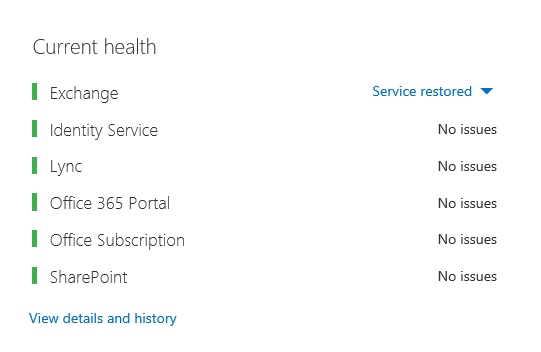
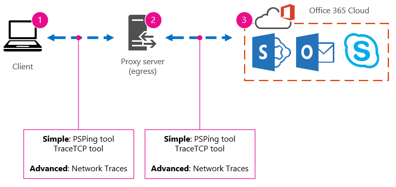

# Ajuste de desempenho do Office 365 usando linhas de base e histórico de desempenho

Existem algumas maneiras simples de verificar o desempenho de conexão entre o Office 365 e o seu negócio que permitirá que você a estabelecer uma linha de base grosseira da sua conectividade. Conhecer o histórico de desempenho de seu cliente conexões do computador pode ajudar a detectar problemas emergentes no início, identificar e prever problemas.
  
Se você não estiver usado para trabalhar em problemas de desempenho, este artigo foi projetado para ajudá-lo a considerar algumas perguntas comuns, como como verifico se o problema que você está vendo é um problema de desempenho e não um incidente de serviço do Office 365? Como você pode planejar para o bom desempenho, de longo prazo? Como você pode ficar atento no desempenho? Se sua equipe ou clientes estão vendo o desempenho lento durante a utilização do Office 365 e você quiser saber sobre qualquer uma dessas perguntas, continue lendo.
  
> [!IMPORTANT]
> **Tem um problema de desempenho entre o cliente e o Office 365 conveniente?** Siga as etapas descritas na [solução de problemas do desempenho plano para o Office 365](performance-troubleshooting-plan.md). 
    
## Algo que você deve saber sobre o desempenho do Office 365

O Office 365 reside dentro de uma rede Microsoft alta capacidade e dedicada progressivamente monitorado não apenas por automação, mas por pessoas reais. Parte da função de manutenção do Office 365 na nuvem é o desempenho de construção ajustando e otimizando onde é possível. Desde que os clientes do Office 365 nuvem precisam se conectar pela Internet, há um esforço contínuo para ajustar o desempenho nos serviços do Office 365 muito. Melhorias de desempenho nunca realmente interromper na nuvem e não há muita experiência acumulada com mantendo a nuvem saudável e rápida. Você deve ter um problema de desempenho, conectando a partir de seu local para o Office 365, ele é melhor não começar com e aguarde ativado, um caso de suporte. Em vez disso, você deve começar investigando o problema de 'o inside out'. Ou seja, inicie dentro da rede e gradativamente check-out para o Office 365. Antes de abrir um caso com suporte do Office 365, você pode reunir dados e execute as ações que irá explorar e podem resolver, seu problema.
  
> [!IMPORTANT]
> Lembre-se de planejamento de capacidade e limites no Office 365. Essas informações serão colocá-lo à frente ao tentar resolver um problema de desempenho. Aqui está um link para o [Office 365 Platform Service Description](https://technet.microsoft.com/en-us/library/office-365-service-descriptions.aspx). Este é um hub central e todos os serviços oferecidos pelo Office 365 tem um link que vai para suas próprias descrições de serviço a partir daqui. Isso significa, você precisa ver os limites padrão para o SharePoint Online, por exemplo, clique [Do SharePoint Online Service Description](https://technet.microsoft.com/en-us/library/sharepoint-online-service-description.aspx) e localize a [seção limites do SharePoint Online](https://go.microsoft.com/fwlink/p/?LinkID=856113). 
  
Certifique-se de ir para sua solução de problemas com o entendimento de que o desempenho é uma escala, mas não sobre atingir um valor ideal e manter o aplicativo permanentemente (se você acha que este é o caso, e tarefas de alta largura de banda ocasionais como o nível de contratação um grande número de usuários, ou fazer migrações de dados grandes será ser muito desgastante – portanto planejar impacto sobre o desempenho, em seguida,). Você pode e deve, ter uma ideia do suas metas de desempenho, mas variam de muitas variáveis tocar em desempenho, portanto, o desempenho. É a natureza do desempenho. 
  
Solução de problemas de desempenho não é sobre objetivos específicos da reunião e manter esses números indefinidamente, é sobre como melhorar atividades existentes, a recebe todas as variáveis. 
  
## Okey, um problema de desempenho como se parece?

Primeiro, você precisará certificar-se de que você estiver enfrentando é na verdade um problema de desempenho e não um incidente de serviço. Um problema de desempenho é diferente de um incidente de serviço no Office 365. Aqui está como informá-los separadamente.
  
Se o serviço Office 365 está tendo problemas, que é um incidente de serviço. Você verá os ícones vermelhos ou amarelos sob **Estados vigentes** no Centro de administração do Office 365, você também pode perceber desempenho lento em computadores clientes conectando-se ao Office 365. Por exemplo, se um ícone vermelho relatórios de integridade atual e você vê **Investigating** ao lado do Exchange, você pode, em seguida, também recebe um monte de chamadas de pessoas em sua organização que reclamam que caixas de correio de cliente que usem o Exchange Online estão executando mal. Nesse caso, é razoável presumir que o desempenho do Exchange Online apenas se tornou uma vítima dos problemas dentro do serviço. 
  

  
Neste ponto, você, o administrador do Office 365, deve verificar **Estados vigentes** e, em seguida, **histórico e exibir detalhes**, com frequência, para manter atualizado em manutenção realizamos no sistema. O painel de **integridade atual** foi feito para atualizar você sobre problemas, no serviço e as alterações. As notas e explicações gravadas histórico de integridade, admin até admin, existem para ajudá-lo a avaliar o impacto e para mantê-lo postados sobre o trabalho em andamento. 
  

  
Um problema de desempenho não é um incidente de serviço, apesar de incidentes podem causar desempenho lento. Um problema de desempenho tem esta aparência:
  
- Um problema de desempenho ocorre, não importa para o serviço está relatando o Centro de administração do Office 365 **Estados vigentes** . 
    
-  Um comportamento que costumavam ser relativamente descomplicado leva muito tempo para ser concluída ou nunca for concluído. 
    
- Você pode replicar o problema muito ou, pelo menos, você sabe que acontecerá se você fizer a série à direita das etapas.
    
-  Se o problema é intermitente, ainda é um padrão, por exemplo, você sabe que, por 10:00 AM você terá de chamadas de usuários que não é possível acessar o Office 365 confiável, e que as chamadas serão die para baixo em torno de meio-dia. 
    
Isso provavelmente parece familiar; Talvez muito familiar. Quando você souber que é um problema de desempenho, a pergunta ficar, "O fazer em seguida?" O restante deste artigo ajuda a determinar exatamente isso.
  
## Como definir e testar o problema de desempenho

Problemas de desempenho com frequência surgem ao longo do tempo, portanto, pode ser um desafio para definir o problema real. Você precisa criar uma instrução de problema boa e uma boa ideia do contexto do problema e, em seguida, você precisará repetíveis etapas dos testes para vencer o dia. Caso contrário, por meio de sem falhas de sua preferência, podem ser perdidos. Por quê? Bem, aqui estão alguns exemplos de instruções de problemas que não fornecem informações suficientes:
  
- Troca de minha caixa de entrada para meu calendário costumava ser algo que eu não Observe e agora é um café. Pode torná-lo atuam como ele é usado para?
    
- Carregando Meus arquivos para o SharePoint Online está demorando para sempre. Por que ele é lento à tarde, mas qualquer outro momento, ela é rápida? Não é possível apenas ser fast?
    
Existem vários desafios grandes trazidos pelas instruções problema acima. Especificamente, há muita ambiguidades para lidar com. Por exemplo:
  
- Não está claro como alternando entre a caixa de entrada e o calendário usado para atuar no laptop.
    
- Quando o usuário diz: "não é possível apenas ser fast", o que é "fast"?
    
- Quanto tempo é "indefinidamente"? É que vários segundos ou minutos, ou poderia o usuário acesse almoço e seria concluir a backup dez minutos após o usuário acessamos?
    
Tudo isso é sem considerar que a administração e solução de problemas não podem estar cientes muitos detalhes das instruções de problema como essas. Por exemplo, quando o problema começou acontecendo; Se o usuário trabalha em casa e apenas nunca vê alternando lenta enquanto se está em uma rede doméstica; Que o usuário deve executar vários outros aplicativos de uso intensivos de RAM no cliente local, ou o usuário está executando um sistema operacional antigo ou não executar atualizações recentes.
  
Quando os usuários informar sobre um problema de desempenho, não há muitas informações a serem coletadas. Coleta dessas informações é parte de um processo chamado o problema de escopo ou investigando-lo. A seguir está uma lista de escopo básica, que você pode usar para coletar informações sobre o seu problema de desempenho. Esta lista não é completa, mas é um lugar para começar uma de sua preferência: 
  
- Em qual data que o problema acontecerá e ao redor da hora do dia ou da noite?
    
- Que tipo de computador cliente usavam e como ele se conecta à rede corporativos (VPN, com fio, sem fio)?
    
- Estava trabalhando remotamente, ou você estava no escritório?
    
- Você tente as mesmas ações em outro computador e ver o mesmo comportamento?
    
- Explore as etapas que estão fornecendo o problema para que você possa gravar as ações que você tomar para baixo.
    
- Como lento em segundos ou minutos é o desempenho?
    
- Onde em todo o mundo você está localizado?
    
Algumas dessas perguntas são mais óbvias do que outras pessoas. A maioria dos todos compreenderá que as etapas exatas para reproduzir o problema precisa de uma solução de problemas. Afinal, como else pode registrar o que está errado e outra forma pode testar se o problema foi corrigido? Menos óbvias são coisas como "tiver o que a data e hora em que você consulte o problema?" e "Onde no mundo você está localizado?", informações que podem ser usadas em conjunto. Dependendo de quando o usuário estava trabalhando, algumas horas de diferença de horário podem significar manutenção já está em andamento em partes da rede da sua empresa. Se, por exemplo, sua empresa tem uma implementação híbrida, como uma pesquisa do SharePoint, pode consultar híbrida pesquisa indexa no SharePoint Online e um local SharePoint Server 2013 instância, atualizações podem estar em andamento no farm local. Se sua empresa é tudo na nuvem, manutenção do sistema pode incluir adição ou remoção de hardware de rede, a aplicação de atualizações de toda a empresa ou fazer alterações em DNS ou outra infraestrutura principal.
  
Quando você está solucionando problemas de desempenho, é um pouco como uma cena crime, você precisa ser precisos e observador desenhar qualquer conclusões da evidência. Para fazer isso, você deve obter uma instrução de problema boa coletando evidência. Ele deve incluir o contexto do computador, o contexto do usuário, quando o problema começou e as etapas exatas que expostos o problema de desempenho. Esta declaração de problema deve ser e permanecer, a página superior em suas anotações. Examinando a declaração do problema novamente após trabalhar na resolução, você está tendo as etapas para testar e comprovar se as ações relacionadas a tem resolvido o problema. Isso é fundamental para saber quando seu trabalho, lá, é feito.
  
## Você sabe como o desempenho é usado para pesquisar quando ele estava BOM?

Se você estiver sorte, ninguém sabe. Ninguém tinha números. Isso significa que ninguém pode atender a pergunta simple "sobre quantos segundos que ele é usado para levar para exibir uma caixa de entrada no Office 365?", ou "quanto tempo que ela usado para levar a executivos tinham uma Lync Online reunião?", que é um cenário comum para muitas empresas.
  
O que está faltando aqui está uma linha de base de desempenho.
  
Linhas de base fornecem um contexto para seu desempenho. Você deve tomar uma linha de base ocasionalmente para com frequência, dependendo das necessidades da sua empresa. Se você for uma empresa maior, sua equipe de operações pode levar já linhas de base para seu ambiente local. Por exemplo, se você patch de todos os servidores do Exchange na primeira segunda-feira do mês e todos os seus servidores do SharePoint na terceira segunda-feira, sua equipe de operações provavelmente tem uma lista de tarefas e cenários executa posteriores à aplicação de patch, provar que funções críticas são operacionais. Por exemplo, abrindo a caixa de entrada, clicar em Enviar/receber e certificando-se de atualizar as pastas ou, no SharePoint, navegando na página principal do site, indo para a página de pesquisa da empresa e fazendo uma pesquisa que retornará os resultados.
  
Se seus aplicativos no Office 365, alguns das linhas de base mais fundamentais que podem ser realizadas medem o tempo (em milissegundos) de um computador cliente dentro da sua rede, para um ponto de saída ou o ponto onde você sair da sua rede e vá check-out para o Office 365. Aqui estão algumas linhas de base úteis que você possa investigar e registro:
  
- Identifique os dispositivos entre o computador cliente e o seu ponto de saída, por exemplo, seu servidor proxy.
    
  - Você precisa saber seus dispositivos de modo que você tenha o contexto (endereços IP, tipo de dispositivo, etc) para os problemas de desempenho que podem surgir.
    
  - Servidores proxy são comuns pontos de saída, de modo que você possa verificar seu navegador da web para ver o que o servidor de proxy que estejam definidos para usar, se houver alguma.
    
  - Existem ferramentas de terceiros que capaz de descobrir e mapear sua rede, mas a maneira mais segura de conhecer seus dispositivos é pedir um membro da sua equipe de rede.
    
- Identificar o seu provedor de serviços de Internet (ISP), anote as informações de contato e pergunte quantas circuitos quanta largura de banda que você tem.
    
- Dentro da sua empresa, identifique os recursos para os dispositivos entre o cliente e o ponto de saída ou identificar um contato de emergência para falar sobre problemas de rede.
    
Aqui estão algumas linhas de base simples teste com ferramentas calcule para você:
  
- Tempo de computador cliente para o seu ponto de saída em milissegundos
    
- Tempo de seu ponto de saída para o Office 365 em milissegundos
    
- Local do mundo do servidor que resolve as URLS para o Office 365 quando você navega
    
- A velocidade da resolução DNS do seu ISP em milissegundos, inconsistências na chegada de pacotes (Tremulação de rede), upload e download de vezes em milissegundos
    
Se você estiver familiarizado com como realizar essas etapas, passaremos a mais detalhes neste artigo. 
  
## O que é uma linha de base?

Você saberá o impacto quando ele vai inválido, mas se você não souber seus dados históricos de desempenho, não é possível ter um contexto para ruim como ele pode tornaram-se e quando. Portanto, sem uma linha de base está faltando a dica de chave para resolver o quebra-cabeça: a imagem na caixa de quebra-cabeça. Solução de problemas de desempenho, você precisa de um ponto de *comparação* . Linhas de base do desempenho simples não são difíceis de levar. Sua equipe de operações pode ser designado para realizar essas em um agendamento. Por exemplo, digamos que sua conexão tem esta aparência: 
  

  
Isso significa que você tiver verificado o com a sua equipe de rede e descobriu que você deixe sua empresa para a Internet por meio de um servidor proxy, e esse proxy lida com todas as solicitações de que seu computador cliente envia para a nuvem. Nesse caso, você deve desenhar uma versão simplificada da sua conexão que lista todos os dispositivos intermediários. Agora, insira as ferramentas que você pode usar para testar o desempenho entre o cliente, o ponto de saída (onde você deixar sua rede para a Internet) e o Office 365 na nuvem.
  

  
As opções são listadas como **simples** e **Avançado** devido a quantidade de experiência que você precisa para localizar os dados de desempenho. Um rastreamento de rede irão levar muito tempo, em comparação com as ferramentas de linha de comando como PsPing e TraceTCP de execução. Essas duas ferramentas de linha de comando escolhidas porque eles não usam pacotes ICMP que serão bloqueados pelo Office 365, e porque oferecem o tempo em milissegundos que levará para deixar o computador cliente, ou o servidor proxy (se você tiver acesso) e chegam ao Office 365. Cada salto individual de um computador para outro terminarão com um valor de tempo e que é ótimo para linhas de base! Assim como importante, essas ferramentas de linha de comando permitem que você adicionar um número de porta no comando de, isso é útil porque o Office 365 se comunica na porta 443, que é a porta usada pelo Secure Sockets Layer e Transport Layer Security (SSL e TLS). No entanto, outras ferramentas de terceiros podem ser soluções melhores para sua situação. Microsoft não oferecer suporte a todas essas ferramentas, portanto se, por algum motivo, não é possível obter PsPing e TraceTCP funcionando, vá para um rastreamento de rede com uma ferramenta como o Netmon. 
  
Uma linha de base podem ser realizadas antes do horário comercial, novamente durante o uso intenso e, em seguida, novamente depois do expediente. Isso significa que você pode ter uma estrutura de pastas que se parece um pouco com isso, no final:
  

  
Você também deve escolher uma convenção de nomenclatura dos arquivos. Aqui estão alguns exemplos:
  
- Feb_09_2015_9amPST_PerfBaseline_Netmon_ClientToEgress_Normal
    
- Jan_10_2015_3pmCST_PerfBaseline_PsPing_ClientToO365_bypassProxy_SLOW
    
- Feb_08_2015_2pmEST_PerfBaseline_BADPerf
    
- Feb_08_2015_8-30amEST_PerfBaseline_GoodPerf
    
Há muitas maneiras diferentes de fazer isso, mas usando o formato ** \<dateTime\>\<o que está acontecendo no teste\> ** é um bom local para começar. Sendo atento sobre isso ajudará muito quando você está tentando solucionar os problemas mais tarde. Posteriormente, você poderá dizer "eu levou dois rastreamentos em 8 de fevereiro, um mostrou bom desempenho e outro mostraram mal, para que possamos comparar". Isso é extremamente útil para solução de problemas. 
  
Você precisa ter uma maneira organizada para manter suas históricas linhas de base. Neste exemplo, os métodos simples produzido três saídas de linha de comando e os resultados foram coletados como capturas de tela, mas você pode ter os arquivos de captura de rede em vez disso. Use o método que funciona melhor para você. Armazenar suas linhas de base históricas e consultá-las nos pontos onde você perceber alterações no comportamento dos serviços online. 
  
## Por que coletar dados de desempenho durante um piloto?

Não há nenhum tempo melhor começar a tomar as linhas de base que durante um piloto do serviço Office 365. Seu escritório disponham de milhares de usuários, centenas de milhares ou ele podem ter cinco, mas mesmo com um pequeno número de usuários, você poderá realizar testes para medir flutuações no desempenho. No caso de uma grande empresa, um exemplo representativo de centenas de usuários piloto do Office 365 pode ser projetado para fora a milhares de várias para que você saiba onde os problemas podem surgir antes que ocorram.
  
No caso de uma pequena empresa, onde o nível de contratação significa que todos os usuários acessem o serviço ao mesmo tempo e não há nenhuma piloto, mantenha as medidas de desempenho para que você tenha dados para mostrar a qualquer pessoa que talvez seja necessário solucionar problemas de uma operação mal desempenho. Por exemplo, se notar que de repente você salão sua construção no tempo que leva para carregar um gráfico de médio porte onde usado acontecerá muito rapidamente.
  
## Como coletar as linhas de base

Para todos os planos de solução de problemas, você precisa identificar essas coisas no mínimo:
  
- O computador cliente que você estiver usando (o tipo de computador ou dispositivo, um endereço IP e as ações que causou o problema)
    
- Onde o computador cliente está localizado no mundo (por exemplo, se esse usuário em uma VPN para a rede, trabalhando remotamente, ou na intranet da empresa)
    
- O ponto de saída do computador cliente usa de sua rede (o ponto no qual o tráfego deixa seu negócio para um ISP ou a Internet)
    
 Você pode descobrir o layout da sua rede do administrador de rede. Se você estiver em uma rede pequena, dê uma olhada os dispositivos que você conectar-se à Internet e ligue para seu provedor se você tiver dúvidas sobre o layout. Crie um gráfico de layout final para referência. 
  
Esta seção é dividida em métodos e as ferramentas de linha de comando simples e mais opções de ferramentas avançadas. Abordaremos métodos simples pela primeira vez. Mas, se você tem um problema de desempenho agora, você deve pular para métodos avançados e testar o plano de ação de solução de problemas de desempenho de amostra.
  
### Métodos simples

Saiba como tirar, entender e armazene adequadamente linhas de base do desempenho simples ao longo do tempo que você é informado sobre o desempenho do Office 365 é o objetivo desses métodos simples. Aqui está o diagrama muito simple para simples, como visto antes:
  

  
> [!NOTE]
> TraceTCP está incluído nesta porque ele é uma ferramenta útil para mostrando, em milissegundos, quanto tempo demora para uma solicitação para o processo e quantos saltos de rede ou conexões de um computador para o próximo, que a solicitação leva para alcançar um destino de captura de tela. TraceTCP também pode fornecer os nomes dos servidores usados durante saltos, que podem ser útil para uma solução de problemas do Microsoft Office 365 no suporte. > TraceTCP comandos podem ser muito simples, tais como: > `tracetcp.exe outlook.office365.com:443`> Lembre-se de incluir o número da porta no comando! > [TraceTCP](http://simulatedsimian.github.io/tracetcp_download.html) é um download gratuito, mas se baseia em Wincap. Wincap é uma ferramenta que também é usada e instalada pelo Netmon. Nós usamos o Netmon também na seção métodos avançados. 
  
 Se você tiver vários escritórios, você precisará manter um conjunto de dados de um cliente em cada um desses locais também. Esse teste mede a latência, que, nesse caso, é um valor de número que descreve a quantidade de tempo entre um cliente enviando uma solicitação para o Office 365 e Office 365 responder à solicitação. O teste for originada dentro do mesmo domínio em um computador cliente e procura para medir uma ida e volta de dentro da sua rede, check-out por meio de um ponto de saída, através da Internet para o Office 365 e fazer. 
  
Há algumas maneiras para lidar com o ponto de saída, nesse caso, o servidor proxy. Você pode rastrear de 1 a 2 e, em seguida, 2 a 3 e, em seguida, adicione os números em milissegundos, para obter um total final até a borda da sua rede. Ou então, você pode configurar a conexão para ignorar o proxy para endereços do Office 365. Em uma rede maior com um firewall, proxy reverso ou alguma combinação dos dois, você pode precisar fazer exceções no servidor proxy que permitirá que o tráfego para passar para um lote de URLs. Para obter a lista de pontos de extremidade usado pelo Office 365, consulte [URLs do Office 365 e intervalos de endereços IP](https://support.office.com/article/8548a211-3fe7-47cb-abb1-355ea5aa88a2). Se você tiver um proxy de autenticação, começar testando exceções para o seguinte:
  
- Portas 80 e 443
    
- TCP e HTTPs
    
- Conexões de saída para qualquer uma dessas URLs:
    
- \*. microsoftonline.com
    
- \*.microsoftonline-p.com
    
- \*. sharepoint.com
    
- \*. outlook.com
    
- \*. lync.com
    
- osub.microsoft.com
    
Todos os usuários precisam ter permissão para chegar a esses endereços sem qualquer interferência proxy ou autenticação. Em uma rede menor, você deve adicionar que esses para seu proxy bypass lista no navegador da web. 
  
Para adicioná-los à sua lista de desvio de proxy no Internet Explorer, vá para **Ferramentas** \> **Opções da Internet** \> **conexões** \> **configurações da LAN** \> **Avançado**. Na guia Avançado também é onde você encontrará seu servidor proxy e a porta do servidor proxy. Talvez seja necessário clicar na caixa de seleção **usar um servidor proxy para a rede local**, para acessar o botão **Avançado** . Você vai querer certificar-se de que é verificado com **Ignorar servidor proxy para endereços locais** . Depois que você clicar em **Avançado**, você verá uma caixa de texto onde você pode inserir exceções. Separe as URLs de curinga listadas acima com ponto e vírgula, por exemplo:
  
\*. microsoftonline.com; \*. sharepoint.com
  
Depois que você ignorar o proxy, você poderá usar o ping ou PsPing diretamente em uma URL do Office 365. A próxima etapa será testar o ping **outlook.office365.com**. Ou, se você estiver usando PsPing ou outra ferramenta que ele permitirá fornecer um número de porta ao comando, PsPing contra **portal.microsoftonline.com:443** para ver o tempo médio de ida e volta em milissegundos. 
  
O tempo de ida e volta, ou tempo de resposta, é um valor de número que mede quanto tempo levará para enviar uma solicitação HTTP para um servidor como outlook.office365.com e obtenha uma resposta de volta que reconhece que o servidor sabe que você fez. Em alguns casos, você verá isso abreviados como o tempo de resposta. Este deve ser um relativamente curto período de tempo.
  
Você precisa usar [PSPing](https://technet.microsoft.com/en-us/sysinternals/jj729731.aspx) ou outra ferramenta que não usa pacotes ICMP que estão bloqueados pelo Office 365 para fazer esse teste. 
  
 **Como usar o PsPing para obter um geral viagem de ida e tempo em milissegundos diretamente a partir de uma URL do Office 365**
  
1. Execute um prompt de comando elevado ao concluir estas etapas:
    
1. Clique em **Iniciar**.
    
2. Na caixa **Iniciar pesquisa** , digite cmd e pressione CTRL + SHIFT + ENTER.
    
3. Se a caixa de diálogo **Controle de Conta de Usuário** for exibida, confirme se a ação exibida é a desejada e clique em **Continuar**.
    
2. Navegue até a pasta onde a ferramenta (em PsPing neste caso) está instalada e testar esses URLs do Office 365:
    
  - psping portal.office.com:443
    
  - microsoft psping-my.sharepoint.com:443
    
  - psping outlook.office365.com:443
    
  - psping www.yammer.com:443
    
    
  
Certifique-se de incluir o número da porta 443. Lembre-se de que o Office 365 funciona em um canal criptografado. Se você PsPing sem o número da porta, sua solicitação falhará. Depois que você tiver feito o ping de sua lista de short, procure o tempo médio, em milissegundos (ms). É o que você deseja registrar!
  

  
Se você não estiver familiarizado com o desvio de proxy e prefere fazer as coisas passo a passo, você precisará primeiro descobrir o nome do seu servidor proxy. No Internet Explorer, vá para **Ferramentas** \> **Opções da Internet** \> **conexões** \> **configurações da LAN** \> **Avançado**. Na guia **Avançado** é onde você verá o seu servidor proxy listado. Ao concluir esta tarefa, execute ping nesse servidor de proxy em um prompt de comando: 
  
 **Execute ping no servidor de proxy e obter um valor de ida e volta em milissegundos para estágio 1 a 2**
  
1. Execute um prompt de comando elevado ao concluir estas etapas:
    
1. Clique em **Iniciar**.
    
2. Na caixa **Iniciar pesquisa** , digite cmd e pressione CTRL + SHIFT + ENTER.
    
3. Se a caixa de diálogo **Controle de Conta de Usuário** for exibida, confirme se a ação exibida é a desejada e clique em **Continuar**.
    
2. Digite ping \<o nome do servidor proxy usa seu navegador ou o endereço IP do servidor proxy\> e pressione ENTER. Se você tiver PsPing ou alguma outra ferramenta, instalado, você pode optar por usar essa ferramenta em vez disso. 
    
    O comando pode ser parecida com qualquer um destes exemplos: 
    
  - ping ourproxy.ourdomain.industry.business.com
    
  - ping 155.55.121.55
    
  - ping ourproxy
    
  - psping ourproxy.ourdomain.industry.business.com:80
    
  - psping 155.55.121.55:80
    
  - psping ourproxy:80
    
3. Quando o rastreamento para o envio de pacotes de teste, você receberá um pequeno resumo que lista uma média, em milissegundos, e que é o valor que você procura. Dê uma captura de tela do prompt e salvá-lo usando a convenção de nomenclatura. Nesse momento também podem ajudar no diagrama com o valor de preenchimento.
    
Talvez você fez um rastreamento da manhã inicial e seu cliente pode obter rapidamente para o proxy (ou sai de qualquer servidor de saída para a Internet). Nesse caso, seus números de talvez esta aparência:
  

  
Se o computador cliente é uma das poucas select com acesso ao servidor proxy (ou saída), você pode executar o seguinte trecho do teste conectando-se remotamente desse computador, executando o prompt de comando para PsPing para uma URL do Office 365, a partir daí. Se você não possui acesso a esse computador, você pode contatar seus recursos de rede para obter ajuda com o próximo trecho e get exato números dessa forma. Se não for possível, leve um PsPing contra a URL do Office 365 em questão e compare-o até o momento PsPing ou Ping em relação a seu servidor proxy. 
  
Por exemplo, se você tiver 51.84 milissegundos do cliente para a URL do Office 365 e você tiver 2,8 milissegundos do cliente para o proxy (ou ponto de saída), você tem 49.04 milissegundos, a partir de saída para o Office 365. Da mesma forma, se você tiver um PsPing 12.25 milissegundos do cliente para o proxy durante a altura de dia e 62.01 milissegundos do cliente para a URL do Office 365, seu valor médio a saída de proxy para a URL do Office 365 é 49.76 milissegundos.
  

  
Em termos de solução de problemas, você pode descobrir algo interessante apenas a partir de manter essas linhas de base. Por exemplo, se achar que geralmente têm sobre 40 a 59 milissegundo de latência do proxy ou saída apontar para a URL do Office 365 e ter um cliente a latência de ponto de saída ou proxy de cerca de 3 a 7 milissegundos (dependendo da rede da quantidade de tráfego você está seein g durante esse horário do dia) e em seguida, você saberá certamente algo é problemático se seu cliente três últimas às linhas de base do proxy ou saída mostrar uma latência de 45 milissegundos.
  
### Métodos avançados

Se você realmente deseja saber o que está acontecendo com suas solicitações da Internet para o Office 365, você precisa se familiarizar com os rastreamentos de rede. Não importa quais ferramentas você preferir para esses rastreamentos, HTTPWatch, Netmon, analisador de mensagem, Wireshark, Fiddler, ferramenta de painel do desenvolvedor ou qualquer outro farão desde que essa ferramenta pode capturar e filtrar tráfego de rede. Você verá nesta seção que é vantajoso para executar mais de uma dessas ferramentas para obter uma imagem mais completa do problema. Quando você estiver testando, algumas dessas ferramentas também atuam como proxies em sua próprias direita. Ferramentas usadas no artigo complementares [plano para o Office 365 de solução de problemas de desempenho](performance-troubleshooting-plan.md), incluem o [Netmon 3.4](https://www.microsoft.com/en-us/download/details.aspx?id=4865), [HTTPWatch](https://www.httpwatch.com/download/)ou [WireShark](https://www.wireshark.org/).
  
Aproveitando a uma linha de base do desempenho é a parte simple deste método e muitas das etapas são iguais ao solucionar um problema de desempenho. Os métodos mais avançados de criação de linhas de base para um desempenho requer tirar e armazenar os rastreamentos de rede. A maioria dos exemplos neste artigo usa o SharePoint Online, mas você deve desenvolver uma lista de ações comuns entre os serviços do Office 365 nos quais você se inscrever para testar e registre. Aqui está um exemplo de linha de base:
  
- Lista de linha de base para SPO - * * etapa 1: * * procurar a home page do site SPO e execute um rastreamento de rede. Salve o rastreamento. 
    
- Lista de linha de base para SPO - **etapa 2:** procurar um termo (por exemplo, o nome da sua empresa) por meio de pesquisa corporativa e execute um rastreamento de rede. Salve o rastreamento. 
    
- Lista de linha de base para SPO - **etapa 3:** para carregar um arquivo grande para uma biblioteca de documentos do SharePoint Online e execute um rastreamento de rede. Salve o rastreamento. 
    
- Lista de linha de base para SPO - **etapa 4:** procurar a home page do site de OneDrive e execute um rastreamento de rede. Salve o rastreamento. 
    
Esta lista deve incluir as ações mais importantes comuns que os usuários executada contra o SharePoint Online. Observe que a última etapa, para rastreamento indo ao OneDrive for Business, compilações-em uma comparação entre a carga da home page do SharePoint Online (que é personalizado com frequência pelas empresas) e OneDrive para Business home page, raramente é personalizado. Este é um teste de muito básico quando se trata de um site do SharePoint Online demoram para carregar. Você pode construir um registro dessa diferença em seus testes.
  
Se você estiver no meio de um problema de desempenho, muitas das etapas são iguais ao tomar uma linha de base. Rastreamentos de rede se tornam critical, portanto, podemos vai tratar *como* realizarão os rastreamentos importantes próximo. 
  
Para resolver um problema de desempenho, *agora* , você precisa estar tendo um rastreamento no momento em que você estiver enfrentando o problema de desempenho. Você precisa ter as ferramentas adequadas disponíveis para coletar logs, e você precisa de um plano de ação, ou seja, uma lista de ações a serem executadas para coletar as melhores informações que você pode usar de solução de problemas. A primeira coisa a fazer é registrar a data e hora do teste para que os arquivos podem ser salvos em uma pasta que refletem o tempo. Em seguida, restringir para as etapas de problema em si. Estas são as etapas exatas que você usará para teste. Não se esqueça os conceitos básicos: se o problema é com o Outlook, certifique-se ao registro que o comportamento de problema acontece em somente um serviço do Office 365. Limitar o escopo deste problema ajudarão enfocam algo que poderá ser resolvido. 
  
## Confira também

[Gerenciar pontos de extremidade do Office 365](https://support.office.com/article/99cab9d4-ef59-4207-9f2b-3728eb46bf9a)

