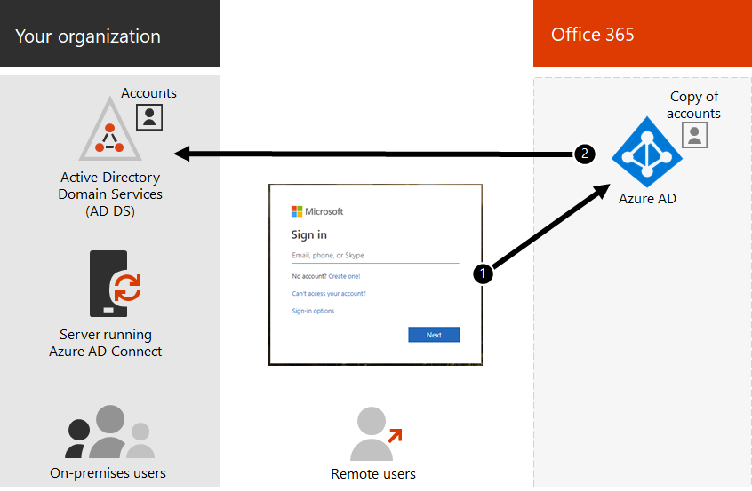

# Identidade híbrida e sincronização de diretório para o Office 365Hybrid identity and directory synchronization for Office 365

*Este artigo aplica-se ao Office 365 Enterprise e ao Microsoft 365 Enterprise**This article applies to both Office 365 Enterprise and Microsoft 365 Enterprise*

Dependendo das necessidades de negócios e dos requisitos técnicos, o modelo de identidade híbrida e a sincronização de diretórios é a opção mais comum para clientes corporativos que estão adotando o Office 365.Depending on business needs and technical requirements, the hybrid identity model and directory synchronization is the most common choice for enterprise customers who are adopting Office 365. A sincronização de diretórios permite gerenciar identidades em seus serviços de domínio do Active Directory (AD DS) e todas as atualizações de contas de usuário, grupos e contatos são sincronizadas com o locatário do Azure Active Directory (Azure AD) da sua assinatura do Office 365.Directory synchronization allows you to manage identities in your Active Directory Domain Services (AD DS) and all updates to user accounts, groups, and contacts are synchronized to the Azure Active Directory (Azure AD) tenant of your Office 365 subscription.

>[!Note]
>Quando as contas de usuário do AD DS são sincronizadas pela primeira vez, elas não recebem automaticamente uma licença do Office 365 e não podem acessar os serviços do Office 365, como email.When AD DS user accounts are synchronized for the first time, they are not automatically assigned an Office 365 license and cannot access Office 365 services, such as email. Você deve atribuir uma licença a essas contas de usuário, individualmente ou dinamicamente por meio da Associação de grupo.You must assign a license to these user accounts, either individually or dynamically through group membership.
>

## Autenticação para identidade híbridaAuthentication for hybrid identity

Há dois tipos de autenticação ao usar o modelo de identidade híbrida:There are two types of authentication when using the hybrid identity model:

- Autenticação gerenciadaManaged authentication

  O Azure AD lida com o processo de autenticação usando uma versão de hash armazenada localmente ou envia as credenciais para um agente de software local para ser autenticado pelo AD DS local.Azure AD handles the authentication process by using a locally stored hashed version of the password or sends the credentials to an on-premises software agent to be authenticated by the on-premises AD DS.

- Autenticação federadaFederated authentication

  O Azure AD redireciona o computador cliente solicitando a autenticação para entrar em contato com outro provedor de identidade.Azure AD redirects the client computer requesting authentication to contact another identity provider.

### Autenticação gerenciadaManaged authentication

Há dois tipos de autenticação gerenciada:There are two types of managed authentication:

- Sincronização de hash de senha (PHS)Password hash synchronization (PHS)

  O Azure AD executa a própria autenticação.Azure AD performs the authentication itself.

- Autenticação de passagem (PTA)Pass-through authentication (PTA)

  O Azure AD tem o AD DS executando a autenticação.Azure AD has AD DS perform the authentication.

#### Sincronização de hash de senhaPassword hash synchronization

Com a sincronização de hash de senha (PHS), você sincroniza suas contas de usuário do AD DS com o Office 365 e gerencia seus usuários no local.With password hash synchronization (PHS), you synchronize your AD DS user accounts with Office 365 and manage your users on-premises. Hashes de senhas de usuário são sincronizados do AD DS para o Azure AD para que os usuários tenham a mesma senha no local e na nuvem.Hashes of user passwords are synchronized from your AD DS to Azure AD so that the users have the same password on-premises and in the cloud. Essa é a maneira mais simples de habilitar a autenticação para identidades do AD DS no Azure AD.This is the simplest way to enable authentication for AD DS identities in Azure AD. 

Quando as senhas são alteradas ou redefinidas no local, os novos hashes de senha são sincronizados com o Azure AD para que os usuários sempre possam usar a mesma senha para recursos de nuvem e recursos locais.When passwords are changed or reset on-premises, the new password hashes are synchronized to Azure AD so that your users can always use the same password for cloud resources and on-premises resources. As senhas do usuário nunca são enviadas para o Azure AD ou armazenadas no Azure AD em texto não criptografado.The user passwords are never sent to Azure AD or stored in Azure AD in clear text. Alguns recursos premium do Azure AD, como proteção de identidade, exigem PHS independentemente do método de autenticação selecionado.Some premium features of Azure AD, such as Identity Protection, require PHS regardless of which authentication method is selected.
  
Consulte [escolher PHS](https://docs.microsoft.com/azure/security/azure-ad-choose-authn) para saber mais.See [choosing PHS](https://docs.microsoft.com/azure/security/azure-ad-choose-authn) to learn more.
  
#### Autenticação de passagemPass-through authentication

A autenticação de passagem (PTA) fornece uma validação de senha simples para os serviços de autenticação do Azure AD usando um agente de software executado em um ou mais servidores locais para validar os usuários diretamente com o AD DS.Pass-through authentication (PTA) provides a simple password validation for Azure AD authentication services using a software agent running on one or more on-premises servers to validate the users directly with your AD DS. Com a autenticação de passagem (PTA), você sincroniza contas de usuário do AD DS com o Office 365 e gerencia seus usuários no local.With pass-through authentication (PTA), you synchronize AD DS user accounts with Office 365 and manage your users on-premises. 

O PTA permite que os usuários entrem em recursos e aplicativos locais e do Office 365 usando sua conta e senha local.PTA allows your users to sign in to both on-premises and Office 365 resources and applications using their on-premises account and password. Essa configuração valida senhas de usuários diretamente em seu AD DS local sem armazenar hashes de senha no Azure AD.This configuration validates users passwords directly against your on-premises AD DS without storing password hashes in Azure AD. 

PTA também é para organizações com um requisito de segurança para impor imediatamente os Estados de conta de usuário local, as diretivas de senha e o horário de logon.PTA is also for organizations with a security requirement to immediately enforce on-premises user account states, password policies, and logon hours. 
  
Consulte [escolher PTA](https://docs.microsoft.com/azure/security/azure-ad-choose-authn) para saber mais.See [choosing PTA](https://docs.microsoft.com/azure/security/azure-ad-choose-authn) to learn more.
  
### Autenticação federadaFederated authentication

A autenticação federada é principalmente para grandes organizações corporativas com requisitos de autenticação mais complexos.Federated authentication is primarily for large enterprise organizations with more complex authentication requirements. As identidades do AD DS são sincronizadas com o Office 365 e as contas de usuários são gerenciadas no local.AD DS identities are synchronized with Office 365 and users accounts are managed on-premises. Com a autenticação federada, os usuários têm a mesma senha no local e na nuvem, e não precisam entrar novamente para usar o Office 365.With federated authentication, users have the same password on-premises and in the cloud and they do not have to sign in again to use Office 365. 

A autenticação federada pode dar suporte a requisitos de autenticação adicionais, como a autenticação com base em Smartcard ou uma autenticação multifator de terceiros, e normalmente é necessária quando as organizações têm um requisito de autenticação não com suporte nativo pelo Azure AD.Federated authentication can support additional authentication requirements, such as smartcard-based authentication or a third-party multi-factor authentication and is typically required when organizations have an authentication requirement not natively supported by Azure AD.
 
Consulte [escolhendo autenticação federada](https://docs.microsoft.com/azure/security/azure-ad-choose-authn) para saber mais.See [choosing federated authentication](https://docs.microsoft.com/azure/security/azure-ad-choose-authn) to learn more.
  
#### Provedores de autenticação e identidade de terceirosThird-party authentication and identity providers

Os objetos de diretório no local podem ser sincronizados com o Office 365 e o acesso a recursos em nuvem é basicamente gerenciado por um provedor de identidade de terceiros (IdP).On-premises directory objects may be synchronized to Office 365 and cloud resource access is primarily managed by a third-party identity provider (IdP). Se sua organização usa uma solução de Federação de terceiros, você pode configurar o logon com essa solução para o Office 365 desde que a solução de Federação de terceiros seja compatível com o Azure AD.If your organization uses a third-party federation solution, you can configure sign-on with that solution for Office 365 provided that the third-party federation solution is compatible with Azure AD.
  
Confira [compatibilidade de Federação do Azure ad](https://docs.microsoft.com/azure/active-directory/connect/active-directory-aadconnect-federation-compatibility) para saber mais.See [Azure AD federation compatibility](https://docs.microsoft.com/azure/active-directory/connect/active-directory-aadconnect-federation-compatibility) to learn more.
  
## Limpeza do AD DSAD DS Cleanup

Para ajudar a garantir uma transição contínua para o Office 365 usando a sincronização, você deve preparar sua floresta do AD DS antes de começar sua implantação de sincronização de diretório do Office 365.To help ensure a seamless transition to Office 365 by using synchronization, you must prepare your AD DS forest before you begin your Office 365 directory synchronization deployment.
  
Ao [Configurar a sincronização de diretórios no Office 365](set-up-directory-synchronization.md), uma das etapas é [baixar e executar a ferramenta IdFix](install-and-run-idfix.md).When you [set up directory synchronization in Office 365](set-up-directory-synchronization.md), one of the steps is to [download and run the IdFix tool](install-and-run-idfix.md). Você pode usar a ferramenta IdFix para ajudar com a [limpeza de diretório](prepare-directory-attributes-for-synch-with-idfix.md).You can use the IdFix tool to help with [directory cleanup](prepare-directory-attributes-for-synch-with-idfix.md).
  
Sua limpeza de diretório deve se concentrar nas seguintes tarefas:Your directory cleanup should focus on the following tasks:

- Remover os atributos **ProxyAddress** e **userPrincipalName** duplicados.Remove duplicate **proxyAddress** and **userPrincipalName** attributes.
- Atualizar atributos **userPrincipalName** em branco e inválidos com atributos **userPrincipalName** válidos.Update blank and invalid **userPrincipalName** attributes with valid **userPrincipalName** attributes.
- Remover caracteres inválidos e questionáveis em **excertoname**, sobrenome ( **SN** ) **, sAMAccountName**, **DisplayName**, **mail**, **proxyAddresses**, **mailNickname**e **userPrincipalName** atributos.Remove invalid and questionable characters in the **givenName**, surname ( **sn** ), **sAMAccountName**, **displayName**, **mail**, **proxyAddresses**, **mailNickname**, and **userPrincipalName** attributes. Para obter detalhes sobre como preparar atributos, consulte [lista de atributos que são sincronizados pela ferramenta de sincronização do Azure Active Directory](https://go.microsoft.com/fwlink/p/?LinkId=396719).For details about preparing attributes, see [List of attributes that are synced by the Azure Active Directory Sync Tool](https://go.microsoft.com/fwlink/p/?LinkId=396719).

    > [!NOTE]
    > Estes são os mesmos atributos que o Azure AD Connect sincroniza.These are the same attributes that Azure AD Connect synchronizes. 
  
## Considerações de implantação de várias florestasMulti-forest deployment considerations

Para várias florestas e opções de SSO, use a [instalação personalizada do Azure ad Connect](https://go.microsoft.com/fwlink/p/?LinkId=698430).For multiple forests and SSO options, use [Custom Installation of Azure AD Connect](https://go.microsoft.com/fwlink/p/?LinkId=698430).
  
Se sua organização tiver várias florestas para autenticação (florestas de logon), recomendamos enfaticamente o seguinte:If your organization has multiple forests for authentication (logon forests), we highly recommend the following:
  
- **Considere a consolidação de suas florestas.****Consider consolidating your forests.** Em geral, há mais sobrecarga necessária para manter várias florestas.In general, there's more overhead required to maintain multiple forests. A menos que sua organização tenha restrições de segurança que ditem a necessidade de florestas separadas, considere simplificar o ambiente local.Unless your organization has security constraints that dictate the need for separate forests, consider simplifying your on-premises environment.
- **Use somente na floresta de logon principal.****Use only in your primary logon forest.** Considere a implantação do Office 365 somente em sua floresta de logon principal para a sua distribuição inicial do Office 365.Consider deploying Office 365 only in your primary logon forest for your initial rollout of Office 365. 

Se você não puder consolidar sua implantação do AD DS de várias florestas ou se estiver usando outros serviços de diretório para gerenciar identidades, talvez seja possível sincronizá-las com a ajuda da Microsoft ou de um parceiro.If you can't consolidate your multi-forest AD DS deployment or are using other directory services to manage identities, you may be able to synchronize these with the help of Microsoft or a partner.
  
Confira [sincronização de diretórios de várias florestas com um cenário de logon único](https://go.microsoft.com/fwlink/p/?LinkId=525321) para obter mais informações.See [Multi-forest Directory Sync with Single Sign-On Scenario](https://go.microsoft.com/fwlink/p/?LinkId=525321) for more information.
  
## Recursos que dependem da sincronização de diretórioFeatures that are dependent on directory synchronization
  
A sincronização de diretórios é necessária para os seguintes recursos e funcionalidade:Directory synchronization is required for the following features and functionality:
  
- Logon único (SSO) contínuo do Azure ADAzure AD Seamless Single Sign-On (SSO)
- Coexistência do SkypeSkype coexistence
- Implantação híbrida do Exchange, incluindo:Exchange hybrid deployment, including:
  - GAL (lista de endereços global) totalmente compartilhada entre seu ambiente do Exchange local e o Office 365.Fully shared global address list (GAL) between your on-premises Exchange environment and Office 365.
  - Sincronizar informação de GAL de sistemas de email diferentes.Synchronizing GAL information from different mail systems.
  - A capacidade de adicionar usuários e remover usuários das ofertas de serviço do Office 365.The ability to add users to and remove users from Office 365 service offerings. Isto exige o seguinte:This requires the following:
  - A sincronização bidirecional deve ser configurada durante a configuração de sincronização de diretório.Two-way synchronization must be configured during directory synchronization setup. Por padrão, as ferramentas de sincronização de diretório gravam informações de diretório somente na nuvem.By default, directory synchronization tools write directory information only to the cloud. Ao configurar a sincronização bidirecional, você habilita a funcionalidade de write-back para que um número limitado de atributos de objeto seja copiado da nuvem e, em seguida, os escreveu novamente no AD DS local.When you configure two-way synchronization, you enable write-back functionality so that a limited number of object attributes are copied from the cloud, and then written them back to your local AD DS. O Write-back também é conhecido como modo híbrido do Exchange.Write-back is also referred to as Exchange hybrid mode. 
  - Uma implantação híbrida local do ExchangeAn on-premises Exchange hybrid deployment
  - A capacidade de mover algumas caixas de correio do usuário para o Office 365 enquanto mantém outras caixas de correio do usuário no local.The ability to move some user mailboxes to Office 365 while keeping other user mailboxes on-premises.
  - Remetentes confiáveis e remetentes bloqueados no local são replicados para o Office 365.Safe senders and blocked senders on-premises are replicated to Office 365.
  - Delegação básica e funcionalidade de email enviar em nome de.Basic delegation and send-on-behalf-of email functionality.
  - Você tem uma solução integrada de cartão inteligente ou de autenticação multifator no local.You have an integrated on-premises smart card or multi-factor authentication solution.
- Sincronização de fotos, miniaturas, salas de conferência e grupos de segurançaSynchronization of photos, thumbnails, conference rooms, and security groups

## Próxima etapaNext step

Quando estiver pronto para implantar a identidade híbrida, confira [preparar para provisionar usuários](prepare-for-directory-synchronization.md).When you are ready to deploy hybrid identity, see [prepare to provision users](prepare-for-directory-synchronization.md).
  
## Confira tambémSee also

[Visão geral do Microsoft 365 EnterpriseMicrosoft 365 Enterprise overview](https://docs.microsoft.com/microsoft-365/enterprise/microsoft-365-overview)

