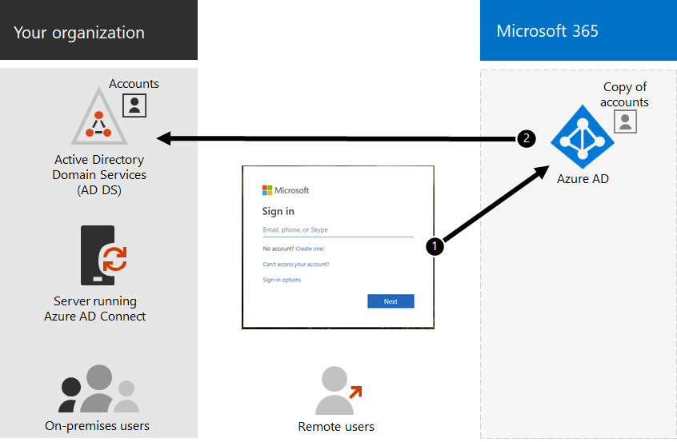

# Identidade híbrida e sincronização de diretório para o Office 365

*Este artigo aplica-se ao Office 365 Enterprise e ao Microsoft 365 Enterprise*

Dependendo das necessidades de negócios e dos requisitos técnicos, o modelo de identidade híbrida e a sincronização de diretórios é a opção mais comum para clientes corporativos que estão adotando o Office 365. A sincronização de diretórios permite gerenciar identidades em seus serviços de domínio do Active Directory (AD DS) e todas as atualizações de contas de usuário, grupos e contatos são sincronizadas com o locatário do Azure Active Directory (Azure AD) da sua assinatura do Office 365.

>[!Note]
>Quando as contas de usuário do AD DS são sincronizadas pela primeira vez, elas não recebem automaticamente uma licença do Office 365 e não podem acessar os serviços do Office 365, como email. Você deve atribuir uma licença a essas contas de usuário, individualmente ou dinamicamente por meio da Associação de grupo.
>

## Autenticação para identidade híbrida

Há dois tipos de autenticação ao usar o modelo de identidade híbrida:

- Autenticação gerenciada

  O Azure AD lida com o processo de autenticação usando uma versão de hash armazenada localmente ou envia as credenciais para um agente de software local para ser autenticado pelo AD DS local.

- Autenticação federada

  O Azure AD redireciona o computador cliente solicitando a autenticação para entrar em contato com outro provedor de identidade.

### Autenticação gerenciada

Há dois tipos de autenticação gerenciada:

- Sincronização de hash de senha (PHS)

  O Azure AD executa a própria autenticação.

- Autenticação de passagem (PTA)

  O Azure AD tem o AD DS executando a autenticação.

#### Sincronização de hash de senha

Com a sincronização de hash de senha (PHS), você sincroniza suas contas de usuário do AD DS com o Office 365 e gerencia seus usuários no local. Hashes de senhas de usuário são sincronizados do AD DS para o Azure AD para que os usuários tenham a mesma senha no local e na nuvem. Essa é a maneira mais simples de habilitar a autenticação para identidades do AD DS no Azure AD. 

Quando as senhas são alteradas ou redefinidas no local, os novos hashes de senha são sincronizados com o Azure AD para que os usuários sempre possam usar a mesma senha para recursos de nuvem e recursos locais. As senhas do usuário nunca são enviadas para o Azure AD ou armazenadas no Azure AD em texto não criptografado. Alguns recursos premium do Azure AD, como proteção de identidade, exigem PHS independentemente do método de autenticação selecionado.
  
Consulte [escolher PHS](https://docs.microsoft.com/azure/security/azure-ad-choose-authn) para saber mais.
  
#### Autenticação de passagem

A autenticação de passagem (PTA) fornece uma validação de senha simples para os serviços de autenticação do Azure AD usando um agente de software executado em um ou mais servidores locais para validar os usuários diretamente com o AD DS. Com a autenticação de passagem (PTA), você sincroniza contas de usuário do AD DS com o Office 365 e gerencia seus usuários no local. 

O PTA permite que os usuários entrem em recursos e aplicativos locais e do Office 365 usando sua conta e senha local. Essa configuração valida senhas de usuários diretamente em seu AD DS local sem armazenar hashes de senha no Azure AD. 

PTA também é para organizações com um requisito de segurança para impor imediatamente os Estados de conta de usuário local, as diretivas de senha e o horário de logon. 
  
Consulte [escolher PTA](https://docs.microsoft.com/azure/security/azure-ad-choose-authn) para saber mais.
  
### Autenticação federada

A autenticação federada é principalmente para grandes organizações corporativas com requisitos de autenticação mais complexos. As identidades do AD DS são sincronizadas com o Office 365 e as contas de usuários são gerenciadas no local. Com a autenticação federada, os usuários têm a mesma senha no local e na nuvem, e não precisam entrar novamente para usar o Office 365. 

A autenticação federada pode dar suporte a requisitos de autenticação adicionais, como a autenticação com base em Smartcard ou uma autenticação multifator de terceiros, e normalmente é necessária quando as organizações têm um requisito de autenticação não com suporte nativo pelo Azure AD.
 
Consulte [escolhendo autenticação federada](https://docs.microsoft.com/azure/security/azure-ad-choose-authn) para saber mais.
  
#### Provedores de autenticação e identidade de terceiros

Os objetos de diretório no local podem ser sincronizados com o Office 365 e o acesso a recursos em nuvem é basicamente gerenciado por um provedor de identidade de terceiros (IdP). Se sua organização usa uma solução de Federação de terceiros, você pode configurar o logon com essa solução para o Office 365 desde que a solução de Federação de terceiros seja compatível com o Azure AD.
  
Confira [compatibilidade de Federação do Azure ad](https://docs.microsoft.com/azure/active-directory/connect/active-directory-aadconnect-federation-compatibility) para saber mais.
  
## Limpeza do AD DS

Para ajudar a garantir uma transição contínua para o Office 365 usando a sincronização, você deve preparar sua floresta do AD DS antes de começar sua implantação de sincronização de diretório do Office 365.
  
Ao [Configurar a sincronização de diretórios no Office 365](set-up-directory-synchronization.md), uma das etapas é [baixar e executar a ferramenta IdFix](install-and-run-idfix.md). Você pode usar a ferramenta IdFix para ajudar com a [limpeza de diretório](prepare-directory-attributes-for-synch-with-idfix.md).
  
Sua limpeza de diretório deve se concentrar nas seguintes tarefas:

- Remover os atributos **ProxyAddress** e **userPrincipalName** duplicados.
- Atualizar atributos **userPrincipalName** em branco e inválidos com atributos **userPrincipalName** válidos.
- Remover caracteres inválidos e questionáveis em **excertoname**, sobrenome ( **SN** ) **, sAMAccountName**, **DisplayName**, **mail**, **proxyAddresses**, **mailNickname**e **userPrincipalName** atributos. Para obter detalhes sobre como preparar atributos, consulte [lista de atributos que são sincronizados pela ferramenta de sincronização do Azure Active Directory](https://go.microsoft.com/fwlink/p/?LinkId=396719).

    > [!NOTE]
    > Estes são os mesmos atributos que o Azure AD Connect sincroniza. 
  
## Considerações de implantação de várias florestas

Para várias florestas e opções de SSO, use a [instalação personalizada do Azure ad Connect](https://go.microsoft.com/fwlink/p/?LinkId=698430).
  
Se sua organização tiver várias florestas para autenticação (florestas de logon), recomendamos enfaticamente o seguinte:
  
- **Considere a consolidação de suas florestas.** Em geral, há mais sobrecarga necessária para manter várias florestas. A menos que sua organização tenha restrições de segurança que ditem a necessidade de florestas separadas, considere simplificar o ambiente local.
- **Use somente na floresta de logon principal.** Considere a implantação do Office 365 somente em sua floresta de logon principal para a sua distribuição inicial do Office 365. 

Se você não puder consolidar sua implantação do AD DS de várias florestas ou se estiver usando outros serviços de diretório para gerenciar identidades, talvez seja possível sincronizá-las com a ajuda da Microsoft ou de um parceiro.
  
Confira [sincronização de diretórios de várias florestas com um cenário de logon único](https://go.microsoft.com/fwlink/p/?LinkId=525321) para obter mais informações.
  
## Recursos que dependem da sincronização de diretório
  
A sincronização de diretórios é necessária para os seguintes recursos e funcionalidade:
  
- Logon único (SSO) contínuo do Azure AD
- Coexistência do Skype
- Implantação híbrida do Exchange, incluindo:
  - GAL (lista de endereços global) totalmente compartilhada entre seu ambiente do Exchange local e o Office 365.
  - Sincronizar informação de GAL de sistemas de email diferentes.
  - A capacidade de adicionar usuários e remover usuários das ofertas de serviço do Office 365. Isto exige o seguinte:
  - A sincronização bidirecional deve ser configurada durante a configuração de sincronização de diretório. Por padrão, as ferramentas de sincronização de diretório gravam informações de diretório somente na nuvem. Ao configurar a sincronização bidirecional, você habilita a funcionalidade de write-back para que um número limitado de atributos de objeto seja copiado da nuvem e, em seguida, os escreveu novamente no AD DS local. O Write-back também é conhecido como modo híbrido do Exchange. 
  - Uma implantação híbrida local do Exchange
  - A capacidade de mover algumas caixas de correio do usuário para o Office 365 enquanto mantém outras caixas de correio do usuário no local.
  - Remetentes confiáveis e remetentes bloqueados no local são replicados para o Office 365.
  - Delegação básica e funcionalidade de email enviar em nome de.
  - Você tem uma solução integrada de cartão inteligente ou de autenticação multifator no local.
- Sincronização de fotos, miniaturas, salas de conferência e grupos de segurança

## Próxima etapa

Quando estiver pronto para implantar a identidade híbrida, confira [preparar para provisionar usuários](prepare-for-directory-synchronization.md).
  
## Confira também

[Visão geral do Microsoft 365 Enterprise](https://docs.microsoft.com/microsoft-365/enterprise/microsoft-365-overview)

