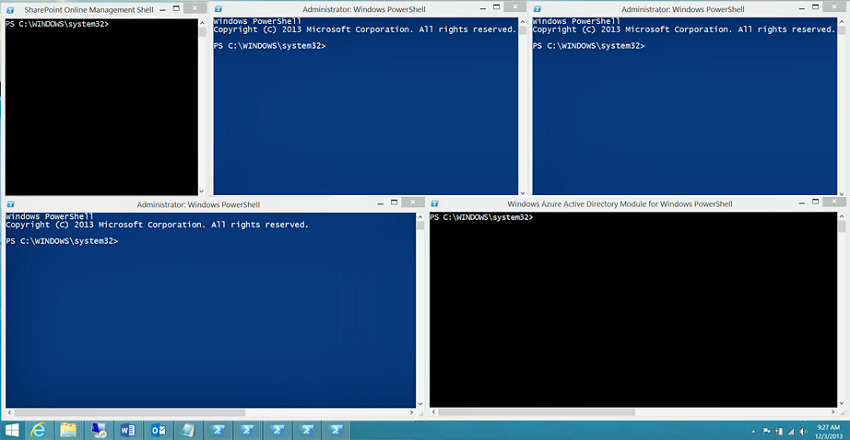

# <a name="connect-to-all-office-365-services-in-a-single-windows-powershell-window"></a><span data-ttu-id="bc9ca-103">Conectar-se a todos os serviços do Office 365 usando uma única janela do Windows PowerShell</span><span class="sxs-lookup"><span data-stu-id="bc9ca-103">Connect to all Office 365 services in a single Windows PowerShell window</span></span>

 <span data-ttu-id="bc9ca-104">**Resumo:** Em vez de gerenciar diferentes serviços do Office 365 em janelas separadas de console do PowerShell, é possível conectar-se a todos os serviços do Office 365 e gerenciá-los da janela do console único.</span><span class="sxs-lookup"><span data-stu-id="bc9ca-104">**Summary:** Instead of managing different Office 365 services in separate PowerShell console windows, you can connect to all Office 365 services and manage them from single console window.</span></span>
  
<span data-ttu-id="bc9ca-p101">Quando você usar o PowerShell para gerenciar o Office 365, é possível ter até cinco sessões diferentes do Windows PowerShell abrir ao mesmo tempo correspondente ao centro de administração do Office 365, SharePoint Online, Exchange Online, Skype para Business Online e a segurança &amp;Centro de conformidade. Com cinco métodos diferentes de conexão em sessões separados do Windows PowerShell, sua área de trabalho pode ser assim:</span><span class="sxs-lookup"><span data-stu-id="bc9ca-p101">When you use PowerShell to manage Office 365, it is possible to have up to five different Windows PowerShell sessions open at the same time corresponding to Office 365 admin center, SharePoint Online, Exchange Online, Skype for Business Online, and the Security &amp; Compliance Center. With five different connection methods in separate Windows PowerShell sessions, your desktop could look like this:</span></span>
  

  
<span data-ttu-id="bc9ca-p102">Isso não é ideal para gerenciar o Office 365 porque você não pode trocar dados entre esses cinco windows para o gerenciamento de cross-service. Este tópico descreve como usar uma única instância do Windows PowerShell a partir do qual você pode gerenciar o Office 365, Skype Business Online, Exchange Online, SharePoint Online e a segurança &amp; Centro de conformidade.</span><span class="sxs-lookup"><span data-stu-id="bc9ca-p102">This is not optimal for managing Office 365 because you can't exchange data among those five windows for cross-service management. This topic describes how to use a single instance of Windows PowerShell from which you can manage Office 365, Skype for Business Online, Exchange Online, SharePoint Online, and the Security &amp; Compliance Center.</span></span>

>[!Note]
><span data-ttu-id="bc9ca-p103">Este artigo contém atualmente somente os comandos para se conectar ao Office 365 internacional (+ GCC) nuvem. Observações adicionais fornecem links para artigos com informações sobre a conexão as outras nuvens do Office 365.</span><span class="sxs-lookup"><span data-stu-id="bc9ca-p103">This article currently only contains the commands to connect to the Office 365 Worldwide (+GCC) cloud. Additional notes provide links to articles with information about connecting to the other Office 365 clouds.</span></span>
>

## <a name="before-you-begin"></a><span data-ttu-id="bc9ca-112">Antes de começar</span><span class="sxs-lookup"><span data-stu-id="bc9ca-112">Before you begin</span></span>

<span data-ttu-id="bc9ca-113">Antes de você pode gerenciar tudo do Office 365 de uma única instância do Windows PowerShell, considere os seguintes pré-requisitos:</span><span class="sxs-lookup"><span data-stu-id="bc9ca-113">Before you can manage all of Office 365 from a single instance of Windows PowerShell, consider the following prerequisites:</span></span>
  
- <span data-ttu-id="bc9ca-p104">O Office 365 funcionam ou escola a conta que você usa para esses procedimentos necessidades para ser um membro de uma função de administrador do Office 365. Para obter mais informações, consulte [funções de administrador do Office 365](https://go.microsoft.com/fwlink/p/?LinkId=532367). Este um requisito para o Office 365 PowerShell, mas não necessariamente para todos os outros serviços do Office 365.</span><span class="sxs-lookup"><span data-stu-id="bc9ca-p104">The Office 365 work or school account that you use for these procedures needs to be a member of an Office 365 admin role. For more information, see [About Office 365 admin roles](https://go.microsoft.com/fwlink/p/?LinkId=532367). This a requirement for Office 365 PowerShell, not necessarily for all other Office 365 services.</span></span>
    
- <span data-ttu-id="bc9ca-117">Você pode usar as seguintes versões de 64 bits do Windows:</span><span class="sxs-lookup"><span data-stu-id="bc9ca-117">You can use the following 64-bit versions of Windows:</span></span>
    
  - <span data-ttu-id="bc9ca-118">Windows 10</span><span class="sxs-lookup"><span data-stu-id="bc9ca-118">Windows 10</span></span>
    
  - <span data-ttu-id="bc9ca-119">Windows 8.1 ou Windows 8</span><span class="sxs-lookup"><span data-stu-id="bc9ca-119">Windows 8.1 or Windows 8</span></span>
    
  - <span data-ttu-id="bc9ca-120">Windows Server 2019</span><span class="sxs-lookup"><span data-stu-id="bc9ca-120">Windows Server 2019</span></span>
    
  - <span data-ttu-id="bc9ca-121">Windows Server 2016</span><span class="sxs-lookup"><span data-stu-id="bc9ca-121">Windows Server 2016</span></span>
    
  - <span data-ttu-id="bc9ca-122">Windows Server 2012 R2 ou Windows Server 2012</span><span class="sxs-lookup"><span data-stu-id="bc9ca-122">Windows Server 2012 R2 or Windows Server 2012</span></span>
    
  - <span data-ttu-id="bc9ca-123">Windows 7 Service Pack 1 (SP1)\*</span><span class="sxs-lookup"><span data-stu-id="bc9ca-123">Windows 7 Service Pack 1 (SP1)\*</span></span>
    
  - <span data-ttu-id="bc9ca-124">Windows Server 2008 R2 SP1\*</span><span class="sxs-lookup"><span data-stu-id="bc9ca-124">Windows Server 2008 R2 SP1\*</span></span>
    
    <span data-ttu-id="bc9ca-p105">\*Você precisa instalar o Microsoft .NET Framework 4.5. *x* e, em seguida, ambos o Windows Management Framework 3.0 ou o Windows Management Framework 4.0. Para obter mais informações, consulte [Instalando o .NET Framework](https://go.microsoft.com/fwlink/p/?LinkId=257868) e [Windows Management Framework 3.0](https://go.microsoft.com/fwlink/p/?LinkId=272757) ou [Windows Management Framework 4.0](https://go.microsoft.com/fwlink/p/?LinkId=391344).</span><span class="sxs-lookup"><span data-stu-id="bc9ca-p105">\* You need to install the Microsoft .NET Framework 4.5.*x* and then either the Windows Management Framework 3.0 or the Windows Management Framework 4.0. For more information, see [Installing the .NET Framework](https://go.microsoft.com/fwlink/p/?LinkId=257868) and [Windows Management Framework 3.0](https://go.microsoft.com/fwlink/p/?LinkId=272757) or [Windows Management Framework 4.0](https://go.microsoft.com/fwlink/p/?LinkId=391344).</span></span>
    
    <span data-ttu-id="bc9ca-127">Você precisa usar uma versão de 64 bits do Windows devido aos requisitos para o Skype para módulo Business Online e outra os módulos do Office 365.</span><span class="sxs-lookup"><span data-stu-id="bc9ca-127">You need to use a 64-bit version of Windows because of the requirements for the Skype for Business Online module and one of the Office 365 modules.</span></span>
    
- <span data-ttu-id="bc9ca-128">Você precisa instalar os módulos que são necessários para o Windows Azure AD, SharePoint Online e Skype para Business Online:</span><span class="sxs-lookup"><span data-stu-id="bc9ca-128">You need to install the modules that are required for Azure AD, SharePoint Online, and Skype for Business Online:</span></span>
    
   - [<span data-ttu-id="bc9ca-129">Azure Active Directory V2</span><span class="sxs-lookup"><span data-stu-id="bc9ca-129">Azure Active Directory V2</span></span>](connect-to-office-365-powershell.md##connect-with-the-azure-active-directory-powershell-for-graph-module)
   - [<span data-ttu-id="bc9ca-130">Shell de Gerenciamento do SharePoint Online</span><span class="sxs-lookup"><span data-stu-id="bc9ca-130">SharePoint Online Management Shell</span></span>](https://go.microsoft.com/fwlink/p/?LinkId=255251)
   - [<span data-ttu-id="bc9ca-131">Skype para negócios on-line, o módulo do Windows PowerShell</span><span class="sxs-lookup"><span data-stu-id="bc9ca-131">Skype for Business Online, Windows PowerShell Module</span></span>](https://go.microsoft.com/fwlink/p/?LinkId=532439)
    
-  <span data-ttu-id="bc9ca-p106">Windows PowerShell deve ser configurado para executar scripts assinados Skype para Business Online, o Exchange Online e a segurança &amp; Centro de conformidade. Para fazer isso, execute o seguinte comando em uma sessão do Windows PowerShell com privilégios elevados (uma janela do Windows PowerShell para abrir, selecione **Executar como administrador**).</span><span class="sxs-lookup"><span data-stu-id="bc9ca-p106">Windows PowerShell needs to be configured to run signed scripts for Skype for Business Online, Exchange Online, and the Security &amp; Compliance Center. To do this, run the following command in an elevated Windows PowerShell session (a Windows PowerShell window you open by selecting **Run as administrator**).</span></span>
    
  ```
  Set-ExecutionPolicy RemoteSigned
  ```

## <a name="connection-steps-when-using-a-password"></a><span data-ttu-id="bc9ca-134">Etapas de Conexão ao usar uma senha</span><span class="sxs-lookup"><span data-stu-id="bc9ca-134">Connection steps when using a password</span></span>

<span data-ttu-id="bc9ca-135">Aqui estão as etapas para se conectar a todos os serviços em uma única janela do PowerShell.</span><span class="sxs-lookup"><span data-stu-id="bc9ca-135">Here are the steps to connect to all the services in a single PowerShell window.</span></span>
  
1. <span data-ttu-id="bc9ca-136">Abra o Windows PowerShell como um administrador (use **Executar como administrador**).</span><span class="sxs-lookup"><span data-stu-id="bc9ca-136">Open Windows PowerShell as an administrator (use **Run as administrator**).</span></span>
    
2. <span data-ttu-id="bc9ca-137">Execute este comando e insira seu trabalho do Office 365 ou escola credenciais da conta.</span><span class="sxs-lookup"><span data-stu-id="bc9ca-137">Run this command, and enter your Office 365 work or school account credentials.</span></span>
    
  ```
  $credential = Get-Credential
  ```

3. <span data-ttu-id="bc9ca-138">Execute este comando para se conectar ao Windows Azure AD (Active Directory) usando o Windows Azure Active Directory PowerShell para o módulo de gráfico.</span><span class="sxs-lookup"><span data-stu-id="bc9ca-138">Run this command to connect to Azure Active Directory (AD) using the Azure Active Directory PowerShell for Graph module.</span></span>
    
  ```
  Connect-AzureAD -Credential $credential
  ```
  
  <span data-ttu-id="bc9ca-139">Como alternativa, se você estiver usando o módulo do Microsoft Azure Active Directory módulo para Windows PowerShell, execute este comando.</span><span class="sxs-lookup"><span data-stu-id="bc9ca-139">Alternately, if you are using the Microsoft Azure Active Directory Module for Windows PowerShell module, run this command.</span></span>
      
  ```
  Connect-MsolService -Credential $credential
 ```

4. <span data-ttu-id="bc9ca-p107">Execute estes comandos para se conectar ao SharePoint Online. Substituir _ \<domainhost >_ com o valor real para seu domínio. Por exemplo, para "litwareinc.onmicrosoft.com", o _ \<domainhost >_ valor é "litwareinc".</span><span class="sxs-lookup"><span data-stu-id="bc9ca-p107">Run these commands to connect to SharePoint Online. Replace  _\<domainhost>_ with the actual value for your domain. For example, for "litwareinc.onmicrosoft.com", the  _\<domainhost>_ value is "litwareinc".</span></span>
    
  ```
  Import-Module Microsoft.Online.SharePoint.PowerShell -DisableNameChecking
  Connect-SPOService -Url https://<domainhost>-admin.sharepoint.com -credential $credential
  ```

5. <span data-ttu-id="bc9ca-p108">Execute estes comandos para se conectar ao Skype para negócios Online. Um aviso sobre o aumento do `WSMan NetworkDelayms` valor esperado na primeira vez que você se conectar e devem ser ignorados.</span><span class="sxs-lookup"><span data-stu-id="bc9ca-p108">Run these commands to connect to Skype for Business Online. A warning about increasing the `WSMan NetworkDelayms` value is expected the first time you connect and should be ignored.</span></span>
    
  ```
  Import-Module SkypeOnlineConnector
  $sfboSession = New-CsOnlineSession -Credential $credential
  Import-PSSession $sfboSession
  ```

6. <span data-ttu-id="bc9ca-145">Execute estes comandos para se conectar ao Exchange Online.</span><span class="sxs-lookup"><span data-stu-id="bc9ca-145">Run these commands to connect to Exchange Online.</span></span>
    
  ```
  $exchangeSession = New-PSSession -ConfigurationName Microsoft.Exchange -ConnectionUri "https://outlook.office365.com/powershell-liveid/" -Credential $credential -Authentication "Basic" -AllowRedirection
  Import-PSSession $exchangeSession -DisableNameChecking
  ```

>[!Note]
><span data-ttu-id="bc9ca-146">Para conectar-se ao Exchange Online para Office 365 nuvens que não seja Worldwide, consulte [Connect to Exchange Online PowerShell](https://docs.microsoft.com/powershell/exchange/exchange-online/connect-to-exchange-online-powershell/connect-to-exchange-online-powershell).</span><span class="sxs-lookup"><span data-stu-id="bc9ca-146">To connect to Exchange Online for Office 365 clouds other than Worldwide, see [Connect to Exchange Online PowerShell](https://docs.microsoft.com/powershell/exchange/exchange-online/connect-to-exchange-online-powershell/connect-to-exchange-online-powershell).</span></span>
>

7. <span data-ttu-id="bc9ca-147">Execute estes comandos para se conectar à segurança &amp; Centro de conformidade.</span><span class="sxs-lookup"><span data-stu-id="bc9ca-147">Run these commands to connect to the Security &amp; Compliance Center.</span></span>
    
  ```
  $SccSession = New-PSSession -ConfigurationName Microsoft.Exchange -ConnectionUri https://ps.compliance.protection.outlook.com/powershell-liveid/ -Credential $credential -Authentication "Basic" -AllowRedirection
  Import-PSSession $SccSession -Prefix cc
  ```

>[!Note]
><span data-ttu-id="bc9ca-148">Para se conectar à segurança &amp; Centro de conformidade para o Office 365 nuvens que não seja Worldwide, consulte [Connect to Office 365 Security & PowerShell do Centro de conformidade](https://docs.microsoft.com/powershell/exchange/office-365-scc/connect-to-scc-powershell/connect-to-scc-powershell).</span><span class="sxs-lookup"><span data-stu-id="bc9ca-148">To connect to the Security &amp; Compliance Center for Office 365 clouds other than Worldwide, see [Connect to Office 365 Security & Compliance Center PowerShell](https://docs.microsoft.com/powershell/exchange/office-365-scc/connect-to-scc-powershell/connect-to-scc-powershell).</span></span>
>

<span data-ttu-id="bc9ca-p109">Aqui estão todos os comandos em um único bloco ao usar o Windows Azure Active Directory PowerShell para o módulo de gráfico. Especifique o nome do seu host do domínio e execute todas elas ao mesmo tempo.</span><span class="sxs-lookup"><span data-stu-id="bc9ca-p109">Here are all the commands in a single block when using the Azure Active Directory PowerShell for Graph module. Specify the name of your domain host, and then run them all at one time.</span></span>
  
```
$domainHost="<domain host name, such as litwareinc for litwareinc.onmicrosoft.com>"
$credential = Get-Credential
Connect-AzureAD -Credential $credential
Import-Module Microsoft.Online.SharePoint.PowerShell -DisableNameChecking
Connect-SPOService -Url https://$domainHost-admin.sharepoint.com -credential $credential
Import-Module SkypeOnlineConnector
$sfboSession = New-CsOnlineSession -Credential $credential
Import-PSSession $sfboSession
$exchangeSession = New-PSSession -ConfigurationName Microsoft.Exchange -ConnectionUri "https://outlook.office365.com/powershell-liveid/" -Credential $credential -Authentication "Basic" -AllowRedirection
Import-PSSession $exchangeSession -DisableNameChecking
$SccSession = New-PSSession -ConfigurationName Microsoft.Exchange -ConnectionUri https://ps.compliance.protection.outlook.com/powershell-liveid/ -Credential $credential -Authentication "Basic" -AllowRedirection
Import-PSSession $SccSession -Prefix cc
```

<span data-ttu-id="bc9ca-p110">Como alternativa, aqui estão todos os comandos em um único bloco ao usar o módulo do Microsoft Azure Active Directory módulo para Windows PowerShell. Especifique o nome do seu host do domínio e execute todas elas ao mesmo tempo.</span><span class="sxs-lookup"><span data-stu-id="bc9ca-p110">Alternately, here are all the commands in a single block when using the Microsoft Azure Active Directory Module for Windows PowerShell module. Specify the name of your domain host, and then run them all at one time.</span></span>
  
```
$domainHost="<domain host name, such as litwareinc for litwareinc.onmicrosoft.com>"
$credential = Get-Credential
Connect-MsolService -Credential $credential
Import-Module Microsoft.Online.SharePoint.PowerShell -DisableNameChecking
Connect-SPOService -Url https://$domainHost-admin.sharepoint.com -credential $credential
Import-Module SkypeOnlineConnector
$sfboSession = New-CsOnlineSession -Credential $credential
Import-PSSession $sfboSession
$exchangeSession = New-PSSession -ConfigurationName Microsoft.Exchange -ConnectionUri "https://outlook.office365.com/powershell-liveid/" -Credential $credential -Authentication "Basic" -AllowRedirection
Import-PSSession $exchangeSession -DisableNameChecking
$SccSession = New-PSSession -ConfigurationName Microsoft.Exchange -ConnectionUri https://ps.compliance.protection.outlook.com/powershell-liveid/ -Credential $credential -Authentication "Basic" -AllowRedirection
Import-PSSession $SccSession -Prefix cc
```

<span data-ttu-id="bc9ca-153">Quando você estiver pronto para fechar a janela do Windows PowerShell para baixo, execute este comando para remover as sessões ativas para Skype para Business Online, Exchange Online, SharePoint Online e a segurança &amp; Centro de conformidade:</span><span class="sxs-lookup"><span data-stu-id="bc9ca-153">When you are ready to close down the Windows PowerShell window, run this command to remove the active sessions to Skype for Business Online, Exchange Online, SharePoint Online, and the Security &amp; Compliance Center:</span></span>
  
```
Remove-PSSession $sfboSession ; Remove-PSSession $exchangeSession ; Remove-PSSession $SccSession ; Disconnect-SPOService
```

## <a name="connection-steps-when-using-multi-factor-authentication"></a><span data-ttu-id="bc9ca-154">Etapas de Conexão ao usar a autenticação multifator</span><span class="sxs-lookup"><span data-stu-id="bc9ca-154">Connection steps when using multi-factor authentication</span></span>

<span data-ttu-id="bc9ca-p111">Aqui estão todos os comandos em um único bloco para se conectar ao AD do Windows Azure, SharePoint Online e Skype para negócios usando a autenticação multifator em uma única janela. Especifique o nome de nome principal (UPN) do usuário de uma conta de administrador global e seu nome de host do domínio e execute todas elas ao mesmo tempo.</span><span class="sxs-lookup"><span data-stu-id="bc9ca-p111">Here are all the commands in a single block to connect to Azure AD, SharePoint Online, and Skype for Buiness using multi-factor authentication in a single window. Specify the user principal name (UPN) name of a global administrator account and your domain host name, and then run them all at one time.</span></span>

````
$acctName="<UPN of a global administrator account>"
$domainHost="<domain host name, such as litwareinc for litwareinc.onmicrosoft.com>"
#Azure Active Directory
Connect-AzureAD
#SharePoint Online
Connect-SPOService -Url https://$domainHost-admin.sharepoint.com
#Skype for Business Online
$sfboSession = New-CsOnlineSession -UserName $acctName
Import-PSSession $sfboSession
````

<span data-ttu-id="bc9ca-157">Como alternativa, aqui estão todos os comandos ao usar o módulo do Microsoft Azure Active Directory módulo para Windows PowerShell.</span><span class="sxs-lookup"><span data-stu-id="bc9ca-157">Alternately, here are all the commands when using the Microsoft Azure Active Directory Module for Windows PowerShell module.</span></span>

````
$acctName="<UPN of a global administrator account>"
$domainHost="<domain host name, such as litwareinc for litwareinc.onmicrosoft.com>"
#Azure Active Directory
Connect-MsolService
#SharePoint Online
Connect-SPOService -Url https://$domainHost-admin.sharepoint.com
#Skype for Business Online
$sfboSession = New-CsOnlineSession -UserName $acctName
Import-PSSession $sfboSession
````

<span data-ttu-id="bc9ca-158">Para o Exchange Online e a segurança &amp; Centro de conformidade, consulte os tópicos a seguir para se conectar usando a autenticação multifator:</span><span class="sxs-lookup"><span data-stu-id="bc9ca-158">For Exchange Online and the Security &amp; Compliance Center, see the following topics to connect using multi-factor authentication:</span></span>

- [<span data-ttu-id="bc9ca-159">Conectar-se ao PowerShell do Exchange Online usando a autenticação multifator</span><span class="sxs-lookup"><span data-stu-id="bc9ca-159">Connect to Exchange Online PowerShell using multi-factor authentication</span></span>](https://docs.microsoft.com/powershell/exchange/exchange-online/connect-to-exchange-online-powershell/mfa-connect-to-exchange-online-powershell)
- [<span data-ttu-id="bc9ca-160">Conectar-se ao PowerShell do Centro de conformidade usando a autenticação multifator & de segurança do Office 365</span><span class="sxs-lookup"><span data-stu-id="bc9ca-160">Connect to Office 365 Security & Compliance Center PowerShell using multi-factor authentication</span></span>](https://docs.microsoft.com/powershell/exchange/office-365-scc/connect-to-scc-powershell/mfa-connect-to-scc-powershell?view=exchange-ps)
 
<span data-ttu-id="bc9ca-161">Observe que, em ambos os casos, você deve se conectar usando sessões separadas do Exchange Online Remote PowerShell módulo.</span><span class="sxs-lookup"><span data-stu-id="bc9ca-161">Note that in both cases, you must connect using separate sessions of the Exchange Online Remote PowerShell Module.</span></span>


## <a name="see-also"></a><span data-ttu-id="bc9ca-162">Confira também</span><span class="sxs-lookup"><span data-stu-id="bc9ca-162">See also</span></span>

- [<span data-ttu-id="bc9ca-163">Conectar-se ao PowerShell do Office 365</span><span class="sxs-lookup"><span data-stu-id="bc9ca-163">Connect to Office 365 PowerShell</span></span>](connect-to-office-365-powershell.md)
- [<span data-ttu-id="bc9ca-164">Gerenciar o SharePoint Online com o Office 365 PowerShell</span><span class="sxs-lookup"><span data-stu-id="bc9ca-164">Manage SharePoint Online with Office 365 PowerShell</span></span>](manage-sharepoint-online-with-office-365-powershell.md)
- [<span data-ttu-id="bc9ca-165">Gerenciar contas de usuário e licenças usando o Office 365 PowerShell</span><span class="sxs-lookup"><span data-stu-id="bc9ca-165">Manage user accounts and licenses with Office 365 PowerShell</span></span>](manage-user-accounts-and-licenses-with-office-365-powershell.md)
- [<span data-ttu-id="bc9ca-166">Use o Windows PowerShell para criar relatórios no Office 365</span><span class="sxs-lookup"><span data-stu-id="bc9ca-166">Use Windows PowerShell to create reports in Office 365</span></span>](use-windows-powershell-to-create-reports-in-office-365.md)
