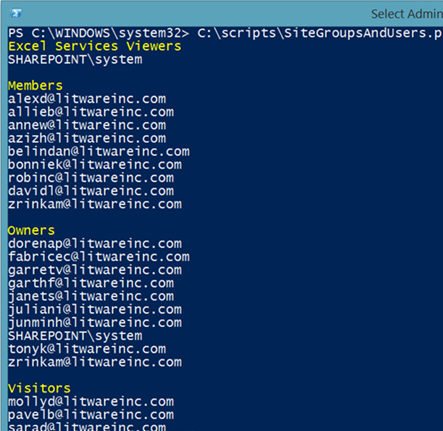

# <a name="manage-sharepoint-online-site-groups-with-office-365-powershell"></a><span data-ttu-id="6e24a-103">Manage SharePoint Online site groups with Office 365 PowerShell</span><span class="sxs-lookup"><span data-stu-id="6e24a-103">Manage SharePoint Online site groups with Office 365 PowerShell</span></span>

 <span data-ttu-id="6e24a-104">**Resumo:** Use o Office 365 PowerShell para gerenciar grupos de sites do SharePoint Online.</span><span class="sxs-lookup"><span data-stu-id="6e24a-104">**Summary:** Use Office 365 PowerShell to manage SharePoint Online site groups.</span></span>
  
<span data-ttu-id="6e24a-105">Embora você possa usar o centro de administração do Microsoft 365, você também pode usar o Office 365 PowerShell para gerenciar seus grupos de sites do SharePoint Online.</span><span class="sxs-lookup"><span data-stu-id="6e24a-105">Although you can use the Microsoft 365 admin center, you can also use Office 365 PowerShell to manage your SharePoint Online site groups.</span></span>

## <a name="before-you-begin"></a><span data-ttu-id="6e24a-106">Antes de começar</span><span class="sxs-lookup"><span data-stu-id="6e24a-106">Before you begin</span></span>

<span data-ttu-id="6e24a-107">Os procedimentos deste artigo exigem que você se conecte ao SharePoint Online.</span><span class="sxs-lookup"><span data-stu-id="6e24a-107">The procedures in this article require you to connect to SharePoint Online.</span></span> <span data-ttu-id="6e24a-108">Para obter instruções, consulte [conectar-se ao PowerShell do SharePoint Online](https://docs.microsoft.com/powershell/sharepoint/sharepoint-online/connect-sharepoint-online?view=sharepoint-ps).</span><span class="sxs-lookup"><span data-stu-id="6e24a-108">For instructions, see [Connect to SharePoint Online PowerShell](https://docs.microsoft.com/powershell/sharepoint/sharepoint-online/connect-sharepoint-online?view=sharepoint-ps).</span></span>

## <a name="view-sharepoint-online-with-office-365-powershell"></a><span data-ttu-id="6e24a-109">Exibir o SharePoint Online com o Office 365 PowerShell</span><span class="sxs-lookup"><span data-stu-id="6e24a-109">View SharePoint Online with Office 365 PowerShell</span></span>

<span data-ttu-id="6e24a-110">O centro de administração do SharePoint Online tem alguns métodos fáceis de usar para gerenciar grupos de sites.</span><span class="sxs-lookup"><span data-stu-id="6e24a-110">The SharePoint Online admin center has some easy-to-use methods for managing site groups.</span></span> <span data-ttu-id="6e24a-111">Por exemplo, suponha que você queira examinar os grupos e os membros do grupo para o `https://litwareinc.sharepoint.com/sites/finance` site.</span><span class="sxs-lookup"><span data-stu-id="6e24a-111">For example, suppose you want to look at the groups, and the group members, for the `https://litwareinc.sharepoint.com/sites/finance` site.</span></span> <span data-ttu-id="6e24a-112">Veja o que você precisa fazer para:</span><span class="sxs-lookup"><span data-stu-id="6e24a-112">Here’s what you have to do to:</span></span>

1. <span data-ttu-id="6e24a-113">No centro de administração do Microsoft 365, clique em**sites**de **recursos** > e, em seguida, clique na URL do site.</span><span class="sxs-lookup"><span data-stu-id="6e24a-113">From the Microsoft 365 admin center, click **Resources** > **Sites**, and then click the URL of the site.</span></span>
2. <span data-ttu-id="6e24a-114">Na caixa de diálogo conjunto de sites, clique em **ir para este site**.</span><span class="sxs-lookup"><span data-stu-id="6e24a-114">In the site collection dialog box, click **Go to this site**.</span></span>
3. <span data-ttu-id="6e24a-115">Na página do site, clique no ícone **configurações** (localizado no canto superior direito da página) e clique em **configurações do site**:</span><span class="sxs-lookup"><span data-stu-id="6e24a-115">On the site page, click the **Settings** icon (located in the upper right-hand corner of the page) and then click **Site settings**:</span></span><br/>
<span data-ttu-id="6e24a-116"></span><span class="sxs-lookup"><span data-stu-id="6e24a-116"></span></span><br/>
4. <span data-ttu-id="6e24a-117">Na página Configurações do site, clique em **permissões de sites** em **usuários e permissões**.</span><span class="sxs-lookup"><span data-stu-id="6e24a-117">On the Site Settings page, click **Sites permissions** under **Users and Permissions**.</span></span>

<span data-ttu-id="6e24a-118">E, em seguida, repita o processo para o próximo site que você deseja examinar.</span><span class="sxs-lookup"><span data-stu-id="6e24a-118">And then repeat the process for the next site you want to look at.</span></span>

<span data-ttu-id="6e24a-119">Para obter uma lista dos grupos com o Office 365 PowerShell, você deve usar o seguinte conjunto de comandos:</span><span class="sxs-lookup"><span data-stu-id="6e24a-119">To get a list of the groups with Office 365 PowerShell, you would use the following command set:</span></span>

```
$siteURL = "https://litwareinc.sharepoint.com/sites/finance"
$x = Get-SPOSiteGroup -Site $siteURL
foreach ($y in $x)
    {
        Write-Host $y.Title -ForegroundColor "Yellow"
        Get-SPOSiteGroup -Site $siteURL -Group $y.Title | Select-Object -ExpandProperty Users
        Write-Host
    }
```

<span data-ttu-id="6e24a-120">Há duas maneiras de executar este conjunto de comandos no prompt de comando do Shell de gerenciamento do SharePoint Online:</span><span class="sxs-lookup"><span data-stu-id="6e24a-120">There are two ways to run this command set in the SharePoint Online Management Shell command prompt:</span></span>

- <span data-ttu-id="6e24a-121">Copie os comandos para o bloco de notas (ou outro editor de texto), modifique o valor da variável **$SiteUrl** , selecione os comandos e cole-os no prompt de comando do Shell de gerenciamento do SharePoint Online.</span><span class="sxs-lookup"><span data-stu-id="6e24a-121">Copy the commands into Notepad (or another text editor), modify the value of the **$siteURL** variable, select the commands, and then paste them into the SharePoint Online Management Shell command prompt.</span></span> <span data-ttu-id="6e24a-122">Quando você fizer isso, o PowerShell será interrompido **>>** em um prompt.</span><span class="sxs-lookup"><span data-stu-id="6e24a-122">When you do, PowerShell will stop at a **>>** prompt.</span></span> <span data-ttu-id="6e24a-123">Pressione Enter para executar o comando **foreach** .</span><span class="sxs-lookup"><span data-stu-id="6e24a-123">Press Enter to execute the **foreach** command.</span></span><br/>
- <span data-ttu-id="6e24a-124">Copie os comandos para o bloco de notas (ou outro editor de texto), modifique o valor da variável **$SiteUrl** e salve esse arquivo de texto com um nome e a extensão. ps1 em uma pasta adequada.</span><span class="sxs-lookup"><span data-stu-id="6e24a-124">Copy the commands into Notepad (or another text editor), modify the value of the **$siteURL** variable, and then save this text file with a name and the .ps1 extension in a suitable folder.</span></span> <span data-ttu-id="6e24a-125">Em seguida, execute o script a partir do prompt de comando do Shell de gerenciamento do SharePoint Online especificando o caminho e o nome do arquivo.</span><span class="sxs-lookup"><span data-stu-id="6e24a-125">Next, run the script from the SharePoint Online Management Shell command prompt by specifying its path and file name.</span></span> <span data-ttu-id="6e24a-126">Este é um exemplo de comando:</span><span class="sxs-lookup"><span data-stu-id="6e24a-126">Here is an example command:</span></span>

```
C:\Scripts\SiteGroupsAndUsers.ps1
```

<span data-ttu-id="6e24a-127">Em ambos os casos, você deve ver algo semelhante a:</span><span class="sxs-lookup"><span data-stu-id="6e24a-127">In both cases, you should see something similar to this:</span></span>



<span data-ttu-id="6e24a-129">Estes são todos os grupos que foram criados para o site `https://litwareinc.sharepoint.com/sites/finance`e todos os usuários atribuídos a esses grupos.</span><span class="sxs-lookup"><span data-stu-id="6e24a-129">These are all the groups that have been created for the site `https://litwareinc.sharepoint.com/sites/finance`, and all the users assigned to those groups.</span></span> <span data-ttu-id="6e24a-130">Os nomes de grupo estão em amarelo para ajudá-lo a separar os nomes de grupo de seus membros.</span><span class="sxs-lookup"><span data-stu-id="6e24a-130">The group names are in yellow to help you separate group names from their members.</span></span>

<span data-ttu-id="6e24a-131">Como outro exemplo, aqui está um conjunto de comandos que lista os grupos e todos os membros do grupo, para todos os seus sites do SharePoint Online.</span><span class="sxs-lookup"><span data-stu-id="6e24a-131">As another example, here is a command set that lists the groups, and all the group memberships, for all of your SharePoint Online sites.</span></span>

```
$x = Get-SPOSite
foreach ($y in $x)
    {
        Write-Host $y.Url -ForegroundColor "Yellow"
        $z = Get-SPOSiteGroup -Site $y.Url
        foreach ($a in $z)
            {
                 $b = Get-SPOSiteGroup -Site $y.Url -Group $a.Title 
                 Write-Host $b.Title -ForegroundColor "Cyan"
                 $b | Select-Object -ExpandProperty Users
                 Write-Host
            }
    }
```
    
## <a name="see-also"></a><span data-ttu-id="6e24a-132">Confira também</span><span class="sxs-lookup"><span data-stu-id="6e24a-132">See also</span></span>

[<span data-ttu-id="6e24a-133">Conectar ao PowerShell do SharePoint Online</span><span class="sxs-lookup"><span data-stu-id="6e24a-133">Connect to SharePoint Online PowerShell</span></span>](https://docs.microsoft.com/powershell/sharepoint/sharepoint-online/connect-sharepoint-online?view=sharepoint-ps)

[<span data-ttu-id="6e24a-134">Criar sites do SharePoint Online e adicionar usuários com o Office 365 PowerShell</span><span class="sxs-lookup"><span data-stu-id="6e24a-134">Create SharePoint Online sites and add users with Office 365 PowerShell</span></span>](create-sharepoint-sites-and-add-users-with-powershell.md)

[<span data-ttu-id="6e24a-135">Gerenciar usuários e grupos do SharePoint Online com o Office 365 PowerShell</span><span class="sxs-lookup"><span data-stu-id="6e24a-135">Manage SharePoint Online users and groups with Office 365 PowerShell</span></span>](manage-sharepoint-users-and-groups-with-powershell.md)

[<span data-ttu-id="6e24a-136">Gerenciar o Office 365 com o Office 365 PowerShell</span><span class="sxs-lookup"><span data-stu-id="6e24a-136">Manage Office 365 with Office 365 PowerShell</span></span>](manage-office-365-with-office-365-powershell.md)
  
[<span data-ttu-id="6e24a-137">Introdução ao Office 365 PowerShell</span><span class="sxs-lookup"><span data-stu-id="6e24a-137">Getting started with Office 365 PowerShell</span></span>](getting-started-with-office-365-powershell.md)

