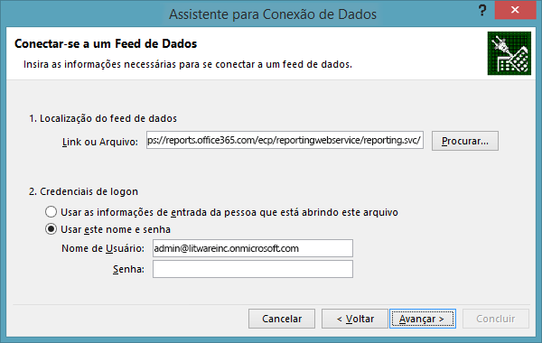
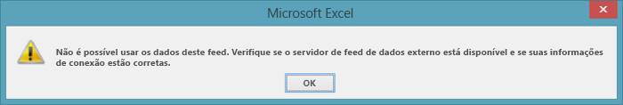
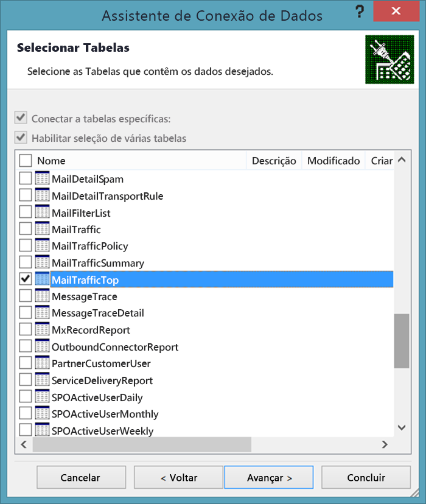
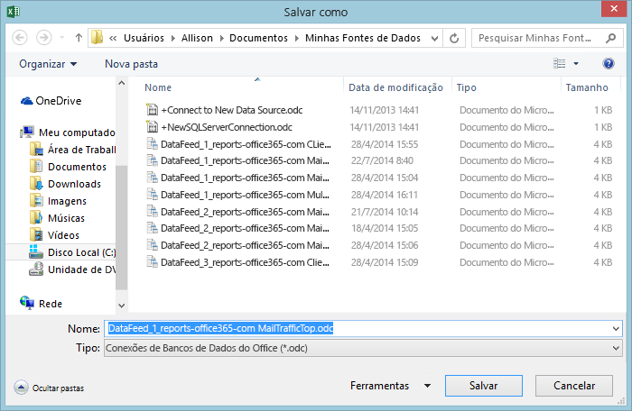
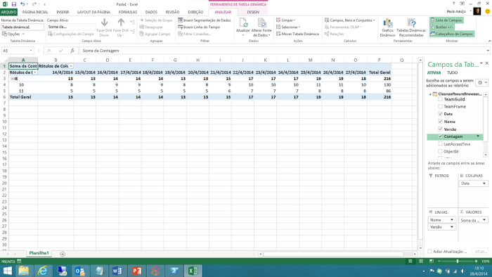

# <a name="using-excel-to-retrieve-office-365-reporting-data"></a><span data-ttu-id="e7947-103">Usar o Excel para Recuperar Dados de Relatório do Office 365</span><span class="sxs-lookup"><span data-stu-id="e7947-103">Using Excel to Retrieve Office 365 Reporting Data</span></span>

 <span data-ttu-id="e7947-104">**Resumo:** use o recurso oData no Microsoft Excel para recuperar informações detalhadas de relatórios para sua implantação do Office 365</span><span class="sxs-lookup"><span data-stu-id="e7947-104">**Summary:** Use the oData feature in Microsoft Excel to retrieve detailed reporting information for your deployment of Office 365</span></span>
  
<span data-ttu-id="e7947-p101">Os relatórios são uma parte importante da administração do sistema. O Centro de administração do Office 365 inclui vários relatórios predefinidos, que você pode acessar na seção **Relatórios** da navegação à esquerda. Há relatórios de uso e segurança e de conformidade.</span><span class="sxs-lookup"><span data-stu-id="e7947-p101">Reporting is a key part of system administration. The Office 365 Admin center includes a number of predefined reports, which you can access from the **Reports** section of the left navigation. There are usage reports and security and compliance reports.</span></span>
  
<span data-ttu-id="e7947-p102">Os relatórios disponíveis para você dependem da versão do Office 365 que está sendo usada e de quais serviços do Office 365 foram habilitados. Para obter mais informações, consulte a [Página de relatórios]((https://technet.microsoft.com/pt-BR/library/office-365-reports.aspx)).</span><span class="sxs-lookup"><span data-stu-id="e7947-p102">The reports available to you depend on the version of Office 365 you are using and which Office 365 services you have enabled. For more information, see the [Reports page]((https://technet.microsoft.com/pt-BR/library/office-365-reports.aspx)).</span></span>
  
<span data-ttu-id="e7947-p103">Os relatórios predefinidos do Centro de administração são um excelente recurso. Eles facilitam a verificação de alguns itens, como o uso de caixa de correio ou o número de minutos que os usuários estão gastando em conferências online. Entretanto, quando se trata de análises detalhadas do seu domínio do Office 365, os relatórios têm suas limitações.</span><span class="sxs-lookup"><span data-stu-id="e7947-p103">The pre-defined Admin center reports are an excellent resource. They make it easy to check on such things as mailbox usage or the number of minutes that your users have been spending in online conferences. However, when it comes to detailed analysis of your Office 365 domain, the reports do have their limitations.</span></span>
  
<span data-ttu-id="e7947-p104">Uma forma de contornar estas limitações é usar o Windows PowerShell ou outra linguagem de desenvolvimento para acessar o serviço de relatório do Office 365 e criar relatórios personalizados. Os relatórios personalizados oferecem a você a capacidade de ditar quais dados (e quantos) são retornados do serviço de relatório do Office 365. Ao escrever relatórios personalizados, você também pode especificar como os dados devem ser classificados e agrupados e, se necessário, como eles devem ser salvos. Por exemplo, é possível salvar dados no formato XML ou no formato de valores separados por vírgula, que podem ser facilmente importados no Excel.</span><span class="sxs-lookup"><span data-stu-id="e7947-p104">One way to work around these limitations is to use Windows PowerShell or another development language to access the Office 365 reporting service and create custom reports; custom reports give you the ability to dictate which data (and how much data) is returned from the Office 365 reporting service. By writing custom reports you can also specify how the data should be sorted and grouped, and, if applicable, how that data should be saved; for example, you can save data in XML format or in a comma-separated values format that can easily be imported in Excel.</span></span> 
  
<span data-ttu-id="e7947-p105">Além disso, os scripts/aplicativos personalizados permitem que você acesse relatórios que não estão disponíveis no Centro de Administração do Office 365. Por exemplo, o Centro de Administração pode informar quantas caixas de correio obsoletas você tem, mas não quantas caixas de correio foram acessadas nos últimos 30 dias. Isso é algo que um script do PowerShell personalizado pode informar. Estas opções em conjunto representam uma enorme flexibilidade como retorno por escrever um breve e relativamente simples script do Windows PowerShell.</span><span class="sxs-lookup"><span data-stu-id="e7947-p105">In addition, custom scripts/applications enable you to access reports that are not available in the Office 365 Admin center. For example, the Admin center can tell you how many stale mailboxes you have, but it can't tell which mailboxes haven't been accessed in the past 30 days. That is something that a custom PowerShell script can tell you. Taken together, this represents an enormous amount of flexibility in return for having to write a short and relatively-simple Windows PowerShell script.</span></span>
  
> [!VISUAL BASIC NOTE]<span data-ttu-id="e7947-119"> Para obter mais informações, consulte a [home page](https://msdn.microsoft.com/en-us/library/office/jj984325%28v=office.15%29.aspx) do serviço de relatório do Office 365.</span><span class="sxs-lookup"><span data-stu-id="e7947-119"> For more information, see the [home page](https://msdn.microsoft.com/en-us/library/office/jj984325%28v=office.15%29.aspx) for the Office 365 reporting service.</span></span>
  
<span data-ttu-id="e7947-p106">Para recuperar esses dados você tem que escrever um código. Essa opção é válida se você fizer parte de uma grande organização que precisa limitar a quantidade e o tipo de informações que são retornadas. Mas se você fizer parte de uma organização menor, que não precisa limitar a quantidade e o tipo de informações que são retornadas, convém considerar abrir os relatórios do Office 365 pelo Excel.</span><span class="sxs-lookup"><span data-stu-id="e7947-p106">In order to retrieve this data, you do have to write code of some kind. That's worth it if you are a larger organization that needs to limit the amount and the type of information that gets returned. But if you're a smaller organization, and you don't need to limit the amount and type of information that gets returned, you might consider opening the Office 365 reports from within Excel itself.</span></span>
  
<span data-ttu-id="e7947-p107">No entanto, há algumas limitações, a primeira delas é: você não pode filtrar, classificar, selecionar ou manipular de forma alguma os dados antes de serem retornados. Em vez disso, você simplesmente obtém o conjunto de dados padrão retornado pelo relatório. Em alguns casos podem não ser dados suficientes. Por exemplo, o relatório pode retornar dados apenas para o mês anterior e não para o ano inteiro. Em outros casos podem ser dados em excesso: você pode obter dados para o ano inteiro mesmo que só quisesse os dados do mês anterior.</span><span class="sxs-lookup"><span data-stu-id="e7947-p107">However, there are a few limitations here, the primary one being this: you cannot filter, sort, select, or otherwise manipulate the data that before it gets returned. Instead, you simply get back the default set of data returned by the report. In some cases that might not be enough data. For example, the report might return data for, say, only the previous month and not for the entire year. Conversely, in other cases that might be too much data: you might get back data for the entire year even though you only want data for the previous month.</span></span>
  
<span data-ttu-id="e7947-128">Para abrir um relatório do Office 365 diretamente de dentro do Excel, realize o procedimento a seguir:</span><span class="sxs-lookup"><span data-stu-id="e7947-128">To open an Office 365 report directly from within Excel, complete the following procedure:</span></span>
  
1. <span data-ttu-id="e7947-p108">Comece abrindo uma nova planilha no Excel. Nesta planilha, clique em **Dados**, depois em **A Partir de Outras Fontes** e, por fim, clique em **A Partir do Feed de Dados OData**. Isso faz com que a caixa de diálogo do **Assistente para Conexão de Dados** seja aberta:</span><span class="sxs-lookup"><span data-stu-id="e7947-p108">Start by opening a new worksheet in Excel. On that worksheet, click **Data**, click **From Other Sources**, and then click **From OData Data Feed**. That brings up the **Data Connection Wizard** dialog box:</span></span>
    
     
  
2. <span data-ttu-id="e7947-p109">Na página **Conectar a um Feed de Dados**, insira **https://reports.office365.com/ecp/reportingwebservice/reporting.svc/** como o local do feed de dados. Observe que você só pode digitar a URL base conforme mostrado. Não é possível adicionar qualquer instrução para Selecionar, Filtrar ou Formatar. Se você digitar qualquer informação que não seja a URL base, não recuperará nenhum dado. Em vez disso, você simplesmente verá a seguinte mensagem de erro:</span><span class="sxs-lookup"><span data-stu-id="e7947-p109">On the **Connect to a Data Feed** page, enter **https://reports.office365.com/ecp/reportingwebservice/reporting.svc/** as the data feed location. Note that you can only enter the base URL as shown; you cannot add any Select, Filter, or Format statements. If you enter anything but the base URL you won't get back any data; instead, you'll simply see the following error message:</span></span>
    
     
  
3. <span data-ttu-id="e7947-p110">Após inserir a URL do serviço de relatório, selecione **Usar este nome e senha** sob **Credenciais de logon**. Na caixa **Nome de Usuário**, digite seu nome de logon do Office 365 (por exemplo, admin@litwareinc.onmicrosoft.com). Na caixa **Senha**, digite sua senha de logon do Office 365 e clique em **Avançar**. Em seguida, o Excel tentará conectar-se ao serviço de relatórios usando as credenciais fornecidas.</span><span class="sxs-lookup"><span data-stu-id="e7947-p110">After entering the reporting service URL, select **Use this name and password** under **Log on credentials**. In the **User Name** box, enter your Office 365 logon name (for example, admin@litwareinc.onmicrosoft.com). In the **Password** box, enter your Office 365 logon password and then click **Next**. Excel will then attempt to connect to the reporting service using the supplied credentials.</span></span>
    
4. <span data-ttu-id="e7947-p111">Após ser autenticado, você verá a página **Selecionar Tabelas**. Selecione o relatório que gostaria de ver (por exemplo, **MailTrafficTop** ) e clique em **Avançar**:</span><span class="sxs-lookup"><span data-stu-id="e7947-p111">After you have been authenticated, you'll see the **Select Tables** page. Select the report that you'd like to view (for example, **MailTrafficTop** ) and then click **Next**:</span></span>
    
     
  
    > [!NOTE]
    > <span data-ttu-id="e7947-p112">É possível selecionar vários relatórios. Isso resulta em várias tabelas/gráficos adicionados à sua planilha do Excel. Também é possível criar uma tabela/gráfico único que combina dados de vários relatórios. No entanto, não discutiremos esta opção neste artigo introdutório.</span><span class="sxs-lookup"><span data-stu-id="e7947-p112">It's possible to select multiple reports; that results in multiple tables/charts being added to your Excel spreadsheet. It's even possible to create a single table/chart that combines data from multiple reports. However, we won't discuss that in this introductory article.</span></span> 
  
5. <span data-ttu-id="e7947-147">Após clicar em **Avançar** você será direcionado para a página **Salvar Arquivo de Conexão de Dados e Concluir**:</span><span class="sxs-lookup"><span data-stu-id="e7947-147">After clicking **Next** you'll be presented with the **Save Data Connection File and Finish** page:</span></span>
    
     
  
    <span data-ttu-id="e7947-p113">Não é preciso inserir informações aqui. Para recuperar seus dados, basta clicar em **Concluir**. No entanto, vale observar que, por padrão, o Excel salva informações sobre cada conexão de dados realizada. Esses dados são armazenados em sua pasta **Minhas Fontes de Dados**:</span><span class="sxs-lookup"><span data-stu-id="e7947-p113">You don't have to enter any information here. All you need to do to retrieve your data is to click **Finish**. However, it's worth noting that, by default, Excel saves information about each data connection you make; this data is stored in your **My Data Sources** folder:</span></span>
    
     
  
    <span data-ttu-id="e7947-p114">É por isso que as caixas de diálogo incluem caixas de texto com rótulos como **Nome Amigável** e **Palavras-chave de Pesquisa**, estas opções lhe conferem a oportunidade de personalizar estas conexões de dados. Dessa forma você não fica com várias fontes de dados parecidas com estas:</span><span class="sxs-lookup"><span data-stu-id="e7947-p114">That's why the dialog box includes text boxes with labels like **Friendly Name** and **Search Keywords**; these options give you the chance to customize these data connections. That way you do not end up with a whole bunch of data sources that look like these:</span></span>
    
  ```
  DataFeed_1_reports-office365-com ClientSoftwareBrowserDetail.odc
DataFeed_1_reports-office365-com MailTrafficTop.odc
DataFeed_1_reports-office365-com Multiple Tables.odc
DataFeed_2_reports-office365-com MailboxActivityWeekly.odc
DataFeed_2_reports-office365-com MailTrafficTop.odc
DataFeed_3_reports-office365-com ClientSoftwareBrowserDetail.odc
  ```

<span data-ttu-id="e7947-p115">Se você marcar a caixa de seleção **Salvar senha em arquivo**, é possível reutilizar estes feeds de dados. Por exemplo, supondo que você salve uma conexão de dados como **Relatório do Navegador do Cliente**. Da próxima vez que precisar de informações sobre os navegadores Web que estão sendo usados para acessar o seu domínio do Office 365, você não terá que usar o assistente para conexão de dados. Em vez disso, tudo o que precisa fazer é abrir o Excel, clicar em **Dados** e em **Fontes Existentes**. Selecione a conexão de dados desejada na caixa de diálogo **Conexões Existentes** e clique em **OK**:</span><span class="sxs-lookup"><span data-stu-id="e7947-p115">If you select the checkbox **Save password in file**, you'll be able to reuse these data feeds. For example, suppose you save a data connection as **Client Browser Report**. The next time you want information about the web browsers being used to access your Office 365 domain you don't have to walk through the data connection wizard. Instead, all you need to do is open Excel, click **Data**, and then click **Existing Sources**. Select the desired data connection in the **Existing Connections** dialog box and then click **OK**:</span></span>
    

  
<span data-ttu-id="e7947-161">Nesse momento, o Excel faz a conexão para você e recupera os dados.</span><span class="sxs-lookup"><span data-stu-id="e7947-161">At that point, Excel will make the connection for you and retrieve the data.</span></span>
    
<span data-ttu-id="e7947-p116">Observe que esses arquivos .ODC são arquivos XML de texto sem formatação. Incluídos neles estão seu nome de usuário e senha do Office 365:</span><span class="sxs-lookup"><span data-stu-id="e7947-p116">Note that these .ODC files are plain-text XML files. Included in these plain-text XML files are your Office 365 user name and password:</span></span>
    
<span data-ttu-id="e7947-164">\<odc:ConnectionString>Data Source=https://reports.office365.com/ecp/reportingwebservice/reporting.svc/;Namespaces to Include=\*;Max Received Message Size=4398046511104;Integrated Security=Basic; **User ID=admin@litwareinc.onmicrosoft.com;Password=MYpassw0rd!**;Persist Security Info=false;Service Document Url=https://reports.office365.com/ecp/reportingwebservice/reporting.svc/\</odc:ConnectionString></span><span class="sxs-lookup"><span data-stu-id="e7947-164">\<odc:ConnectionString>Data Source=https://reports.office365.com/ecp/reportingwebservice/reporting.svc/;Namespaces to Include=\*;Max Received Message Size=4398046511104;Integrated Security=Basic; **User ID=admin@litwareinc.onmicrosoft.com;Password=MYpassw0rd!**;Persist Security Info=false;Service Document Url=https://reports.office365.com/ecp/reportingwebservice/reporting.svc/\</odc:ConnectionString></span></span>
    
<span data-ttu-id="e7947-p117">Se você não gosta da ideia de salvar seu nome de usuário e senha em um arquivo de texto sem formatação, não marque a caixa rotulada **Salvar senha em arquivo**. Entretanto, lembre-se que se fizer isso não poderá reutilizar estas conexões de dados. Isso acontece porque, sem o nome de usuário e a senha, o Office 365 não pode autenticar a sua tentativa de logon no serviço.</span><span class="sxs-lookup"><span data-stu-id="e7947-p117">If you don't like the idea of saving your user name and password in a plain-text file, then don't check the box labeled **Save password in file**. If you do that, however, keep in mind that you won't be able to reuse these data connections. That's because, without the user name and password, Office 365 will not be able to authenticate your attempt to log on to the service.</span></span>
    
6. <span data-ttu-id="e7947-168">Clique em **Concluir** na página **Salvar Arquivo de Conexão de Dados e Concluir** e a caixa de diálogo **Importar Dados** aparecerá:</span><span class="sxs-lookup"><span data-stu-id="e7947-168">Click **Finish** on the **Save Data Connection File and Finish** page you'll be presented with the **Import Data** dialog box:</span></span>
    
     
  
7. <span data-ttu-id="e7947-p118">Selecione as opções de exibição (por exemplo, **Relatório de Tabela Dinâmica** ) e clique em **OK**. Se tudo der certo, os seus dados serão importados e apresentados em qualquer opção de exibição que você tenha escolhido:</span><span class="sxs-lookup"><span data-stu-id="e7947-p118">Select your view options (for example, **PivotTable Report** ) and then click **OK**. If all goes well, your data will be imported and be presented in whichever view option you happened to choose:</span></span>
    
     
  
<span data-ttu-id="e7947-p119">O que fazer com esses dados é escolha sua. Para obter sugestões, confira [Crie um painel nos Serviços do Excel usando o feed de dados oData](https://technet.microsoft.com/en-us/library/jj873965%28v=office.15%29.aspx). Ainda que este artigo não use o serviço de relatório do Office 365, ele fornece algumas dicas úteis de como realizar ações como adicionar filtros e segmentações ao seu novo painel.</span><span class="sxs-lookup"><span data-stu-id="e7947-p119">What you do with that data is then entirely up to you. For some suggestions. take a look at [Create an Excel Services dashboard using an oData data feed](https://technet.microsoft.com/en-us/library/jj873965%28v=office.15%29.aspx). Although that article doesn't use the Office 365 reporting service, it does provide some handy hints for doing things like adding filters and slicers to your new dashboard.</span></span>
  
## <a name="see-also"></a><span data-ttu-id="e7947-177">Veja também</span><span class="sxs-lookup"><span data-stu-id="e7947-177">See also</span></span>

#### 

[<span data-ttu-id="e7947-178">Gerenciar o Office 365 com o Office 365 PowerShell</span><span class="sxs-lookup"><span data-stu-id="e7947-178">Manage Office 365 with Office 365 PowerShell</span></span>](manage-office-365-with-office-365-powershell.md)
  
[<span data-ttu-id="e7947-179">Introdução ao Office 365 PowerShell</span><span class="sxs-lookup"><span data-stu-id="e7947-179">Getting started with Office 365 PowerShell</span></span>](getting-started-with-office-365-powershell.md)
  
[<span data-ttu-id="e7947-180">Use o Windows PowerShell para criar relatórios no Office 365</span><span class="sxs-lookup"><span data-stu-id="e7947-180">Use Windows PowerShell to create reports in Office 365</span></span>](use-windows-powershell-to-create-reports-in-office-365.md)

