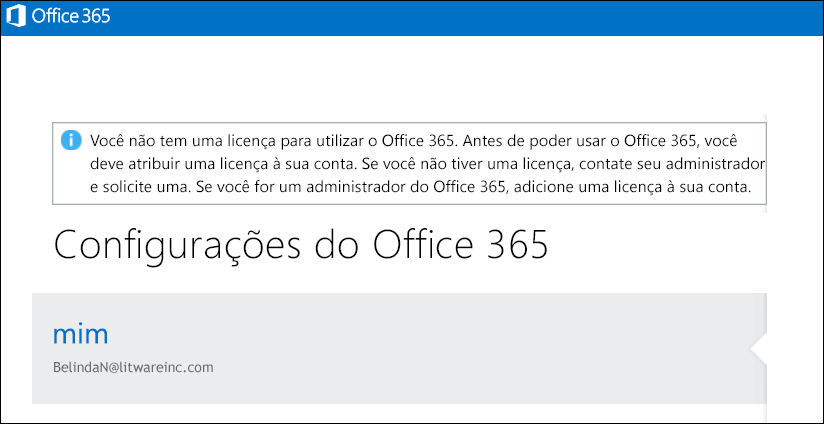

# <a name="view-licensed-and-unlicensed-users-with-office-365-powershell"></a><span data-ttu-id="5aeb4-103">Exibir usuários licenciados e não licenciados com o PowerShell do Office 365</span><span class="sxs-lookup"><span data-stu-id="5aeb4-103">View licensed and unlicensed users with Office 365 PowerShell</span></span>

<span data-ttu-id="5aeb4-104">**Resumo:** explica como usar o Office 365 PowerShell para exibir as contas de usuário licenciado e não licenciado.</span><span class="sxs-lookup"><span data-stu-id="5aeb4-104">**Summary:** Explains how to use Office 365 PowerShell to view licensed and unlicensed user accounts.</span></span>
  
<span data-ttu-id="5aeb4-p101">As contas de usuário em sua organização do Office 365 podem ter algumas, todas ou nenhuma das licenças disponíveis atribuídas a elas em planos de licenciamento que estão disponíveis em sua organização. Você pode usar o Office 365 PowerShell para localizar rapidamente os usuários licenciados e não licenciados em sua organização.</span><span class="sxs-lookup"><span data-stu-id="5aeb4-p101">User accounts in your Office 365 organization may have some, all, or none of the available licenses assigned to them from the licensing plans that are available in your organization. You can use Office 365 PowerShell to quickly find the licensed and unlicensed users in your organization.</span></span>
  
## <a name="before-you-begin"></a><span data-ttu-id="5aeb4-107">Antes de começar</span><span class="sxs-lookup"><span data-stu-id="5aeb4-107">Before you begin</span></span>

- <span data-ttu-id="5aeb4-p102">Os procedimentos deste tópico exigem que você se conecte ao Office 365 PowerShell. Para obter instruções, confira [Conectar-se ao PowerShell do Office 365](connect-to-office-365-powershell.md).</span><span class="sxs-lookup"><span data-stu-id="5aeb4-p102">The procedures in this topic require you to connect to Office 365 PowerShell. For instructions, see [Connect to Office 365 PowerShell](connect-to-office-365-powershell.md).</span></span>
    
- <span data-ttu-id="5aeb4-110">Se você usar o cmdlet **Get-MsolUser** sem usar o parâmetro _-All_, somente as primeiras 500 contas serão retornadas.</span><span class="sxs-lookup"><span data-stu-id="5aeb4-110">If you use the **Get-MsolUser** cmdlet without using the _-All_ parameter, only the first 500 accounts are returned.</span></span>
    
## <a name="the-short-version-instructions-without-explanations"></a><span data-ttu-id="5aeb4-111">A versão curta (instruções sem explicações)</span><span class="sxs-lookup"><span data-stu-id="5aeb4-111">The short version (instructions without explanations)</span></span>

<span data-ttu-id="5aeb4-p103">Esta seção apresenta os procedimentos sem divulgação ou explicação supérflua. Se você tiver dúvidas ou se quiser obter mais informações, leia o restante do tópico.</span><span class="sxs-lookup"><span data-stu-id="5aeb4-p103">This section presents the procedures without fanfare or superfluous explanation. If you have questions or want more information, you can read rest of the topic.</span></span>
  
<span data-ttu-id="5aeb4-114">Para exibir a lista de todas as contas de usuário e seu status de licenciamento em sua organização, execute o seguinte comando no Office 365 PowerShell:</span><span class="sxs-lookup"><span data-stu-id="5aeb4-114">To view the list of all user accounts and their licensing status in your organization, run the following command in Office 365 PowerShell:</span></span>
  
```
Get-MsolUser -All
```

<span data-ttu-id="5aeb4-115">Para exibir a lista de todas as contas de usuário não licenciado e seu status de licenciamento em sua organização, execute o seguinte comando:</span><span class="sxs-lookup"><span data-stu-id="5aeb4-115">To view the list of all unlicensed user accounts in your organization, run the following command:</span></span>
  
```
Get-MsolUser -All -UnlicensedUsersOnly
```

<span data-ttu-id="5aeb4-116">Para exibir a lista de todas as contas de usuário licenciado e seu status de licenciamento em sua organização, execute o seguinte comando:</span><span class="sxs-lookup"><span data-stu-id="5aeb4-116">To view the list of all licensed user accounts in your organization, run the following command:</span></span>
  
```
Get-MsolUser -All | where {$_.isLicensed -eq $true}
```

## <a name="the-long-version-instructions-with-detailed-explanations"></a><span data-ttu-id="5aeb4-117">A versão longa (instruções com explicações detalhadas)</span><span class="sxs-lookup"><span data-stu-id="5aeb4-117">The long version (instructions with detailed explanations)</span></span>

<span data-ttu-id="5aeb4-p104">As contas de usuário do Office 365 e as licenças do Office 365 não precisam ter uma correspondência direta: é possível ter os usuários do Office 365 que não têm uma licença do Office 365 e é possível ter licenças do Office 365 que ainda não foram atribuídas a um usuário. (Na verdade, uma única conta de usuário pode até ter  *várias*  licenças do Office 365.) Quando você cria uma nova conta de usuário do Office 365 (confira o artigo[Licenciar usuários do Office 365 com o Windows PowerShell](http://technet.microsoft.com/library/0ab9fcac-e5ea-4b5b-b72c-8c92c55565ac.aspx) para obter mais informações), não precisa atribuir uma licença ao usuário: o novo usuário terá uma conta válida, mas ele não poderá entrar no Office 365. Se tentar entrar, verá algo parecido com isto:</span><span class="sxs-lookup"><span data-stu-id="5aeb4-p104">Office 365 user accounts and Office 365 licenses don't need to have a one-to-one correspondence: it's possible to have Office 365 users who do not have an Office 365 license, and it's possible to have Office 365 licenses that haven't been assigned to a user. (In fact, a single user account can even have  *multiple*  Office 365 licenses.) When you create a new Office 365 user account (see the article [License Office 365 users with Windows PowerShell](http://technet.microsoft.com/library/0ab9fcac-e5ea-4b5b-b72c-8c92c55565ac.aspx) for more information) you don't have to assign that user a license: the new user will have a valid account, but he or she won't be able to sign in to Office 365. If they try to sign in, they'll see something similar to this:</span></span>
  

  
<span data-ttu-id="5aeb4-p105">Da mesma forma, você pode ter um usuário que ficará de férias ou ausente por um longo período. Nesse caso, você poderia remover a licença do usuário, mas deixar a conta intacta (isto é, manter todos os valores de propriedades, como endereço e telefone, como estão). Ao fazer isso, você pode atribuir a licença a outra pessoa (como, por exemplo, um funcionário temporário que esteja substituindo a pessoa que está de férias). Quando o usuário voltar ao trabalho, você poderá emitir uma nova licença e ele poderá retomar seu trabalho como se nunca tivesse saído.</span><span class="sxs-lookup"><span data-stu-id="5aeb4-p105">Likewise, you might have a user who will be taking some extended time off, perhaps for a sabbatical or for maternity/paternity leave. In a case like that, you could remove the user's license but leave the user account intact (that is, leave all its property values, such as address and phone number, as-is). By doing that, you can assign their license to someone else (like, say, a temporary worker filling in for the person on leave). When the user returns to work you can issue them a new license and they'll be able to resume working as if they'd never been gone.</span></span>
  
<span data-ttu-id="5aeb4-p106">O que simplesmente significa que sim, você pode ter usuários que têm contas, mas não têm licenças. Ou vice-versa.</span><span class="sxs-lookup"><span data-stu-id="5aeb4-p106">Which simply means that, yes, you can have users who have accounts but who don't have licenses. Or vice-versa.</span></span>
  
<span data-ttu-id="5aeb4-p107">O artigo [Exibir licenças e serviços com o PowerShell do Office 365](view-licenses-and-services-with-office-365-powershell.md) explica como você pode determinar o número de licenças do Office 365 que a sua organização comprou, além de quantas dessas licenças foram atribuídas a usuários. Essas são informações importantes. No entanto, é igualmente importante saber quais dos usuários receberam essas licenças e quais não receberam. E este artigo dirá a você como fazer isso.</span><span class="sxs-lookup"><span data-stu-id="5aeb4-p107">The article [View licenses and services with Office 365 PowerShell](view-licenses-and-services-with-office-365-powershell.md) explains how you can determine the number of Office 365 licenses your organization has purchased as well as how many of those licenses have been assigned to users. That's important information. Equally important, however is knowing which of your users have been assigned these licenses and which ones haven't. And this article will tell you how to do just that.</span></span>
  
<span data-ttu-id="5aeb4-p108">Como você provavelmente já sabe, o cmdlet **Get-MsolUser** retorna informações sobre todas as suas contas de usuário do Office 365. Precisa de algumas informações rápidas sobre todos os seus usuários do Office 365? Em seguida, execute este comando no Office 365 PowerShell:</span><span class="sxs-lookup"><span data-stu-id="5aeb4-p108">As you probably know, the **Get-MsolUser** cmdlet returns information about all your Office 365 user accounts. Need some quick info about all your Office 365 users? Then run this command in Office 365 PowerShell:</span></span>
  
```
Get-MsolUser
```

<span data-ttu-id="5aeb4-135">Por sua vez, Get-MsolUser retorna dados similares a:</span><span class="sxs-lookup"><span data-stu-id="5aeb4-135">In turn, Get-MsolUser returns data similar to this:</span></span>
  
```
UserPrincipalName           DisplayName                     isLicensed
-----------------           -----------                     ----------
ZrinkaM@litwareinc.com      Zrinka Makovac                  True
BelindaN@litwareinc.com     Belinda Newman                  False
BonnieK@litwareinc.com      Bonnie Kearney                  True
FabriceC@litwareinc.com     Fabrice Canel                   True
AnneW@litwareinc.com        Anne Wallace                    True
AlexD@litwareinc.com        Alex Darrow                     True
```

<span data-ttu-id="5aeb4-p109">Como você pode ver, um dos valores de propriedade retornados é para a propriedade **isLicensed**. Se **isLicensed** for igual a `False`, isso significa que o usuário não tem uma licença do Office 365. Ou seja, se quisesse, você poderia simplesmente percorrer a lista de usuários e escolher aqueles em que a propriedade **isLicensed** esteja definida como `False`.</span><span class="sxs-lookup"><span data-stu-id="5aeb4-p109">As you can see, one of the property values returned is for the **isLicensed** property. If **isLicensed** is equal to `False` that means that the user doesn't have a license for Office 365. In other words, and if you wanted to, you could simply scroll through your list of users and pick out the ones where the **isLicensed** property is set to `False`.</span></span>
  
<span data-ttu-id="5aeb4-p110">De qualquer forma, rolar pela lista de usuários para tentar escolher os que não têm licenças funciona bem, desde que você tenha uma quantidade relativamente pequena de usuários. Se houver um grande número de usuários, no entanto, rolar pela lista será, no melhor dos casos, extremamente tedioso. (E, dependendo de como o Windows PowerShell foi configurado, provavelmente impossível, já que há um limite no número de linhas de resultados que podem ser exibidas no console do Windows PowerShell em um momento específico).</span><span class="sxs-lookup"><span data-stu-id="5aeb4-p110">At any rate, scrolling through a list of users trying to pick out the unlicensed users works as long as you have a relatively small number of users. If you have a large number of users, however, scrolling through that list will be, at best, extremely tedious. (And, depending on how Windows PowerShell has been configured, perhaps downright impossible. That's because there's a limit to the number of lines of output that can be displayed in the Windows PowerShell console at any one time.)</span></span>
  
<span data-ttu-id="5aeb4-143">Com isto em mente, uma maneira muito melhor de listar os usuários não licenciados é executar o seguinte comando:</span><span class="sxs-lookup"><span data-stu-id="5aeb4-143">With that in mind, a much better way to list your unlicensed users is to run this command instead:</span></span>
  
```
Get-MsolUser -UnlicensedUsersOnly
```

<span data-ttu-id="5aeb4-p111">Esse comando retorna apenas os usuários que não têm uma licença do Office 365. Em outras palavras:</span><span class="sxs-lookup"><span data-stu-id="5aeb4-p111">That command returns only those users who don't have a license for Office 365. In other words:</span></span>
  
```
UserPrincipalName           DisplayName                     isLicensed
-----------------           -----------                     ----------
BelindaN@litwareinc.com     Belinda Newman                  False
```

<span data-ttu-id="5aeb4-p112">Como você pode ver, temos um usuário não licenciado. E se quiséssemos somente uma lista dos usuários  *licenciados*  ? Isso é um pouco mais complicado, mas somente uma pequena parte:</span><span class="sxs-lookup"><span data-stu-id="5aeb4-p112">As you can see we have one unlicensed user. And what is we only wanted a list of the  *licensed*  users? That's a tiny bit more complicated, but only the tiniest bit:</span></span>
  
```
Get-MsolUser | Where-Object {$_.isLicensed -eq $true}
```

<span data-ttu-id="5aeb4-149">Esse comando, que procura todas as contas de usuário em que a propriedade **isLicensed** é igual a `True`, retorna informações semelhantes a esta:</span><span class="sxs-lookup"><span data-stu-id="5aeb4-149">That command, which looks for all the user accounts where the **isLicensed** property is equal to `True`, returns information similar to this:</span></span>
  
```
UserPrincipalName           DisplayName                     isLicensed
-----------------           -----------                     ----------
ZrinkaM@litwareinc.com      Zrinka Makovac                  True
BonnieK@litwareinc.com      Bonnie Kearney                  True
FabriceC@litwareinc.com     Fabrice Canel                   True
AnneW@litwareinc.com        Anne Wallace                    True
AlexD@litwareinc.com        Alex Darrow                     True
```

<span data-ttu-id="5aeb4-p113">Como você pode ver, as informações não são retornadas para Brenda Fernandes. Por que não? Isso mesmo: porque a propriedade **isLicensed** da conta de Brenda não está definida como `True`.</span><span class="sxs-lookup"><span data-stu-id="5aeb4-p113">As you can see, information is not returned for Belinda Newman. Why not? You got it: because the **isLicensed** property for Belinda's account is not set to `True`.</span></span>
  
## <a name="see-also"></a><span data-ttu-id="5aeb4-153">Veja também</span><span class="sxs-lookup"><span data-stu-id="5aeb4-153">See also</span></span>
<span data-ttu-id="5aeb4-154"><a name="SeeAlso"> </a></span><span class="sxs-lookup"><span data-stu-id="5aeb4-154"><a name="SeeAlso"> </a></span></span>

<span data-ttu-id="5aeb4-155">Para saber mais sobre os cmdlets usados nestes procedimentos, confira os seguintes tópicos:</span><span class="sxs-lookup"><span data-stu-id="5aeb4-155">For more information about the cmdlets that are used in these procedures, see the following topics:</span></span>
  
- [<span data-ttu-id="5aeb4-156">Get-MsolUser</span><span class="sxs-lookup"><span data-stu-id="5aeb4-156">Get-MsolUser</span></span>](https://go.microsoft.com/fwlink/p/?LinkId=691547)
    
- [<span data-ttu-id="5aeb4-157">Where-Object</span><span class="sxs-lookup"><span data-stu-id="5aeb4-157">Where-Object</span></span>](https://go.microsoft.com/fwlink/p/?LinkId=113423)
    

