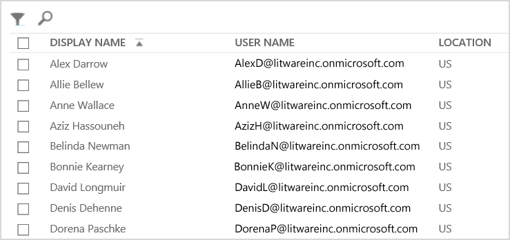

# <a name="why-you-need-to-use-office-365-powershell"></a>Por que você precisa usar o Office 365 PowerShell

 **Resumo:** entenda por que usar o Office 365 PowerShell para gerenciar o Office 365, em alguns casos, com mais eficiência e, em outros casos, por necessidade.
  
Com o Centro de administração do Office 365, além de gerenciar suas contas de usuário e as licenças do Office 365, você também pode gerenciar os produtos de servidor do Office 365: Exchange, Skype for Business online e SharePoint Online. No entanto, você também pode gerenciar esses elementos com os comandos do Office 365 PowerShell, beneficiando-se de um ambiente de linha de comando e linguagem de scripts de velocidade, automação e capacidade adicional.
  
Neste artigo, mostraremos a você as seguintes maneiras em que você pode usar o Office 365 PowerShell para gerenciar o Office 365.
  
- O Office 365 PowerShell pode revelar informações adicionais que não é possível ver com o Centro de administração do Office 365
    
- O Office 365 tem recursos que você pode configurar apenas usando o Office 365 PowerShell
    
- Office 365 PowerShell é ótimo para realizar operações em massa
    
- O Office 365 PowerShell é ótimo na filtragem de dados
    
- O Office 365 PowerShell torna mais fácil imprimir ou salvar dados
    
- O Office 365 PowerShell permite que você gerencie produtos de servidor
    
Antes de começar, saiba que o Office 365 PowerShell é um conjunto de módulos para o Windows PowerShell, um ambiente de linha de comando para plataformas e serviços baseados em Windows. Esse ambiente cria uma linguagem de shell de comando que pode ser estendida com módulos adicionais e fornece uma maneira de executar comandos simples ou complexos, ou scripts. Por exemplo, depois de instalar os módulos do Office 365 PowerShell e entrar com sua assinatura do Office 365, você poderá executar esse comando para listar todas as caixas de correio do usuário para o Microsoft Exchange Online:
  
```
Get-Mailbox
```

A lista de caixas de correio também pode ser facilmente obtida usando o Centro de administração do Office 365, mas a contagem do número de itens em todas as listas de todos os sites para todos os aplicativos Web não pode ser feita com facilidade.
  
Observe que o Office 365 PowerShell foi projetado para ampliar e aprimorar sua capacidade de gerenciar o Office 365, não para substituir o Centro de administração do Office 365. Como administrador do Office 365, você deve pelo menos se sentir confortável usando o Office 365 PowerShell porque existem alguns procedimentos de configuração que só podem ser feitos com comandos do Office 365 PowerShell. Nesses casos, você precisará compreender como:
  
- Instalar os módulos do Office 365 PowerShell (feito apenas uma vez para cada computador do administrador).
    
- Conectar-se a sua assinatura do Office 365 (feita uma vez para cada sessão do PowerShell).
    
- Reunir as informações necessárias para executar os comandos necessários do Office 365 PowerShell.
    
- Executar os comandos do Office 365 PowerShell com êxito.
    
Depois de aprender essas habilidades básicas, não é necessário listar os usuários de caixa de correio com o comando **Get-Mailbox**, também não é preciso entender como criar um novo comando como o anterior para contar todos os itens nas listas de todos os sites para todos os seus aplicativos Web. A Microsoft e a comunidade de administradores do Office 365 podem ajudá-lo conforme necessário.
  
## <a name="office-365-powershell-can-reveal-additional-information-that-you-cannot-see-with-the-office-365-admin-center"></a>O Office 365 PowerShell pode revelar informações adicionais que não é possível ver com o Centro de administração do Office 365

O Centro de administração do Office 365 exibe muitas informações úteis, mas isso não significa que ele exibirá todas as informações possíveis que o Office 365 armazena em sites, caixas de correio, licenças e usuários. Veja um exemplo de **usuários e grupos** no Centro de administração do Office 365:
  

  
Para muitas finalidades, isso exibe as informações que você precisa saber. No enTanto, há ocasiões em que você precisa de mais. Por exemplo, o licenciamento do Office 365 (e os recursos do Office 365 disponíveis para um usuário) dependem parte da localização geográfica desse usuário. As políticas e os recursos que você pode estender para um usuário que reside nos Estados Unidos podem não ser os mesmos que as políticas e os recursos que você pode estender para um usuário que mora na Índia ou na Bélgica. Você pode usar o centro de administração do Office 365 para determinar a localização geográfica de um usuário com estas etapas:
  
1. Clique duas vezes no **Nome de exibição** do usuário.
    
2. No painel de exibição de propriedades do usuário, clique em **detalhes**.
    
3. Na exibição detalhes, clique em **detalhes adicionais**.
    
4. Role para baixo até ver o cabeçalho **País ou região**:
    
     
  
5. Escreva o nome de exibição e localização do usuário em um pedaço de papel ou copie e cole no Bloco de notas. 
    
Você deve repetir este procedimento para cada usuário. Quando há muitos usuários, isso pode ser uma tarefa entediante. Com o Office 365 PowerShell, você pode exibir essas informações para todos os usuários com o seguinte comando:
  
```
Get-MsolUser | Select DisplayName, UsageLocation
```

> [!NOTE]
> Este comando requer a instalação do [módulo do Microsoft Azure Active Directory](https://docs.microsoft.com/powershell/module/Azuread/?view=azureadps-2.0). 
  
Este é um exemplo de exibição:
  
```
DisplayName                               UsageLocation
-----------                               -------------
Bonnie Kearney                            GB
Fabrice Canel                             BR
Brian Johnson (TAILSPIN)                  US
Anne Wallace                              US
Alex Darrow                               US
David Longmuir                            BR
```

> [!TIP]
>  A interpretação deste comando do Office 365 PowerShell é: obter todos os usuários na assinatura atual do Office 365 ( **Get-MsolUser** ), mas exibir apenas o nome e o local para cada usuário ( **Select DisplayName, UsageLocation**).
  
Porque o Office 365 PowerShell dá suporte a uma linguagem de shell de comando, você pode manipular ainda mais as informações obtidas do comando **Get-MSolUser**. Por exemplo, talvez você queira classificar esses usuários por sua localização, agrupar todos os usuários brasileiros, todos os usuários dos Estados Unidos etc. Este é o comando:
  
```
Get-MsolUser | Select DisplayName, UsageLocation | Sort UsageLocation, DisplayName
```

Este é um exemplo de exibição:
  
```
DisplayName                                 UsageLocation
-----------                                 -------------
David Longmuir                              BR
Fabrice Canel                               BR
Bonnie Kearney                              GB
Alex Darrow                                 US
Anne Wallace                                US
Brian Johnson (TAILSPIN)                    US
```

> [!TIP]
>  A interpretação deste comando do Office 365 PowerShell é: obter todos os usuários na assinatura atual do Office 365, mas exibir apenas o nome e o local para cada usuário e classificá-los primeiro pela localização, depois pelos nomes ( **Sort UsageLocation, DisplayName**).
  
Você também pode usar a filtragem adicional. Por exemplo, se você quiser ver informações sobre usuários baseados no Brasil, use este comando:
  
```
Get-MsolUser | Where {$_.UsageLocation -eq "BR"} | Select DisplayName, UsageLocation 
```

Este é um exemplo de exibição:
  
```
DisplayName                                           UsageLocation
-----------                                           -------------
David Longmuir                                        BR
Fabrice Canel                                         BR
```

> [!TIP]
>  A interpretação deste comando do Office 365 PowerShell é: obter todos os usuários na assinatura atual do Office 365 que estejam no Brasil (**Where {$\_.UsageLocation -eq "BR"}**), em seguida, exibir o nome e o local de cada usuário.
  
 **Uma rápida observação sobre domínios maiores**
  
Se você tiver um domínio muito grande, com dezenas de milhares de usuários, alguns dos exemplos que mostramos neste artigo podem levar a "limitação". Isso significa que, com base em coisas como poder de computação e largura de banda de rede disponível, você está tentando um pouco demais de uma só vez. Por causa disso, grandes organizações podem desejar dividir alguns dos comandos do Office 365 PowerShell em dois comandos. Por exemplo, este comando retorna todas as contas de usuário e mostra o nome e o local de cada usuário:
  
```
Get-MsolUser | Select DisplayName, UsageLocation
```

Isso funciona bem com domínios menores. Em uma grande organização, no entanto, talvez você precise dividi-lo em dois comandos: um comando para armazenar as informações da conta do usuário em uma variável e outro comando para exibir as informações necessárias. Veja um exemplo:
  
```
$x = Get-MsolUser
$x | Select DisplayName, UsageLocation
```


A interpretação deste conjunto de comandos do Office 365 PowerShell é:
- Obter todos os usuários na assinatura atual do Office 365 e armazenar as informações em uma variável chamada $x (**$x = Get-MsolUser**).
- Exibir o conteúdo da variável $x, mas incluir apenas o nome e o local para cada usuário (**$x | Select DisplayName, UsageLocation**).
  
## <a name="office-365-has-features-that-you-can-only-configure-with-office-365-powershell"></a>O Office 365 tem recursos que você pode configurar apenas com o Office 365 PowerShell

O Centro de administração do Office 365 destina-se a fornecer acesso a tarefas administrativas mais comuns ou significativas que se aplicam à maioria das pessoas. Em outras palavras, o Centro de administração do Office 365 foi desenvolvido para que o administrador típico pudesse usar a ferramenta para realizar as tarefas de gerenciamento mais comuns. Por definição, isso significa que há algumas tarefas que não podem ser concluídas usando o Centro de administração do Office 365.
  
Por exemplo, o Centro de administração Skype for Business online fornece algumas opções para criar convites personalizados para reunião:
  

  
Com essas configurações, você pode adicionar um toque de personalização e profissionalismo a convites de reunião. No entanto, há muito mais configurações de reunião do que simplesmente criar convites personalizados de reunião. Por exemplo, por padrão, as reuniões permitem:
  
- Usuários anônimos obterem entrada automática para cada reunião.
    
- Participantes gravem a reunião.
    
- Todos os usuários da sua organização serem designado como apresentadores quando eles entrarem na reunião.
    
Essas configurações não estão disponíveis no Centro de administração do Skype for Business online. No entanto, você pode controlá-las no Office 365 PowerShell. Veja um comando que desabilita essas três configurações:
  
```
Set-CsMeetingConfiguration -AdmitAnonymousUsersByDefault $False -AllowConferenceRecording $False -DesignateAsPresenter "None"
```

> [!NOTE]
> Este comando requer que você instale o [Módulo do PowerShell Skype for Business Online ](https://www.microsoft.com/download/details.aspx?id=39366). 
  
> [!TIP]
>  A interpretação deste comando do Office 365 PowerShell é: para obter as configurações para novas reuniões do Skype for Business Online ( **Set-CsMeetingConfiguration** ), desabilite a permissão para que usuários anônimos obtenham entrada automática para reuniões ( **- AdmitAnonymousUsersByDefault $False** ), desabilite a capacidade dos participantes de gravarem reuniões ( **- AllowConferenceRecording $False** ) e não defina todos os usuários da sua organização como apresentadores ( **- DesignateAsPresenter "None"** ).
  
Se você mudar de ideia e desejar restaurar essas configurações padrão (todas são ativadas), execute este comando:
  
```
Set-CsMeetingConfiguration -AdmitAnonymousUsersByDefault $True -AllowConferenceRecording $True -DesignateAsPresenter "Company"
```

Isso é apenas um exemplo. Existem outros, é por isso que você, como administrador do Office 365, precisa estar familiarizado com a execução de comandos do Office 365 PowerShell.
  
## <a name="office-365-powershell-is-great-at-carrying-out-bulk-operations"></a>O Office 365 PowerShell é ideal para realizar operações em massa

Historicamente, interfaces visuais, como o Centro de administração do Office 365, são mais úteis quando você tem uma única operação a ser executada. Por exemplo, se você precisar desativar uma conta de usuário, você pode usar o Centro de administração do Office 365 para localizar rapidamente e desmarcar uma caixa de seleção. Isso pode ser mais simples do que executar uma operação similar no Office 365 PowerShell.
  
Mas, se você precisar alterar muitas coisas ou alguns itens selecionados em um conjunto grande de outras coisas, o Centro de administração do Office 365 pode não ser a melhor maneira de economizar seu tempo. Por exemplo, se precisar alterar o prefixo de milhares de números de telefone ou remover um usuário específico, Paulo Araújo, de todos os sites do SharePoint Online, como você faria isso no Centro de administração do Office 365?
  
No último exemplo, você tem centenas de sites do SharePoint Online e não tem a mínima ideia de quais deles Paulo Araújo é membro. Isso significa que você terá que começar no Centro de administração do Office 365 e, em seguida, executar este procedimento para cada site:
  
1. Clicar na **URL** do site.
    
2. Na caixa **Propriedades da coleção de sites**, clicar no link **Endereço de Site da Web** para abrir o site.
    
3. No site, clicar em **Compartilhar**.
    
4. Na caixa de diálogo **Compartilhar** clicar no link que mostra a você todos os usuários que têm permissão para o site:
    
     
  
5. Na caixa de diálogo **Compartilhado com** clicar em **Avançado**.
    
6. Rolar pela lista de usuários, encontrar e selecionar Paulo Araújo (supondo que ele tem permissões para o site) e então clicar em **Remover Permissões do Usuário**.
    
Pode demorar muito tempo para você fazer isso em uma centena de sites.
  
A alternativa é usar o Office 365 PowerShell e o comando a seguir para remover Paulo Araújo de todos os sites:
  
```
Get-SPOSite | ForEach {Remove-SPOUser -Site $_.Url -LoginName "kenmyer@litwareinc.com"}
```

> [!NOTE]
> Este comando requer que você instale o [Conectar ao PowerShell do SharePoint Online](https://docs.microsoft.com/powershell/sharepoint/sharepoint-online/connect-sharepoint-online?view=sharepoint-ps). 
  
> [!TIP]
>  A interpretação deste comando do Office 365 PowerShell é: obtenha todos os sites do SharePoint na assinatura atual do Office 365 ( **Get-SPOSite** ) e, em cada site, remova Paulo Araújo da lista de usuários que podem acessá-los ( **ForEach {Remove-SPOUser -Site $\_.Url -LoginName "kenmyer@litwareinc.com"}** ).
  
Como estamos informando o Office 365 para remover Paulo Araújo de cada site, incluindo aqueles em que ele não tem acesso, a exibição desse comando exibirá erros para os sites em que ele não tem acesso atualmente. Podemos usar uma condição adicional nesse comando para remover Paulo Araújo somente de sites com ele esteja na lista de login, mas os erros listados não provocam danos aos sites. Este comando pode demorar alguns minutos para ser executado em centenas de sites, em vez de horas de trabalho por meio do Centro de administração do Office 365.
  
Este é outro exemplo de operação em massa. Use este comando para adicionar Mila Moraes, uma nova administradora do SharePoint, para todos os sites na organização:
  
```
Get-SPOSite | ForEach {Add-SPOUser -Site $_.Url -LoginName "bkearney@litwareinc.com" -Group "Members"}
```

> [!TIP]
>  A interpretação deste comando do Office 365 PowerShell é: obter todos os sites do SharePoint na assinatura atual do Office 365 e, em cada site, permitir o acesso de Mila Moraes adicionando o nome de logon dela ao grupo Membros do site ( **ForEach {Add-SPOUser -Site $\_.Url -LoginName "mmoraes@litwareinc.com" -Group "Members"}** ).
  
## <a name="office-365-powershell-is-great-at-filtering-data"></a>O Office 365 PowerShell é ótimo na filtragem de dados

O Centro de administração do Office 365 fornece diversas maneiras de filtrar seus dados rapidamente e de localizar um subconjunto específico de informações facilmente. Por exemplo, o Exchange facilita a filtragem de praticamente qualquer propriedade da caixa de correio de um usuário. Por exemplo, esta é uma lista de caixas de correio para todos os usuários que moram em Belo Horizonte:
  

  
O Centro de administração do Exchange também permite que você combine critérios de filtro. Por exemplo, você pode encontrar as caixas de correio para todas as pessoas que moram em Belo Horizonte e que trabalham no departamento financeiro. 
  
No entanto, existem limitações no que você pode fazer no Centro de administração do Exchange. Por exemplo, talvez você queira localizar caixas de correio de quem mora em Belo Horizonte ou Curitiba ou caixas de correio para todas as pessoas que não moram em Belo Horizonte. 
  
Com o Office 365 PowerShell, você pode obter uma lista de caixas de correio de todas as pessoas que vivem nas cidades de Belo Horizonte ou Curitiba com este comando:
  
```
Get-User | Where {$_.RecipientTypeDetails -eq "UserMailbox" -and ($_.City -eq "San Diego" -or $_.City -eq "Bloomington")} | Select DisplayName, City
```

Este é um exemplo de exibição:
  
```
DisplayName                              City
-----------                              ----
Alex Darrow                              San Diego
Bonnie Kearney                           San Diego
Julian Isla                              Bloomington
Rob Young                                Bloomington
```

> [!TIP]
>  A interpretação deste comando do Office 365 PowerShell é: obter todos os usuários na assinatura atual do Office 365 que têm uma caixa de correio nas cidades de Curitiba ou Belo Horizonte ( **Where {$\_.RecipientTypeDetails -eq "UserMailbox" -and ($\_.City -eq "Curitiba" -or $\_.City -eq "Belo Horizonte")}** ), em seguida, exibir o nome e a cidade de cada um ( **Select DisplayName, City** ).
  
Este é o comando para listar todas as caixas de correio de quem mora em qualquer lugar, exceto Belo Horizonte:
  
```
Get-User | Where {$_.RecipientTypeDetails -eq "UserMailbox" -and $_.City -ne "Bloomington"} | Select DisplayName, City
```

Este é um exemplo de exibição:
  
```
DisplayName                               City
-----------                               ----
MOD Administrator                         Redmond
Alex Darrow                               San Diego
Allie Bellew                              Bellevue
Anne Wallace                              Louisville
Aziz Hassouneh                            Cairo
Belinda Newman                            Charlotte
Bonnie Kearney                            San Diego
David Longmuir                            Waukesha
Denis Dehenne                             Birmingham
Garret Vargas                             Seattle
Garth Fort                                Tulsa
Janet Schorr                              Bellevue
```

> [!TIP]
>  A interpretação deste comando do Office 365 PowerShell é: obter todos os usuários na assinatura atual do Office 365 com uma caixa de correio não localizada na cidade de Belo Horizonte ( **Where {$\_.RecipientTypeDetails -eq "UserMailbox" -and $\_.City -ne "Belo Horizonte"}** ), em seguida, exibir o nome e a cidade de cada um.
  
Você também pode usar caracteres curinga nos seus filtros do Office 365 PowerShell para corresponder a parte de um nome. Por exemplo, suponha que você esteja procurando uma conta de usuário e tudo aquilo que você consegue se lembrar é que o sobrenome é Mendes, ou talvez seja Gonçalves ou quem sabe Gomes.
  
Você pode encontrar esse usuário no Centro de administração do Office 365 usando a ferramenta de pesquisa e executando três pesquisas diferentes:
  
- Uma para  *Mendes* 
    
- Uma para  *Gonçalves* 
    
- Uma para  *Gomes* 
    
Como todos esses três nomes terminam em "es", você pode dizer ao Office 365 PowerShell para exibir todos os usuários cujos nomes terminam em "es". Este é o comando:
  
```
Get-User -Filter '{LastName -like "*son"}'
```

> [!TIP]
>  A interpretação deste comando do Office 365 PowerShell é: obter todos os usuários na assinatura atual do Office 365, mas usar um filtro que lista apenas os usuários cujos sobrenomes terminam em "es" ( **-Filter '{LastName -like "\*son"}'** ). O \* representa qualquer conjunto de caracteres, que são as letras no caso do sobrenome do usuário.
  
## <a name="office-365-powershell-makes-it-easy-to-print-or-save-data"></a>O Office 365 PowerShell torna mais fácil imprimir ou salvar dados

O centro de administração do Office 365 permite exibir listas de dados. Veja um exemplo do centro de administração do Skype for Business online que exibe uma lista de usuários que foram habilitados para o Skype for Business Online:
  

  
Para salvar essas informações em um arquivo, você deve copiá-lo e colá-lo em um documento ou no Excel. Em ambos os casos, a cópia pode exigir uma formatação adicional. Além disso, o Centro de administração do Office 365 não oferece uma maneira de imprimir a lista exibida diretamente.
  
Felizmente, você pode usar o Office 365 PowerShell para exibir não apenas uma lista, mas para salvá-la em um arquivo que pode ser facilmente importado para o Excel. Este é um exemplo do comando para salvar dados do usuário do Skype for Business online em valores separados por vírgula (CSV), um arquivo que pode ser facilmente importado como uma tabela em uma planilha do Excel:
  
```
Get-CsOnlineUser | Select DisplayName, UserPrincipalName, UsageLocation | Export-Csv -Path "C:\Logs\SfBUsers.csv" -NoTypeInformation
```

Este é um exemplo de exibição:
  

  
> [!TIP]
>  A interpretação deste comando do Office 365 PowerShell é: obter todos os usuários do Skype for Business Online na assinatura atual do Office 365 ( **Get-CsOnlineUser** ), obter apenas o nome de usuário, o UPN e o local ( **Select DisplayName, UserPrincipalName, UsageLocation** ) e, em seguida, salvar informações no arquivo CSV chamado C:\\Logs\\SfBUsers.csv ( **Export-Csv -Path "C:\\Logs\\SfBUsers.csv" - NoTypeInformation** ).
  
Você também pode usar opções para salvar a lista como um arquivo XML ou como uma página HTML. Na verdade, com os comandos adicionais do PowerShell, você poderia salvá-la diretamente como um arquivo do Excel, com qualquer formatação personalizada desejada. 
  
Você também pode enviar a saída de um comando do Office 365 PowerShell que exibe uma lista diretamente para a impressora padrão no Windows. Este é um exemplo de comando:
  
```
Get-CsOnlineUser | Select DisplayName, UserPrincipalName, UsageLocation | Out-Printer
```

O seu documento impresso ficará assim:
  

  
> [!TIP]
>  A interpretação deste comando do Office 365 PowerShell é: obter todos os usuários do Skype for Business Online na assinatura atual do Office 365, obter apenas o nome de usuário, o UPN e o local e enviá-las para a impressora padrão do Windows ( **Out-Printer** ).
  
O documento impresso tem a mesma formatação simples exibida dentro da janela de comando do Office 365 PowerShell, mas após ter criado um comando do Office 365 PowerShell para listar o que você precisa, basta adicionar **| Out-Printer** no final do comando para obter uma cópia para trabalhar.
  
## <a name="office-365-powershell-lets-you-manage-across-server-products"></a>O Office 365 PowerShell permite que você gerencie produtos de servidor

Os diferentes componentes que compõem o Office 365 são projetados para trabalhar juntos. Por exemplo, suponha que você adicionou um novo usuário ao Office 365 e, ao fazer isso, você especificou informações como o departamento e o telefone desse usuário. Essas informações estarão disponíveis se você acessar as informações do usuário de qualquer um dos produtos de servidor do Office 365: Skype for Business online, Exchange, ou SharePoint Online.
  
Mas isso se trata de informações genéricas que existem em todo o conjunto de produtos. Informações específicas do produto, por exemplo, as informações sobre uma caixa de correio do Exchange do usuário, geralmente não estão disponíveis em todo o pacote. Por exemplo, se você deseja saber se a caixa de correio do usuário está habilitada ou não, essas informações estão disponíveis somente no Centro de administração do Exchange. 
  
Suponha que você queira fazer um relatório que mostre as seguintes informações sobre todos os seus usuários:
  
- O nome de exibição do usuário
    
- Se o usuário tem uma licença para o Office 365
    
- Se a caixa de correio do Exchange do usuário está habilitada
    
- Se o usuário está habilitado para o Skype for Business online
    
No momento, não é possível usar o Centro de administração do Office 365 para produzir facilmente essas informações. Em vez disso, você precisará criar um documento separado para armazenar informações, como uma planilha do Excel e obter todos os nomes de usuário e informações de licenciamento a partir do Centro de administração do Office 365, obter informações de caixa de correio do Centro de administração do Exchange, obter informação sobre o Skype for Business online a partir do Centro de administração do Skype for Business online e, em seguida, agrupar e combinar essas informações.
  
A alternativa é usar um script do Office 365 PowerShell para compilar esse relatório para você.
  
O script de exemplo a seguir é mais complicado do que os comandos que vimos até agora neste artigo. Mas, mostra a possibilidade de usar o Office 365 PowerShell para criar modos de exibição de informações que são muito difíceis de serem feitos de outra maneira. Aqui está o script que pode compilar e exibir a lista necessária:
  
```
$x = Get-MsolUser

foreach ($i in $x)
    {
      $y = Get-Mailbox -Identity $i.UserPrincipalName
      $i | Add-Member -MemberType NoteProperty -Name IsMailboxEnabled -Value $y.IsMailboxEnabled

      $y = Get-CsOnlineUser -Identity $i.UserPrincipalName
      $i | Add-Member -MemberType NoteProperty -Name EnabledForSfB -Value $y.Enabled
    }

$x | Select DisplayName, IsLicensed, IsMailboxEnabled, EnabledforSfB
```

Este é um exemplo de exibição:
  
```
DisplayName             IsLicensed   IsMailboxEnabled   EnabledForSfB
-----------             ----------   ----------------   --------------
Bonnie Kearney          True         True               True
Fabrice Canel           True         True               True
Brian Johnson           False        True               False
Anne Wallace            True         True               True
Alex Darrow             True         True               True
David Longmuir          True         True               True
Katy Jordan             False        True               False
Molly Dempsey           False        True               False
```

A interpretação deste script do Office 365 PowerShell é:  
- Obter todos os usuários na assinatura atual do Office 365 e armazenar as informações em uma variável chamada $x (**$x = Get-MsolUser**).
- Iniciar um loop que é executado em todos os usuários na variável denominada $x (**foreach ($i in $x)**).  
- Definir uma variável chamada $y e armazenar as informações da caixa de correio do usuário nela (**$y = Get-Mailbox -Identity $i.UserPrincipalName**).
- Adicionar uma nova propriedade à informação do usuário chamada IsMailBoxEnabled e configurá-la para o valor da propriedade IsMailBoxEnabled da caixa de correio do usuário (**$i | Add-Member -MemberType NoteProperty -Name IsMailboxEnabled -Value $y.IsMailboxEnabled**).
- Definir uma variável chamada $y e armazenar as informações do usuário do Skype for Business Online nela (**$y = Get-CsOnlineUser -Identity $i.UserPrincipalName**).
- Adicionar uma nova propriedade à informação do usuário chamada EnabledForSfB e configurá-la para o valor da propriedade Habilitada das informações do usuário do Skype for Business Online (**$i | Add-Member -MemberType NoteProperty -Name EnabledForSfB -Value $y.Enabled**).
- Exibir a lista de usuários, mas incluir apenas os nomes, informar se eles estão licenciados e incluir as duas novas propriedades que indicam se as caixas de correio deles estão ativadas e se elas estão habilitadas para o Skype for Business Online ( **$x | Select DisplayName, IsLicensed, IsMailboxEnabled, EnabledforSfB** ).
  
## <a name="see-also"></a>Veja também

[Introdução ao Office 365 PowerShell](getting-started-with-office-365-powershell.md)
  
[Gerenciar contas de usuário e licenças usando o Office 365 PowerShell](manage-user-accounts-and-licenses-with-office-365-powershell.md)
  
[Use o Windows PowerShell para criar relatórios no Office 365](use-windows-powershell-to-create-reports-in-office-365.md)

