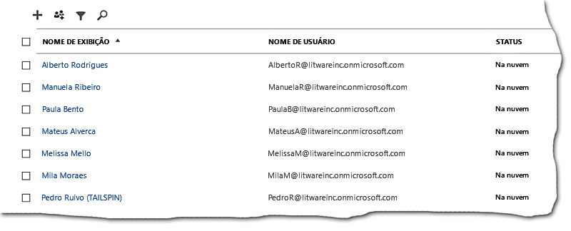
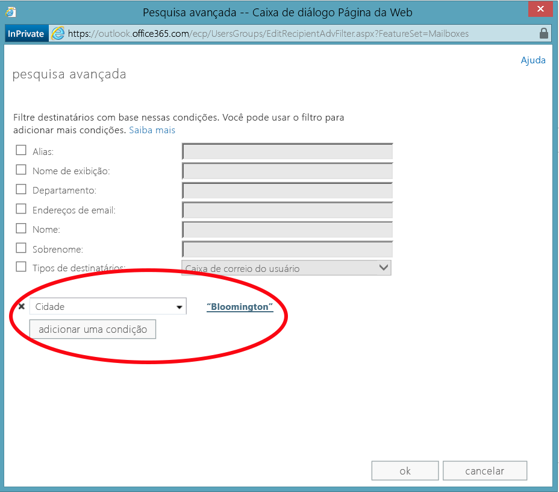
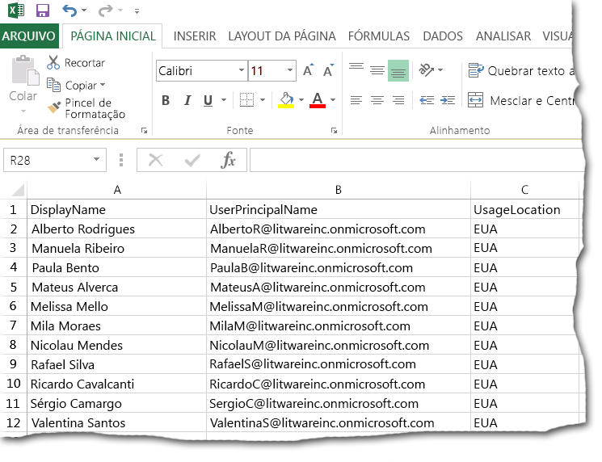
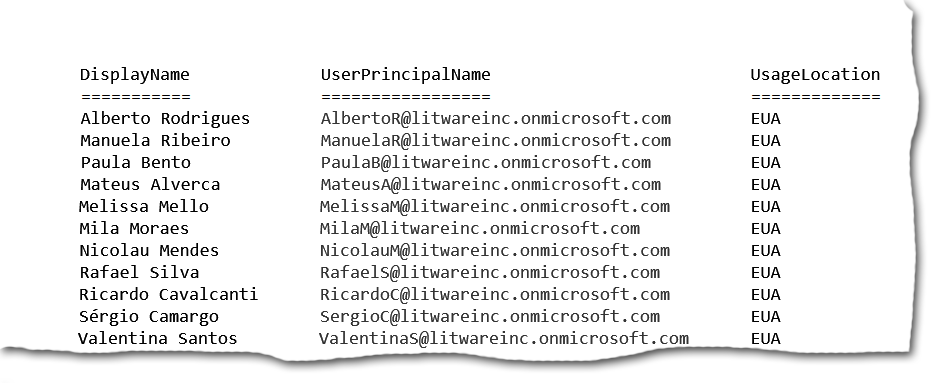

# <a name="why-you-need-to-use-office-365-powershell"></a><span data-ttu-id="3f378-103">Por que você precisa usar o Office 365 PowerShell</span><span class="sxs-lookup"><span data-stu-id="3f378-103">Why you need to use Office 365 PowerShell</span></span>

 <span data-ttu-id="3f378-104">**Resumo:** entenda por que usar o Office 365 PowerShell para gerenciar o Office 365, em alguns casos, com mais eficiência e, em outros casos, por necessidade.</span><span class="sxs-lookup"><span data-stu-id="3f378-104">Summary: Understand why you must use Office 365 PowerShell to manage Office 365, in some cases more efficiently and in other cases by necessity.</span></span>
  
<span data-ttu-id="3f378-p101">Com o Centro de administração do Office 365, além de gerenciar suas contas de usuário e as licenças do Office 365, você também pode gerenciar os produtos de servidor do Office 365: Exchange, Skype for Business online e SharePoint Online. No entanto, você também pode gerenciar esses elementos com os comandos do Office 365 PowerShell, beneficiando-se de um ambiente de linha de comando e linguagem de scripts de velocidade, automação e capacidade adicional.</span><span class="sxs-lookup"><span data-stu-id="3f378-p101">With the Office 365 admin center, you can not only manage your Office 365 user accounts and licenses, but you can also manage your Office 365 server products: Exchange, Skype for Business Online, and SharePoint Online. However, you can also manage these elements with Office 365 PowerShell commands, taking advantage of a command-line and scripting language environment for speed, automation, and additional capability.</span></span>
  
<span data-ttu-id="3f378-107">Neste artigo, mostraremos a você as seguintes maneiras em que você pode usar o Office 365 PowerShell para gerenciar o Office 365.</span><span class="sxs-lookup"><span data-stu-id="3f378-107">In this article, we'll show you these ways in which you can use Office 365 PowerShell to manage Office 365.</span></span>
  
- <span data-ttu-id="3f378-108">O Office 365 PowerShell pode revelar informações adicionais que você não consegue ver no Centro de administração do Office 365</span><span class="sxs-lookup"><span data-stu-id="3f378-108">Office 365 PowerShell can reveal additional information that you cannot see with the Office 365 admin center</span></span>
    
- <span data-ttu-id="3f378-109">O Office 365 tem recursos que você pode configurar apenas usando o Office 365 PowerShell</span><span class="sxs-lookup"><span data-stu-id="3f378-109">Office 365 has features that you can only configure by using Office 365 PowerShell</span></span>
    
- <span data-ttu-id="3f378-110">Office 365 PowerShell é ótimo para realizar operações em massa</span><span class="sxs-lookup"><span data-stu-id="3f378-110">Office 365 PowerShell is great at performing bulk operations</span></span>
    
- <span data-ttu-id="3f378-111">O Office 365 PowerShell é ótimo na filtragem de dados</span><span class="sxs-lookup"><span data-stu-id="3f378-111">Office 365 PowerShell is great at filtering data</span></span>
    
- <span data-ttu-id="3f378-112">O Office 365 PowerShell torna mais fácil imprimir ou salvar dados</span><span class="sxs-lookup"><span data-stu-id="3f378-112">Office 365 PowerShell makes it easy to print or save data</span></span>
    
- <span data-ttu-id="3f378-113">O Office 365 PowerShell permite que você gerencie produtos de servidor</span><span class="sxs-lookup"><span data-stu-id="3f378-113">Office 365 PowerShell lets you manage across server products</span></span>
    
<span data-ttu-id="3f378-p102">Antes de começar, saiba que o Office 365 PowerShell é um conjunto de módulos para o Windows PowerShell, um ambiente de linha de comando para o Windows baseado em serviços e plataformas. Esse ambiente cria uma linguagem de shell de comando que pode ser estendida com módulos adicionais e fornece uma maneira de executar comandos simples ou complexos ou scripts, por exemplo, depois de instalar o módulos do Office 365 PowerShell e entrar com a sua assinatura do Office 365, você pode executar esse comando para listar todas as caixas de correio do usuário para o Microsoft Exchange Online:</span><span class="sxs-lookup"><span data-stu-id="3f378-p102">Before you begin, understand that Office 365 PowerShell is a set of modules for Windows PowerShell, a command-line environment for Windows-based services and platforms. This environment creates a command shell language that can be extended with additional modules and provides a way to execute simple or complex commands or scripts For example, after you install the Office 365 PowerShell modules and connect to your Office 365 subscription, you can run this command to list all of the user mailboxes for Microsoft Exchange Online:</span></span>
  
```
Get-Mailbox
```

<span data-ttu-id="3f378-116">Você também pode executar esse comando para calcular o número de itens em todas as listas de todos os sites para todos os seus aplicativos da Web em SharePoint Online:</span><span class="sxs-lookup"><span data-stu-id="3f378-116">You can also run this command to calculate the number of items in all of the lists for all of the sites for all of your web apps in SharePoint Online:</span></span>
  
```
Get-SPOSite -Limit All | Get-SPWeb -Limit All | % {$_.Lists} | ? {$_ -is [Microsoft.SharePoint.SPDocumentLibrary]} | % {$total+= $_.ItemCount}; $total
```

<span data-ttu-id="3f378-117">A lista de caixas de correio também pode ser facilmente obtida usando o Centro de administração do Office 365, mas a contagem do número de itens em todas as listas de todos os sites para todos os aplicativos da Web não pode ser feita com facilidade.</span><span class="sxs-lookup"><span data-stu-id="3f378-117">Getting the list of mailboxes can also be easily done using the Office 365 admin center, but counting the number of items in all of the lists for all of the sites for all of your web apps cannot be easily done.</span></span>
  
<span data-ttu-id="3f378-p103">Observe que o Office 365 PowerShell foi projetado para ampliar e aprimorar sua capacidade de gerenciar o Office 365, não para substituir o Centro de administração do Office 365. Como administrador do Office 365, você deve pelo menos se sentir confortável usando o PowerShell do Office 365 porque existem alguns procedimentos de configuração que só podem ser feitos com comandos do Office 365 PowerShell. Nesses casos, você precisará compreender como:</span><span class="sxs-lookup"><span data-stu-id="3f378-p103">Please note that Office 365 PowerShell is designed to augment and enhance your ability to manage Office 365, not to replace the Office 365 admin center. As an Office 365 administrator, you must become at least comfortable with using Office 365 PowerShell because there are some configuration procedures that can only be done with Office 365 PowerShell commands. In these cases, you will be required to understand how to:</span></span>
  
- <span data-ttu-id="3f378-121">Instalar os módulos do Office 365 PowerShell (feito apenas uma vez para cada computador do administrador).</span><span class="sxs-lookup"><span data-stu-id="3f378-121">Install the Office 365 PowerShell modules (done only once for each administrator computer).</span></span>
    
- <span data-ttu-id="3f378-122">Conectar-se a sua assinatura do Office 365 (feita uma vez para cada sessão do PowerShell).</span><span class="sxs-lookup"><span data-stu-id="3f378-122">Connect to your Office 365 subscription (done once for each PowerShell session).</span></span>
    
- <span data-ttu-id="3f378-123">Reunir as informações necessárias para executar os comandos necessários do Office 365 PowerShell.</span><span class="sxs-lookup"><span data-stu-id="3f378-123">Gather the information needed to run the required Office 365 PowerShell commands.</span></span>
    
- <span data-ttu-id="3f378-124">Executar os comandos do Office 365 PowerShell com êxito.</span><span class="sxs-lookup"><span data-stu-id="3f378-124">Run the Office 365 PowerShell commands successfully.</span></span>
    
<span data-ttu-id="3f378-p104">Depois de aprender essas habilidades básicas, não é necessário listar os usuários de caixa de correio com o comando **Get-Mailbox**, também não é preciso entender como criar um novo comando como o anterior para contar todos os itens nas listas de todos os sites para todos os seus aplicativos da Web. A Microsoft e a comunidade de administradores do Office 365 podem ajudá-lo conforme necessário.</span><span class="sxs-lookup"><span data-stu-id="3f378-p104">After learning these basic skills, you are not required to list your mailbox users with **Get-Mailbox** command, nor are you required to understand how to create a new command like the previous one to count all the items in all the lists for all of the sites for all of your web apps. Microsoft and the community of Office 365 administrators can help you with that as needed.</span></span>
  
## <a name="office-365-powershell-can-reveal-additional-information-that-you-cannot-see-with-the-office-365-admin-center"></a><span data-ttu-id="3f378-127">O Office 365 PowerShell pode revelar informações adicionais que não é possível ver com o Centro de administração do Office 365</span><span class="sxs-lookup"><span data-stu-id="3f378-127">Office 365 PowerShell can reveal additional information that you cannot see with the Office 365 admin center</span></span>
<span data-ttu-id="3f378-128"><a name="reveal"> </a></span><span class="sxs-lookup"><span data-stu-id="3f378-128"></span></span>

<span data-ttu-id="3f378-p105">O Centro de administração do Office 365 exibe muitas informações úteis, mas isso não significa que ele exibirá todas as informações possíveis que o Office 365 armazena em sites, caixas de correio, licenças e usuários. Veja um exemplo de **usuários e grupos** no Centro de administração do Office 365:</span><span class="sxs-lookup"><span data-stu-id="3f378-p105">The Office 365 admin center displays a lot of useful information, but that doesn't mean that it displays all the possible information that Office 365 stores on users, licenses, mailboxes, and sites. Here is an example for **users and groups** in the Office 365 admin center:</span></span>
  

  
<span data-ttu-id="3f378-p106">Para diversas finalidades, isso exibe as informações que você precisa saber. No entanto, há ocasiões em que você precisa de mais. Por exemplo, o licenciamento do Office 365 (além dos recursos do Office 365 disponíveis a um usuário) dependem, em parte, da localização geográfica desse usuário: as políticas e os recursos que você pode estender a um usuário que mora nos Estados Unidos podem não ser as mesmas políticas e recursos que você pode estender a um usuário que mora na Índia ou na Bélgica. Você pode usar o Centro de administração do Office 365 para determinar a localização geográfica do usuário com estas etapas:</span><span class="sxs-lookup"><span data-stu-id="3f378-p106">For many purposes, this displays the information you need to know. However, there are times when you need more. For example, Office 365 licensing (as well as the Office 365 features available to a user) depend in part on that user's geographic location. The policies and features you can extend to a user who lives in the United States might not be the same as the policies and features you can extend to a user who lives in India or in Belgium. You can use the Office 365 admin center to determine a user's geographic location with these steps:</span></span>
  
1. <span data-ttu-id="3f378-137">Clique duas vezes no **Nome de exibição** do usuário.</span><span class="sxs-lookup"><span data-stu-id="3f378-137">Double-click the user's **Display Name**.</span></span>
    
2. <span data-ttu-id="3f378-138">No painel de exibição de propriedades do usuário, clique em **detalhes**.</span><span class="sxs-lookup"><span data-stu-id="3f378-138">In the user properties display pane, click **details**.</span></span>
    
3. <span data-ttu-id="3f378-139">Na exibição detalhes, clique em **detalhes adicionais**.</span><span class="sxs-lookup"><span data-stu-id="3f378-139">In the details display, click **additional details**.</span></span>
    
4. <span data-ttu-id="3f378-140">Role para baixo até ver o cabeçalho **País ou região**:</span><span class="sxs-lookup"><span data-stu-id="3f378-140">Scroll down until you see the heading **Country or region**:</span></span>
    
     
  
5. <span data-ttu-id="3f378-142">Escreva o nome de exibição e localização do usuário em um pedaço de papel ou copie e cole no Bloco de notas.</span><span class="sxs-lookup"><span data-stu-id="3f378-142">Write the user's display name and location on a piece of paper, or copy and paste it into Notepad.</span></span> 
    
<span data-ttu-id="3f378-p107">Você deve repetir este procedimento para cada usuário. Quando há muitos usuários, isso pode ser uma tarefa entediante. Com o Office 365 PowerShell, você pode exibir essas informações para todos os usuários com o seguinte comando:</span><span class="sxs-lookup"><span data-stu-id="3f378-p107">You must repeat this procedure for each user. For many users, this can be a tedious task. With Office 365 PowerShell, you can display this information for all of your users with the following command:</span></span>
  
```
Get-MsolUser | Select DisplayName, UsageLocation
```

> [!NOTE]
> <span data-ttu-id="3f378-146">Este comando requer a instalação do [módulo do Microsoft Azure Active Directory]((https://technet.microsoft.com/pt-BR/library/jj151815.aspx)).</span><span class="sxs-lookup"><span data-stu-id="3f378-146">This command requires you to install the [Windows Azure Active Directory module]((https://technet.microsoft.com/pt-BR/library/jj151815.aspx)).</span></span> 
  
<span data-ttu-id="3f378-147">Este é um exemplo de exibição:</span><span class="sxs-lookup"><span data-stu-id="3f378-147">Here is an example of the display:</span></span>
  
```
DisplayName                               UsageLocation
-----------                               -------------
Zrinka Makovac                            US
Bonnie Kearney                            GB
Fabrice Canel                             BR
Brian Johnson (TAILSPIN)                  US
Anne Wallace                              US
Alex Darrow                               US
David Longmuir                            BR
```

> [!TIP]
>  <span data-ttu-id="3f378-148">A interpretação deste comando do Office 365 PowerShell é: obter todos os usuários na assinatura atual do Office 365 ( **Get-MsolUser** ), mas exibir apenas o nome e o local para cada usuário ( **Select DisplayName, UsageLocation**).</span><span class="sxs-lookup"><span data-stu-id="3f378-148">The interpretation of this Office 365 PowerShell command is:>  Get all of the users in the current Office 365 subscription ( **Get-MsolUser** ), but only display the name and location for each user ( **Select DisplayName, UsageLocation** ).</span></span>
  
<span data-ttu-id="3f378-p108">Porque o Office 365 PowerShell dá suporte a uma linguagem de shell de comando, você pode manipular ainda mais as informações obtidas do comando **Get-MSolUser**. Por exemplo, talvez você queira classificar esses usuários por sua localização, agrupar todos os usuários brasileiros, todos os usuários dos Estados Unidos etc. Este é o comando:</span><span class="sxs-lookup"><span data-stu-id="3f378-p108">Because Office 365 PowerShell supports a command shell language, you can further manipulate the information obtained from the **Get-MSolUser** command. For example, maybe you'd like to sort these users by their location, grouping all the Brazilian users together, all the United States users together, etc. Here is the command:</span></span>
  
```
Get-MsolUser | Select DisplayName, UsageLocation | Sort UsageLocation, DisplayName
```

<span data-ttu-id="3f378-151">Este é um exemplo de exibição:</span><span class="sxs-lookup"><span data-stu-id="3f378-151">Here is an example of the display:</span></span>
  
```
DisplayName                                 UsageLocation
-----------                                 -------------
David Longmuir                              BR
Fabrice Canel                               BR
Bonnie Kearney                              GB
Alex Darrow                                 US
Anne Wallace                                US
Brian Johnson (TAILSPIN)                    US
Zrinka Makovac                              US
```

> [!TIP]
>  <span data-ttu-id="3f378-152">A interpretação deste comando do Office 365 PowerShell é: obter todos os usuários na assinatura atual do Office 365, mas exibir apenas o nome e o local para cada usuário e classificá-los primeiro pela localização, depois pelos nomes ( **Sort UsageLocation, DisplayName**).</span><span class="sxs-lookup"><span data-stu-id="3f378-152">The interpretation of this Office 365 PowerShell command is:>  Get all of the users in the current Office 365 subscription, but only display the name and location for each user and sort them first by their location, and then their names ( **Sort UsageLocation, DisplayName** ).</span></span>
  
<span data-ttu-id="3f378-p109">Você também pode usar a filtragem adicional. Por exemplo, se você quiser ver informações sobre usuários baseados no Brasil, use este comando:</span><span class="sxs-lookup"><span data-stu-id="3f378-p109">You can also employ additional filtering. For example, if you only want to see information about users based in Brazil, use this command:</span></span>
  
```
Get-MsolUser | Where {$_.UsageLocation -eq "BR"} | Select DisplayName, UsageLocation 
```

<span data-ttu-id="3f378-155">Este é um exemplo de exibição:</span><span class="sxs-lookup"><span data-stu-id="3f378-155">Here is an example of the display:</span></span>
  
```
DisplayName                                           UsageLocation
-----------                                           -------------
David Longmuir                                        BR
Fabrice Canel                                         BR
```

> [!TIP]
>  <span data-ttu-id="3f378-156">A interpretação deste comando do Office 365 PowerShell é: obter todos os usuários na assinatura atual do Office 365 que estejam no Brasil (**Where {$\_.UsageLocation -eq "BR"}**), em seguida, exibir o nome e o local de cada usuário.</span><span class="sxs-lookup"><span data-stu-id="3f378-156">The interpretation of this Office 365 PowerShell command is:>  Get all of the users in the current Office 365 subscription whose location is Brazil ( **Where {$_.UsageLocation -eq "BR"}** ), then display the name and location for each user.</span></span>
  
 <span data-ttu-id="3f378-157">**Uma rápida observação sobre domínios maiores**</span><span class="sxs-lookup"><span data-stu-id="3f378-157">**A Quick Note Regarding Larger Domains**</span></span>
  
<span data-ttu-id="3f378-p110">Se você tiver um domínio muito grande, com dezenas de milhares de usuários, alguns dos exemplos que mostramos neste artigo podem levar a "limitação". Isso significa que, com base em coisas como poder de computação e largura de banda de rede disponível, você está tentando um pouco demais de uma só vez. Por causa disso, grandes organizações podem desejar dividir alguns dos comandos do Office 365 PowerShell em dois comandos. Por exemplo, este comando retorna todas as contas de usuário e mostra o nome e o local de cada usuário:</span><span class="sxs-lookup"><span data-stu-id="3f378-p110">If you have a very large domain with tens of thousands of users, trying some of the examples we show in this article could lead to "throttling." That means that, based on things like computing power and available network bandwidth, you're trying to do a little too much at one time. Because of that, larger organizations might want to split some of these Office 365 PowerShell commands into two commands. For example, this one command returns all the user accounts and shows the name and location for each:</span></span>
  
```
Get-MsolUser | Select DisplayName, UsageLocation
```

<span data-ttu-id="3f378-p111">Isso funciona bem com domínios menores. Em uma grande organização, no entanto, talvez você precise dividi-lo em dois comandos: um comando para armazenar as informações da conta do usuário em uma variável e outro comando para exibir as informações necessárias. Veja um exemplo:</span><span class="sxs-lookup"><span data-stu-id="3f378-p111">That works great for smaller domains. In a large organization, however, you might need to split that into two commands: one command to store the user account information in a variable and another command to display the needed information. Here is an example:</span></span>
  
```
$x = Get-MsolUser
$x | Select DisplayName, UsageLocation
```


<span data-ttu-id="3f378-165">A interpretação deste conjunto de comandos do Office 365 PowerShell é:</span><span class="sxs-lookup"><span data-stu-id="3f378-165">The interpretation of this set of O365_W14_2nd PowerShell commands is:</span></span>
- <span data-ttu-id="3f378-166">Obter todos os usuários na assinatura atual do Office 365 e armazenar as informações em uma variável chamada $x (**$x = Get-MsolUser**).</span><span class="sxs-lookup"><span data-stu-id="3f378-166">Get all of the users in the current  O365_W14_2nd subscription and store the information in a variable named $x ($x = Get-MsolUser).</span></span>
- <span data-ttu-id="3f378-167">Exibir o conteúdo da variável $x, mas incluir apenas o nome e o local para cada usuário (**$x | Select DisplayName, UsageLocation**).</span><span class="sxs-lookup"><span data-stu-id="3f378-167">Display the contents of the variable $x, but only include the name and location for each user (**$x | Select DisplayName, UsageLocation**).</span></span>
  
## <a name="office-365-has-features-that-you-can-only-configure-with-office-365-powershell"></a><span data-ttu-id="3f378-168">O Office 365 tem recursos que você pode configurar apenas com o Office 365 PowerShell</span><span class="sxs-lookup"><span data-stu-id="3f378-168">Office 365 has features that you can only configure with Office 365 PowerShell</span></span>
<span data-ttu-id="3f378-169"><a name="only"> </a></span><span class="sxs-lookup"><span data-stu-id="3f378-169"></span></span>

<span data-ttu-id="3f378-p112">O Centro de administração do Office 365 destina-se a fornecer acesso a tarefas administrativas mais comuns ou significativas que se aplicam à maioria das pessoas. Em outras palavras, o Centro de administração do Office 365 foi desenvolvido para que o administrador típico pudesse usar a ferramenta para realizar as tarefas de gerenciamento mais comuns. Por definição, isso significa que há algumas tarefas que não podem ser concluídas usando o Centro de administração do Office 365.</span><span class="sxs-lookup"><span data-stu-id="3f378-p112">The Office 365 admin center is intended to provide access to the most common or meaningful administrative tasks that apply to most people. In other words, the Office 365 admin center was designed so that the typical administrator could use the tool to carry out the most common management tasks. By this definition, that means that there are some tasks that can't be completed by using the Office 365 admin center.</span></span>
  
<span data-ttu-id="3f378-173">Por exemplo, o Centro de administração Skype for Business online fornece algumas opções para criar convites personalizados para reunião:</span><span class="sxs-lookup"><span data-stu-id="3f378-173">For example, the Skype for Business Online Admin center provides a few options for creating custom meeting invitations:</span></span>
  

  
<span data-ttu-id="3f378-p113">Com essas configurações, você pode adicionar um toque de personalização e profissionalismo a convites de reunião. No entanto, há muito mais configurações de reunião do que simplesmente criar convites personalizados de reunião. Por exemplo, por padrão, as reuniões permitem:</span><span class="sxs-lookup"><span data-stu-id="3f378-p113">With these settings, you can add a touch of personalization and professionalism to meeting invitations. However, there's more to meeting configuration settings than simply creating custom meeting invitations. For example, by default, meetings allow:</span></span>
  
- <span data-ttu-id="3f378-178">Usuários anônimos obterem entrada automática para cada reunião.</span><span class="sxs-lookup"><span data-stu-id="3f378-178">Anonymous users to gain automatic entrance to each meeting.</span></span>
    
- <span data-ttu-id="3f378-179">Participantes gravem a reunião.</span><span class="sxs-lookup"><span data-stu-id="3f378-179">Attendees to record the meeting.</span></span>
    
- <span data-ttu-id="3f378-180">Todos os usuários da sua organização serem designado como apresentadores quando eles entrarem na reunião.</span><span class="sxs-lookup"><span data-stu-id="3f378-180">All users from your organization to be designated as presenters when they join the meeting.</span></span>
    
<span data-ttu-id="3f378-p114">Essas configurações não estão disponíveis no Centro de administração do Skype for Business online. No entanto, você pode controlá-las no Office 365 PowerShell. Veja um comando que desabilita essas três configurações:</span><span class="sxs-lookup"><span data-stu-id="3f378-p114">These settings are not available from the Skype for Business Online Admin center. However, you can control them from Office 365 PowerShell. Here is a command that disables these three settings:</span></span>
  
```
Set-CsMeetingConfiguration -AdmitAnonymousUsersByDefault $False -AllowConferenceRecording $False -DesignateAsPresenter "None"
```

> [!NOTE]
> <span data-ttu-id="3f378-184">Este comando requer que você instale o [Módulo do PowerShell Skype for Business Online ](https://www.microsoft.com/download/details.aspx?id=39366).</span><span class="sxs-lookup"><span data-stu-id="3f378-184">This command requires that you install the [Skype for Business Online PowerShell Module ](https://www.microsoft.com/download/details.aspx?id=39366).</span></span> 
  
> [!TIP]
>  <span data-ttu-id="3f378-185">A interpretação deste comando do Office 365 PowerShell é: para obter as configurações para novas reuniões do Skype for Business Online ( **Set-CsMeetingConfiguration** ), desabilite a permissão para que usuários anônimos obtenham entrada automática para reuniões ( **- AdmitAnonymousUsersByDefault $False** ), desabilite a capacidade dos participantes de gravarem reuniões ( **- AllowConferenceRecording $False** ) e não defina todos os usuários da sua organização como apresentadores ( **- DesignateAsPresenter "None"** ).</span><span class="sxs-lookup"><span data-stu-id="3f378-185">The interpretation of this Office 365 PowerShell command is:>  For the settings for new Skype for Business Online meetings ( **Set-CsMeetingConfiguration** ), disable allowing anonymous users to gain automatic entrance to meetings ( **-AdmitAnonymousUsersByDefault $False** ), disable the ability for attendees to record meetings ( **-AllowConferenceRecording $False** ), and do not designate all users from your organization as presenters ( **-DesignateAsPresenter "None"** ).</span></span>
  
<span data-ttu-id="3f378-186">Se você mudar de ideia e desejar restaurar essas configurações padrão (todas são ativadas), execute este comando:</span><span class="sxs-lookup"><span data-stu-id="3f378-186">If you change your mind and want to restore these default settings (all of them enabled), run this command:</span></span>
  
```
Set-CsMeetingConfiguration -AdmitAnonymousUsersByDefault $True -AllowConferenceRecording $True -DesignateAsPresenter "Company"
```

<span data-ttu-id="3f378-p115">Isso é apenas um exemplo. Existem outros, é por isso que você, como administrador do Office 365, precisa estar familiarizado com a execução de comandos do Office 365 PowerShell.</span><span class="sxs-lookup"><span data-stu-id="3f378-p115">This is just one example. There are others, which is why you, as an Office 365 administrator, need to be comfortable with running Office 365 PowerShell commands.</span></span>
  
## <a name="office-365-powershell-is-great-at-carrying-out-bulk-operations"></a><span data-ttu-id="3f378-189">O Office 365 PowerShell é ideal para realizar operações em massa</span><span class="sxs-lookup"><span data-stu-id="3f378-189">Office 365 PowerShell is great at carrying out bulk operations</span></span>
<span data-ttu-id="3f378-190"><a name="bulk"> </a></span><span class="sxs-lookup"><span data-stu-id="3f378-190"></span></span>

<span data-ttu-id="3f378-p116">Historicamente, interfaces visuais, como o Centro de administração do Office 365, são mais úteis quando você tem uma única operação a ser executada. Por exemplo, se você precisar desativar uma conta de usuário, você pode usar o Centro de administração do Office 365 para localizar rapidamente e desmarcar uma caixa de seleção. Isso pode ser mais simples do que executar uma operação similar no Office 365 PowerShell.</span><span class="sxs-lookup"><span data-stu-id="3f378-p116">Historically, visual interfaces like the Office 365 admin center are most valuable when you have a single operation to perform. For example, if you need to disable one user account, you can use the Office 365 admin center to quickly locate and clear a checkbox. This can be simpler than performing a similar operation in Office 365 PowerShell.</span></span>
  
<span data-ttu-id="3f378-p117">Mas, se você precisar alterar muitas coisas ou alguns itens selecionados em um conjunto grande de outras coisas, o Centro de administração do Office 365 pode não ser a melhor maneira de economizar seu tempo. Por exemplo, se precisar alterar o prefixo de milhares de números de telefone ou remover um usuário específico, Paulo Araújo, de todos os sites do SharePoint Online, como você faria isso no Centro de administração do Office 365?</span><span class="sxs-lookup"><span data-stu-id="3f378-p117">But if you have to change many things or some selected things within a large set of other things, the Office 365 admin center might not be the best use of your time. For example, if you had to change the prefix on thousands of phone numbers or you needed to remove a specific user, Ken Myer, from all of your SharePoint Online sites, how would you do that in the Office 365 admin center?</span></span>
  
<span data-ttu-id="3f378-p118">No último exemplo, você tem centenas de sites do SharePoint Online e não tem a mínima ideia de quais deles Paulo Araújo é membro. Isso significa que você terá que começar no Centro de administração do Office 365 e, em seguida, executar este procedimento para cada site:</span><span class="sxs-lookup"><span data-stu-id="3f378-p118">For the latter example, you have several hundred SharePoint Online sites and you don't know even know which ones of which Ken Meyer is a member. That means you'll have to start at the Office 365 admin center and then perform this procedure for each site:</span></span>
  
1. <span data-ttu-id="3f378-198">Clicar na **URL** do site.</span><span class="sxs-lookup"><span data-stu-id="3f378-198">Click the **URL** of the site.</span></span>
    
2. <span data-ttu-id="3f378-199">Na caixa **Propriedades da coleção de sites**, clicar no link **Endereço de Site da Web** para abrir o site.</span><span class="sxs-lookup"><span data-stu-id="3f378-199">In the **site collection properties** box, click the **Web Site Address** link to open the site.</span></span>
    
3. <span data-ttu-id="3f378-200">No site, clicar em **Compartilhar**.</span><span class="sxs-lookup"><span data-stu-id="3f378-200">On the site, click **Share**.</span></span>
    
4. <span data-ttu-id="3f378-201">Na caixa de diálogo **Compartilhar** clicar no link que mostra a você todos os usuários que têm permissão para o site:</span><span class="sxs-lookup"><span data-stu-id="3f378-201">In the **Share** dialog box click the link that shows you all the users who have permissions to the site:</span></span>
    
     
  
5. <span data-ttu-id="3f378-203">Na caixa de diálogo **Compartilhado com** clicar em **Avançado**.</span><span class="sxs-lookup"><span data-stu-id="3f378-203">In the **Shared With** dialog box, click **Advanced**.</span></span>
    
6. <span data-ttu-id="3f378-204">Rolar pela lista de usuários, encontrar e selecionar Paulo Araújo (supondo que ele tem permissões para o site) e então clicar em **Remover Permissões do Usuário**.</span><span class="sxs-lookup"><span data-stu-id="3f378-204">Scroll down the list of users, find and select Ken Myer (assuming he has permissions to the site), and then click **Remove User Permissions**.</span></span>
    
<span data-ttu-id="3f378-205">Pode demorar muito tempo para você fazer isso em uma centena de sites.</span><span class="sxs-lookup"><span data-stu-id="3f378-205">This can take a long time for several hundred sites.</span></span>
  
<span data-ttu-id="3f378-206">A alternativa é usar o Office 365 PowerShell e o comando a seguir para remover Paulo Araújo de todos os sites:</span><span class="sxs-lookup"><span data-stu-id="3f378-206">The alternative is to use Office 365 PowerShell and the following command to remove Ken Myer from all of your sites:</span></span>
  
```
Get-SPOSite | ForEach {Remove-SPOUser -Site $_.Url -LoginName "kenmyer@litwareinc.com"}
```

> [!NOTE]
> <span data-ttu-id="3f378-207">Este comando requer que você instale o [Conectar ao PowerShell do SharePoint Online]((https://technet.microsoft.com/library/fp161372.aspx)).</span><span class="sxs-lookup"><span data-stu-id="3f378-207">This command requires that you install the [Connect to SharePoint Online PowerShell]((https://technet.microsoft.com/library/fp161372.aspx)).</span></span> 
  
> [!TIP]
>  <span data-ttu-id="3f378-208">A interpretação deste comando do Office 365 PowerShell é: obtenha todos os sites do SharePoint na assinatura atual do Office 365 ( **Get-SPOSite** ) e, em cada site, remova Paulo Araújo da lista de usuários que podem acessá-los ( **ForEach {Remove-SPOUser -Site $\_.Url -LoginName "kenmyer@litwareinc.com"}** ).</span><span class="sxs-lookup"><span data-stu-id="3f378-208">The interpretation of this Office 365 PowerShell command is:>  Get all of the SharePoint sites in the current Office 365 subscription ( **Get-SPOSite** ) and for each site, remove Ken Meyer from the list of users who can access it ( **ForEach {Remove-SPOUser -Site $_.Url -LoginName "kenmyer@litwareinc.com"}** ).</span></span>
  
<span data-ttu-id="3f378-p119">Como estamos informando o Office 365 para remover Paulo Araújo de cada site, incluindo aqueles em que ele não tem acesso, a exibição desse comando exibirá erros para os sites em que ele não tem acesso atualmente. Podemos usar uma condição adicional nesse comando para remover Paulo Araújo somente de sites com ele esteja na lista de login, mas os erros listados não provocam danos aos sites. Este comando pode demorar alguns minutos para ser executado em centenas de sites, em vez de horas de trabalho por meio do Centro de administração do Office 365.</span><span class="sxs-lookup"><span data-stu-id="3f378-p119">Because we are telling Office 365 to remove Ken Meyer from every site, including those in which he does not have access, the display of this command will show errors for those sites in which he does not currently have access. We can use an additional condition on this command to remove Key Meyer only from the sites that have him in their login list, but the listed errors cause no harm to the sites themselves. This command might take a few minutes to run against hundreds of sites, rather than hours of working through the Office 365 admin center.</span></span>
  
<span data-ttu-id="3f378-p120">Este é outro exemplo de operação em massa. Use este comando para adicionar Mila Moraes, uma nova administradora do SharePoint, para todos os sites na organização:</span><span class="sxs-lookup"><span data-stu-id="3f378-p120">Here is another bulk operation example. Use this command to add Bonnie Kearney, a new SharePoint administrator, to all of the sites in the organization:</span></span>
  
```
Get-SPOSite | ForEach {Add-SPOUser -Site $_.Url -LoginName "bkearney@litwareinc.com" -Group "Members"}
```

> [!TIP]
>  <span data-ttu-id="3f378-214">A interpretação deste comando do Office 365 PowerShell é: obter todos os sites do SharePoint na assinatura atual do Office 365 e, em cada site, permitir o acesso de Mila Moraes adicionando o nome de logon dela ao grupo Membros do site ( **ForEach {Add-SPOUser -Site $\_.Url -LoginName "mmoraes@litwareinc.com" -Group "Members"}** ).</span><span class="sxs-lookup"><span data-stu-id="3f378-214">The interpretation of this Office 365 PowerShell command is:>  Get all of the SharePoint sites in the current Office 365 subscription and for each site, allow Bonnie Kearney access by adding her login name to the Members group of the site ( **ForEach {Add-SPOUser -Site $_.Url -LoginName "bkearney@litwareinc.com" -Group "Members"}** ).</span></span>
  
## <a name="office-365-powershell-is-great-at-filtering-data"></a><span data-ttu-id="3f378-215">O Office 365 PowerShell é ótimo na filtragem de dados</span><span class="sxs-lookup"><span data-stu-id="3f378-215">Office 365 PowerShell is great at filtering data</span></span>
<span data-ttu-id="3f378-216"><a name="filter"> </a></span><span class="sxs-lookup"><span data-stu-id="3f378-216"></span></span>

<span data-ttu-id="3f378-p121">O Centro de administração do Office 365 fornece diversas maneiras de filtrar seus dados rapidamente e de localizar um subconjunto específico de informações facilmente. Por exemplo, o Exchange facilita a filtragem de praticamente qualquer propriedade da caixa de correio de um usuário. Por exemplo, esta é uma lista de caixas de correio para todos os usuários que moram em Belo Horizonte:</span><span class="sxs-lookup"><span data-stu-id="3f378-p121">The Office 365 admin center provides several different ways to filter your data to quickly and easily locate a targeted subset of information. For example, Exchange makes it easy to filter on practically any property of a user mailbox. For example, here is the list of mailboxes for all the users who live in the city of Bloomington:</span></span>
  

  
<span data-ttu-id="3f378-p122">O Centro de administração do Exchange também permite que você combine critérios de filtro. Por exemplo, você pode encontrar as caixas de correio para todas as pessoas que moram em Belo Horizonte e que trabalham no departamento financeiro.</span><span class="sxs-lookup"><span data-stu-id="3f378-p122">The Exchange Admin center also lets you combine filter criteria. For example, you can find the mailboxes for all the people who live in Bloomington and who work in the Finance department.</span></span> 
  
<span data-ttu-id="3f378-p123">No entanto, existem limitações no que você pode fazer no Centro de administração do Exchange. Por exemplo, talvez você queira localizar caixas de correio de quem mora em Belo Horizonte ou Curitiba ou caixas de correio para todas as pessoas que não moram em Belo Horizonte.</span><span class="sxs-lookup"><span data-stu-id="3f378-p123">However, there are limitations to what you can do in the Exchange Admin center. For example, maybe you'd like to find the mailboxes of people who live in Bloomington or San Diego, or the mailboxes for all the people who don't live in Bloomington.</span></span> 
  
<span data-ttu-id="3f378-225">Com o Office 365 PowerShell, você pode obter uma lista de caixas de correio de todas as pessoas que vivem nas cidades de Belo Horizonte ou Curitiba com este comando:</span><span class="sxs-lookup"><span data-stu-id="3f378-225">With Office 365 PowerShell, you can get a list of mailboxes for all the people who live in the cities of Bloomington or San Diego with this command:</span></span>
  
```
Get-User | Where {$_.RecipientTypeDetails -eq "UserMailbox" -and ($_.City -eq "San Diego" -or $_.City -eq "Bloomington")} | Select DisplayName, City
```

<span data-ttu-id="3f378-226">Este é um exemplo de exibição:</span><span class="sxs-lookup"><span data-stu-id="3f378-226">Here is an example of the display:</span></span>
  
```
DisplayName                              City
-----------                              ----
Alex Darrow                              San Diego
Bonnie Kearney                           San Diego
Julian Isla                              Bloomington
Rob Young                                Bloomington
Zrinka Makovac                           San Diego
```

> [!TIP]
>  <span data-ttu-id="3f378-227">A interpretação deste comando do Office 365 PowerShell é: obter todos os usuários na assinatura atual do Office 365 que têm uma caixa de correio nas cidades de Curitiba ou Belo Horizonte ( **Where {$\_.RecipientTypeDetails -eq "UserMailbox" -and ($\_.City -eq "Curitiba" -or $\_.City -eq "Belo Horizonte")}** ), em seguida, exibir o nome e a cidade de cada um ( **Select DisplayName, City** ).</span><span class="sxs-lookup"><span data-stu-id="3f378-227">The interpretation of this Office 365 PowerShell command is:>  Get all of the users in the current Office 365 subscription who have a mailbox in the cities of either San Diego or Bloomington ( **Where {$\_.RecipientTypeDetails -eq "UserMailbox" -and ($\_.City -eq "San Diego" -or $_.City -eq "Bloomington")}** ), then display the name and city for each ( **Select DisplayName, City** ).</span></span>
  
<span data-ttu-id="3f378-228">Este é o comando para listar todas as caixas de correio de quem mora em qualquer lugar, exceto Belo Horizonte:</span><span class="sxs-lookup"><span data-stu-id="3f378-228">To list all the mailboxes for people who live anywhere except Bloomington, here is the command:</span></span>
  
```
Get-User | Where {$_.RecipientTypeDetails -eq "UserMailbox" -and $_.City -ne "Bloomington"} | Select DisplayName, City
```

<span data-ttu-id="3f378-229">Este é um exemplo de exibição:</span><span class="sxs-lookup"><span data-stu-id="3f378-229">Here is an example of the display:</span></span>
  
```
DisplayName                               City
-----------                               ----
MOD Administrator                         Redmond
Alex Darrow                               San Diego
Allie Bellew                              Bellevue
Anne Wallace                              Louisville
Aziz Hassouneh                            Cairo
Belinda Newman                            Charlotte
Bonnie Kearney                            San Diego
David Longmuir                            Waukesha
Denis Dehenne                             Birmingham
Garret Vargas                             Seattle
Garth Fort                                Tulsa
Janet Schorr                              Bellevue
```

> [!TIP]
>  <span data-ttu-id="3f378-230">A interpretação deste comando do Office 365 PowerShell é: obter todos os usuários na assinatura atual do Office 365 com uma caixa de correio não localizada na cidade de Belo Horizonte ( **Where {$\_.RecipientTypeDetails -eq "UserMailbox" -and $\_.City -ne "Belo Horizonte"}** ), em seguida, exibir o nome e a cidade de cada um.</span><span class="sxs-lookup"><span data-stu-id="3f378-230">The interpretation of this Office 365 PowerShell command is:>  Get all of the users in the current Office 365 subscription who have a mailbox not located in the city of Bloomington ( **Where {$\_.RecipientTypeDetails -eq "UserMailbox" -and $\_.City -ne "Bloomington"}** ), then display the name and city for each.</span></span>
  
<span data-ttu-id="3f378-p124">Você também pode usar caracteres curinga nos seus filtros do Office 365 PowerShell para corresponder a parte de um nome. Por exemplo, suponha que você esteja procurando uma conta de usuário e tudo aquilo que você consegue se lembrar é que o sobrenome é Mendes, ou talvez seja Gonçalves ou quem sabe Gomes.</span><span class="sxs-lookup"><span data-stu-id="3f378-p124">You can also use wildcard characters in your Office 365 PowerShell filters to match part of a name. For example, suppose you're looking for a user account, and all you can remember is that their last name was Anderson, or maybe Henderson, or maybe it was Jorgenson.</span></span>
  
<span data-ttu-id="3f378-233">Você pode encontrar esse usuário no Centro de administração do Office 365 usando a ferramenta de pesquisa e executando três pesquisas diferentes:</span><span class="sxs-lookup"><span data-stu-id="3f378-233">You could track down that user in the Office 365 admin center by using the search tool and carrying out three different searches:</span></span>
  
- <span data-ttu-id="3f378-234">Uma para  *Mendes*</span><span class="sxs-lookup"><span data-stu-id="3f378-234">One for  *Anderson*</span></span> 
    
- <span data-ttu-id="3f378-235">Uma para  *Gonçalves*</span><span class="sxs-lookup"><span data-stu-id="3f378-235">One for  *Henderson*</span></span> 
    
- <span data-ttu-id="3f378-236">Uma para  *Gomes*</span><span class="sxs-lookup"><span data-stu-id="3f378-236">One for  *Jorgenson*</span></span> 
    
<span data-ttu-id="3f378-p125">Como todos esses três nomes terminam em "es", você pode dizer ao Office 365 PowerShell para exibir todos os usuários cujos nomes terminam em "es". Este é o comando:</span><span class="sxs-lookup"><span data-stu-id="3f378-p125">Because all three of these names end in "son", you can tell Office 365 PowerShell to display all the users whose name ends in "son". Here is the command:</span></span>
  
```
Get-User -Filter '{LastName -like "*son"}'
```

> [!TIP]
>  <span data-ttu-id="3f378-p126">A interpretação deste comando do Office 365 PowerShell é: obter todos os usuários na assinatura atual do Office 365, mas usar um filtro que lista apenas os usuários cujos sobrenomes terminam em "es" ( **-Filter '{LastName -like "\*son"}'** ). O \* representa qualquer conjunto de caracteres, que são as letras no caso do sobrenome do usuário.</span><span class="sxs-lookup"><span data-stu-id="3f378-p126">The interpretation of this Office 365 PowerShell command is:>  Get all of the users in the current Office 365 subscription, but use a filter that only lists the users whose last names end in "son" ( **-Filter '{LastName -like "\*son"}'*** ). The ***** stands for any set of characters, which are letters in the case of the user's last name.</span></span>
  
## <a name="office-365-powershell-makes-it-easy-to-print-or-save-data"></a><span data-ttu-id="3f378-241">O Office 365 PowerShell torna mais fácil imprimir ou salvar dados</span><span class="sxs-lookup"><span data-stu-id="3f378-241">Office 365 PowerShell makes it easy to print or save data</span></span>
<span data-ttu-id="3f378-242"><a name="printsave"> </a></span><span class="sxs-lookup"><span data-stu-id="3f378-242"></span></span>

<span data-ttu-id="3f378-p127">O Centro de administração do Office 365 permite exibir listas de dados. Este é um exemplo do Skype for Business online exibindo uma lista de usuários que foram habilitados para o Skype for Business online:</span><span class="sxs-lookup"><span data-stu-id="3f378-p127">The Office 365 admin center allows you to view lists of data. Here is an example of the Skype for Business Online Admin center displaying a list of users who have been enabled for Skype for Business Online:</span></span>
  

  
<span data-ttu-id="3f378-p128">Para salvar essas informações em um arquivo, você deve copiá-lo e colá-lo em um documento ou no Excel. Em ambos os casos, a cópia pode exigir uma formatação adicional. Além disso, o Centro de administração do Office 365 não oferece uma maneira de imprimir a lista exibida diretamente.</span><span class="sxs-lookup"><span data-stu-id="3f378-p128">To save that information to a file, you must copy and paste it into a document or Excel. In either case, the copy might require additional formatting. Additionally, the Office 365 admin center does not provide a way to directly print the displayed list.</span></span>
  
<span data-ttu-id="3f378-p129">Felizmente, você pode usar o Office 365 PowerShell para exibir não apenas uma lista, mas para salvá-la em um arquivo que pode ser facilmente importado para o Excel. Este é um exemplo do comando para salvar dados do usuário do Skype for Business online em valores separados por vírgula (CSV), um arquivo que pode ser facilmente importado como uma tabela em uma planilha do Excel:</span><span class="sxs-lookup"><span data-stu-id="3f378-p129">Fortunately, you can use Office 365 PowerShell to not only display the list, but save it to a file that can be easily imported into Excel. Here is an example command to save Skype for Business Online user data to a comma-separated values (CSV) file, a file that can be easily imported as a table in an Excel worksheet:</span></span>
  
```
Get-CsOnlineUser | Select DisplayName, UserPrincipalName, UsageLocation | Export-Csv -Path "C:\\Logs\\SfBUsers.csv" -NoTypeInformation
```

<span data-ttu-id="3f378-251">Este é um exemplo de exibição:</span><span class="sxs-lookup"><span data-stu-id="3f378-251">Here is an example of the display:</span></span>
  

  
> [!TIP]
>  <span data-ttu-id="3f378-253">A interpretação deste comando do Office 365 PowerShell é: obter todos os usuários do Skype for Business Online na assinatura atual do Office 365 ( **Get-CsOnlineUser** ), obter apenas o nome de usuário, o UPN e o local ( **Select DisplayName, UserPrincipalName, UsageLocation** ) e, em seguida, salvar informações no arquivo CSV chamado C:\\Logs\\SfBUsers.csv ( **Export-Csv -Path "C:\\Logs\\SfBUsers.csv" - NoTypeInformation** ).</span><span class="sxs-lookup"><span data-stu-id="3f378-253">The interpretation of this Office 365 PowerShell command is:>  Get all of the Skype for Business Online users in the current Office 365 subscription ( **Get-CsOnlineUser** ), obtain only the user name, UPN, and location ( **Select DisplayName, UserPrincipalName, UsageLocation** ), and then save that information in CSV file named C:\\Logs\\SfBUsers.csv ( **Export-Csv -Path "C:\\Logs\\SfBUsers.csv" -NoTypeInformation** ).</span></span>
  
<span data-ttu-id="3f378-p130">Você também pode usar opções para salvar a lista como um arquivo XML ou como uma página HTML. Na verdade, com os comandos adicionais do PowerShell, você poderia salvá-la diretamente como um arquivo do Excel, com qualquer formatação personalizada desejada.</span><span class="sxs-lookup"><span data-stu-id="3f378-p130">You can also use options to save this list as an XML file or as an HTML page. In fact, with additional PowerShell commands, you could save it directly as an Excel file, with any custom formatting you desire.</span></span> 
  
<span data-ttu-id="3f378-p131">Você também pode enviar a saída de um comando do Office 365 PowerShell que exibe uma lista diretamente para a impressora padrão no Windows. Este é um exemplo de comando:</span><span class="sxs-lookup"><span data-stu-id="3f378-p131">You can also send the output of an Office 365 PowerShell command that displays a list directly to the default printer in Windows. Here is an example command:</span></span>
  
```
Get-CsOnlineUser | Select DisplayName, UserPrincipalName, UsageLocation | Out-Printer
```

<span data-ttu-id="3f378-258">O seu documento impresso ficará assim:</span><span class="sxs-lookup"><span data-stu-id="3f378-258">Here's what your printed document will look like:</span></span>
  

  
> [!TIP]
>  <span data-ttu-id="3f378-260">A interpretação deste comando do Office 365 PowerShell é: obter todos os usuários do Skype for Business Online na assinatura atual do Office 365, obter apenas o nome de usuário, o UPN e o local e enviá-las para a impressora padrão do Windows ( **Out-Printer** ).</span><span class="sxs-lookup"><span data-stu-id="3f378-260">The interpretation of this Office 365 PowerShell command is:>  Get all of the Skype for Business Online users in the current Office 365 subscription, obtain only the user name, UPN, and location, and then send that information to the default Windows printer ( **Out-Printer** ).</span></span>
  
<span data-ttu-id="3f378-261">O documento impresso tem a mesma formatação simples exibida dentro da janela de comando do Office 365 PowerShell, mas após ter criado um comando do Office 365 PowerShell para listar o que você precisa, basta adicionar **| Out-Printer** no final do comando para obter uma cópia para trabalhar.</span><span class="sxs-lookup"><span data-stu-id="3f378-261">The printed document has the same simple formatting as the display within the Office 365 PowerShell command window, but once you have created an Office 365 PowerShell command to list what you need, you just add ** | Out-Printer** to the end of the command to get a hard copy to work from.</span></span>
  
## <a name="office-365-powershell-lets-you-manage-across-server-products"></a><span data-ttu-id="3f378-262">O Office 365 PowerShell permite que você gerencie produtos de servidor</span><span class="sxs-lookup"><span data-stu-id="3f378-262">Office 365 PowerShell lets you manage across server products</span></span>
<span data-ttu-id="3f378-263"><a name="printsave"> </a></span><span class="sxs-lookup"><span data-stu-id="3f378-263"></span></span>

<span data-ttu-id="3f378-p132">Os diferentes componentes que compõem o Office 365 são projetados para trabalhar juntos. Por exemplo, suponha que você adicionou um novo usuário ao Office 365 e, ao fazer isso, você especificou informações como o departamento e o telefone desse usuário. Essas informações estarão disponíveis se você acessar as informações do usuário de qualquer um dos produtos de servidor do Office 365: Skype for Business online, Exchange, ou SharePoint Online.</span><span class="sxs-lookup"><span data-stu-id="3f378-p132">The different components that make up Office 365 are designed to work together. For example, suppose you add a new user to Office 365 and, when you do, you specify such information as the user's department and phone number. That information will then be available if you access the user's information using any of the Office 365 server products: Skype for Business Online, Exchange, or SharePoint Online.</span></span>
  
<span data-ttu-id="3f378-p133">Mas isso se trata de informações genéricas que existem em todo o conjunto de produtos. Informações específicas do produto, por exemplo, as informações sobre uma caixa de correio do Exchange do usuário, geralmente não estão disponíveis em todo o pacote. Por exemplo, se você deseja saber se a caixa de correio do usuário está habilitada ou não, essas informações estão disponíveis somente no Centro de administração do Exchange.</span><span class="sxs-lookup"><span data-stu-id="3f378-p133">But that's for common information that spans the suite of products. Product-specific information-for example, information about a user's Exchange mailbox-is typically not available across the suite. For example, if you want to know if a user's mailbox is enabled or not, that information is available only in the Exchange Admin center.</span></span> 
  
<span data-ttu-id="3f378-270">Suponha que você queira fazer um relatório que mostre as seguintes informações sobre todos os seus usuários:</span><span class="sxs-lookup"><span data-stu-id="3f378-270">Suppose you'd like to make a report that shows the following information for all your users:</span></span>
  
- <span data-ttu-id="3f378-271">O nome de exibição do usuário</span><span class="sxs-lookup"><span data-stu-id="3f378-271">The user's display name</span></span>
    
- <span data-ttu-id="3f378-272">Se o usuário tem uma licença para o Office 365</span><span class="sxs-lookup"><span data-stu-id="3f378-272">Whether the user is licensed for Office 365</span></span>
    
- <span data-ttu-id="3f378-273">Se a caixa de correio do Exchange do usuário está habilitada</span><span class="sxs-lookup"><span data-stu-id="3f378-273">Whether the user's Exchange mailbox has been enabled</span></span>
    
- <span data-ttu-id="3f378-274">Se o usuário está habilitado para o Skype for Business online</span><span class="sxs-lookup"><span data-stu-id="3f378-274">Whether the user is enabled for Skype for Business Online</span></span>
    
<span data-ttu-id="3f378-p134">No momento, não é possível usar o Centro de administração do Office 365 para produzir facilmente essas informações. Em vez disso, você precisará criar um documento separado para armazenar informações, como uma planilha do Excel e obter todos os nomes de usuário e informações de licenciamento a partir do Centro de administração do Office 365, obter informações de caixa de correio do Centro de administração do Exchange, obter informação sobre o Skype for Business online a partir do Centro de administração do Skype for Business online e, em seguida, agrupar e combinar essas informações.</span><span class="sxs-lookup"><span data-stu-id="3f378-p134">You currently cannot use the Office 365 admin center to easily produce such a report. Instead, you'll have to create a separate document to store the information, like an Excel worksheet, and get all the user names and licensing information from the Office 365 admin center, get mailbox information from the Exchange Admin center, get Skype for Business Online information from the Skype for Business Online Admin center, and then collate and combine that information.</span></span>
  
<span data-ttu-id="3f378-277">A alternativa é usar um script do Office 365 PowerShell para compilar esse relatório para você.</span><span class="sxs-lookup"><span data-stu-id="3f378-277">The alternative is to use an Office 365 PowerShell script to compile that report for you.</span></span>
  
<span data-ttu-id="3f378-p135">O script de exemplo a seguir é mais complicado do que os comandos que vimos até agora neste artigo. Mas, mostra a possibilidade de usar o Office 365 PowerShell para criar modos de exibição de informações que são muito difíceis de serem feitos de outra maneira. Aqui está o script que pode compilar e exibir a lista necessária:</span><span class="sxs-lookup"><span data-stu-id="3f378-p135">The following example script is more complicated than the commands you have seen so far in this article. But, it shows the potential of using Office 365 PowerShell to create views of information that are very difficult to do otherwise. Here is the script that can compile and display the needed list:</span></span>
  
```
$x = Get-MsolUser

foreach ($i in $x)
    {
      $y = Get-Mailbox -Identity $i.UserPrincipalName
      $i | Add-Member -MemberType NoteProperty -Name IsMailboxEnabled -Value $y.IsMailboxEnabled

      $y = Get-CsOnlineUser -Identity $i.UserPrincipalName
      $i | Add-Member -MemberType NoteProperty -Name EnabledForSfB -Value $y.Enabled
    }

$x | Select DisplayName, IsLicensed, IsMailboxEnabled, EnabledforSfB
```

<span data-ttu-id="3f378-281">Este é um exemplo de exibição:</span><span class="sxs-lookup"><span data-stu-id="3f378-281">Here is an example of the display:</span></span>
  
```
DisplayName             IsLicensed   IsMailboxEnabled   EnabledForSfB
-----------             ----------   ----------------   --------------
Zrinka Makovac          True         True               True
Bonnie Kearney          True         True               True
Fabrice Canel           True         True               True
Brian Johnson           False        True               False
Anne Wallace            True         True               True
Alex Darrow             True         True               True
David Longmuir          True         True               True
Katy Jordan             False        True               False
Molly Dempsey           False        True               False
```

<span data-ttu-id="3f378-282">A interpretação deste script do Office 365 PowerShell é:</span><span class="sxs-lookup"><span data-stu-id="3f378-282">The interpretation of this Office 365 PowerShell script is:</span></span>  
- <span data-ttu-id="3f378-283">Obter todos os usuários na assinatura atual do Office 365 e armazenar as informações em uma variável chamada $x (**$x = Get-MsolUser**).</span><span class="sxs-lookup"><span data-stu-id="3f378-283">Get all of the users in the current  O365_W14_2nd subscription and store the information in a variable named $x ($x = Get-MsolUser).</span></span>
- <span data-ttu-id="3f378-284">Iniciar um loop que é executado em todos os usuários na variável denominada $x (**foreach ($i in $x)**).</span><span class="sxs-lookup"><span data-stu-id="3f378-284">Start a loop that runs over all the users in the variable named $x (**foreach ($i in $x)**).</span></span>  
- <span data-ttu-id="3f378-285">Definir uma variável chamada $y e armazenar as informações da caixa de correio do usuário nela (**$y = Get-Mailbox -Identity $i.UserPrincipalName**).</span><span class="sxs-lookup"><span data-stu-id="3f378-285">Define a variable named $y and store the user's mailbox information in it (**$y = Get-Mailbox -Identity $i.UserPrincipalName**).</span></span>
- <span data-ttu-id="3f378-286">Adicionar uma nova propriedade à informação do usuário chamada IsMailBoxEnabled e configurá-la para o valor da propriedade IsMailBoxEnabled da caixa de correio do usuário (**$i | Add-Member -MemberType NoteProperty -Name IsMailboxEnabled -Value $y.IsMailboxEnabled**).</span><span class="sxs-lookup"><span data-stu-id="3f378-286">Add a new property to the user information named IsMailBoxEnabled and set it to the value of the IsMailBoxEnabled property of the user's mailbox  (**$i | Add-Member -MemberType NoteProperty -Name IsMailboxEnabled -Value $y.IsMailboxEnabled**).</span></span>
- <span data-ttu-id="3f378-287">Definir uma variável chamada $y e armazenar as informações do usuário do Skype for Business Online nela (**$y = Get-CsOnlineUser -Identity $i.UserPrincipalName**).</span><span class="sxs-lookup"><span data-stu-id="3f378-287">Define a variable named $y and store the user's Skype for Business Online information in it ( **$y = Get-CsOnlineUser -Identity $i.UserPrincipalName** ).</span></span>
- <span data-ttu-id="3f378-288">Adicionar uma nova propriedade à informação do usuário chamada EnabledForSfB e configurá-la para o valor da propriedade Habilitada das informações do usuário do Skype for Business Online (**$i | Add-Member -MemberType NoteProperty -Name EnabledForSfB -Value $y.Enabled**).</span><span class="sxs-lookup"><span data-stu-id="3f378-288">Add a new property to the user information named EnabledForSfB and set it to the value of the Enabled property of the user's Skype_for_Business_Online information ($i | Add-Member -MemberType NoteProperty -Name EnabledForSfB -Value $y.Enabled).</span></span>
- <span data-ttu-id="3f378-289">Exibir a lista de usuários, mas incluir apenas os nomes, informar se eles estão licenciados e incluir as duas novas propriedades que indicam se as caixas de correio deles estão ativadas e se elas estão habilitadas para o Skype for Business Online ( **$x | Select DisplayName, IsLicensed, IsMailboxEnabled, EnabledforSfB** ).</span><span class="sxs-lookup"><span data-stu-id="3f378-289">Display the list of users, but include only their name, whether they are licensed, and the two new properties that indicate whether their mailbox is enabled and whether they are enabled for Skype_for_Business_Online  ($x | Select DisplayName, IsLicensed, IsMailboxEnabled, EnabledforSfB).</span></span>
  
## <a name="see-also"></a><span data-ttu-id="3f378-290">Veja também</span><span class="sxs-lookup"><span data-stu-id="3f378-290">See also</span></span>


#### 

[<span data-ttu-id="3f378-291">Introdução ao Office 365 PowerShell</span><span class="sxs-lookup"><span data-stu-id="3f378-291">Getting started with Office 365 PowerShell</span></span>](getting-started-with-office-365-powershell.md)
  
[<span data-ttu-id="3f378-292">Gerenciar contas de usuário e licenças usando o PowerShell do Office 365</span><span class="sxs-lookup"><span data-stu-id="3f378-292">Manage user accounts and licenses with Office 365 PowerShell</span></span>](manage-user-accounts-and-licenses-with-office-365-powershell.md)
  
[<span data-ttu-id="3f378-293">Use o Windows PowerShell para criar relatórios no Office 365</span><span class="sxs-lookup"><span data-stu-id="3f378-293">Use Windows PowerShell to create reports in Office 365</span></span>](use-windows-powershell-to-create-reports-in-office-365.md)

