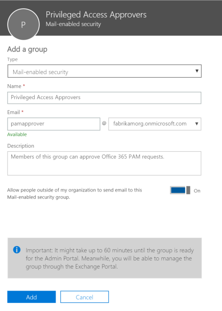

# <a name="privileged-access-management-in-office-365"></a>Privilégios acessar management no Office 365

> [!IMPORTANT]
> Este tópico aborda as diretrizes de implantação e configuração para recursos da versão beta pública só está disponíveis no Office 365 E5 e avançadas SKUs de conformidade.

Privilegiado acesso gerenciamento permite que o controle de acesso granular sobre tarefas de administração com privilégios no Office 365.  Ele pode ajudar a proteger sua organização contra violações que possam usar contas de administração com privilégios existentes com acesso a posição a dados confidenciais ou acesso às definições de configuração crítico. Após habilitar o gerenciamento de acesso privilegiado, serão necessário solicitar acesso just-in-time para executar tarefas com privilégios elevados e privilegiadas por meio de um fluxo de trabalho de aprovação que é altamente no escopo do tempo-limite e usuários. Isso dá usuários just-o suficiente-acesso para realizar a tarefa em questão, sem o risco de exposição dos dados confidenciais ou definições de configuração crítico. Habilitando o gerenciamento de acesso privilegiado no Office 365 permitirá a sua organização para operar com zero privilégios a posição e fornecem uma camada de defesa contra vulnerabilidades resultantes por causa de tal acesso administrativo de posição. 

Este tópico vai guiá-lo por meio de habilitando e configurando o gerenciamento de acesso privilegiado em sua organização do Office 365 e servir como um guia de referência para a solicitação, aprovar e gerenciamento do recurso. 

## <a name="before-you-begin"></a>Antes de começar

### <a name="limited-functionality"></a>Funcionalidade limitada
Durante a versão beta pública, privilegiado acesso a recursos de gerenciamento só estão disponíveis por meio do [PowerShell do Exchange Online](https://docs.microsoft.com/powershell/exchange/exchange-online/exchange-online-powershell?view=exchange-ps) no Office 365. Acesso de privilegiado gerenciamento abrange as definições de tarefa no nível de cmdlets de gerenciamento do Exchange. Em Office 365 versões futuras, acesso privilegiado recursos estarão disponíveis por meio do portal de administração e abordarão outros serviços de cargas de trabalho do Office 365.

### <a name="connecting-to-exchange-online-powershell"></a>Conectar-se para o Exchange Online PowerShell
As etapas de configuração neste tópico vai orientá-lo por meio de habilitação e usar acesso privilegiado no Office 365 usando o PowerShell do Exchange Online. 

Siga as etapas em [Connect to Exchange Online PowerShell usando a autenticação multifator](https://docs.microsoft.com/powershell/exchange/exchange-online/connect-to-exchange-online-powershell/mfa-connect-to-exchange-online-powershell?view=exchange-ps) para se conectar ao Exchange Online PowerShell com suas credenciais do Office 365 para habilitar e configurar o acesso privilegiado para sua organização.

> [!NOTE]
> Você não precisará habilitar a autenticação multifator para sua organização do Office 365 usar as etapas para habilitar o acesso privilegiado ao conectar ao PowerShell do Exchange Online. Conexão com a autenticação multifator cria um token de OAuth que é usado pelo acesso privilegiado para assinar suas solicitações.

## <a name="enable-and-configure-privileged-access-management"></a>Habilitar e configurar o gerenciamento de acesso privilegiado

### <a name="step-1---create-an-approvers-group"></a>Etapa 1 - Criar grupo do aprovador
No Portal de administração do Office 365, selecione **grupos** > **Adicionar um grupo**, em seguida, crie um grupo de segurança habilitado para email para os aprovadores de acesso padrão privilegiado. Quando concluir, selecione **Adicionar** para criar e salvar o grupo de aprovador.



> [!NOTE] 
> Neste momento, somente os usuários com acesso administrativo têm permissão para aprovar solicitações de acesso ao Office 365 privilegiada. No futuro, qualquer usuário que faz parte do grupo dos aprovadores será aprovar solicitações de acesso.

### <a name="step-2---enable-privileged-access-in-office-365"></a>Etapa 2 - habilitar acesso privilegiado no Office 365
Acesso privilegiado deve ser explicitamente ativado ao grupo padrão aprovador e incluindo um conjunto de contas de sistema que deseja sejam excluídos do controle de acesso de gerenciamento de acesso privilegiado. 

Execute o seguinte comando no PowerShell do Exchange Online para habilitar o acesso privilegiado e atribuir o grupo do aprovador:
```
Enable-ElevatedAccessControl -AdminGroup '<default approver group>' -SystemAccounts @('<systemAccountUPN1>','<systemAccountUPN2>')
```
Exemplo:
```
Enable-ElevatedAccessControl -AdminGroup 'pamapprovers@fabrikam.onmicrosoft.com' -SystemAccounts @('sys1@fabrikamorg.onmicrosoft.com', sys2@fabrikamorg.onmicrosoft.com')
```

> [!NOTE]
> Contas de sistema recurso é disponibilizado garantir que certas automáticos em suas organizações podem trabalhar sem dependência no acesso privilegiado, no entanto, é recomendável que tal exclusões ser excepcionais e devem ser aprovados e auditadas aqueles permitidos regularmente.

### <a name="step-3---create-an-approval-policy"></a>Etapa 3: criar uma política de aprovação
Uma política de aprovação permite definir os requisitos específicos de aprovação com escopo em tarefas individuais. As opções de tipo de aprovação são **Auto** ou **Manual**. 

Execute o seguinte comando no Exchange Online PowerShell para definir uma política de aprovação:
```
New-ElevatedAccessApprovalPolicy -Task 'Exchange\<exchange management cmdlet name>' -ApprovalType <Manual, Auto> -ApproverGroup '<default/custom approver group>'
```
Exemplo:
```
New-ElevatedAccessApprovalPolicy -Task 'Exchange\New-MoveRequest' -ApprovalType Manual -ApproverGroup 'mbmanagers@fabrikamorg.onmicrosoft.com'
```

## <a name="using-privileged-access-in-your-office-365-organization"></a>Usar o acesso privilegiado em sua organização do Office 365

### <a name="requesting-elevation-authorization-to-execute-tasks"></a>Autorização de elevação solicitante para executar tarefas
Uma vez ativado, com privilégios de acesso requer aprovações para executar qualquer tarefa que tem uma política de aprovação associados definida. Os usuários que precisam executar tarefas incluídas na uma política de aprovação deve solicitar e receber aprovação de acesso para que as permissões necessárias para executar a tarefa.

Execute o seguinte comando no Exchange Online PowerShell para criar e enviar uma solicitação de aprovação ao grupo do aprovador:
```
New-ElevatedAccessRequest -Task 'Exchange\<exchange management cmdlet name>' -Reason '<appropriate reason>' -DurationHours <duration in hours>
```
Exemplo:
```
New-ElevatedAccessRequest -Task 'Exchange\New-MoveRequest' -Reason 'Attempting to fix the user mailbox error' -DurationHours 4
```
### <a name="view-status-of-elevation-requests"></a>Exibir o status das solicitações de elevação
Depois que uma solicitação de aprovação é criada, o status da solicitação de elevação podem ser revisados usando o associado com o ID de solicitação.

Execute o seguinte comando no Exchange Online PowerShell para exibir o status de uma solicitação de aprovação para uma ID de solicitação específica:
```
Get-ElevatedAccessRequest -Identity <request ID> | select RequestStatus
```
Exemplo:
```
Get-ElevatedAccessRequest -Identity 28560ed0-419d-4cc3-8f5b-603911cbd450 | select RequestStatus
```

### <a name="approving-an-elevation-authorization-request"></a>Aprovar uma solicitação de autorização de elevação
Quando uma solicitação de aprovação é criada, os membros do grupo aprovador relevantes receberão uma notificação de e-mail e podem aprovar a solicitação associada com o ID de solicitação. 

Execute o seguinte comando no Exchange Online PowerShell para aprovar uma solicitação de autorização de elevação:
```
Approve-ElevatedAccessRequest -RequestId <request id> -Comment '<approval comment>'
```
Exemplo:
```
Approve-ElevatedAccessRequest -RequestId a4bc1bdf-00a1-42b4-be65-b6c63d6be279 -Comment '<approval comment>'
```
### <a name="denying-an-elevation-authorization-request"></a>Rejeitar uma solicitação de autorização de elevação
Quando uma solicitação de aprovação é criada, membros do grupo relevantes aprovador podem negar a solicitação associada com o ID de solicitação. 

Execute o seguinte comando no Exchange Online PowerShell para negar uma solicitação de autorização de elevação:
```
Deny-ElevatedAccessRequest -RequestId <request id> -Comment '<denial comment>'
```
Exemplo:
```
Deny-ElevatedAccessRequest -RequestId a4bc1bdf-00a1-42b4-be65-b6c63d6be279 -Comment '<denial comment>'
```

### <a name="running-the-task"></a>Executando a tarefa
Após a aprovação for concedida, o usuário solicitante pode executar a tarefa pretendida e acesso privilegiado será autorizar e executar a tarefa em nome dos usuários. A aprovação permanecerá válida para os solicitados duração (duração padrão é 4 horas), durante o qual o solicitante pode executar a tarefa pretendida várias vezes. Todas essas execuções são registradas e torná-los disponíveis para auditoria de conformidade e segurança. 

### <a name="disable-privileged-access-in-office-365"></a>Desabilitar acesso privilegiado no Office 365
Se necessário, você pode desativar o gerenciamento de acesso privilegiado no Office 365. Desabilitando privilegiada acesso não exclui quaisquer políticas de aprovação associados ou a grupos de aprovador.

Execute o seguinte comando no Exchange Online Powershell para desabilitar o acesso privilegiado:

```
Disable-ElevatedAccessControl
```
## <a name="managed-access-to-microsoft-graph-in-microsoft-azure"></a>Gerenciados acesso ao Microsoft Graph in Microsoft Azure

> [!IMPORTANT]
> Esta seção aborda as diretrizes de implantação e configuração para um recurso do Microsoft Graph versão beta pública só está disponível no Office 365 E5 e avançadas SKUs de conformidade.

Acesso gerenciado para o Microsoft Graph in Microsoft Azure é um serviço que ajuda as organizações a exercer um nível granular de controle sobre seus dados do Office 365. Este sistema permite que os desenvolvedores de aplicativos de falsificar ideias com esses dados. 

Este sistema usa acesso ao Office 365 privilegiado reivindicar controle sobre seus dados por meio de seu fluxo de trabalho de aprovação, permitindo o acesso com escopo aos dados do Office 365 com supervisão de admin. Solicitações de dados são quando os aplicativos são instalados e exigem acesso aos dados do Office 365.

### <a name="view-request-details"></a>Exibir detalhes da solicitação
Exibir detalhes das solicitações de acesso de dados do Office 365.

Execute o seguinte comando no Exchange Online Powershell para visualizar as solicitações de dados:
```
Get-ElevatedAccessRequest | where {$_.RequestedAccess -like '*Data Access Request*'} | select RequestorUPN, Service, RequestedAccess | fl
```
Exemplo de saída:
```
RequestorUPN    : admin@contoso.com
Service         : Office365
RequestedAccess : Data Access Request
```

### <a name="approve-data-access-requests"></a>Aprovar solicitações de acesso de dados
Todas as solicitações de acesso de dados podem ser aprovadas por meio dos cmdlets de aprovação de acesso privilegiado standard.

Execute o seguinte comando no Exchange Online Powershell para aprovar solicitações de todos os dados para o solicitante específico:

```
Approve-ElevatedAccessRequest -RequestId <request id> -Comment '<approval comment>'
```
Exemplo:
```
Approve-ElevatedAccessRequest -RequestId a4bc1bdf-00a1-42b4-be65-b6c63d6be279 -Comment '<approval comment>'
```

## <a name="getting-help-and-providing-feedback"></a>Obtendo ajuda e fornecer comentários
Reconhecemos que, durante o beta público, você pode se deparar com um bug ocasional ou ter comentários e sugestões sobre como podemos melhorar o gerenciamento de acesso privilegiado. Podemos seus comentários são importantes e incentivar a compartilhá-las conosco:
- Poste seus comentários sugestões da ad no [Grupo do Yammer de visualização do Office](https://www.yammer.com/officeenterprisenda/#/threads/inGroup?type=in_group&feedId=14435206).
- Arquivo seus relatórios de bugs sob o caminho de área "Office 365 privilegiado acesso gerenciamento" no [VSO de visualização do Office](https://office-previews.visualstudio.com/previews).

## <a name="frequently-asked-questions"></a>Perguntas frequentes

### <a name="what-skus-do-i-need-to-use-privileged-access-in-office-365"></a>Quais SKUs precisa usar acesso privilegiado no Office 365?
Privilegiado acesso gerenciamento no Office 365 atualmente só está disponível para clientes com E5 e avançadas SKUs de conformidade.

### <a name="when-will-privileged-access-be-available-for-office-365-workloads-beyond-exchange"></a>Quando o acesso privilegiado estará disponível para cargas de trabalho do Office 365 além do Exchange?
Pretendemos oferecer esse recurso em outras cargas de trabalho do Office 365 em breve. Quando estamos prontos para compartilhar um cronograma, ele estará disponível por meio do mapa do Office 365.

### <a name="how-is-this-different-from-azure-active-directorys-privileged-identity-management"></a>Como isso é diferente do gerenciamento de identidade do Windows Azure Active Directory privilegiado?
Acesso privilegiado gerenciamento no Office 365 e o complemento de [gerenciamento de identidade do Azure AD privilegiado](https://docs.microsoft.com/azure/active-directory/active-directory-privileged-identity-management-configure) uns aos outros, fornecendo acesso para controlar com acesso just-in-time em escopos diferentes. Juntos, eles oferecem um conjunto robusto de controles de proteção de seus dados.

Privilegiado access pode ser definido e com escopo no nível da tarefa, enquanto o Azure AD privilegiado Identity Management aplica no nível de função com a capacidade de executar várias tarefas de gerenciamento no Office 365.  Gerenciamento de identidade Azure AD privilegiado principalmente permite Gerenciando acessos para grupos de função enquanto com privilégios e funções do AD gerenciamento de acesso no Office 365 é aplicado no nível da tarefa.

 - **Privilegiada habilitando acessar management no Office 365 durante o uso do Windows Azure AD privilegiado gerenciamento de identidade já:** Adicionar o gerenciamento de acesso privilegiado no Office 365 pode fornecer outra camada granular de proteção e recursos para acesso privilegiado ao Office 365 dados de auditoria.

- **Habilitando o Azure AD privilegiado gerenciamento de identidade durante a utilização do já privilegiado gerenciamento de acesso no Office 365:**  Adicionando o Azure AD privilegiado gerenciamento de identidade a privilegiada gerenciamento de acesso no Office 365 pode estender privilegiado acesso aos dados fora do Office 365 definida principalmente por função ou a identidade de um usuário. 

### <a name="do-i-need-to-be-a-global-admin-to-manage-privileged-access-in-office-365"></a>É necessário ser um Administrador Global para gerenciar o acesso privilegiado no Office 365?
Durante a visualização, você precisa ter privilégios de Administrador Global para poder gerenciar acesso privilegiado no Office 365. Os usuários que estão incluídos no grupo dos aprovadores um não precisam ser um Administrador Global para revisar e aprovar solicitações. 

### <a name="how-is-privileged-access-management-in-office-365-related-to-customer-lockbox"></a>Como é o gerenciamento de acesso privilegiado no Office 365 relacionadas ao cliente Lockbox?
[Lockbox do cliente](https://support.office.com/article/Office-365-Customer-Lockbox-Requests-36f9cdd1-e64c-421b-a7e4-4a54d16440a2) permite que um nível de controle de acesso para as organizações para acesso a dados pelo seu provedor de serviço, ou seja, a Microsoft. Privilegiado acesso management no Office 365 permite que o controle de acesso granular dentro de uma organização para todas as tarefas do Office 365 privilegiado.