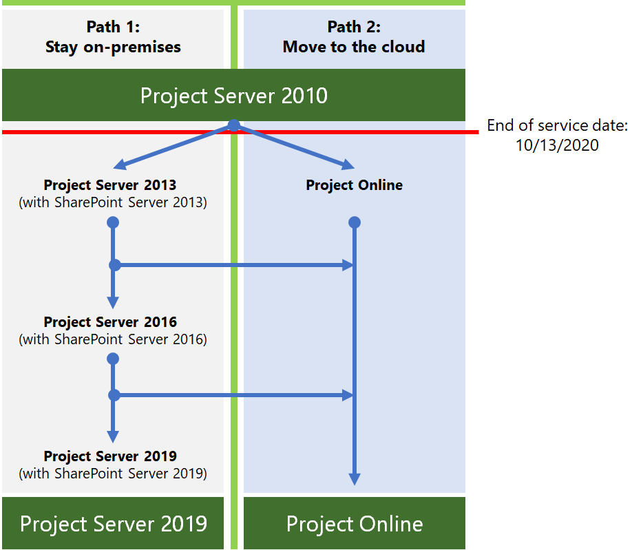

# Roteiro de fim do suporte do Project Server 2010Project Server 2010 end of support roadmap

*Esse artigo se aplica ao Office 365 Enterprise e ao Microsoft 365 Enterprise.**This article applies to both Office 365 Enterprise and Microsoft 365 Enterprise.*

O Project Server 2010 atingirá o fim do suporte em **13 de abril de 2021**.Project Server 2010 will reach end of support on **April 13, 2021**. Essa data foi estendida a partir da data de fim de suporte anterior de 13 de outubro de 2020.This date has been extended from the previous end-of-support date of October 13, 2020. Se você estiver usando o Project Server 2010 no momento, observe que esses outros produtos relacionados têm as seguintes datas de suporte:If you are currently using Project Server 2010, note that these other related products have the following end of support dates:
  
|**Product****Product**|**data do fim da suporte****end of support date**|
|:-----|:-----|
|Project Portfolio Server 2010Project Portfolio Server 2010    |13 de outubro de 2020October 13, 2020    |
|Padrão do Project 2010Project 2010 Standard    |13 de outubro de 2020October 13, 2020    |
|Project 2010 ProfessionalProject 2010 Professional    |13 de outubro de 2020October 13, 2020    |
   
Para obter mais informações sobre os servidores do Office 2010 que atinjam o fim do suporte, consulte [Upgrade from Office 2010 Servers and Client Products](https://docs.microsoft.com/office365/enterprise/plan-upgrade-previous-versions-office).For more information about Office 2010 servers reaching end of support, see [Upgrade from Office 2010 servers and client products](https://docs.microsoft.com/office365/enterprise/plan-upgrade-previous-versions-office).
  
## O que significa o fim do suporte?What does end of support mean?

O Project Server, como quase todos os produtos da Microsoft, tem um ciclo de vida de suporte durante o qual fornecemos novos recursos, correções de erros e atualizações de segurança.Project Server, like almost all Microsoft products, has a support lifecycle during which we provide new features, bug fixes, and security updates. Esse ciclo de vida normalmente dura 10 anos a partir da data da versão inicial do produto, e o final desse ciclo de vida é conhecido como o fim do suporte do produto.This lifecycle typically lasts for 10 years from the date of the product's initial release, and the end of this lifecycle is known as the product's end of support. Quando o Project Server 2010 atingir o fim do suporte em 13 de outubro de 2020, a Microsoft não fornecerá mais:When Project Server 2010 reaches its end of support on October 13, 2020, Microsoft will no longer provide:
  
- Suporte técnico para problemas que podem ocorrer.Technical support for problems that may occur.
    
- Correções de erros descobertas e que podem afetar a estabilidade e a usabilidade do servidor.Bug fixes for issues that are discovered and that may impact the stability and usability of the server.
    
- Correções de segurança para vulnerabilidades descobertas e que podem tornar o servidor vulnerável a brechas de segurança.Security fixes for vulnerabilities that are discovered and that may make the server vulnerable to security breaches.
    
- Atualizações de fuso horário.Time zone updates.
    
Sua instalação do Project Server 2010 continuará a ser executada após essa data.Your installation of Project Server 2010 will continue to run after this date. No entanto, devido às alterações listadas acima, é altamente recomendável migrar do Project Server 2010 o mais rápido possível.However, because of the changes listed above, we strongly recommend that you migrate from Project Server 2010 as soon as possible.
  
## Quais são as minhas opções?What are my options?

Se você estiver usando o Project Server 2010, precisará explorar as opções de migração, que são:If you are using Project Server 2010, you need to explore your migration options, which are:
  
- Migrar para o Project onlineMigrate to Project Online
    
- Migre para uma versão local mais recente do Project Server (preferivelmente o Project Server 2019).Migrate to a newer on-premises version of Project Server (preferably Project Server 2019).

Estes são os dois caminhos que você pode executar para evitar o fim do suporte para o Project Server 2010.Here are the two paths you can take to avoid the end of support for Project Server 2010.

    

|**Por que eu prefiro migrar para o Project Server 2019?****Why would I prefer to migrate to Project Server 2019?**|**Por que eu prefiro migrar para o Project online?****Why would I prefer to migrate to Project Online?**|
|:-----|:-----|
|Regras de negócios restringe a operar minha empresa na nuvem.Business rules restrict me from operating my business in the cloud.     Preciso de controle das atualizações no meu ambiente.I need control of updates to my environment.    | Tenho usuários móveis ou remotos.I have mobile or remote users.     Os custos para migrar servidores locais são uma grande preocupação (hardware, software, horas e esforço para implementar, etc.).Costs to migrate on-premises servers are a big concern (hardware, software, hours and effort to implement, etc.).     Após a migração, os custos de manutenção do meu ambiente são uma grande preocupação (por exemplo, atualizações automáticas, tempo de atividade garantido, etc.).After migration, costs to maintain my environment are a big concern (for example, automatic updates, guaranteed uptime, etc.).     |

   
> [!NOTE]
> Para obter mais informações sobre as opções de migração de seus servidores do Office 2010, consulte [recursos para ajudá-lo a atualizar de clientes e servidores do office 2010](https://docs.microsoft.com/office365/enterprise/upgrade-from-office-2010-servers-and-products).For more information about options for moving from your Office 2010 servers, see [Resources to help you upgrade from Office 2010 servers and clients](https://docs.microsoft.com/office365/enterprise/upgrade-from-office-2010-servers-and-products). Observe que o Project Server não oferece suporte a uma configuração híbrida, já que o Project Server e o Project online não podem compartilhar o mesmo pool de recursos.Note that Project Server does not support a hybrid configuration since Project Server and Project Online cannot share the same resource pool. 

### Quais são as opções do Project Client?What are my options for Project client?
Se você estiver usando o Project Professional 2010 ou o Project Standard 2010 e quiser explorar suas opções de migração, você tem a opção de:If you are using Project Professional 2010 or Project Standard 2010 and want to explore your migration options, you have the choice of:
- Mover para uma versão mais recente do Project Professional ou do Project Standard.Moving to a newer version of Project Professional or Project Standard.
- Mudar para uma solução online como o Project online ou o Project para a Web.Moving to an online solution such as Project Online or Project for the web.
 
#### Movendo para uma versão mais recente do cliente do ProjectMoving to a newer version of Project client

Se você estiver migrando do Project Standard 2010, poderá migrar para uma versão mais recente do Project Standard (Project Standard 2016 ou Project Standard 2019).If you are migrating from Project Standard 2010, you can migrate to a newer version of Project Standard (Project Standard 2016 or Project Standard 2019).  Recomendamos mover para a versão mais recente para aproveitar os recursos e a funcionalidade mais recentes.We recommend moving to the newest version to take advantage of the latest features and functionality. Além disso, a migração para uma versão menos recente (Project Standard 2016) significa que você precisará migrar dessa versão mais cedo à medida que o final da data de suporte surgir.Also, migrating to a less current version (Project Standard 2016) means that you will need to migrate from this version sooner as its end of support date comes up.

Da mesma forma, se você estiver migrando do Project Professional 2010, poderá optar por migrar para uma versão mais recente (Project Professional 2019 ou Project Professional 2016).Similarly, if you are migrating from Project Professional 2010, you can choose to migrate to a newer version (Project Professional 2019 or Project Professional 2016). Recomendamos mover para a versão mais recente, se possível.We recommend moving to the newest version if possible.  Se você estiver usando o Project Professional para se conectar ao Project Server, certifique-se de migrar para uma versão do Project Professional que é compatível com a versão do Project Server que você está usando.If you are using Project Professional to connect to Project Server, make sure that you migrate to a version of Project Professional that is supported to connect with the version of Project Server that you are using.

Os usuários do Project Professional 2010 também podem optar por migrar para o cliente da área de trabalho do Project online.Project Professional 2010 users can also choose to migrate to the Project Online Desktop client. É uma versão baseada em assinatura do Project Professional 2019 e está incluída nas assinaturas do plano de projeto 3 e do Project Plan 5.It is a subscription-based version of Project Professional 2019, and is included in Project Plan 3 and Project Plan 5 subscriptions. 

#### Movendo para uma solução onlineMoving to an online solution

Você também pode optar por migrar do Project Professional 2010 ou do Project Standard 2010 para as soluções online baseadas em assinatura do projeto.You can also choose to migrate from Project Professional 2010 or Project Standard 2010 to Project's subscription-based online solutions. O plano de projeto 3 e o plano 5 incluem o Project online e a última oferta de nuvem, [projeto para a Web](https://support.office.com/article/what-can-you-do-with-project-for-the-web-b30f5442-be5f-43d2-9072-c95bff778ea1).Both Project Plan 3 and Plan 5 include Project Online and the latest cloud offering, [Project for the web](https://support.office.com/article/what-can-you-do-with-project-for-the-web-b30f5442-be5f-43d2-9072-c95bff778ea1). Ambas oferecem vários novos recursos e benefícios que vale a pena explorar.Both offer a number of new features and benefits that are worth exploring.

Para obter mais informações sobre os recursos incluídos em ambas, bem como as licenças do plano de projeto incluídas no, consulte a [Descrição do serviço do Microsoft Project](https://docs.microsoft.com/office365/servicedescriptions/project-online-service-description/project-online-service-description).For more information about features included in both, as well as Project Plan licenses they are included in, see the [Microsoft Project service description](https://docs.microsoft.com/office365/servicedescriptions/project-online-service-description/project-online-service-description).

  
## Considerações importantes que você precisa tomar ao planejar a migração do Project Server 2010Important considerations you need to make when planning to migrate from Project Server 2010

Você precisa considerar o seguinte ao planejar a migração do Project Server 2010:You need to consider the following when planning to migrate from Project Server 2010:
  
- **Obter ajuda de um provedor de solução da Microsoft** – a atualização do Project Server 2010 pode ser um desafio e requer muito planejamento e preparação.**Get help from a Microsoft solution provider** - Upgrading from Project Server 2010 can be a challenge and requires much preparation and planning. Pode ser especialmente desafiador se você não fosse o para instalar e configurar o Project Server 2010 originalmente.It can be especially challenging if you were not the one to setup and configure Project Server 2010 originally. 2019 no @ @ @ @ @ @ @ @ @ @ @ @ @ @ @ @ @ @ @ @ @ @ @ @ @ @ @ @ @ @ @ @ @ @ @ @ @ @ @ @ @ @ @ @ @Luckily, there are Microsoft solution providers you can turn to who do this for a living, whether you plan on migrating to Project Server 2019 or to Project Online. Você pode pesquisar por um provedor de soluções da Microsoft para ajudá-lo com sua migração no [centro de provedores de soluções da Microsoft](https://go.microsoft.com/fwlink/p/?linkid=841249).You can search for a Microsoft solution provider to help with your migration on the [Microsoft solution provider center](https://go.microsoft.com/fwlink/p/?linkid=841249). 
    
- **Planejar suas personalizações** – esteja ciente de que muitas das personalizações que você está trabalhando no seu ambiente do Project Server 2010 podem não funcionar ao migrar para o project Server 2019 ou para o Project online.**Plan for your customizations** - Be aware that many of the customizations you have working in your Project Server 2010 environment might not work when migrating to Project Server 2019 or to Project Online. Há grandes diferenças na arquitetura do Project Server entre as versões, bem como os sistemas operacionais necessários, os servidores de banco de dados e os navegadores da Web do cliente com suporte para trabalhar com a versão mais recente.There are big differences in Project Server architecture between versions, as well as the required operating systems, database servers, and client web browsers that are supported to work with the newer version. Tenha um plano em vigor para testar ou reconstruir suas personalizações conforme necessário em seu novo ambiente.Have a plan in place on how to test or rebuild your customizations as needed in your new environment. O planejamento da atualização também será uma boa oportunidade para verificar se uma personalização específica é realmente necessária à medida que você avança.Planning for your upgrade will also be a good opportunity to verify if a specific customization is really needed as you move forward. [Criar um plano para personalizações atuais durante a atualização para o SharePoint 2013]( https://docs.microsoft.com/SharePoint/upgrade-and-update/create-a-plan-for-current-customizations-during-upgrade-to-sharepoint-2013) tem algumas informações gerais excelentes sobre a avaliação e o planejamento de suas personalizações atuais durante a atualização.[Create a plan for current customizations during upgrade to SharePoint 2013]( https://docs.microsoft.com/SharePoint/upgrade-and-update/create-a-plan-for-current-customizations-during-upgrade-to-sharepoint-2013) has some great general information about evaluating and planning for your current customizations when upgrading. 
    
- O planejamento, a execução e o teste da atualização de **tempo e paciência** levarão muito tempo e esforço, especialmente se você estiver atualizando para o Project Server 2019.**Time and patience** - Upgrade planning, execution, and testing will take much time and effort, especially if you are upgrading to Project Server 2019. Por exemplo, se você estiver migrando do Project Server 2010 para o Project Server 2019, primeiro será necessário migrar do Project Server 2010 para o Project Server 2013 e, em seguida, verificar seus dados e, em seguida, fazer o mesmo quando migrar para cada versão sucessiva (para o Project Server 2016 e, em seguida, para o Project Server 2019).For example, if you are migrating from Project Server 2010 to Project Server 2019, you will first need to migrate from Project Server 2010 to Project Server 2013, and then check your data, and then do the same thing when you migrate to each successive version (to Project Server 2016 and then to Project Server 2019). Você pode querer verificar com um provedor de soluções da Microsoft para comparar seus custos estimados com suas estimativas de quanto tempo levará para eles e em qual custo.You might want to check with a Microsoft solution provider to compare your estimated costs with their estimates of how long it will take for them to do it, and at what cost. 
    
## Migrar para o Project onlineMigrate to Project Online

Se você optar por migrar do Project Server 2010 para o Project online, poderá fazer o seguinte para migrar manualmente os dados do plano de projeto:If you choose to migrate from Project Server 2010 to Project Online, you can do the following to manually migrate your project plan data:
  
1. Salve seus planos de projeto do Project Server 2010 para o. Formato MPP.Save your project plans from Project Server 2010 to .MPP format.
    
2. Usando o Project Professional 2016, o Project Professional 2019 ou o cliente da área de trabalho do Project online, abra cada arquivo. mpp e salve e publique-o no Project online.Using Project Professional 2016, Project Professional 2019, or the Project Online Desktop Client, open each .mpp file, and then save and publish it to Project Online.
    
Você pode criar manualmente a configuração do PWA no Project online (por exemplo, recrie os campos personalizados ou calendários da empresa necessários).You can manually create your PWA configuration in Project Online (for example, recreate any needed custom fields or enterprise calendars). Os Microsoft Solution Providers também podem ajudá-lo com isso.Microsoft solution providers can also help you with this.
  
Principais recursos:Key resources:
  
|**Recurso****Resource**|**Descrição****Description**|
|:-----|:-----|
|[Introdução ao Project OnlineGet started with Project Online](https://support.office.com/article/e3e5f64f-ada5-4f9d-a578-130b2d4e5f11)   |Como configurar e usar o Project online.How to setup and use Project Online.    |
|[Descrição do Serviço do Project OnlineProject Online Service Description](https://go.microsoft.com/fwlink/p/?linkid=829088)   |Informações sobre os diferentes planos do Project online que estão disponíveis para você.Information about the different Project Online plans that are available to you.    |
   
## Migrar para uma versão local mais recente do Project ServerMigrate to a newer on-premises version of Project Server

Embora acreditemos que você possa obter o melhor valor e a experiência do usuário migrando para o Project online, também entendemos que algumas organizações precisam manter os dados do projeto em um ambiente local.While we strongly believe that you can achieve the best value and user experience by migrating to Project Online, we also understand that some organizations need to keep project data in an on-premises environment. Se você optar por manter seus dados de projeto no local, poderá migrar seu ambiente do Project Server 2010 para o Project Server 2013, o Project Server 2016 ou o Project Server 2019.If you choose to keep your project data on-premises, you can migrate your Project Server 2010 environment to Project Server 2013, Project Server 2016, or Project Server 2019.
  
Recomendamos migrar para o Project Server 2019 se não for possível migrar para o Project online.We recommend that you migrate to Project Server 2019 if you can't migrate to Project Online. O Project Server 2019 inclui a maior parte da chave dos recursos e avanços incluídos nas versões anteriores do Project Server e mais se compara à experiência disponível com o Project online (embora alguns recursos estejam disponíveis somente no Project online).Project Server 2019 includes most of the key the features and advancements included with previous releases of Project Server, and it most closely matches the experience available with Project Online (although some features are available only in Project Online).
  
Após concluir cada migração, você deve verificar seus dados para certificar-se de que foram migrados com êxito.After completing each migration, you should check your data to make sure that it has migrated successfully.
  
> [!NOTE]
> Se você estiver pensando em migrar somente para o Project Server 2013 se estiver limitado a uma solução local, é importante observar que ela tem apenas mais alguns anos de suporte à esquerda.If you are considering only migrating to Project Server 2013 if you are limited to an on-premises solution, it is important to note that it only has a few more years of support left. O Project Server 2013 com Service Pack 2 data de término de suporte é 10/13/2023.Project Server 2013 with Service Pack 2 end of support date is 10/13/2023. Para obter mais informações sobre o fim das datas de suporte, consulte [política de ciclo de vida do produto da Microsoft](https://go.microsoft.com/fwlink/p/?linkid=842066).For more information about end of support dates, see [Microsoft Product Lifecycle Policy](https://go.microsoft.com/fwlink/p/?linkid=842066). 
  
### Como faço para migrar para o Project Server 2019?How do I migrate to Project Server 2019?

As diferenças arquitetônicas entre o Project Server 2010 e o Project Server 2019 evitam um caminho de migração direta.The architectural differences between Project Server 2010 and Project Server 2019 prevents a direct migration path. Isso significa que você precisará migrar os dados do Project Server 2010 para a próxima versão sucessiva do Project Server até atualizar para o Project Server 2019.This means that you will need to migrate your Project Server 2010 data to the next successive version of Project Server until you upgrade to Project Server 2019.
  
Será necessário executar as seguintes etapas para atualizar o Project Server 2010 para o Project Server 2019:You will need to do the following steps to upgrade Project Server 2010 to Project Server 2019:
  
1. Migrar para o Project Server 2013.Migrate to Project Server 2013.
    
2. Migrar do Project serve 2013 para o Project Server 2016.Migrate from Project Serve 2013 to Project Server 2016.
    
3. Migre do Project Server 2016 para o Project Server 2019.Migrate from Project Server 2016 to Project Server 2019.
    
Após concluir cada migração, você deve verificar seus dados para certificar-se de que foram migrados com êxito.After completing each migration, you should check your data to make sure that it has migrated successfully.
  
    
### Etapa 1: migrar para o Project Server 2013Step 1: Migrate to Project Server 2013

Sua primeira etapa na migração dos dados do Project Server 2010 para o Project Server 2019 é primeiro migrar para o Project Server 2013.Your first step in migrating your Project Server 2010 data to Project Server 2019 is to first migrate to Project Server 2013. 
  
Para obter uma compreensão abrangente do que você precisa fazer para atualizar do Project Server 2010 para o Project Server 2013, consulte [upgrade to project server 2013](https://go.microsoft.com/fwlink/p/?linkid=841822).For a comprehensive understanding of what you need to do to upgrade from Project Server 2010 to Project Server 2013, see [Upgrade to Project Server 2013](https://go.microsoft.com/fwlink/p/?linkid=841822). 
  
Principais recursos:Key resources:
  
|||
|:-----|:-----|
|[Visão geral do processo de atualização do Project Server 2013Overview of the Project Server 2013 upgrade process](https://go.microsoft.com/fwlink/p/?linkid=841822)   |Obtenha uma compreensão de alto nível do que você precisa fazer para atualizar do Project Server 2010 para o Project Server 2013.Get a high-level understanding of what you need to do to upgrade from Project Server 2010 to Project Server 2013.    |
|[Planejar a atualização para o Project Server 2013Plan to upgrade to Project Server 2013](https://go.microsoft.com/fwlink/p/?linkid=841823)   |Observe as considerações de planejamento que você precisa fazer ao atualizar do Project Server 2010 para o Project Server 2013, incluindo os requisitos do sistema.Look at planning considerations you need to make when upgrading from Project Server 2010 to Project Server 2013, including System Requirements.    |
   
[O que há de novo na atualização do Project Server 2013](https://go.microsoft.com/fwlink/p/?linkid=841824) mostra algumas alterações importantes para a atualização desta versão, o mais notável:[What's new in Project Server 2013 upgrade](https://go.microsoft.com/fwlink/p/?linkid=841824) tells you some important changes for upgrade for this version, the most notable being: 
  
- Não há nenhuma atualização no local para o Project Server 2013.There is no in-place upgrade to Project Server 2013. O método Database-Attach é o único método com suporte para atualização do Project Server 2010 para o Project Server 2013.The database-attach method is the only supported method for upgrading from Project Server 2010 to Project Server 2013.
    
- O processo de atualização não só converterá os dados do Project Server 2010 no formato do Project Server 2013, mas também consolidará os quatro bancos de dados do Project Server 2010 em um único banco de dados do Project Web App.The upgrade process will not only convert your Project Server 2010 data to Project Server 2013 format, but will also consolidate the four Project Server 2010 databases to a single Project Web App database.
    
- O SharePoint Server 2013 e o Project Server 2013 foram alterados para a autenticação baseada em declarações da versão anterior.Both SharePoint Server 2013 and Project Server 2013 changed to claims-based authentication from the previous version. Você precisará fazer considerações ao atualizar se estiver usando a autenticação clássica.You will need to make considerations when upgrading if you are using classic authentication. Para saber mais, confira [Migrar da autenticação de modo clássico para a autenticação baseada em declarações SharePoint 2013]( https://docs.microsoft.com/sharepoint/upgrade-and-update/migrate-from-classic-mode-to-claims-based-authentication-in-sharepoint-2013).For more information, see [Migrate from classic-mode to claims-based authentication in SharePoint 2013]( https://docs.microsoft.com/sharepoint/upgrade-and-update/migrate-from-classic-mode-to-claims-based-authentication-in-sharepoint-2013).
    
Principais recursos:Key resources:
  
- [Visão geral do processo de atualização para o Project Server 2013Overview of the upgrade process to Project Server 2013](https://go.microsoft.com/fwlink/p/?linkid=841274)
    
- [Atualizar seus bancos de dados e conjuntos de sites do Project Web App (Project Server 2013)Upgrade your databases and Project Web App site collections (Project Server 2013)](https://go.microsoft.com/fwlink/p/?linkid=841272)
    
- [Diagrama de processo de atualização do Microsoft Project ServerMicrosoft Project Server upgrade process diagram](https://go.microsoft.com/fwlink/p/?linkid=841270)
    
- [A excelente consolidação do banco de dados, o Project Server 2010 para a migração 2013 em 8 etapas simplesThe Great Database Consolidation, Project Server 2010 to 2013 Migration in 8 Easy Steps](https://go.microsoft.com/fwlink/p/?linkid=841271)
    
### Etapa 2: migrar para o Project Server 2016Step 2: Migrate to Project Server 2016

Após a migração para o Project Server 2013 e a verificação de que seus dados foram migrados com êxito, a próxima etapa é migrar seus dados para o Project Server 2016.After migrating to Project Server 2013 and verifying that your data has migrated successfully, the next step is to migrate your data to Project Server 2016.
  
Para obter uma compreensão abrangente do que você precisa fazer para atualizar do Project Server 2013 para o Project Server 2016, consulte [upgrade to project server 2016](https://docs.microsoft.com/Project/upgrade-to-project-server-2016).For a comprehensive understanding of what you need to do to upgrade from Project Server 2013 to Project Server 2016, see [Upgrade to Project Server 2016](https://docs.microsoft.com/Project/upgrade-to-project-server-2016).
  
Principais recursos:Key resources:
  
|||
|:-----|:-----|
|[Visão geral do processo de atualização do Project Server 2016Overview of the Project Server 2016 upgrade process](https://docs.microsoft.com/Project/overview-of-the-project-server-2016-upgrade-process)   |Obtenha uma compreensão de alto nível do que você precisa fazer para atualizar do Project Server 2013 para o Project Server 2016.Get a high-level understanding of what you need to do to upgrade from Project Server 2013 to Project Server 2016.    |
|[Planejar a atualização para o Project Server 2016Plan for upgrade to Project Server 2016](https://docs.microsoft.com/Project/plan-for-upgrade-to-project-server-2016)   |Observe as considerações de planejamento que você precisa fazer ao atualizar do Project Server 2013 para o Project Server 2016.Look at planning considerations you need to make when upgrading from Project Server 2013 to Project Server 2016.    |
   
As [coisas que você precisa saber sobre a atualização do Project Server 2016](https://docs.microsoft.com/project/plan-for-upgrade-to-project-server-2016#thingknow) lhe dizem algumas alterações importantes para atualizar para esta versão, que incluem:[Things you need to know about Project Server 2016 upgrade](https://docs.microsoft.com/project/plan-for-upgrade-to-project-server-2016#thingknow) tells you some important changes for upgrading to this version, which include: 
  
- Ao criar seu ambiente do Project Server 2016 para o qual você migrará os dados do Project Server 2013, observe que os arquivos de instalação do Project Server 2016 estão incluídos no SharePoint Server 2016.When you create your Project Server 2016 environment to which you will migrate your Project Server 2013 data, note that the Project Server 2016 installation files are included in SharePoint Server 2016. Para obter mais informações, consulte [Deploy Project Server 2016](https://go.microsoft.com/fwlink/p/?linkid=841829).For more information, see [Deploy Project Server 2016](https://go.microsoft.com/fwlink/p/?linkid=841829).
    
- Os planos de recursos são preteridos no Project Server 2016.Resource plans are deprecated in Project Server 2016. Seus planos de recursos do Project Server 2013 serão migrados para os compromissos de recursos no Project Server 2016 e no Project online.Your Project Server 2013 resource plans will be migrated to Resource Engagements in Project Server 2016 and in Project Online. Consulte [visão geral: compromissos de recursos](https://support.office.com/article/73eefb5a-81fe-42bf-980e-9532b1bdc870) para obter mais informações.See [Overview: Resource engagements](https://support.office.com/article/73eefb5a-81fe-42bf-980e-9532b1bdc870) for more information. 
    
### Etapa 3: migrar para o Project Server 2019Step 3: Migrate to Project Server 2019

Após a migração para o Project Server 2016 e a verificação de que seus dados foram migrados com êxito, a próxima etapa é migrar seus dados para o Project Server 2019.After migrating to Project Server 2016 and verifying that your data has migrated successfully, the next step is to migrate your data to Project Server 2019.
  
Para obter uma compreensão abrangente do que você precisa fazer para atualizar do Project Server 2016 para o Project Server 2019, consulte [upgrade to project server 2019](https://docs.microsoft.com/Project/upgrade-to-project-server-2016).For a comprehensive understanding of what you need to do to upgrade from Project Server 2016 to Project Server 2019, see [Upgrade to Project Server 2019](https://docs.microsoft.com/Project/upgrade-to-project-server-2016).
  
Principais recursos:Key resources:
  
|||
|:-----|:-----|
|[Visão geral do processo de atualização do Project Server 2019Overview of the Project Server 2019 upgrade process](https://docs.microsoft.com/project/overview-of-the-project-server-2019-upgrade-process)   |Obtenha uma compreensão de alto nível do que você precisa fazer para atualizar do Project Server 2013 para o Project Server 2016.Get a high-level understanding of what you need to do to upgrade from Project Server 2013 to Project Server 2016.    |
|[Planejar a atualização para o Project Server 2019Plan for upgrade to Project Server 2019](https://docs.microsoft.com/project/plan-for-upgrade-to-project-server-2019)   |Observe as considerações de planejamento que você precisa fazer ao atualizar do Project Server 2016 para o Project Server 2019.Look at planning considerations you need to make when upgrading from Project Server 2016 to Project Server 2019.    |
   
As [coisas que você precisa saber sobre a atualização do Project Server 2019](https://go.microsoft.com/fwlink/p/?linkid=841827) lhe dizem algumas alterações importantes para atualizar para esta versão, que incluem:[Things you need to know about Project Server 2019 upgrade](https://go.microsoft.com/fwlink/p/?linkid=841827) tells you some important changes for upgrading to this version, which include: 
  
- O processo de atualização migrará seus dados do banco de dados do Project Server 2016 para o banco de dados de conteúdo do SharePoint Server 2019.The upgrade process will migrate your data from your Project Server 2016 database to the SharePoint Server 2019 Content database.  O Project Server 2019 não criará mais seu próprio banco de dados do Project Server no farm do SharePoint Server.Project Server 2019 will no longer create its own Project Server database in the SharePoint Server farm.

- Após a atualização, esteja ciente de várias alterações no Project Web App.After upgrade, be aware of several changes in Project Web App.  Para obter uma descrição dessas, consulte [What ' s New in Project Server 2019](https://docs.microsoft.com/project/what-s-new-for-it-pros-in-project-server-2019#PWAChanges).For a description of these, see [What's new in Project Server 2019](https://docs.microsoft.com/project/what-s-new-for-it-pros-in-project-server-2019#PWAChanges).

  
Outros recursos:Other resources:
  
- [Descrições do serviço do Project online](https://go.microsoft.com/fwlink/p/?linkid=841280): consulte os recursos de gerenciamento de portfólio incluídos no project Server 2016 e no Project Online Premium.[Project Online Service Descriptions](https://go.microsoft.com/fwlink/p/?linkid=841280): See the portfolio management features that are included with Project Server 2016 and Project Online Premium.
    
- [Guia de migração do Microsoft Office Project Portfolio Server 2010Microsoft Office Project Portfolio Server 2010 migration guide](https://go.microsoft.com/fwlink/p/?linkid=841279)

## Resumo das opções de cliente e servidores do Office 2010 e do Windows 7Summary of options for Office 2010 client and servers and Windows 7

Para obter um resumo visual das opções de atualização, migração e movimentação para a nuvem para clientes e servidores do Office 2010 e Windows 7, confira o [cartaz de fim de suporte](./media/upgrade-from-office-2010-servers-and-products/Office2010Windows7EndOfSupport.pdf).For a visual summary of the upgrade, migrate, and move-to-the-cloud options for Office 2010 clients and servers and Windows 7, see the [end of support poster](./media/upgrade-from-office-2010-servers-and-products/Office2010Windows7EndOfSupport.pdf).

Este cartaz de uma página é uma maneira rápida de entender os vários caminhos que você pode tomar para impedir que os produtos de cliente e de servidor do Office 2010 e o Windows 7 atinjam o fim do suporte, com caminhos e suporte de opções preferidos no Microsoft 365 Enterprise realçado.This one-page poster is a quick way to understand the various paths you can take to prevent Office 2010 client and server products and Windows 7 from reaching end of support, with preferred paths and option support in Microsoft 365 Enterprise highlighted.

Você também pode [baixar](https://github.com/MicrosoftDocs/microsoft-365-docs/raw/public/microsoft-365/media/migration-microsoft-365-enterprise-workload/Office2010Windows7EndOfSupport.pdf) este cartaz e imprimi-lo em formatos carta, ofício ou tablóide (11 x 17).You can also [download](https://github.com/MicrosoftDocs/microsoft-365-docs/raw/public/microsoft-365/media/migration-microsoft-365-enterprise-workload/Office2010Windows7EndOfSupport.pdf) this poster and print it in letter, legal, or tabloid (11 x 17) formats.
   
## Tópicos relacionadosRelated topics

[Atualizando do SharePoint 2010Upgrading from SharePoint 2010](upgrade-from-sharepoint-2010.md)
  
[Atualizar de servidores e clientes do Office 2010Upgrade from Office 2010 servers and clients](upgrade-from-office-2010-servers-and-products.md)
  

