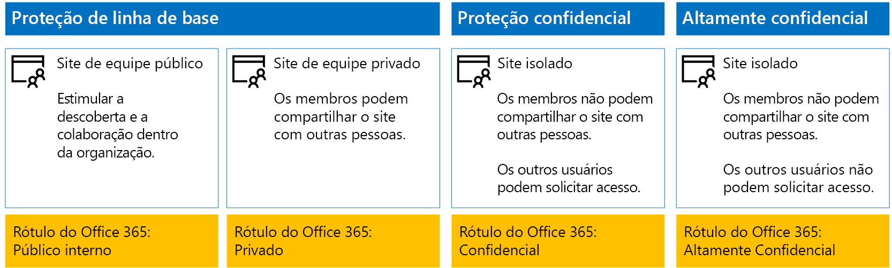
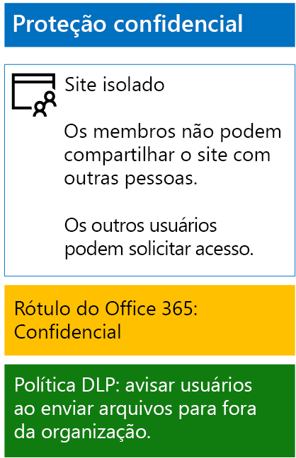
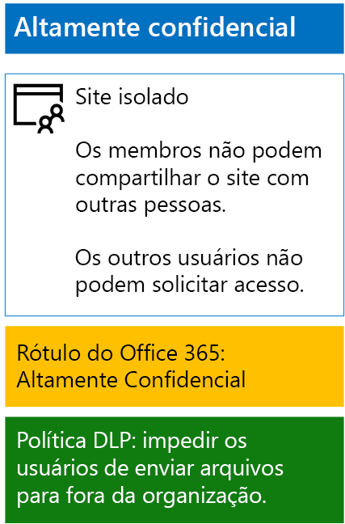

# <a name="protect-sharepoint-online-files-with-office-365-labels-and-dlp"></a>Proteger os arquivos do SharePoint Online com o Office 365 rótulos e DLP

 **Resumo:** Aplica Office 365 rótulos e dados perda prevention (DLP) políticas para sites de equipe do SharePoint Online com vários níveis de proteção das informações.
  
Use as etapas neste artigo para projetar e implantar o Office 365 rótulos e políticas DLP da linha de base, confidenciais e altamente confidenciais SharePoint Online para sites de equipe. Para obter mais informações sobre esses três camadas de proteção, consulte [arquivos e sites seguro do SharePoint Online](secure-sharepoint-online-sites-and-files.md).
  
## <a name="office-365-labels-for-your-sharepoint-online-sites"></a>Rótulos do Office 365 para seus sites do SharePoint Online

Existem três fases à criação e, em seguida, atribuir o Office 365 etiquetas aos sites de equipe do SharePoint Online.
  
### <a name="phase-1-determine-the-office-365-label-names"></a>Fase 1: Determinar os nomes de rótulo do Office 365

Nesta fase, você deve determinar os nomes de seus rótulos do Office 365 para os quatro níveis de proteção de informações aplicado a sites de equipe do SharePoint Online. A tabela a seguir lista os nomes recomendados para cada nível.
  
|**Nível de proteção de sites de equipe do SharePoint Online**|**Nome de rótulo**|
|:-----|:-----|
|Linha de base-públicos  <br/> |Público interno  <br/> |
|Linha de base-privado  <br/> |Particular  <br/> |
|Confidenciais  <br/> |Confidenciais  <br/> |
|Altamente confidenciais  <br/> |Altamente confidenciais  <br/> |
   
### <a name="phase-2-create-the-office-365-labels"></a>Fase 2: Criar os rótulos do Office 365

Nesta fase, você pode cria e publica seus determinados rótulos para os diferentes níveis de proteção das informações.
  
Para criar os rótulos, você pode usar o Centro de administração do Office 365 ou o Microsoft PowerShell.
  
### <a name="create-office-365-labels-with-the-office-365-admin-center"></a>Crie rótulos do Office 365 com o Centro de administração do Office 365

1. Entrar no portal do Office 365 com uma conta que tenha a função de administrador de segurança ou administrador da empresa. Para obter ajuda, consulte [Where entrar no Office 365](https://support.office.com/Article/Where-to-sign-in-to-Office-365-e9eb7d51-5430-4929-91ab-6157c5a050b4).
    
2. Na guia **Página inicial do Microsoft Office** , clique no lado do **Admin** .
    
3. Na guia novo **Centro de administração do Office** do seu navegador, clique em **centrais de Admin > segurança &amp; conformidade**.
    
4. Do novo **Home - segurança &amp; conformidade** guia do navegador, clique em **classificações > rótulos**.
    
5. Da **Home > rótulos** painel, clique em **criar um rótulo**.
    
6. No painel de **nome de seu rótulo** , digite o nome do rótulo e clique em **Avançar**.
    
7. No painel de **configurações de rótulo** , clique em **Avançar**.
    
8. No painel **Revise suas configurações** , clique em **criar este rótulo**e, em seguida, clique em **Fechar**.
    
9. Repita as etapas 5 a 8 para seus rótulos adicionais.
    
### <a name="create-office-365-labels-with-powershell"></a>Crie rótulos do Office 365 com o PowerShell

1. [Conectar para a segurança do Office 365 &amp; usando o PowerShell remoto do Centro de conformidade](http://go.microsoft.com/fwlink/?LinkID=799771&amp;clcid=0x409) e especifique as credenciais de uma conta que tenha a função de administrador de segurança ou administrador da empresa.
    
2. Preencher a lista de nomes de rótulo e, em seguida, execute estes comandos no prompt de comando do PowerShell:
    
  ```
  $labelNames=@(<list of label names, each enclosed in quotes and separated by commas>)
ForEach ($element in $labelNames){ New-ComplianceTag -Name $element }
  ```

Em seguida, execute estas etapas para publicar as novas etiquetas do Office 365.
  
1. Da **Home > rótulos** a segurança do painel &amp; Centro de conformidade, clique em **Publicar rótulos**.
    
2. No painel **Choose rótulos para publicar** , clique em **rótulos de escolher para publicar**.
    
3. No painel **Choose rótulos** , clique em **Adicionar** e selecione todas as quatro rótulos.
    
4. Clique em **concluído**.
    
5. No painel **Choose rótulos para publicar** , clique em **Avançar**.
    
6. No painel **Choose locais** , clique em **Avançar**.
    
7. No painel de **sua política de nome** , digite um nome para seu conjunto de etiquetas em **nome**e, em seguida, clique em **Avançar**.
    
8. No painel **Revise suas configurações** , clique em **rótulos de publicar**e, em seguida, clique em **Fechar**.
    
### <a name="phase-3-apply-the-office-365-labels-to-your-sharepoint-online-sites"></a>Fase 3: Aplicar os rótulos do Office 365 aos seus sites do SharePoint Online

Use estas etapas para aplicar os rótulos do Office 365 para as pastas de documentos dos sites de equipe do SharePoint Online.
  
1. Na guia **Página inicial do Microsoft Office** do seu navegador, clique no lado do **SharePoint** .
    
2. Na guia **SharePoint** nova no seu navegador, clique em um site que precisa de um rótulo do Office 365 atribuído.
    
3. Em uma nova guia de site do SharePoint do seu navegador, clique em **documentos**.
    
4. Clique no ícone configurações e clique em **definições da biblioteca**.
    
5. Em **permissões e gerenciamento**, clique em **rótulo aplicar a itens nessa biblioteca**.
    
6. Em **Configurações se aplicam rótulo**, selecione o rótulo apropriado e, em seguida, clique em **Salvar**.
    
7. Feche a guia para o site do SharePoint Online.
    
8. Repita as etapas 3 a 8 para atribuir o Office 365 rótulos aos seus sites do SharePoint Online adicionais.
    
Esta é a configuração resultante.
  

  
## <a name="dlp-policies-for-your-sharepoint-online-sites"></a>Políticas de DLP para seus sites do SharePoint Online

Use estas etapas para configurar uma política de DLP que notifica os usuários quando eles compartilham um documento em um site de equipe confidenciais SharePoint Online fora da organização.
  
1. Na guia **Página inicial do Microsoft Office** no seu navegador, clique no **segurança &amp; conformidade** lado a lado.
    
2. No novo **segurança &amp; conformidade** no seu navegador, clique em **prevenção de perda de dados > política**.
    
3. No painel de **prevenção de perda de dados** , clique em **+ para criar uma política**.
    
4. No **começar com um modelo ou criar uma política personalizada** painel, clique em **personalizado**e, em seguida, clique em **Avançar**.
    
5. No painel de **sua política de nome** , digite o nome para a política de DLP nível confidencial em **nome**e, em seguida, clique em **Avançar**.
    
6. No painel **Choose locais** , clique em **Deixe-me escolher locais específicos**e clique em **Avançar**.
    
7. Na lista de locais, desabilitar os locais de **contas do OneDrive** e de **email do Exchange** e clique em **Avançar**.
    
8. No painel de **Personalizar os tipos de informações confidenciais que você queira proteger** , clique em **Editar**.
    
9. No painel de **Escolher os tipos de conteúdo para proteger** , clique em **Adicionar** na caixa suspensa e, em seguida, clique em **rótulos**.
    
10. No painel de **rótulos** , clique em **+ Adicionar**, selecione o rótulo **confidenciais** , clique em **Adicionar**e, em seguida, clique em **concluído**.
    
11. No painel de **Escolher os tipos de conteúdo para proteger** , clique em **Salvar**.
    
12. No painel de **Personalizar os tipos de informações confidenciais que você queira proteger** , clique em **Avançar**.
    
13. No **o que você deseja fazer se podemos detectar informações confidenciais?** painel, clique em **Personalizar a dica e email**.
    
14. No painel de **dicas de política personalizar e notificações por email** , clique em **Personalizar o texto da dica de política**.
    
15. Na caixa de texto, digite ou cole o código a seguir:
    
  - Para compartilhar com um usuário fora da organização, baixe o arquivo e, em seguida, abri-lo. Clique em arquivo, em seguida, proteger documento e, em seguida, criptografar com senha e especifique uma senha forte. Envie a senha em um email separado ou outros meios de comunicação.
    
    Como alternativa, digite ou cole em seu próprio dica de política que instrua os usuários sobre como compartilhar um arquivo de fora da sua organização.
    
16. Clique em **OK**.
    
17. No **o que você deseja fazer se podemos detectar informações confidenciais?** painel, desmarque a caixa de seleção **bloquear pessoas de compartilhamento e restringir o acesso ao conteúdo compartilhado** e, em seguida, clique em **Avançar**.
    
18. No **você deseja ativar as coisas política ou teste out primeiro?** painel, clique em **Sim, ativá-lo imediatamente**e clique em **Avançar**.
    
19. No painel **Revise suas configurações** , clique em **criar**e, em seguida, clique em **Fechar**.
    
Aqui está a sua configuração resultante para sites de equipe do SharePoint Online confidenciais.
  

  
Em seguida, execute estas etapas para configurar uma política DLP que bloqueia usuários quando eles compartilham um documento em um site de equipe altamente confidenciais SharePoint Online fora da organização.
  
1. Na guia **Página inicial do Microsoft Office** no seu navegador, clique no **segurança &amp; conformidade** lado a lado.
    
2. No novo **segurança &amp; conformidade** no seu navegador, clique em **prevenção de perda de dados > política**.
    
3. No painel de **prevenção de perda de dados** , clique em **+ para criar uma política**.
    
4. No **começar com um modelo ou criar uma política personalizada** painel, clique em **personalizado**e, em seguida, clique em **Avançar**.
    
5. No painel de **sua política de nome** , digite o nome para a política de DLP nível altamente confidencial em **nome**e, em seguida, clique em **Avançar**.
    
6. No painel **Choose locais** , clique em **Deixe-me escolher locais específicos**e clique em **Avançar**.
    
7. Na lista de locais, desabilitar os locais de **contas do OneDrive** e de **email do Exchange** e clique em **Avançar**.
    
8. No painel de **Personalizar os tipos de informações confidenciais que você queira proteger** , clique em **Editar**.
    
9. No painel de **Escolher os tipos de conteúdo para proteger** , clique em **Adicionar** na caixa suspensa e, em seguida, clique em **rótulos**.
    
10. No painel de **rótulos** , clique em **+ Adicionar**, selecione o rótulo **Altamente confidenciais** , clique em **Adicionar**e, em seguida, clique em **concluído**.
    
11. No painel de **Escolher os tipos de conteúdo para proteger** , clique em **Salvar**.
    
12. No painel de **Personalizar os tipos de informações confidenciais que você queira proteger** , clique em **Avançar**.
    
13. No **o que você deseja fazer se podemos detectar informações confidenciais?** painel, clique em **Personalizar a dica e email**.
    
14. No painel de **dicas de política personalizar e notificações por email** , clique em **Personalizar o texto da dica de política**.
    
15. Na caixa de texto, digite ou cole o código a seguir:
    
  - Para compartilhar com um usuário fora da organização, baixe o arquivo e, em seguida, abri-lo. Clique em arquivo, em seguida, proteger documento e, em seguida, criptografar com senha e especifique uma senha forte. Envie a senha em um email separado ou outros meios de comunicação.
    
    Como alternativa, digite ou cole em seu próprio dica de política que instrua os usuários sobre como compartilhar um arquivo de fora da sua organização.
    
16. Clique em **OK**.
    
17. No **o que você deseja fazer se podemos detectar informações confidenciais?** painel, selecione **exigir uma justificativa comercial para substituir**e, em seguida, clique em **Avançar**.
    
18. No **você deseja ativar as coisas política ou teste out primeiro?** painel, clique em **Sim, ativá-lo imediatamente**e clique em **Avançar**.
    
19. No painel **Revise suas configurações** , clique em **criar**e, em seguida, clique em **Fechar**.
    
Aqui está a sua configuração resultante para sites de equipe do SharePoint Online alta confidencialidade.
  

  
## <a name="next-step"></a>Próxima etapa

[Proteger os arquivos do SharePoint Online com proteção de informações do Windows Azure](protect-sharepoint-online-files-with-azure-information-protection.md)
    
## <a name="see-also"></a>See Also

[Proteja arquivos e sites do SharePoint Online](secure-sharepoint-online-sites-and-files.md)
  
[Proteger sites do SharePoint Online em um ambiente de desenvolvimento e teste](secure-sharepoint-online-sites-in-a-dev-test-environment.md)
  
[Orientação de segurança da Microsoft para campanhas políticas, organizações sem fins lucrativos e outras organizações ágil](microsoft-security-guidance-for-political-campaigns-nonprofits-and-other-agile-o.md)
  
[Adoção da nuvem e soluções híbridas](cloud-adoption-and-hybrid-solutions.md)


