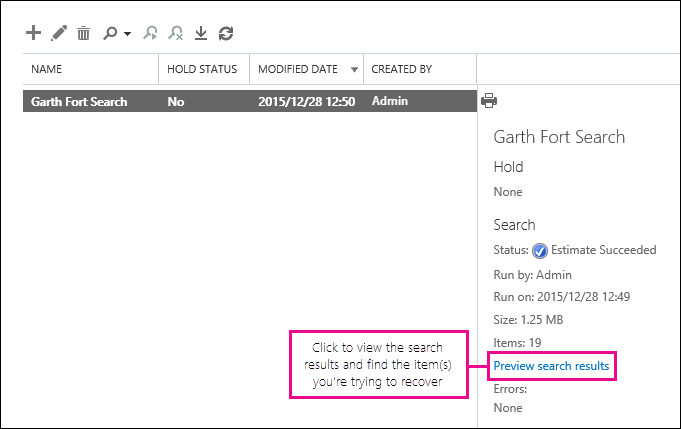

# Recuperar itens excluídos na caixa de correio do usuário – Ajuda para Administradores

**Neste artigo destina-se a administradores. Você está tentando recuperar itens excluídos em sua própria caixa de correio?** Tente um dos seguintes procedimentos:
- [Recuperar itens excluídos no Outlook para Windows](https://support.office.com/article/49e81f3c-c8f4-4426-a0b9-c0fd751d48ce)
- [Recuperar itens ou emails excluídos no Outlook Web App](https://support.office.com/article/c3d8fc15-eeef-4f1c-81df-e27964b7edd4)
- [Restaurar as mensagens de email excluídas no Outlook na web](https://support.office.com/article/a8ca78ac-4721-4066-95dd-571842e9fb11)
- [Outlook.com](https://go.microsoft.com/fwlink/p/?LinkID=623435)
   
Um usuário excluir de permanentemente a itens de suas caixas de correio do Outlook? O usuário deseja-los novamente, mas não é possível recuperá-los. Você pode conseguir recuperar os itens removidos se ainda não tiver sido removidos permanentemente da caixa de correio do usuário. Você pode fazer isso usando a ferramenta de descoberta eletrônica In-loco no Exchange Online para pesquisar por email excluído e outros itens — e como contatos, compromissos do calendário e tarefas — na caixa de correio do usuário. Se você encontrar os itens excluídos, você poderá exportá-los para um arquivo PST (também chamado de um arquivo de dados do Outlook), que o usuário pode usar para restaurar os itens de volta para suas caixas de correio.
  
Aqui estão as etapas para recuperar itens excluídos na caixa de correio do usuário. Quanto tempo isso levará? Na primeira vez pode levar 20 ou 30 minutos para ser concluído todas as etapas, dependendo de quantos itens que você está tentando recuperar.
  
> [!NOTE]
> Você precisa ser um **Administrador Global** no Office 365 ou um **administrador do Exchange** ou ser membro do grupo de funções de gerenciamento da organização no Exchange Online para executar as etapas neste artigo. Para obter mais informações, consulte [funções de administrador do Office 365](https://support.office.com/article/da585eea-f576-4f55-a1e0-87090b6aaa9d). 
  
## Etapa 1: Atribuir permissões de descoberta eletrônica para si mesmo

A primeira etapa é atribuir si mesmo as permissões necessárias no Exchange Online para que você pode usar a ferramenta de descoberta eletrônica In-loco para pesquisar caixa de correio do usuário. Você só precisa fazer isso vez. Se você tiver outra caixa de correio de pesquisa no futuro, você pode ignorar esta etapa.
  
1. [Onde fazer o login Office 365 para empresas](https://support.office.com/article/e9eb7d51-5430-4929-91ab-6157c5a050b4) com sua conta do trabalho ou da escola. 
    
2. Selecione o ícone do aplicativo iniciador  no canto esquerdo superior e clique em **Admin**.
    
3. No painel de navegação à esquerda no Centro de administração do Office 365, expanda **centrais de administração**e clique em **Exchange**.
    
    
  
4. No Centro de administração do Exchange, clique em **permissões**e clique em **funções de administrador**.
    
5. Na exibição de lista, selecione **Gerenciamento de descoberta**e clique em **Editar**.
    
    
  
6. No **Grupo de função**, em **membros**, clique em **Adicionar**.
    
7. Em **Selecionar membros**, selecione sozinho na lista de nomes, clique em **Adicionar**e, em seguida, clique em **Okey**.
    
    > [!NOTE]
    > Você também pode adicionar um grupo que você é um membro de, como o gerenciamento da organização ou TenantAdmins. Se você adicionar um grupo, outros membros do grupo serão atribuídos as permissões necessárias para executar a ferramenta de descoberta eletrônica In-loco. 
  
8. No **Grupo de função**, clique em **Salvar**.
    
9. Sair do Office 365.
    
    Você precisará sair antes de iniciar a próxima etapa para que as novas permissões entrarão em vigor.
    
> [!CAUTION]
> Membros do grupo de função de gerenciamento de descoberta podem acessar o conteúdo da mensagem confidenciais. Isso inclui a pesquisa de todas as caixas de correio em sua organização, visualizar os resultados da pesquisa (e outros itens de caixa de correio), copiando os resultados para uma caixa de correio de descoberta e exporte os resultados de pesquisa para um arquivo PST. 
  
[Return to top](recover-deleted-items-in-a-mailbox.md#__top)
  
## Etapa 2: Pesquisa de caixa de correio do usuário para itens excluídos

Quando você executa uma pesquisa de descoberta eletrônica In-loco, a pasta itens recuperáveis na caixa de correio que você pesquise automaticamente está incluída na pesquisa. A pasta itens recuperáveis é onde os itens excluídos permanentemente são armazenados até eles estão limpo (removida permanentemente) da caixa de correio. Portanto, se um item ainda não foram removido, você poderá encontrá-lo usando a ferramenta de descoberta eletrônica In-loco.
  
1. [Onde fazer o login Office 365 para empresas](https://support.office.com/article/e9eb7d51-5430-4929-91ab-6157c5a050b4) com sua conta do trabalho ou da escola. 
    
2. Selecione o ícone do aplicativo iniciador  no canto esquerdo superior e clique em **Admin**.
    
3. No painel de navegação à esquerda no Centro de administração do Office 365, expanda **Admin**e, em seguida, clique em **Exchange**.
    
4. No Centro de administração do Exchange, clique em **gerenciamento de conformidade**, clique em **Descoberta eletrônica In-loco &amp; mantenha**e, em seguida, clique em **novo**.
    
    
  
5. Na página **nome e descrição** , digite um nome para a pesquisa (por exemplo, o nome do usuário que você estiver recuperando o email para), uma descrição opcional e depois clique em **Avançar**.
    
6. Na página **caixas de correio** , clique em **especificar caixas de correio para pesquisar**e clique em **Adicionar**.
    
    
  
7. Encontre e selecione o nome do usuário que você estiver recuperando o email excluído para, clique em **Adicionar**e, em seguida, clique em **Okey**.
    
8. Clique em **Avançar**.
    
    A página de **consulta de pesquisa** é exibida. Isso é onde você define os critérios de pesquisa que ajudarão você a localizar os itens ausentes na caixa de correio do usuário. 
    
9. Na página **Consulta de pesquisa**, preencha os seguintes campos: 
    
  - **Incluir todo o conteúdo** Selecione essa opção para incluir todo o conteúdo na caixa de correio do usuário nos resultados da pesquisa. Se você selecionar essa opção, você não pode especificar critérios de pesquisa adicionais. 
    
  - **Filtro com base nos critérios** Selecione essa opção para especificar os critérios de pesquisa, incluindo palavras-chave, iniciar e encerrar datas, remetente e endereços de destinatário e tipos de mensagem. 
    
    
  
|**Campo**|**Use essa opção para...**|
|:-----|:-----|
|             |Especifique o intervalo de datas, palavras-chave, os destinatários e tipos de mensagem.    |
|             |Buscar mensagens com palavras-chave ou frases e use operadores lógicos, como **AND** ou **OR**.    |
|             |Procurar mensagens enviadas ou recebidas em um intervalo de datas.    |
|             |Pesquisar mensagens recebidas de ou enviados a pessoas específicas.    |
|             |Procurar todos os tipos de mensagem ou selecione aqueles específicos.    |
   
    > [!TIP]
    >  Here's a few tips about how to build a search query to find missing items. Try to get as much information from the user to help you create a search query so you can find what you're looking for. >  If you not sure how to find a missing message, consider using the **Include all content** option. The search results will include all items in the user's Recoverable Items folder, including the hidden folder (called the Purges folder) that contain items that have been purged by the user. Then you can go to Step 3, copy the results to a discovery mailbox, and look at the message in the hidden folder. >  If you know approximately when the missing message was originally sent or received by the user, use the **Specify start date** and **Specify end date** options to provide a date range. This will return all messages sent or received by the user within that date range. Specifying a date range is a really good way to narrow the search results. >  If you know who sent the missing email, use the **From** box to specify this sender. >  If you want to narrow the search results to different types of mailbox items, click **Select message types**, click **Select the message types to search**, and then choose a specific message type to search for. For example, you can search only for calendar items or contacts. Here's a screenshot of the different message types you can search for; the default is to search for all message types. 
  
    Click **Next** when you've completed the **Search query** page. 
    
10. Na página **configurações de bloqueio In-loco** , clique em **Concluir** para iniciar a pesquisa. Para recuperar o email excluído, não há motivo para colocar a caixa de correio do usuário em espera. 
    
    Depois de iniciar a pesquisa, o Exchange exibirá uma estimativa do tamanho total e o número de itens que retornarão na pesquisa com base nos critérios especificados por você.
    
11. Selecione a pesquisa que você acabou de criar e clique em **Atualizar** para atualizar as informações exibidas no painel de detalhes. O status **Estimativa Succeeded** indica que a pesquisa foi finalizada. Exchange também exibe uma estimativa do número total de itens (e seu tamanho) encontrados na pesquisa com base nos critérios de pesquisa que você especificou na etapa 9. 
    
12. No painel de detalhes, clique em **resultados da pesquisa de visualização** para exibir os itens encontrados. Isso pode ajudá-lo a identificar os itens que você está procurando. Se você encontrar os itens que você está tentando recuperar, vá para a etapa 4 para exportar os resultados da pesquisa para um arquivo PST. 
    
    
  
13. Se você não encontrar o que você está procurando, você pode revisar os critérios de pesquisa, selecionando a pesquisa, clicar em **Editar**e clicando em **consulta de pesquisa**. Alterar os critérios de pesquisa e, em seguida, execute novamente a pesquisa.
    
[Return to top](recover-deleted-items-in-a-mailbox.md#__top)
  
## (Opcional) Etapa 3: Copiar os resultados de pesquisa para uma caixa de correio de descoberta

Se você não puder encontrar uma itens visualizando os resultados da pesquisa, ou se você quiser ver quais itens estão na pasta de itens recuperáveis do usuário, em seguida, você pode copiar os resultados de pesquisa para uma caixa de correio especial (chamada de uma caixa de correio de descoberta) e abra essa caixa de correio do Outlook na web t o visualizar os itens reais. O melhor motivo para copiar os resultados de pesquisa é para que possa visualizar os itens na pasta de itens recuperáveis do usuário. Mais do que provável o item que você está tentando recuperar está localizado na subpasta limpezas. 
  
1. No Centro de administração do Exchange, vá até **gerenciamento de conformidade** \> **Descoberta eletrônica In-loco &amp; mantenha**.
    
2. Na lista de pesquisas, selecione a pesquisa que você criou na etapa 2.
    
3. Clique em **Pesquisar**e clique em **resultados da pesquisa de cópia** da lista suspensa. 
    
    
  
4. Na página **Resultados da pesquisa de cópia** , clique em **Procurar**.
    
    
  
5. Em **Nome para exibição**, clique em **Caixa de correio de pesquisa de descoberta**e clique em **Okey**.
    
    
  
    > [!NOTE]
    > A caixa de correio de pesquisa de descoberta é uma caixa de correio de descoberta padrão que é criada automaticamente na sua organização do Office 365. 
  
6. Volta na página **Resultados da pesquisa de cópia** , clique em **Copiar** para iniciar o processo para copiar os resultados da pesquisa para a caixa de correio de pesquisa de descoberta. 
    
    
  
7. Clique em **Atualizar** para atualizar as informações sobre o status de cópia que é exibido no painel de detalhes. 
    
8. Quando a cópia for concluída, clique em **Abrir** para abrir a caixa de correio de pesquisa de descoberta para exibir os resultados da pesquisa. 
    
    
  
    Os resultados da pesquisa copiados para a caixa de correio de pesquisa de descoberta são colocados em uma pasta que tem o mesmo nome que a pesquisa de descoberta eletrônica In-loco. Você pode clicar em uma pasta para exibir os itens nessa pasta.
    
    
  
    Quando você executa uma pesquisa, a pasta de itens recuperáveis do usuário também é pesquisada. Isso significa que se itens na pasta itens recuperáveis atendam aos critérios de pesquisa, eles são incluídos nos resultados da pesquisa. Os itens na pasta exclusões são itens que o usuário é excluído permanentemente (excluindo um item da pasta Itens excluídos ou selecionando-o e pressionando **Shift + Delete**. Um usuário pode usar a ferramenta de recuperar itens excluídos no Outlook ou no Outlook na web para recuperar itens na pasta exclusões. Na pasta limpezas são itens que o usuário removido usando a ferramenta de recuperar itens excluídos ou itens que eles foram removidos automaticamente por uma política aplicada à caixa de correio. Em ambos os casos, apenas um administrador pode recuperar itens na pasta limpezas. 
    
    > [!TIP]
    > Se um usuário não puder encontrar um item excluído, usando a ferramenta de itens recuperáveis, mas que o item ainda é recuperável (o que significa que ele não tenha sido removido permanentemente da caixa de correio), ele é mais do que provável localizado na pasta limpezas. Assim, certifique-se de examinar na pasta limpezas para o item excluído que você está tentando recuperar de um usuário. 
  
[Return to top](recover-deleted-items-in-a-mailbox.md#__top)
  
## Etapa 4: Exportar os resultados da pesquisa para um arquivo PST

Após localizar o item que você está tentando recuperar para um usuário, a próxima etapa é exportar os resultados de pesquisa que você executou na etapa 2 para um arquivo PST. O usuário usará esse arquivo PST na próxima etapa para restaurar o item excluído para suas caixas de correio.
  
1. No Centro de administração do Exchange, vá até **gerenciamento de conformidade** \> **Descoberta eletrônica In-loco &amp; mantenha**.
    
2. Na lista de pesquisas, selecione a pesquisa que você criou na etapa 2.
    
3. Clique em **Exportar para um arquivo PST**.
    
    
  
4. Se você for solicitado a instalar a ferramenta de exportação de descoberta eletrônica, clique em **Executar**.
    
5. Na ferramenta de exportação de PST descoberta eletrônica, clique em **Procurar** para especificar o local onde você deseja baixar o arquivo PST. 
    
    
  
    Você pode ignorar as opções para habilitar a eliminação da duplicação e incluir itens não pesquisáveis.
    
6. Clique em **Iniciar** para baixar o arquivo PST em seu computador. 
    
    A **ferramenta de exportação de PST de descoberta eletrônica** exibe informações de status sobre o processo de exportação. Quando a exportação estiver concluída, você pode acessar o arquivo no local onde ele foi baixado. 
    
[Return to top](recover-deleted-items-in-a-mailbox.md#__top)
  
## Etapa 5: Restaurar os itens recuperados à caixa de correio do usuário

A etapa final é usar o arquivo PST que foi exportado na etapa 4 para restaurar os itens recuperados à caixa de correio do usuário. Após enviar o arquivo PST para o usuário, o restante desta etapa é executado pelo usuário para abrir o arquivo PST e, em seguida, mover os itens recuperados para outra pasta em suas caixas de correio. Para obter instruções passo a passo, você também pode enviar ao usuário um link para este tópico: [Abrir e fechar arquivos de dados do Outlook (. pst)](https://support.office.com/article/381b776d-7511-45a0-953a-0935c79d24f2). Ou você pode enviar ao usuário um link para a seção [restaurar itens excluídos para uma caixa de correio usando um arquivo PST](recover-deleted-items-in-a-mailbox.md#restoredeleteditems) abaixo e pedir-lhe que executar estas etapas. 
  
 **Enviar um arquivo PST para o usuário**
  
A etapa final que você precisa executar está enviando o arquivo PST que foi exportado na etapa 4 para o usuário. Existem algumas maneiras de se fazer isso:
  
- Anexe o arquivo PST a uma mensagem de email. Se o Outlook é configurado para bloquear PST arquivos, você terá o arquivo zip e, em seguida, anexá-lo à mensagem. Veja como:
    
1. No Windows Explorer ou o Gerenciador de arquivos, navegue até o arquivo PST.
    
2. O arquivo do mouse em e selecione **Enviar para** \> **Compressed folder (compactado)**. O Windows cria um novo arquivo zip e lhe atribui um nome idêntico como o arquivo PST.
    
3. Anexe o arquivo PST compactado a uma mensagem de email e enviá-la ao usuário, que então pode descompactar o arquivo apenas clicando nele.
    
- Copie o arquivo PST para uma pasta compartilhada que o usuário pode acessar e recuperá-la.
    
As etapas na próxima seção são realizadas pelo usuário para restaurar os itens excluídos para suas caixas de correio.
  
 **Restaurar itens excluídos para uma caixa de correio usando um arquivo PST**
  
Você precisa usar o aplicativo de área de trabalho do Outlook para restaurar um item excluído, usando um arquivo PST. Você não pode usar o Outlook Web App ou Outlook na web para abrir um arquivo PST.
  
1. No Outlook 2013 ou 2016 do Outlook, clique na guia **arquivo** . 
    
2. Clique em **Open &amp; exportar**e clique em **Abrir arquivo de dados do Outlook**.
    
3. Navegue até o local onde você salvou o arquivo PST enviada pelo administrador.
    
4. Selecione o arquivo PST e, em seguida, clique em **Abrir**.
    
    O arquivo PST aparece na barra de navegação da esquerda no Outlook.
    
    
  
5. Clique nas setas para expandir o arquivo PST e as pastas nela para localizar o item que você deseja recuperar.
    
    
  
    > [!TIP]
    > Procure na pasta limpezas para o item que você deseja recuperar. Esta é uma pasta oculta que removidos para os itens serão movidos. Provavelmente é o item que o administrador recuperado é nesta pasta. 
  
6. Com o botão direito do item que você deseja recuperar e, em seguida, clique em **Mover** \> **Outra pasta**.
    
    
  
7. Para mover o item para sua caixa de entrada, clique em **caixa de entrada**e, em seguida, clique em **Okey**.
    
    **Dica:** Para recuperar outros tipos de itens, siga um destes procedimentos: 
    
  - Para recuperar um item do calendário, clique sobre ela e, em seguida, clique em **Mover** \> **Outra pasta** \> **calendário**.
    
  - Para recuperar um contato, clique sobre ela e, em seguida, clique em **Mover** \> **Outra pasta** \> **Contatos**.
    
  - Para recuperar uma tarefa, clique sobre ela e, em seguida, clique em **Mover** \> **Outra pasta** \> **tarefas**.
    

  
    Note that calendar items, contacts, and tasks are located directly in the Purges folder, and not in a Calendar, Contacts, or Tasks subfolder. However, you can sort by **Type** to group similar types of items. 
    
8. Quando tiver terminado de recuperar itens excluídos, com o botão direito na barra de navegação da esquerda e selecione **Fechar "nome do arquivo PST"** arquivo PST.
    
[Voltar ao início](recover-deleted-items-in-a-mailbox.md#__top)
  
## Mais informações

- Talvez seja possível que um usuário recuperar um item excluído permanentemente, se o período de retenção de itens excluídos para o item não tiver expirado. Como um administrador, que talvez você tenha especificados quanto tempo os itens na pasta itens recuperáveis estão disponíveis para recuperação. Por exemplo, pode haver uma política que exclui qualquer coisa que está na pasta Itens excluídos de um usuário por 30 dias e outra política que permite aos usuários recuperar itens na pasta itens recuperáveis para até outro 14 dias. No entanto, após este 14 dias, você ainda poderá recuperar um item na caixa de correio de um usuário usando os procedimentos neste tópico.
    
- Os usuários podem recuperar um item excluído, se ele ainda não foram removido e se o período de retenção de itens excluídos para que o item não tiver expirado. Para ajudar os usuários a recuperar itens excluídos em suas caixas de correio, apontá-los para um dos seguintes tópicos:
    
  - [Recuperar itens excluídos no Outlook para Windows](https://support.office.com/article/49e81f3c-c8f4-4426-a0b9-c0fd751d48ce)
    
  - [Recuperar itens excluídos no Outlook 2010](https://support.office.com/article/cd9dfe12-8e8c-4a21-bbbf-4bd103a3f1fe)
    
  - [Recuperar itens ou emails excluídos no Outlook Web App](https://support.office.com/article/c3d8fc15-eeef-4f1c-81df-e27964b7edd4)
    
  - [Restaurar as mensagens de email excluídas no Outlook na web](https://support.office.com/article/a8ca78ac-4721-4066-95dd-571842e9fb11)
    
  - [Recuperar um contato excluído no Outlook](https://support.office.com/article/51c83288-6888-4dcd-8c99-4932daabf643)
    
  - [Restaurar as mensagens de email excluídas no Outlook.com](https://go.microsoft.com/fwlink/p/?LinkID=623435)
    
[Return to top](recover-deleted-items-in-a-mailbox.md#__top)
  

