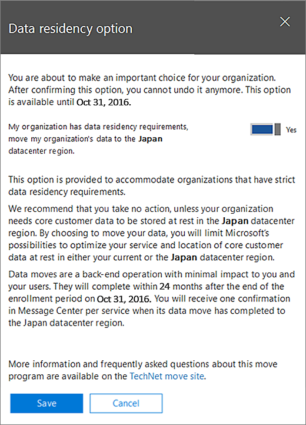

# Como solicitar a migração dos dadosHow to request your data move

> [!NOTE]
> As informações nesta página só se aplica aos clientes que tinham locatários existentes do Office 365, antes que os datacenters novos em seu geo iniciado.The information on this page only applies to customers who had existing Office 365 tenants before the new datacenters in their geo launched. 
  
Os clientes existentes do Office 365 precisará enviar uma solicitação antes do prazo para seu país para que os dados do cliente dos seus serviços do Office 365 participantes movidos para sua nova geo.Existing Office 365 customers will need to submit a request before the deadline for their country in order to have the customer data of their participating Office 365 services moved to their new geo. 
  
Estamos não consegue aceitar solicitações a serem movidos depois do prazo em cada geo.We are unable to accept requests to be moved after the deadline in each geo. 
  
## Quando solicitar uma movimentação?When can I request a move?

|**Clientes com o endereço de cobrança****Customers with billing address in**|**Solicitar o período começa****Request period begins**|**Prazo final de solicitação****Request deadline**|
|:-----|:-----|:-----|
|JapãoJapan    |1 de agosto de 2016August 1, 2016    |31 de outubro de 2016October 31, 2016    |
|Austrália, Nova Zelândia, FijiAustralia, New Zealand, Fiji    |1 de agosto de 2016August 1, 2016    |31 de outubro de 2016October 31, 2016    |
|ÍndiaIndia    |1 de agosto de 2016August 1, 2016    |31 de outubro de 2016October 31, 2016    |
|CanadáCanada    |1 de agosto de 2016August 1, 2016    |31 de outubro de 2016October 31, 2016    |
|Reino UnidoUnited Kingdom    |15 de março de 2017March 15, 2017    |15 de setembro de 2017September 15, 2017    |
|Coreia do SulSouth Korea    |1 de maio de 2017May 1, 2017    |31 de outubro de 2017October 31, 2017    |
|FrançaFrance    |14 de março de 2018March 14, 2018    |15 de setembro de 2018September 15, 2018    |
   
## Como solicitar uma movimentaçãoHow to request a move

> [!NOTE]
> Essa opção só está disponível no Centro de administração do Office 365 Preview. Para obter instruções sobre como acessar esse, consulte [Office 365 para empresas - ajuda de Admin](https://aka.ms/365admin). Todas as solicitações para movimentações precisam ser feito por meio do Centro de administração do Office 365. Suporte não será capaz de fazer essa seleção para você ou substituir sua seleção.This option is only available on the Office 365 admin center Preview. For instructions on how to access this, see [Office 365 for business - Admin Help](https://aka.ms/365admin). All requests for moves need to be done through the Office 365 admin center. Support will not be able to make this selection for you or override your selection. 
  
Os clientes qualificados verão uma página no seu [Centro de administração do Office 365](https://aka.ms/365admin), que lhes permitirão solicitar que os dados dos clientes de núcleo movidos para a sua nova região de datacenter.Eligible customers will see a page in their [Office 365 Admin Center](https://aka.ms/365admin), which will allow them to request to have their core customer data moved to their new datacenter region.  
  
Para acessar a página no Centro de administração do Office 365, no painel de navegação à esquerda, expanda **configurações**e clique em **Perfil da organização**.To access the page in the Office 365 admin center, in the navigation pane on the left, expand **Settings**, and then click **Organization Profile**.
  

  
Na página **Perfil da organização** , role até a seção **Opção de residência de dados** .On the **Organization Profile** page, scroll down to the **Data Residency Option** section. 
  

  
**Você não pode ver nesta seção se aplicar por um dos seguintes**:**You may not see this section if one of the following apply**:
- Seu locatário não está qualificado para o programa de movimentação.Your tenant is not eligible for the move program. 
- Todos os seus dados já estão localizados no novo geo (consulte a seção de dados local da página).All of your data is already located in the new geo (see Data Location section of the page). 
  
> [!IMPORTANT]
> **Você vai fazer uma escolha importante para sua organização. Após confirmar a opção a seguir, você não pode desfazê-lo. Suporte é não é possível reverter essa decisão também.****You are about to make an important choice for your organization. After confirming the option below, you cannot undo it. Support is unable to reverse this decision as well.**
  
Se sua organização tem requisitos de residência de dados, e você precisa solicitar uma movimentação, clique em **Editar** na parte superior direita da seção. Uma nova seção aparecerá no lado direito da tela que explica os detalhes do programa de movimentação. Selecione o botão de alternância ao lado do texto que diz **Sim, minha organização tem requisitos de residência de dados**. Em seguida, clique em **Salvar**.If your organization has data residency requirements, and you need to request a move, click **Edit** on the top right of the section. A new section will appear on the right side of your screen explaining the details of the move program. Select the toggle button next to the text that says **Yes, my organization has data residency requirements**. Then, click **Save**.
  

  
Você deve ver o texto sobre a alteração da seção de **Dados residência opção** para indicar **sua organização solicitou para mover dados de cliente seu core.** Você também terá uma mensagem de confirmação no Centro de sua mensagem. Isso confirma que você solicitou uma movimentação com êxito.You should see the text on the **Data Residency Option** section change to indicate **Your organization has requested to move its core customer data.** You'll also have a confirmation message in your message center. This confirms that you have successfully requested a move. 

  
## O que acontece após a solicitação de movimento?What happens after requesting a move?

Após a solicitação de movimento, podemos planeja mover você rapidamente nossas restrições operacionais permitem. Devido à natureza imprevisível de muitas das restrições, podemos não pode compartilhar uma data específica ou intervalo de tempo para as movimentações. Depois que a movimentação for concluída, você verá uma notificação.After requesting a move, we will plan to move you as quickly as our operational constraints allow for. Due to the unpredictable nature of many of the constraints, we cannot share a specific date or timeframe for the moves. You will see a notification after the move has completed.
  
Movimentações podem demorar até 24 meses a partir do prazo de solicitação para o seu país concluir.Moves may take up to 24 months from the request deadline for your country to complete.
  
Após a solicitação de uma movimentação, não é possível alterar sua seleção conforme começamos processar as movimentações, já que você fez a solicitação.After requesting a move, it is not possible to change your selection as we begin to process the moves once you have made the request.
  
## Microsoft TeamsMicrosoft Teams

Microsoft Teams ainda não dá suporte para migração de conteúdo do cliente em repouso na região para centros de dados de país onde residência de dados for Microsoft Teams está disponível.  Portanto, somente os novos clientes terão todos os seus dados armazenados no país nas novas regiões onde Teams Microsoft suporta residência de dados.  Saiba mais sobre o Office 365 residência de dados para o seu local de empresa no [onde estão seus dados localizados?](https://office/com/datamaps)Microsoft Teams does not yet support migration of customer content at rest from in-region to in-country data centers where data residency for Microsoft Teams is available.  Therefore, only new customers will have all of their data stored within country in the new regions where Microsoft Teams supports data residency.  Learn more about Office 365 data residency for your company location at [Where is your data located?](https://office/com/datamaps)   

## Ações opcionais antes de você solicitar uma movimentaçãoOptional actions before you request a move

Execute as etapas a seguir conforme apropriado.Perform the following steps as appropriate.
  
### Se você usar um firewall com base em IP, adicionar regras para os novos endereços IP de permissãoIf you use an IP-based firewall, add allow rules for the new IP addresses

É recomendável usar a filtragem para firewalls, em vez de endereços IP de DNS. Não há nenhuma novas entradas DNS necessárias.We recommend using DNS filtering for firewalls instead of IP addresses. There are no new DNS entries required.
  
Se você usar um firewall com base em IP para conectividade de Internet, você deve adicionar regras para os novos endereços IP para o destino datacenter geo de permissão. Endereços IP para o novo geos datacenter além dos novos servidores continuamente são adicionados ao [Office 365 URLs e intervalos de endereço IP](https://go.microsoft.com/fwlink/p/?LinkId=229631).If you use an IP-based firewall for Internet connectivity, you must add allow rules for the new IP addresses for the destination datacenter geo. IP addresses for new datacenter geos in addition to new servers are continuously added to [Office 365 URLs and IP Address Ranges](https://go.microsoft.com/fwlink/p/?LinkId=229631).
  
Consultar a documentação do firewall para obter informações sobre como adicionar permitir regras (também conhecidas como lista de exceções.)Consult your firewall documentation for information about how to add allow rules (also known as whitelisting.)
  
Após adicionar endereços IP, você deseja testar a conectividade com o novo geo datacenter. Para fazer isso, recomendamos que você criar um locatário da [nova versão gratuita de avaliação de 30 dias](https://go.microsoft.com/fwlink/?LinkId=522463) , assim que o novo geo datacenter está disponível.After adding IP addresses, you may want to test connectivity to the new datacenter geo. To do this, we recommend creating a [new free 30-day trial](https://go.microsoft.com/fwlink/?LinkId=522463) tenant as soon as the new datacenter geo is available. 
  
### Testar usando um novo inquilinoTest using a new tenant

Se você quiser testar a conectividade antes da movimentação, você pode configurar um [novo inquilino de avaliação de 30 dias gratuito](https://go.microsoft.com/fwlink/?LinkId=522463) depois que o novo geo datacenter está disponível e usá-lo para experimentar o Office 365 hospedados no novo geo datacenter.If you'd like to test connectivity prior to the move, you can set up a [new free 30-day trial tenant](https://go.microsoft.com/fwlink/?LinkId=522463) after the new datacenter geo is available, and use it to experience Office 365 hosted in the new datacenter geo. 
  
O inquilino avaliação não pode ser combinado com seu locatário existente:The trial tenant can't be combined with your existing tenant:
  
- Os usuários devem usar uma conta separada de avaliação para seus testes.Users must use a separate trial account for their testing.
    
- Não há um meio para mover dados entre locatários.There is no way to move data between tenants.
    
### Notificar os usuários a atualizarem desatualizadas configurações do Exchange em dispositivos móveisNotify users to update out-of-date Exchange settings on mobile devices

Se os usuários têm um dispositivo móvel com o Exchange Server definida como **m.outlook.com** ou **podxxxxx.outlook.com**, recomendamos que elas alternam para **outlook.office365.com**, seguindo as instruções em [Set up um dispositivo móvel para sincronizar com a sua conta](https://support.office.com/article/c9139caf-01ab-41a0-827c-3c06ee569ed3).If users have a mobile device with the Exchange Server set to **m.outlook.com** or **podxxxxx.outlook.com**, we recommend that they switch to **outlook.office365.com**, following the instructions in [Set up a mobile device to synchronize with your account](https://support.office.com/article/c9139caf-01ab-41a0-827c-3c06ee569ed3).
  

