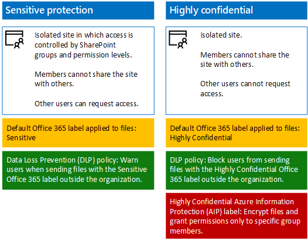

# Proteger sites de equipe do SharePoint Online para os ativos altamente confidenciais

 **Resumo:** Como proteção confidencial da Contoso implementada e altamente confidenciais SharePoint Online sites de equipe para colaboração mais fácil, embora segura, para executivos e seus centros de pesquisa.
  
A liderança executiva da Contoso deseja usar o Office 365 e armazenar os arquivos em um único local para colaboração, independentemente de onde um executivo pode ser. Da mesma forma, os departamentos de pesquisa da Contoso — com divisões em Paris, Moscou, Nova York, Pequim e Bangalore — gostaria de fazer a transição de seus ativos digitais do local para a nuvem para facilitar o acesso e colaboração mais vulnerável entre equipes.
  
No entanto, em ambos os casos, o acesso a esses recursos deve ser restrito ao subconjunto de pessoas que têm permissão para exibir ou alterá-los, com permissões em andamento para o site administrado pela equipe de TI. Além disso, mesmo se alguns recursos são intencionalmente ou não distribuído, eles deverão ser criptografados e tem permissões para impedir aqueles que não têm acesso para exibir ou alterar seu conteúdo.
  
Os administradores de segurança e o SharePoint em Contoso do departamento de TI decidiu usar proteção confidencial e altamente confidenciais sites de equipe do SharePoint Online, conforme mostrado na Figura 1.
  
**Figura 1: Comparação de proteção confidencial e altamente confidenciais sites de equipe do SharePoint Online**

  
A Contoso usou estas etapas para criar sites de equipe do SharePoint Online seguras para seus executivos e equipes de pesquisa:
  
1. Criar um site de equipe ' **executivos** confidencial SharePoint Online
    
    O novo site de equipe usa grupos existentes do Windows Azure AD (Active Directory) para executivos como membros com o nível de permissão do SharePoint editar e um pequeno conjunto de contas de administrador do SharePoint como proprietários com o nível de permissão Controle total.
    
2. Migrar os arquivos de executivos
    
    Mova o local executivo arquivos e pastas existentes para o novo site de equipe executivos SharePoint Online.
    
3. Criar um site de equipe ' **Research** altamente confidencial SharePoint Online
    
    O novo site de equipe usa grupos existentes de equipe de pesquisa Azure AD como membros com o nível de permissão de edição e um pequeno conjunto de contas de administrador do SharePoint como proprietários com o nível de permissão Controle total. Um rótulo AIP atribuído a pesquisa de arquivos garante que eles são criptografados e apenas membros de um grupo de pesquisa podem abri-los.
    
4. Migrar os arquivos de pesquisa
    
    Mova a equipe de pesquisa existente no local arquivos e pastas para o novo site de equipe de pesquisa do SharePoint Online.
    
O resultado é dois sites de colaboração cujo acesso hermeticamente é controlado por segurança e administradores do SharePoint. Para arquivos com o rótulo altamente confidenciais AIP, mesmo que elas sejam distribuídas fora o site de equipe de pesquisa, eles são criptografados e só podem ser abertos por um membro de uma equipe de pesquisa.
  
Para obter mais informações, consulte [arquivos e sites seguro do SharePoint Online](https://docs.microsoft.com/microsoft-365-enterprise/secure-sharepoint-online-sites-and-files).
  
 Para definir isso para esse demonstração, prova de conceito ou desenvolvimento e teste, consulte [sites seguro do SharePoint Online em um ambiente de desenvolvimento e teste](https://docs.microsoft.com/microsoft-365-enterprise/secure-sharepoint-online-sites-dev-test).
  
## Veja também

[Cenários empresariais para a Contoso Corporation](enterprise-scenarios-for-the-contoso-corporation.md)
  
[Contoso na Microsoft Cloud](contoso-in-the-microsoft-cloud.md)
  
[Recursos de arquitetura de TI do Microsoft](microsoft-cloud-it-architecture-resources.md)

[Alongar para o banco de dados](https://msdn.microsoft.com/library/dn935011.aspx)
  
[Roteiro do Enterprise Cloud da Microsoft: recursos para responsáveis pelas decisões de TI](https://sway.com/FJ2xsyWtkJc2taRD)

