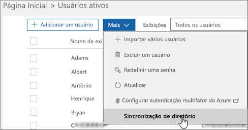

# Configurar a sincronização de diretório com o Office 365
O Office 365 usa o serviço de gerenciamento de identidade de usuário baseada em nuvem do Azure Active Directory para gerenciar usuários. Também é possível integrar seu Active Directory no local com o Azure AD por meio da sincronização seu ambiente local com o Office 365. Depois que você configurar a sincronização você pode optar por ter sua autenticação de usuário ocorra dentro do Azure AD ou em seu diretório local.
  
## Sincronização de diretórios do Office 365
Você pode usar a identidade sincronizada ou identidade federada entre sua organização local e o Office 365. Com identidade sincronizada, você gerenciar seus usuários locais e eles são autenticados pelo Windows Azure AD quando eles usam a mesma senha na nuvem como local. Esse é o cenário mais comum de sincronização de diretório. Autenticação de passagem ou identidade federada, permite que você gerencie seus usuários locais e eles são autenticados por seu diretório local. Identidade federada requer configuração adicional e permite que os usuários entrar somente uma vez. Para obter detalhes, leia [Understanding Office 365 Identity e o Azure Active Directory](about-office-365-identity.md).
  
## Você deseja atualizar de sincronização do Windows Azure Active Directory (DirSync) para conectar do Azure Active Directory?
Se você está usando no momento DirSync e deseja atualizar, vá direto [Azure.com](https://azure.com) para [obter instruções de atualização](https://go.microsoft.com/fwlink/p/?LinkId=733240).
  
## Conecte-se os pré-requisitos para o Azure AD.
Você obtém uma assinatura gratuita do Azure AD com sua assinatura do Office 365. Quando você configura a sincronização de diretório, você instalará conectar do Azure Active Directory em um dos servidores no local.
  
Para o Office 365, você precisará:
  
- Verifique se o seu domínio local (o procedimento orientará você isso).
- Ter permissões de [atribuir funções de administrador no Office 365 para empresas](https://support.office.com/article/EAC4D046-1AFD-4F1A-85FC-8219C79E1504) para seu locatário do Office 365 e o Active Directory local. 
    
Para seu servidor local no qual você instalou Connect do Azure AD, você precisará os seguintes softwares:
  
|**Sistema operacional de servidor**|**Outro software**|
|:-----|:-----|
|**Windows Server 2012 R2** | -PowerShell é instalado por padrão, nenhuma ação é necessária.    -Net 4.5.1 e versões posteriores são oferecidos pelo Windows Update. Verifique se que você instalou as atualizações mais recentes para o Windows Server, no painel de controle. |
|**Windows Server 2008 R2 com Service Pack 1 (SP1)** ou o **Windows Server 2012** | -A versão mais recente do PowerShell está disponível no Windows Management Framework 4.0. Procure no [Centro de Download da Microsoft](https://go.microsoft.com/fwlink/p/?LinkId=717996).  -.net 4.5.1 e versões posteriores estão disponíveis no [Centro de Download da Microsoft](https://go.microsoft.com/fwlink/p/?LinkId=717996). |
|**Windows Server 2008** | -A última versão suportada do PowerShell está disponível no Windows Management Framework 3.0, disponível no [Centro de Download da Microsoft](https://go.microsoft.com/fwlink/p/?LinkId=717996).    -.net 4.5.1 e versões posteriores estão disponíveis no [Centro de Download da Microsoft](https://go.microsoft.com/fwlink/p/?LinkId=717996). |
   
> [!NOTE]
> Se você estiver usando o Windows Azure Active Directory DirSync, o número máximo de membros do grupo de distribuição que você pode sincronizar a partir de seu local no Active Directory para o Windows Azure Active Directory é 15.000. Para conectar do Azure AD, esse número é 50.000. 
  
Para revisar mais cuidadosamente o hardware, software, a conta e requisitos de permissões, requisitos de certificado SSL e limites de objeto para conectar do Azure AD, leia [os pré-requisitos para conectar do Azure Active Directory](https://go.microsoft.com/fwlink/p/?LinkId=716896).
  
Você também pode revisar o Azure Connect da AD [histórico de versão de lançamento](https://go.microsoft.com/fwlink/p/?LinkId=733238) para ver o que é incluído e corrigido em cada versão. 

## Para configurar a sincronização de diretório
1. Faça logon no Centro de administração do Office 365 e escolha **usuários** \> **Usuários ativos** no painel de navegação esquerdo. 
2. No Centro de administração do Office 365, na página **usuários ativos** , escolha * * mais * * \> **sincronização de diretórios**.
    
    
  
3. Sobre o * * é sincronização de diretório adequados para você? * * página, as duas primeiras escolhas de **1 a 10**e **11 e 50** resultados em "com base no tamanho da sua organização, recomendamos que você crie e gerencie usuários na nuvem. Usando a sincronização de diretório fará sua instalação mais complexos. Vá para usuários ativos para adicionar seus usuários." 
    
    - No entanto, ainda assim, pode continuar configurando a sincronização de diretórios, escolhendo **aqui continuar** na parte inferior da página. 
    
    - Se você selecionar as duas opções de últimas, **51-250** ou **251 ou posterior**, a configuração de sincronização recomendará a sincronização de diretórios. Escolha **próximo** para continuar. 
    
    
  
4. Sobre a **sincronização de diretório local com a nuvem**, leia as informações e se você quiser obter mais informações, escolha a Saiba mais link que leva a: [preparar para provisionar usuários por meio da sincronização de diretório para o Office 365](prepare-for-directory-synchronization.md)e escolha **Avançar **. 
    
5. Na página **vamos verificar seu diretório** , examine os requisitos para a verificação automática de seu diretório. Se você atende aos requisitos, escolha **próximo** \> **Iniciar verificação**. Se você não puder atender os requisitos, você ainda pode continuar escolhendo **continuar manualmente**.
    
    
  
6. Se você selecionar para examinar seus diretórios, escolha **Iniciar exame** na página **avaliando a configuração de sincronização de diretório** . 
    
    Siga as instruções para baixar e executar a verificação.
    
7. Uma vez concluída a varredura, voltar para o Assistente de configuração e escolha **próximo** para ver os resultados do exame. 
    
8. Verifique se seus domínios, como instruído na página **Verifique se a propriedade de seus domínios** . Para obter instruções detalhadas, consulte [criar registros DNS para Office 365 ao gerenciar seus registros DNS](https://support.office.com/article/b0f3fdca-8a80-4e8e-9ef3-61e8a2a9ab23).
    
    > [!IMPORTANT]
    > Depois de adicionar um registro TXT para verificar se que você é proprietário de seu domínio, não são encaminhadas para a próxima etapa de adição de usuários no Assistente de domínios. A sincronização de diretório adicionará os usuários para você. 
  
    Retornar à página de **Configuração do Office 365** e escolha **atualização**
    
    
  
9. Na página **seus domínios estiver prontos** , escolha **Avançar**.
    
10. Na página **Limpar o seu ambiente** , opcionalmente, siga as instruções para baixar o IDFix para verificar seu Active Directory. Escolha **próximo** para continuar. 
    
11. Sobre o * * execute Azure Active Directory Connect * * página, escolha o **Download** para instalar o Assistente de conectar do Azure AD. 
    
    > [!NOTE]
    > Neste ponto, você será no Assistente para conectar do Azure AD. Verifique se que você deixar a página Assistente de sincronização de diretório que estava na abertura no seu navegador, portanto é possível retornar a ela, depois de concluir as etapas de conectar do Azure AD. 
  
    Depois de conectar do Azure AD wizard instalou será aberto automaticamente. Você também pode abri-lo da sua área de trabalho, o local de instalação padrão. Siga as instruções do assistente dependendo do cenário:
    
  - Sincronização de diretórios com a sincronização de hash de senha, use a [opção conectar AD Azure com configurações express](https://go.microsoft.com/fwlink/p/?LinkID=698537).
    
  - Para várias florestas, autenticação de passagem, identidade federada e opções de SSO, use o [sinalizador instalação do Windows Azure AD conectar](https://go.microsoft.com/fwlink/p/?LinkId=698430).
    
    Selecione **Personalizar** , na página **Configurações Express** para usar essas opções. 
    
12. Depois que o Assistente de conectar do Azure AD for concluído, voltar para o Assistente de **Instalação do Office 365** e siga as instruções na **tornar a sincronização se funcionou conforme esperada página**. Escolha **próximo** para continuar. 
    
13. Leia as instruções sobre o * * ativar usuários * * página e escolha **Avançar**.
    
14. Escolha **Concluir** na página **estiver toda a configuração** . 
    
## Atribuir licenças aos usuários sincronizados
Depois de você ter sincronizado seus usuários para o Office 365, são criados, mas você precisa atribuir licenças a eles para que possam usar os recursos do Office 365, como email. Para obter instruções, consulte [Atribuir licenças aos usuários no Office 365 para empresas](https://support.office.com/article/997596b5-4173-4627-b915-36abac6786dc).
    
## Concluir a configuração domínios
Siga as etapas em [criar registros DNS para Office 365 ao gerenciar seus registros DNS](https://support.office.com/article/b0f3fdca-8a80-4e8e-9ef3-61e8a2a9ab23) para terminar de configurar seus domínios.