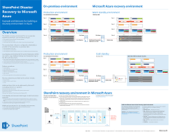
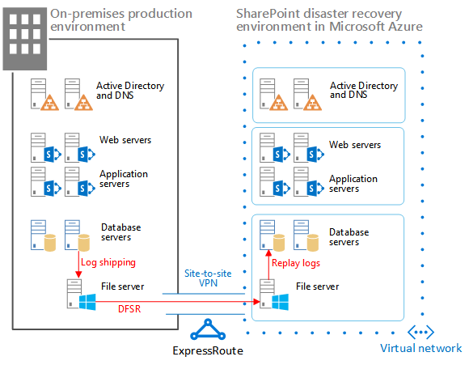

# <a name="sharepoint-server-2013-disaster-recovery-in-microsoft-azure"></a><span data-ttu-id="4202f-104">Recuperação de Desastre do SharePoint Server 2013 no Microsoft Azure</span><span class="sxs-lookup"><span data-stu-id="4202f-104">SharePoint Server 2013 Disaster Recovery in Microsoft Azure</span></span>

 <span data-ttu-id="4202f-p102">**Resumo:** Usando o Windows Azure, você pode criar um ambiente de recuperação de desastres para seu farm do SharePoint local. Este artigo descreve como projetar e implementar esta solução.</span><span class="sxs-lookup"><span data-stu-id="4202f-p102">**Summary:** Using Azure, you can create a disaster-recovery environment for your on-premises SharePoint farm. This article describes how to design and implement this solution.</span></span>

 <span data-ttu-id="4202f-107">**Assista o vídeo de visão geral de recuperação de desastres do SharePoint Server 2013**</span><span class="sxs-lookup"><span data-stu-id="4202f-107">**Watch the SharePoint Server 2013 disaster recovery overview video**</span></span>
> [!VIDEO https://www.microsoft.com/videoplayer/embed/1b73ec8f-29bd-44eb-aa3a-f7932784bfd9?autoplay=false]
  
 <span data-ttu-id="4202f-p103">Quando acidente seu ambiente do SharePoint local, sua prioridade mais alta é obter o sistema executando novamente rapidamente. Recuperação de desastres com o SharePoint é mais rápido e fácil quando você tiver um ambiente de backup já em execução no Microsoft Azure. Este vídeo explica os principais conceitos de um ambiente do SharePoint passiva de failover e complementa os detalhes completos disponíveis neste artigo.</span><span class="sxs-lookup"><span data-stu-id="4202f-p103">When disaster strikes your SharePoint on-premises environment, your top priority is to get the system running again quickly. Disaster recovery with SharePoint is quicker and easier when you have a backup environment already running in Microsoft Azure. This video explains the main concepts of a SharePoint warm failover environment and complements the full details available in this article.</span></span>
  
<span data-ttu-id="4202f-111">Use este artigo com o seguinte modelo de solução: **SharePoint Disaster Recovery in Microsoft Azure**.</span><span class="sxs-lookup"><span data-stu-id="4202f-111">Use this article with the following solution model: **SharePoint Disaster Recovery in Microsoft Azure**.</span></span>
  
<span data-ttu-id="4202f-112">[](https://go.microsoft.com/fwlink/p/?LinkId=392555)</span><span class="sxs-lookup"><span data-stu-id="4202f-112">[](https://go.microsoft.com/fwlink/p/?LinkId=392555)</span></span>
  
 <span data-ttu-id="4202f-113">[PDF](https://go.microsoft.com/fwlink/p/?LinkId=392555) |  [Visio](https://go.microsoft.com/fwlink/p/?LinkId=392554)</span><span class="sxs-lookup"><span data-stu-id="4202f-113">[PDF](https://go.microsoft.com/fwlink/p/?LinkId=392555) |  [Visio](https://go.microsoft.com/fwlink/p/?LinkId=392554)</span></span>
  
<span data-ttu-id="4202f-114">Neste artigo:</span><span class="sxs-lookup"><span data-stu-id="4202f-114">In this article:</span></span>
  
- [<span data-ttu-id="4202f-115">Usar os serviços de infraestrutura do Windows Azure para recuperação de desastres</span><span class="sxs-lookup"><span data-stu-id="4202f-115">Use Azure Infrastructure Services for disaster recovery</span></span>](sharepoint-server-2013-disaster-recovery-in-microsoft-azure.md#AZ)
    
- [<span data-ttu-id="4202f-116">Descrição da solução</span><span class="sxs-lookup"><span data-stu-id="4202f-116">Solution description</span></span>](sharepoint-server-2013-disaster-recovery-in-microsoft-azure.md#SOL)
    
- [<span data-ttu-id="4202f-117">Arquitetura detalhada</span><span class="sxs-lookup"><span data-stu-id="4202f-117">Detailed architecture</span></span>](sharepoint-server-2013-disaster-recovery-in-microsoft-azure.md#arch)
    
- [<span data-ttu-id="4202f-118">Mapa de recuperação de desastres</span><span class="sxs-lookup"><span data-stu-id="4202f-118">Disaster recovery roadmap</span></span>](sharepoint-server-2013-disaster-recovery-in-microsoft-azure.md#RDmap)
    
- [<span data-ttu-id="4202f-119">Fase 1: Criar o ambiente de recuperação de desastres</span><span class="sxs-lookup"><span data-stu-id="4202f-119">Phase 1: Design the disaster recovery environment</span></span>](sharepoint-server-2013-disaster-recovery-in-microsoft-azure.md#Phase1)
    
- [<span data-ttu-id="4202f-120">Fase 2: Criar a rede virtual do Azure e uma conexão VPN</span><span class="sxs-lookup"><span data-stu-id="4202f-120">Phase 2: Create the Azure virtual network and VPN connection</span></span>](sharepoint-server-2013-disaster-recovery-in-microsoft-azure.md#Phase2)
    
- [<span data-ttu-id="4202f-121">Fase 3: Implantar o Active Directory e serviços de nome de domínio à rede virtual do Azure</span><span class="sxs-lookup"><span data-stu-id="4202f-121">Phase 3: Deploy Active Directory and Domain Name Services to the Azure virtual network</span></span>](sharepoint-server-2013-disaster-recovery-in-microsoft-azure.md#Phase3)
    
- [<span data-ttu-id="4202f-122">Fase 4: Implantar o farm de recuperação do SharePoint no Windows Azure</span><span class="sxs-lookup"><span data-stu-id="4202f-122">Phase 4: Deploy the SharePoint recovery farm in Azure</span></span>](sharepoint-server-2013-disaster-recovery-in-microsoft-azure.md#Phase4)
    
- [<span data-ttu-id="4202f-123">Fase 5: Configurar DFSR entre os farms</span><span class="sxs-lookup"><span data-stu-id="4202f-123">Phase 5: Set up DFSR between the farms</span></span>](sharepoint-server-2013-disaster-recovery-in-microsoft-azure.md#Phase5)
    
- [<span data-ttu-id="4202f-124">Fase 6: Configurar o envio de logs para o farm de recuperação</span><span class="sxs-lookup"><span data-stu-id="4202f-124">Phase 6: Set up log shipping to the recovery farm</span></span>](sharepoint-server-2013-disaster-recovery-in-microsoft-azure.md#Phase6)
    
- [<span data-ttu-id="4202f-125">Fase 7: Validar o failover e recuperação</span><span class="sxs-lookup"><span data-stu-id="4202f-125">Phase 7: Validate failover and recovery</span></span>](sharepoint-server-2013-disaster-recovery-in-microsoft-azure.md#Phase7)
    
- [<span data-ttu-id="4202f-126">Ambiente de prova de conceito da Microsoft</span><span class="sxs-lookup"><span data-stu-id="4202f-126">Microsoft proof-of-concept environment</span></span>](sharepoint-server-2013-disaster-recovery-in-microsoft-azure.md#POC)
    
- [<span data-ttu-id="4202f-127">Dicas de solução de problemas</span><span class="sxs-lookup"><span data-stu-id="4202f-127">Troubleshooting tips</span></span>](sharepoint-server-2013-disaster-recovery-in-microsoft-azure.md#Troubleshooting)
    
## <a name="use-azure-infrastructure-services-for-disaster-recovery"></a><span data-ttu-id="4202f-128">Usar os serviços de infraestrutura do Windows Azure para recuperação de desastres</span><span class="sxs-lookup"><span data-stu-id="4202f-128">Use Azure Infrastructure Services for disaster recovery</span></span>

<span data-ttu-id="4202f-p104">Muitas organizações não têm um ambiente de recuperação de desastres para o SharePoint, que pode ser caro construir e manter o local. Serviços do Azure infraestrutura oferece opções de atraentes para desastres ambientes de recuperação que são mais flexível e mais barata que as alternativas de local.</span><span class="sxs-lookup"><span data-stu-id="4202f-p104">Many organizations do not have a disaster recovery environment for SharePoint, which can be expensive to build and maintain on-premises. Azure Infrastructure Services provides compelling options for disaster recovery environments that are more flexible and less expensive than the on-premises alternatives.</span></span>
  
<span data-ttu-id="4202f-131">As vantagens do uso de serviços de infraestrutura do Windows Azure incluem:</span><span class="sxs-lookup"><span data-stu-id="4202f-131">The advantages for using Azure Infrastructure Services include:</span></span>
  
- <span data-ttu-id="4202f-p105">**Menos dispendiosos recursos** Manter e se pague menos recursos que ambientes de recuperação de desastres no local. O número de recursos depende de qual ambiente de recuperação de desastre, você escolher: espera a frio, espera passiva ou espera ativa.</span><span class="sxs-lookup"><span data-stu-id="4202f-p105">**Fewer costly resources** Maintain and pay for fewer resources than on-premises disaster recovery environments. The number of resources depends on which disaster-recovery environment you choose: cold standby, warm standby, or hot standby.</span></span>
    
- <span data-ttu-id="4202f-p106">**Melhor flexibilidade de recursos** Em caso de desastre, facilmente dimensionar seu farm do SharePoint de recuperação para atender aos requisitos de carga. Dimensione em quando não precisar mais os recursos.</span><span class="sxs-lookup"><span data-stu-id="4202f-p106">**Better resource flexibility** In the event of a disaster, easily scale out your recovery SharePoint farm to meet load requirements. Scale in when you no longer need the resources.</span></span>
    
- <span data-ttu-id="4202f-136">**Compromisso de datacenter inferior** Use os serviços de infraestrutura do Windows Azure em vez de investimento em um datacenter secundário em uma região diferente.</span><span class="sxs-lookup"><span data-stu-id="4202f-136">**Lower datacenter commitment** Use Azure Infrastructure Services instead of investing in a secondary datacenter in a different region.</span></span>
    
<span data-ttu-id="4202f-p107">Há menos complexas opções para as organizações apenas introdução com recuperação de desastres e opções avançadas para organizações com requisitos de resiliência de alta. As definições para ambientes de espera a frio, passiva e hot são um pouco diferentes quando o ambiente está hospedado em uma plataforma de nuvem. A tabela a seguir descreve esses ambientes de criação de um farm de recuperação do SharePoint no Windows Azure.</span><span class="sxs-lookup"><span data-stu-id="4202f-p107">There are less-complex options for organizations just getting started with disaster recovery and advanced options for organizations with high-resilience requirements. The definitions for cold, warm, and hot standby environments are a little different when the environment is hosted on a cloud platform. The following table describes these environments for building a SharePoint recovery farm in Azure.</span></span>
  
<span data-ttu-id="4202f-140">**Tabela: Ambientes de recuperação**</span><span class="sxs-lookup"><span data-stu-id="4202f-140">**Table: Recovery environments**</span></span>

|<span data-ttu-id="4202f-141">**Tipo de ambiente de recuperação**</span><span class="sxs-lookup"><span data-stu-id="4202f-141">**Type of recovery environment**</span></span>|<span data-ttu-id="4202f-142">**Descrição**</span><span class="sxs-lookup"><span data-stu-id="4202f-142">**Description**</span></span>|
|:-----|:-----|
|<span data-ttu-id="4202f-143">Hot</span><span class="sxs-lookup"><span data-stu-id="4202f-143">Hot</span></span>  <br/> |<span data-ttu-id="4202f-144">Um farm totalmente dimensionado é provisionado, atualizadas e está sendo executado no modo de espera.</span><span class="sxs-lookup"><span data-stu-id="4202f-144">A fully sized farm is provisioned, updated, and running on standby.</span></span>  <br/> |
|<span data-ttu-id="4202f-145">Passiva</span><span class="sxs-lookup"><span data-stu-id="4202f-145">Warm</span></span>  <br/> |<span data-ttu-id="4202f-146">O farm é criado e máquinas virtuais estão em execução e atualizados.</span><span class="sxs-lookup"><span data-stu-id="4202f-146">The farm is built and virtual machines are running and updated.</span></span>  <br/> <span data-ttu-id="4202f-147">Recuperação inclui anexar bancos de dados de conteúdo, aplicativos de serviço de provisionamento e rastreamento de conteúdo.</span><span class="sxs-lookup"><span data-stu-id="4202f-147">Recovery includes attaching content databases, provisioning service applications, and crawling content.</span></span>  <br/> <span data-ttu-id="4202f-148">O farm pode ser uma versão menor do que o farm de produção e, em seguida, reduzidas para servir completos do usuário base.</span><span class="sxs-lookup"><span data-stu-id="4202f-148">The farm can be a smaller version of the production farm and then scaled out to serve the full user base.</span></span>  <br/> |
|<span data-ttu-id="4202f-149">Frio</span><span class="sxs-lookup"><span data-stu-id="4202f-149">Cold</span></span>  <br/> |<span data-ttu-id="4202f-150">O farm totalmente é criado, mas as máquinas virtuais são interrompidas.</span><span class="sxs-lookup"><span data-stu-id="4202f-150">The farm is fully built, but the virtual machines are stopped.</span></span>  <br/> <span data-ttu-id="4202f-151">Manter o ambiente inclui iniciar as máquinas virtuais do tempo, aplicando o patch, atualizando e verificando o ambiente.</span><span class="sxs-lookup"><span data-stu-id="4202f-151">Maintaining the environment includes starting the virtual machines from time to time, patching, updating, and verifying the environment.</span></span>  <br/> <span data-ttu-id="4202f-152">Inicie o ambiente completo em caso de desastre.</span><span class="sxs-lookup"><span data-stu-id="4202f-152">Start the full environment in the event of a disaster.</span></span>  <br/> |
   
<span data-ttu-id="4202f-p108">É importante avaliar os objetivos de tempo de recuperação (Recovery Time Objectives) e objetivos de ponto de recuperação (RPOs) da sua organização. Esses requisitos determinam qual ambiente é o investimento mais apropriado para sua organização.</span><span class="sxs-lookup"><span data-stu-id="4202f-p108">It's important to evaluate your organization's Recovery Time Objectives (RTOs) and Recovery Point Objectives (RPOs). These requirements determine which environment is the most appropriate investment for your organization.</span></span>
  
<span data-ttu-id="4202f-p109">As diretrizes deste artigo descrevem como implementar um ambiente em espera passiva. Você também pode adaptá-lo em um ambiente em espera a frio, embora precisam ser seguidas procedimentos adicionais para dar suporte a esse tipo de ambiente. Este artigo não descreve como implementar um ambiente em espera ativa.</span><span class="sxs-lookup"><span data-stu-id="4202f-p109">The guidance in this article describes how to implement a warm standby environment. You can also adapt it to a cold standby environment, although you need to follow additional procedures to support this kind of environment. This article does not describe how to implement a hot standby environment.</span></span>
  
<span data-ttu-id="4202f-158">Para obter mais informações sobre as soluções de recuperação de desastres, consulte [alta disponibilidade e conceitos de recuperação de desastres no SharePoint 2013](https://go.microsoft.com/fwlink/p/?LinkID=393114) e [Escolha uma estratégia de recuperação de desastres para o SharePoint 2013](https://go.microsoft.com/fwlink/p/?linkid=203228).</span><span class="sxs-lookup"><span data-stu-id="4202f-158">For more information about disaster recovery solutions, see [High availability and disaster recovery concepts in SharePoint 2013](https://go.microsoft.com/fwlink/p/?LinkID=393114) and [Choose a disaster recovery strategy for SharePoint 2013](https://go.microsoft.com/fwlink/p/?linkid=203228).</span></span>
  
## <a name="solution-description"></a><span data-ttu-id="4202f-159">Descrição da solução</span><span class="sxs-lookup"><span data-stu-id="4202f-159">Solution description</span></span>

<span data-ttu-id="4202f-160">A solução de recuperação de desastre em espera passiva requer o seguinte ambiente:</span><span class="sxs-lookup"><span data-stu-id="4202f-160">The warm standby disaster-recovery solution requires the following environment:</span></span>
  
- <span data-ttu-id="4202f-161">Um farm de produção do SharePoint local</span><span class="sxs-lookup"><span data-stu-id="4202f-161">An on-premises SharePoint production farm</span></span>
    
- <span data-ttu-id="4202f-162">Um farm do SharePoint de recuperação no Windows Azure</span><span class="sxs-lookup"><span data-stu-id="4202f-162">A recovery SharePoint farm in Azure</span></span>
    
- <span data-ttu-id="4202f-163">Uma conexão VPN de site a site entre os dois ambientes</span><span class="sxs-lookup"><span data-stu-id="4202f-163">A site-to-site VPN connection between the two environments</span></span>
    
<span data-ttu-id="4202f-164">A figura a seguir ilustra esses três elementos.</span><span class="sxs-lookup"><span data-stu-id="4202f-164">The following figure illustrates these three elements.</span></span>
  
<span data-ttu-id="4202f-165">**Figura: Elementos de uma solução em espera passiva no Azure**</span><span class="sxs-lookup"><span data-stu-id="4202f-165">**Figure: Elements of a warm standby solution in Azure**</span></span>


  
<span data-ttu-id="4202f-167">Envio com distribuído arquivo sistema replicação (DFSR) de log do SQL Server é usado para copiar backups de banco de dados e logs de transação para o farm de recuperação no Windows Azure:</span><span class="sxs-lookup"><span data-stu-id="4202f-167">SQL Server log shipping with Distributed File System Replication (DFSR) is used to copy database backups and transaction logs to the recovery farm in Azure:</span></span> 
  
- <span data-ttu-id="4202f-p110">DFSR transfere logs do ambiente de produção para o ambiente de recuperação. Em um cenário WAN, DFSR é mais eficiente do que os logs diretamente para o servidor secundário de envio no Windows Azure.</span><span class="sxs-lookup"><span data-stu-id="4202f-p110">DFSR transfers logs from the production environment to the recovery environment. In a WAN scenario, DFSR is more efficient than shipping the logs directly to the secondary server in Azure.</span></span>
    
- <span data-ttu-id="4202f-170">Logs são reproduzidos ao SQL Server no ambiente de recuperação no Windows Azure.</span><span class="sxs-lookup"><span data-stu-id="4202f-170">Logs are replayed to the SQL Server in the recovery environment in Azure.</span></span>
    
- <span data-ttu-id="4202f-171">Não anexar enviados com logs SharePoint conteúdo bancos de dados no ambiente de recuperação até que um exercício de recuperação é executado.</span><span class="sxs-lookup"><span data-stu-id="4202f-171">You don't attach log-shipped SharePoint content databases in the recovery environment until a recovery exercise is performed.</span></span>
    
<span data-ttu-id="4202f-172">Execute as seguintes etapas para recuperar o farm:</span><span class="sxs-lookup"><span data-stu-id="4202f-172">Perform the following steps to recover the farm:</span></span>
  
1. <span data-ttu-id="4202f-173">Pare o envio de log.</span><span class="sxs-lookup"><span data-stu-id="4202f-173">Stop log shipping.</span></span>
    
2. <span data-ttu-id="4202f-174">Pare de aceitar o tráfego para o farm principal.</span><span class="sxs-lookup"><span data-stu-id="4202f-174">Stop accepting traffic to the primary farm.</span></span>
    
3. <span data-ttu-id="4202f-175">Repetição durante os logs de transações final.</span><span class="sxs-lookup"><span data-stu-id="4202f-175">Replay the final transaction logs.</span></span>
    
4. <span data-ttu-id="4202f-176">Anexe os bancos de dados de conteúdo ao farm.</span><span class="sxs-lookup"><span data-stu-id="4202f-176">Attach the content databases to the farm.</span></span>
    
5. <span data-ttu-id="4202f-177">Restaure aplicativos de serviço dos bancos de dados replicados.</span><span class="sxs-lookup"><span data-stu-id="4202f-177">Restore service applications from the replicated services databases.</span></span>
    
6. <span data-ttu-id="4202f-178">Atualize registros de sistema de nome de domínio (DNS) para apontar para o farm de recuperação.</span><span class="sxs-lookup"><span data-stu-id="4202f-178">Update Domain Name System (DNS) records to point to the recovery farm.</span></span>
    
7. <span data-ttu-id="4202f-179">Inicie um rastreamento completo.</span><span class="sxs-lookup"><span data-stu-id="4202f-179">Start a full crawl.</span></span>
    
<span data-ttu-id="4202f-p111">Recomendamos que você poderá testar essas etapas regularmente e documentá-los para ajudar a garantir que sua recuperação live seja executado sem problemas. Anexar bancos de dados de conteúdo e aplicativos de serviço de restauração podem levar algum tempo e geralmente envolvem algumas configuração manual.</span><span class="sxs-lookup"><span data-stu-id="4202f-p111">We recommend that you rehearse these steps regularly and document them to help ensure that your live recovery runs smoothly. Attaching content databases and restoring service applications can take some time and typically involves some manual configuration.</span></span>
  
<span data-ttu-id="4202f-182">Após uma recuperação é executada, essa solução oferece os itens listados na tabela a seguir.</span><span class="sxs-lookup"><span data-stu-id="4202f-182">After a recovery is performed, this solution provides the items listed in the following table.</span></span>
  
<span data-ttu-id="4202f-183">**Tabela: Objetivos de recuperação de solução**</span><span class="sxs-lookup"><span data-stu-id="4202f-183">**Table: Solution recovery objectives**</span></span>

|<span data-ttu-id="4202f-184">**Item**</span><span class="sxs-lookup"><span data-stu-id="4202f-184">**Item**</span></span>|<span data-ttu-id="4202f-185">**Descrição**</span><span class="sxs-lookup"><span data-stu-id="4202f-185">**Description**</span></span>|
|:-----|:-----|
|<span data-ttu-id="4202f-186">Sites e conteúdo</span><span class="sxs-lookup"><span data-stu-id="4202f-186">Sites and content</span></span>  <br/> |<span data-ttu-id="4202f-187">Sites e conteúdo estão disponíveis no ambiente de recuperação.</span><span class="sxs-lookup"><span data-stu-id="4202f-187">Sites and content are available in the recovery environment.</span></span>  <br/> |
|<span data-ttu-id="4202f-188">Uma nova instância de pesquisa</span><span class="sxs-lookup"><span data-stu-id="4202f-188">A new instance of search</span></span>  <br/> |<span data-ttu-id="4202f-p112">Nesta solução em espera passiva, a pesquisa não é restaurada dos bancos de dados de pesquisa. Componentes de pesquisa do farm de recuperação são configurados como da mesma forma como possíveis para o farm de produção. Depois que os sites e conteúdo são restaurados, um rastreamento completo é iniciado para reconstruir o índice de pesquisa. Você não precisará aguardar o rastreamento a ser concluídas para disponibilizar os sites e conteúdo.</span><span class="sxs-lookup"><span data-stu-id="4202f-p112">In this warm standby solution, search is not restored from search databases. Search components in the recovery farm are configured as similarly as possible to the production farm. After the sites and content are restored, a full crawl is started to rebuild the search index. You do not need to wait for the crawl to complete to make the sites and content available.</span></span>  <br/> |
|<span data-ttu-id="4202f-193">Serviços</span><span class="sxs-lookup"><span data-stu-id="4202f-193">Services</span></span>  <br/> | <span data-ttu-id="4202f-p113">Os serviços que armazenam dados em bancos de dados são restaurados dos bancos de dados enviados com logs. Serviços que não armazene dados nos bancos de dados simplesmente foram iniciados.</span><span class="sxs-lookup"><span data-stu-id="4202f-p113">Services that store data in databases are restored from the log-shipped databases. Services that do not store data in databases are simply started.</span></span> <br/>  <span data-ttu-id="4202f-p114">Nem todos os serviços com bancos de dados precisam ser restaurado. Os seguintes serviços não precisam ser restaurado a partir de bancos de dados e simplesmente podem ser iniciados após o failover:</span><span class="sxs-lookup"><span data-stu-id="4202f-p114">Not all services with databases need to be restored. The following services do not need to be restored from databases and can simply be started after failover:</span></span> <br/>  <span data-ttu-id="4202f-198">Coleta de Dados de Uso e Integridade</span><span class="sxs-lookup"><span data-stu-id="4202f-198">Usage and Health Data Collection</span></span> <br/>  <span data-ttu-id="4202f-199">Serviço de Controle de Sessão</span><span class="sxs-lookup"><span data-stu-id="4202f-199">State service</span></span> <br/>  <span data-ttu-id="4202f-200">Automação do Word</span><span class="sxs-lookup"><span data-stu-id="4202f-200">Word automation</span></span> <br/>  <span data-ttu-id="4202f-201">Qualquer outro serviço que não usa um banco de dados</span><span class="sxs-lookup"><span data-stu-id="4202f-201">Any other service that doesn't use a database</span></span> <br/> |
   
<span data-ttu-id="4202f-p115">Você pode trabalhar com os serviços de consultoria Microsoft (MCS) ou um parceiro para atender aos objetivos de recuperação mais complexa. Estas são resumidas na tabela a seguir.</span><span class="sxs-lookup"><span data-stu-id="4202f-p115">You can work with Microsoft Consulting Services (MCS) or a partner to address more-complex recovery objectives. These are summarized in the following table.</span></span>
  
<span data-ttu-id="4202f-204">**Tabela: Outros itens que podem ser abordados pelo MCS ou um parceiro**</span><span class="sxs-lookup"><span data-stu-id="4202f-204">**Table: Other items that can be addressed by MCS or a partner**</span></span>

|<span data-ttu-id="4202f-205">**Item**</span><span class="sxs-lookup"><span data-stu-id="4202f-205">**Item**</span></span>|<span data-ttu-id="4202f-206">**Descrição**</span><span class="sxs-lookup"><span data-stu-id="4202f-206">**Description**</span></span>|
|:-----|:-----|
|<span data-ttu-id="4202f-207">Sincronizando soluções personalizadas do farm</span><span class="sxs-lookup"><span data-stu-id="4202f-207">Synchronizing custom farm solutions</span></span>  <br/> |<span data-ttu-id="4202f-p116">Idealmente, a configuração do farm de recuperação é idêntica ao farm de produção. Você pode trabalhar com um consultor ou parceiro para avaliar se soluções personalizadas do farm são replicadas e se o processo está em vigor para manter dois ambientes sincronizados.</span><span class="sxs-lookup"><span data-stu-id="4202f-p116">Ideally, the recovery farm configuration is identical to the production farm. You can work with a consultant or partner to evaluate whether custom farm solutions are replicated and whether the process is in place for keeping the two environments synchronized.</span></span>  <br/> |
|<span data-ttu-id="4202f-210">Conexões com fontes de dados no local</span><span class="sxs-lookup"><span data-stu-id="4202f-210">Connections to data sources on-premises</span></span>  <br/> |<span data-ttu-id="4202f-211">Talvez não seja prático replicar conexões para sistemas de dados back-end, conexões (BDC) do controlador de domínio de backup e fontes de conteúdo de pesquisa.</span><span class="sxs-lookup"><span data-stu-id="4202f-211">It might not be practical to replicate connections to back-end data systems, such as backup domain controller (BDC) connections and search content sources.</span></span>  <br/> |
|<span data-ttu-id="4202f-212">Cenários de restauração de pesquisa</span><span class="sxs-lookup"><span data-stu-id="4202f-212">Search restore scenarios</span></span>  <br/> |<span data-ttu-id="4202f-p117">Porque as implantações do enterprise search tendem a ser bastante exclusivo e complexas, a restauração de pesquisa dos bancos de dados exige um investimento maior. Você pode trabalhar com um consultor ou parceiro para identificar e implementar cenários de restauração de pesquisa que sua organização pode exigir.</span><span class="sxs-lookup"><span data-stu-id="4202f-p117">Because enterprise search deployments tend to be fairly unique and complex, restoring search from databases requires a greater investment. You can work with a consultant or partner to identify and implement search restore scenarios that your organization might require.</span></span>  <br/> |
   
<span data-ttu-id="4202f-215">As diretrizes fornecidas neste artigo pressupõe que o farm local já foi desenvolvido e implantado.</span><span class="sxs-lookup"><span data-stu-id="4202f-215">The guidance provided in this article assumes that the on-premises farm is already designed and deployed.</span></span>
  
## <a name="detailed-architecture"></a><span data-ttu-id="4202f-216">Arquitetura detalhada</span><span class="sxs-lookup"><span data-stu-id="4202f-216">Detailed architecture</span></span>

<span data-ttu-id="4202f-217">Idealmente, a configuração do farm de recuperação no Windows Azure é idêntica de produção farm local, incluindo o seguinte:</span><span class="sxs-lookup"><span data-stu-id="4202f-217">Ideally, the recovery farm configuration in Azure is identical to the production farm on-premises, including the following:</span></span>
  
- <span data-ttu-id="4202f-218">A mesma representação das funções de servidor</span><span class="sxs-lookup"><span data-stu-id="4202f-218">The same representation of server roles</span></span>
    
- <span data-ttu-id="4202f-219">A mesma configuração de personalizações</span><span class="sxs-lookup"><span data-stu-id="4202f-219">The same configuration of customizations</span></span>
    
- <span data-ttu-id="4202f-220">A mesma configuração de componentes de pesquisa</span><span class="sxs-lookup"><span data-stu-id="4202f-220">The same configuration of search components</span></span>
    
<span data-ttu-id="4202f-p118">O ambiente no Azure pode ser uma versão menor do que o farm de produção. Se você planeja dimensionar o farm de recuperação após o failover, é importante que cada tipo de função de servidor inicialmente ser representado.</span><span class="sxs-lookup"><span data-stu-id="4202f-p118">The environment in Azure can be a smaller version of the production farm. If you plan to scale out the recovery farm after failover, it's important that each type of server role be initially represented.</span></span>
  
<span data-ttu-id="4202f-p119">Algumas configurações talvez não seja práticas replicar no ambiente de failover. Certifique-se de testar os procedimentos de failover e o ambiente para ajudar a garantir que o farm de failover oferece o nível de serviço esperado.</span><span class="sxs-lookup"><span data-stu-id="4202f-p119">Some configurations might not be practical to replicate in the failover environment. Be sure to test the failover procedures and environment to help ensure that the failover farm provides the expected service level.</span></span>
  
<span data-ttu-id="4202f-p120">Essa solução não estabelece uma topologia específica para um farm do SharePoint. O foco desta solução é usar o Windows Azure para o farm de failover e implementar o envio de logs e DFSR entre os dois ambientes.</span><span class="sxs-lookup"><span data-stu-id="4202f-p120">This solution doesn't prescribe a specific topology for a SharePoint farm. The focus of this solution is to use Azure for the failover farm and to implement log shipping and DFSR between the two environments.</span></span>
  
### <a name="warm-standby-environments"></a><span data-ttu-id="4202f-227">Ambientes de espera passiva</span><span class="sxs-lookup"><span data-stu-id="4202f-227">Warm standby environments</span></span>

<span data-ttu-id="4202f-p121">Em um ambiente em espera passiva, todas as máquinas virtuais no ambiente do Azure estão em execução. O ambiente estiver pronto para um evento ou exercício de failover.</span><span class="sxs-lookup"><span data-stu-id="4202f-p121">In a warm standby environment, all virtual machines in the Azure environment are running. The environment is ready for a failover exercise or event.</span></span>
  
<span data-ttu-id="4202f-230">A figura a seguir ilustra uma solução de recuperação de desastre de um farm do SharePoint local a um farm do SharePoint com base no Windows Azure que esteja configurado como um ambiente em espera passiva.</span><span class="sxs-lookup"><span data-stu-id="4202f-230">The following figure illustrates a disaster recovery solution from an on-premises SharePoint farm to an Azure-based SharePoint farm that is configured as a warm standby environment.</span></span>
  
<span data-ttu-id="4202f-231">**Figura: Topologia e principais elementos de um farm de produção e um farm de recuperação de espera passiva**</span><span class="sxs-lookup"><span data-stu-id="4202f-231">**Figure: Topology and key elements of a production farm and a warm standby recovery farm**</span></span>


  
<span data-ttu-id="4202f-233">Neste diagrama:</span><span class="sxs-lookup"><span data-stu-id="4202f-233">In this diagram:</span></span>
  
- <span data-ttu-id="4202f-234">Dois ambientes são mostrados lado a lado: o farm do SharePoint no local e o farm de espera passiva no Azure.</span><span class="sxs-lookup"><span data-stu-id="4202f-234">Two environments are illustrated side by side: the on-premises SharePoint farm and the warm standby farm in Azure.</span></span>
    
- <span data-ttu-id="4202f-235">Cada ambiente inclui um compartilhamento de arquivos.</span><span class="sxs-lookup"><span data-stu-id="4202f-235">Each environment includes a file share.</span></span>
    
- <span data-ttu-id="4202f-p122">Cada farm inclui quatro camadas. Para atingir a alta disponibilidade, cada camada inclui dois servidores ou máquinas virtuais que são configuradas de forma idêntica para uma função específica, como serviços de front-end, cache distribuído, serviços back-end e bancos de dados. Não é importante nessa ilustração chamar componentes específicos. Os dois farms são configurados de forma idêntica.</span><span class="sxs-lookup"><span data-stu-id="4202f-p122">Each farm includes four tiers. To achieve high availability, each tier includes two servers or virtual machines that are configured identically for a specific role, such as front-end services, distributed cache, back-end services, and databases. It isn't important in this illustration to call out specific components. The two farms are configured identically.</span></span>
    
- <span data-ttu-id="4202f-p123">A camada de quarta é a camada de banco de dados. Envio de logs é usado para copiar os logs do servidor de banco de dados secundário no ambiente local para o compartilhamento de arquivos no mesmo ambiente.</span><span class="sxs-lookup"><span data-stu-id="4202f-p123">The fourth tier is the database tier. Log shipping is used to copy logs from the secondary database server in the on-premises environment to the file share in the same environment.</span></span>
    
- <span data-ttu-id="4202f-242">A DFSR copia os arquivos do compartilhamento de arquivos no ambiente local para o compartilhamento de arquivos no ambiente Azure.</span><span class="sxs-lookup"><span data-stu-id="4202f-242">DFSR copies files from the file share in the on-premises environment to the file share in the Azure environment.</span></span>
    
- <span data-ttu-id="4202f-243">O envio de logs reproduz os logs do compartilhamento de arquivos no ambiente Azure para a réplica primária no grupo de disponibilidade AlwaysOn do SQL Server no ambiente secundário.</span><span class="sxs-lookup"><span data-stu-id="4202f-243">Log shipping replays the logs from the file share in the Azure environment to the primary replica in the SQL Server AlwaysOn availability group in the recovery environment.</span></span>
    
### <a name="cold-standby-environments"></a><span data-ttu-id="4202f-244">Ambientes de espera a frio</span><span class="sxs-lookup"><span data-stu-id="4202f-244">Cold standby environments</span></span>

<span data-ttu-id="4202f-p124">Em um ambiente em espera a frio, a maioria das máquinas virtuais do SharePoint farm pode ser desligada. (É recomendável ocasionalmente Iniciando as máquinas virtuais, como a cada duas semanas ou uma vez por mês, para que cada máquina virtual pode ser sincronizado com o domínio.) As seguintes máquinas virtuais no ambiente de recuperação Azure devem permanecer em execução para ajudar a garantir operações contínuas de envio de logs e DFSR:</span><span class="sxs-lookup"><span data-stu-id="4202f-p124">In a cold standby environment, most of the SharePoint farm virtual machines can be shut down. (We recommend occasionally starting the virtual machines, such as every two weeks or once a month, so that each virtual machine can sync with the domain.) The following virtual machines in the Azure recovery environment must remain running to help ensure continuous operations of log shipping and DFSR:</span></span>
  
- <span data-ttu-id="4202f-247">O compartilhamento de arquivo</span><span class="sxs-lookup"><span data-stu-id="4202f-247">The file share</span></span>
    
- <span data-ttu-id="4202f-248">Servidor de banco de dados principal</span><span class="sxs-lookup"><span data-stu-id="4202f-248">The primary database server</span></span>
    
- <span data-ttu-id="4202f-249">Pelo menos uma máquina virtual que executa o Windows Server Active Directory Domain Services e DNS</span><span class="sxs-lookup"><span data-stu-id="4202f-249">At least one virtual machine running Windows Server Active Directory Domain Services and DNS</span></span>
    
<span data-ttu-id="4202f-p125">A figura a seguir mostra um ambiente de failover do Windows Azure no qual a máquina virtual do compartilhamento de arquivo e a máquina de virtual de banco de dados principal do SharePoint estão em execução. Todas as outras máquinas de virtuais do SharePoint são interrompidas. A máquina virtual que está executando o Windows Server Active Directory e DNS não será mostrada.</span><span class="sxs-lookup"><span data-stu-id="4202f-p125">The following figure shows an Azure failover environment in which the file share virtual machine and the primary SharePoint database virtual machine are running. All other SharePoint virtual machines are stopped. The virtual machine that is running Windows Server Active Directory and DNS is not shown.</span></span>
  
<span data-ttu-id="4202f-253">**Figura: Farm de recuperação de espera a frio com máquinas virtuais em execução**</span><span class="sxs-lookup"><span data-stu-id="4202f-253">**Figure: Cold standby recovery farm with running virtual machines**</span></span>


  
<span data-ttu-id="4202f-255">Após o failover para um ambiente em espera a frio, todas as máquinas virtuais são iniciadas e o método para alcançar a alta disponibilidade dos servidores de banco de dados deve ser configurado, como grupos de disponibilidade AlwaysOn do SQL Server.</span><span class="sxs-lookup"><span data-stu-id="4202f-255">After failover to a cold standby environment, all virtual machines are started, and the method to achieve high availability of the database servers must be configured, such as SQL Server AlwaysOn availability groups.</span></span>
  
<span data-ttu-id="4202f-256">Se vários grupos de armazenamento são implementados (bancos de dados estão espalhados por mais de um conjunto de alta disponibilidade do SQL Server), deve estar executando o banco de dados primário para cada grupo de armazenamento para aceitar os logs associados ao seu grupo de armazenamento.</span><span class="sxs-lookup"><span data-stu-id="4202f-256">If multiple storage groups are implemented (databases are spread across more than one SQL Server high availability set), the primary database for each storage group must be running to accept the logs associated with its storage group.</span></span>
  
### <a name="skills-and-experience"></a><span data-ttu-id="4202f-257">Habilidades e experiência</span><span class="sxs-lookup"><span data-stu-id="4202f-257">Skills and experience</span></span>

<span data-ttu-id="4202f-p126">Várias tecnologias são usadas nessa solução de recuperação de desastres. Para ajudar a garantir que essas tecnologias interagem conforme o esperado, cada componente em locais e do ambiente do Azure deve ser instalado e configurado corretamente. É recomendável que a pessoa ou equipe que configura essa solução tenham um conhecimento de trabalho de forte e conhecimentos práticos com as tecnologias descritas nos seguintes artigos:</span><span class="sxs-lookup"><span data-stu-id="4202f-p126">Multiple technologies are used in this disaster recovery solution. To help ensure that these technologies interact as expected, each component in the on-premises and Azure environment must be installed and configured correctly. We recommend that the person or team who sets up this solution have a strong working knowledge of and hands-on skills with the technologies described in the following articles:</span></span>
  
- [<span data-ttu-id="4202f-261">Serviços de replicação do arquivos distribuídos (DFS) do sistema</span><span class="sxs-lookup"><span data-stu-id="4202f-261">Distributed File System (DFS) Replication Services</span></span>](https://go.microsoft.com/fwlink/p/?LinkId=392698)
    
- [<span data-ttu-id="4202f-262">Failover do Windows Server Clustering (WSFC) com o SQL Server</span><span class="sxs-lookup"><span data-stu-id="4202f-262">Windows Server Failover Clustering (WSFC) with SQL Server</span></span>](https://go.microsoft.com/fwlink/p/?LinkId=392701)
    
- [<span data-ttu-id="4202f-263">Grupos de Disponibilidade AlwaysOn (SQL Server)</span><span class="sxs-lookup"><span data-stu-id="4202f-263">AlwaysOn Availability Groups (SQL Server)</span></span>](https://go.microsoft.com/fwlink/p/?LinkId=392725)
    
- [<span data-ttu-id="4202f-264">Backup e restauração de bancos de dados do SQL Server</span><span class="sxs-lookup"><span data-stu-id="4202f-264">Back Up and Restore of SQL Server Databases</span></span>](https://go.microsoft.com/fwlink/p/?LinkId=392728)
    
- [<span data-ttu-id="4202f-265">Implantação de instalação e o farm do SharePoint Server 2013</span><span class="sxs-lookup"><span data-stu-id="4202f-265">SharePoint Server 2013 installation and farm deployment</span></span>](https://go.microsoft.com/fwlink/p/?LinkId=393119)
    
- [<span data-ttu-id="4202f-266">Microsoft Azure</span><span class="sxs-lookup"><span data-stu-id="4202f-266">Microsoft Azure</span></span>](https://go.microsoft.com/fwlink/p/?LinkId=392729)
    
<span data-ttu-id="4202f-p127">Finalmente, é recomendável habilidades que você pode usar para automatizar as tarefas associadas com essas tecnologias de script. É possível usar as interfaces de usuário disponíveis para concluir todas as tarefas descritas nesta solução. No entanto, uma abordagem manual pode ser demorada e sujeita a erros e fornece resultados inconsistentes.</span><span class="sxs-lookup"><span data-stu-id="4202f-p127">Finally, we recommend scripting skills that you can use to automate tasks associated with these technologies. It's possible to use the available user interfaces to complete all the tasks described in this solution. However, a manual approach can be time consuming and error prone and delivers inconsistent results.</span></span>
  
<span data-ttu-id="4202f-p128">Além do Windows PowerShell, também há bibliotecas do Windows PowerShell para SQL Server, SharePoint Server e Windows Azure. Não se esqueça T-SQL, que também pode ajudar a reduzir o tempo para configurar e manter seu ambiente de recuperação de desastres.</span><span class="sxs-lookup"><span data-stu-id="4202f-p128">In addition to Windows PowerShell, there are also Windows PowerShell libraries for SQL Server, SharePoint Server, and Azure. Don't forget T-SQL, which can also help reduce the time to configure and maintain your disaster-recovery environment.</span></span>
  
## <a name="disaster-recovery-roadmap"></a><span data-ttu-id="4202f-272">Mapa de recuperação de desastres</span><span class="sxs-lookup"><span data-stu-id="4202f-272">Disaster recovery roadmap</span></span>


  
<span data-ttu-id="4202f-274">Este mapa pressupõe que você já tem um farm do SharePoint Server 2013 implantado na produção.</span><span class="sxs-lookup"><span data-stu-id="4202f-274">This roadmap assumes that you already have a SharePoint Server 2013 farm deployed in production.</span></span>
  
<span data-ttu-id="4202f-275">**Tabela: Mapa para recuperação de desastres**</span><span class="sxs-lookup"><span data-stu-id="4202f-275">**Table: Roadmap for disaster recovery**</span></span>

|<span data-ttu-id="4202f-276">**Fase**</span><span class="sxs-lookup"><span data-stu-id="4202f-276">**Phase**</span></span>|<span data-ttu-id="4202f-277">**Descrição**</span><span class="sxs-lookup"><span data-stu-id="4202f-277">**Description**</span></span>|
|:-----|:-----|
|<span data-ttu-id="4202f-278">Fase 1</span><span class="sxs-lookup"><span data-stu-id="4202f-278">Phase 1</span></span>  <br/> |<span data-ttu-id="4202f-279">Projete o ambiente de recuperação de desastres.</span><span class="sxs-lookup"><span data-stu-id="4202f-279">Design the disaster recovery environment.</span></span>  <br/> |
|<span data-ttu-id="4202f-280">Fase 2</span><span class="sxs-lookup"><span data-stu-id="4202f-280">Phase 2</span></span>  <br/> |<span data-ttu-id="4202f-281">Crie a rede virtual do Azure e uma conexão VPN.</span><span class="sxs-lookup"><span data-stu-id="4202f-281">Create the Azure virtual network and VPN connection.</span></span>  <br/> |
|<span data-ttu-id="4202f-282">Fase 3</span><span class="sxs-lookup"><span data-stu-id="4202f-282">Phase 3</span></span>  <br/> |<span data-ttu-id="4202f-283">Implante a rede virtual do Azure Active Directory do Windows e serviços de nome de domínio.</span><span class="sxs-lookup"><span data-stu-id="4202f-283">Deploy Windows Active Directory and Domain Name Services to the Azure virtual network.</span></span>  <br/> |
|<span data-ttu-id="4202f-284">Fase 4</span><span class="sxs-lookup"><span data-stu-id="4202f-284">Phase 4</span></span>  <br/> |<span data-ttu-id="4202f-285">Implante o farm de recuperação do SharePoint no Windows Azure.</span><span class="sxs-lookup"><span data-stu-id="4202f-285">Deploy the SharePoint recovery farm in Azure.</span></span>  <br/> |
|<span data-ttu-id="4202f-286">Fase 5</span><span class="sxs-lookup"><span data-stu-id="4202f-286">Phase 5</span></span>  <br/> |<span data-ttu-id="4202f-287">Configure DFSR entre os farms.</span><span class="sxs-lookup"><span data-stu-id="4202f-287">Set up DFSR between the farms.</span></span>  <br/> |
|<span data-ttu-id="4202f-288">Fase 6</span><span class="sxs-lookup"><span data-stu-id="4202f-288">Phase 6</span></span>  <br/> |<span data-ttu-id="4202f-289">Configure o envio de logs para o farm de recuperação.</span><span class="sxs-lookup"><span data-stu-id="4202f-289">Set up log shipping to the recovery farm.</span></span>  <br/> |
|<span data-ttu-id="4202f-290">Fase 7</span><span class="sxs-lookup"><span data-stu-id="4202f-290">Phase 7</span></span>  <br/> | <span data-ttu-id="4202f-p129">Valide soluções de failover e recuperação. Isso inclui os seguintes procedimentos e tecnologias:</span><span class="sxs-lookup"><span data-stu-id="4202f-p129">Validate failover and recovery solutions. This includes the following procedures and technologies:</span></span> <br/>  <span data-ttu-id="4202f-293">Pare o envio de log.</span><span class="sxs-lookup"><span data-stu-id="4202f-293">Stop log shipping.</span></span> <br/>  <span data-ttu-id="4202f-294">Restaure os backups.</span><span class="sxs-lookup"><span data-stu-id="4202f-294">Restore the backups.</span></span> <br/>  <span data-ttu-id="4202f-295">Rastrear o conteúdo.</span><span class="sxs-lookup"><span data-stu-id="4202f-295">Crawl content.</span></span> <br/>  <span data-ttu-id="4202f-296">Recupere serviços.</span><span class="sxs-lookup"><span data-stu-id="4202f-296">Recover services.</span></span> <br/>  <span data-ttu-id="4202f-297">Gerencie registros DNS.</span><span class="sxs-lookup"><span data-stu-id="4202f-297">Manage DNS records.</span></span> <br/> |
   
## <a name="phase-1-design-the-disaster-recovery-environment"></a><span data-ttu-id="4202f-298">Fase 1: Criar o ambiente de recuperação de desastres</span><span class="sxs-lookup"><span data-stu-id="4202f-298">Phase 1: Design the disaster recovery environment</span></span>

<span data-ttu-id="4202f-p130">Use as diretrizes in [Microsoft Azure Architectures for SharePoint 2013](microsoft-azure-architectures-for-sharepoint-2013.md) para criar o ambiente de recuperação de desastre, incluindo o farm de recuperação do SharePoint. Você pode usar os elementos gráficos no arquivo do Visio de [Solução de recuperação de desastres do SharePoint no Windows Azure](https://go.microsoft.com/fwlink/p/?LinkId=392554) para iniciar o processo de design. Recomendamos que você crie de todo o ambiente antes de iniciar qualquer trabalho no ambiente do Azure.</span><span class="sxs-lookup"><span data-stu-id="4202f-p130">Use the guidance in [Microsoft Azure Architectures for SharePoint 2013](microsoft-azure-architectures-for-sharepoint-2013.md) to design the disaster-recovery environment, including the SharePoint recovery farm. You can use the graphics in the [SharePoint Disaster Recovery Solution in Azure](https://go.microsoft.com/fwlink/p/?LinkId=392554) Visio file to start the design process. We recommend that you design the entire environment before beginning any work in the Azure environment.</span></span>
  
<span data-ttu-id="4202f-302">Além das diretrizes fornecidas no [Microsoft Azure Architectures for SharePoint 2013](microsoft-azure-architectures-for-sharepoint-2013.md) para projetar a rede virtual, conexão VPN, Active Directory e farm do SharePoint, certifique-se de adicionar uma função de compartilhamento de arquivo para o ambiente do Azure.</span><span class="sxs-lookup"><span data-stu-id="4202f-302">In addition to the guidance provided in [Microsoft Azure Architectures for SharePoint 2013](microsoft-azure-architectures-for-sharepoint-2013.md) for designing the virtual network, VPN connection, Active Directory, and SharePoint farm, be sure to add a file share role to the Azure environment.</span></span>
  
<span data-ttu-id="4202f-p131">Para suportar o envio de log em uma solução de recuperação de desastre, uma máquina de virtual de compartilhamento de arquivo é adicionada à sub-rede em que as funções de banco de dados residem. O compartilhamento de arquivos também serve como o terceiro nó da maioria nó para o grupo de disponibilidade do SQL Server AlwaysOn. Esta é a configuração recomendada para um farm do SharePoint padrão que usa os grupos de disponibilidade AlwaysOn do SQL Server.</span><span class="sxs-lookup"><span data-stu-id="4202f-p131">To support log shipping in a disaster-recovery solution, a file share virtual machine is added to the subnet where the database roles reside. The file share also serves as the third node of a Node Majority for the SQL Server AlwaysOn availability group. This is the recommended configuration for a standard SharePoint farm that uses SQL Server AlwaysOn availability groups.</span></span> 
  
> [!NOTE]
> <span data-ttu-id="4202f-p132">É importante revisar os pré-requisitos para um banco de dados participar de um grupo de disponibilidade do SQL Server AlwaysOn. Para obter mais informações, consulte [os pré-requisitos, restrições e recomendações para grupos de disponibilidade do AlwaysOn](https://go.microsoft.com/fwlink/p/?LinkId=510870).</span><span class="sxs-lookup"><span data-stu-id="4202f-p132">It is important to review the prerequisites for a database to participate in a SQL Server AlwaysOn availability group. For more information, see [Prerequisites, Restrictions, and Recommendations for AlwaysOn Availability Groups](https://go.microsoft.com/fwlink/p/?LinkId=510870).</span></span> 
  
<span data-ttu-id="4202f-308">**Figura: O posicionamento de um servidor de arquivos usado para uma solução de recuperação de desastres**</span><span class="sxs-lookup"><span data-stu-id="4202f-308">**Figure: Placement of a file server used for a disaster recovery solution**</span></span>


  
<span data-ttu-id="4202f-p133">Neste diagrama, uma máquina de virtual de compartilhamento de arquivo é adicionada à mesma sub-rede no Azure que contém as funções de servidor de banco de dados. Não adicione a máquina virtual do compartilhamento de arquivo a uma disponibilidade definidas com outras funções de servidor, como as funções do SQL Server.</span><span class="sxs-lookup"><span data-stu-id="4202f-p133">In this diagram, a file share virtual machine is added to the same subnet in Azure that contains the database server roles. Do not add the file share virtual machine to an availability set with other server roles, such as the SQL Server roles.</span></span>
  
<span data-ttu-id="4202f-p134">Se você estiver preocupado com a alta disponibilidade dos logs, considere adotar uma abordagem de diferente usando o [SQL Server backup e restauração com o serviço de armazenamento de Blob do Azure](https://go.microsoft.com/fwlink/p/?LinkId=393113). Esse é um novo recurso no Azure que salva logs diretamente em uma URL de armazenamento de blob. Esta solução não inclui diretrizes sobre como usar esse recurso.</span><span class="sxs-lookup"><span data-stu-id="4202f-p134">If you are concerned about the high availability of the logs, consider taking a different approach by using [SQL Server backup and restore with Azure Blob Storage Service](https://go.microsoft.com/fwlink/p/?LinkId=393113). This is a new feature in Azure that saves logs directly to a blob storage URL. This solution does not include guidance about using this feature.</span></span>
  
<span data-ttu-id="4202f-p135">Ao criar o farm de recuperação, tenha em mente que um ambiente de recuperação de desastres bem-sucedido reflete com precisão o farm de produção que você deseja recuperar. O tamanho do farm de recuperação não é o mais importante no design do farm de recuperação, implantação e teste. Escala de farm varia de organização para organização com base nos requisitos de negócios. Talvez seja possível usar um farm reduzido por uma breve interrupção ou até que as exigências de desempenho e capacidade exigem que você dimensionar o farm.</span><span class="sxs-lookup"><span data-stu-id="4202f-p135">When you design the recovery farm, keep in mind that a successful disaster recovery environment accurately reflects the production farm that you want to recover. The size of the recovery farm is not the most important thing in the recovery farm's design, deployment, and testing. Farm scale varies from organization to organization based on business requirements. It might be possible to use a scaled-down farm for a short outage or until performance and capacity demands require you to scale the farm.</span></span>
  
<span data-ttu-id="4202f-p136">Configure o farm de recuperação identicamente forem possíveis para o farm de produção para que ele atenda às suas necessidades de (SLA) contrato de nível de serviço e fornece a funcionalidade que você precisa oferecer suporte a sua empresa. Ao criar o ambiente de recuperação de desastres, também examine seu processo de gerenciamento de alterações para o seu ambiente de produção. Recomendamos que você estenda o processo de gerenciamento de alterações para o ambiente de recuperação, atualizando o ambiente de recuperação no mesmo intervalo como um ambiente de produção. Como parte do processo de gerenciamento de alteração, é recomendável manter um inventário detalhado de sua configuração de farm, aplicativos e usuários.</span><span class="sxs-lookup"><span data-stu-id="4202f-p136">Configure the recovery farm as identically as possible to the production farm so that it meets your service level agreement (SLA) requirements and provides the functionality that you need to support your business. When you design the disaster recovery environment, also look at your change management process for your production environment. We recommend that you extend the change management process to the recovery environment by updating the recovery environment at the same interval as the production environment. As part of the change management process, we recommend maintaining a detailed inventory of your farm configuration, applications, and users.</span></span> 
  
## <a name="phase-2-create-the-azure-virtual-network-and-vpn-connection"></a><span data-ttu-id="4202f-323">Fase 2: Criar a rede virtual do Azure e uma conexão VPN</span><span class="sxs-lookup"><span data-stu-id="4202f-323">Phase 2: Create the Azure virtual network and VPN connection</span></span>

<span data-ttu-id="4202f-p137">[Conectar um local de rede para uma rede virtual do Microsoft Azure](connect-an-on-premises-network-to-a-microsoft-azure-virtual-network.md) mostra como planejar e implantar a rede virtual no Windows Azure e como criar a conexão VPN. Siga as orientações no tópico para concluir os procedimentos a seguir:</span><span class="sxs-lookup"><span data-stu-id="4202f-p137">[Connect an on-premises network to a Microsoft Azure virtual network](connect-an-on-premises-network-to-a-microsoft-azure-virtual-network.md) shows you how to plan and deploy the virtual network in Azure and how to create the VPN connection. Follow the guidance in the topic to complete the following procedures:</span></span>
  
- <span data-ttu-id="4202f-326">Planeje o espaço de endereço IP particular da rede Virtual.</span><span class="sxs-lookup"><span data-stu-id="4202f-326">Plan the private IP address space of the Virtual Network.</span></span>
    
- <span data-ttu-id="4202f-327">Planeje as alterações de infra-estrutura de roteamento para a rede Virtual.</span><span class="sxs-lookup"><span data-stu-id="4202f-327">Plan the routing infrastructure changes for the Virtual Network.</span></span>
    
- <span data-ttu-id="4202f-328">Planeje regras de firewall para o tráfego de e para o dispositivo VPN local.</span><span class="sxs-lookup"><span data-stu-id="4202f-328">Plan firewall rules for traffic to and from the on-premises VPN device.</span></span>
    
- <span data-ttu-id="4202f-329">Criar a rede virtual entre locais no Azure.</span><span class="sxs-lookup"><span data-stu-id="4202f-329">Create the cross-premises virtual network in Azure.</span></span>
    
- <span data-ttu-id="4202f-330">Configure o roteamento entre sua rede local e a rede Virtual.</span><span class="sxs-lookup"><span data-stu-id="4202f-330">Configure routing between your on-premises network and the Virtual Network.</span></span>
    
## <a name="phase-3-deploy-active-directory-and-domain-name-services-to-the-azure-virtual-network"></a><span data-ttu-id="4202f-331">Fase 3: Implantar o Active Directory e serviços de nome de domínio à rede virtual do Azure</span><span class="sxs-lookup"><span data-stu-id="4202f-331">Phase 3: Deploy Active Directory and Domain Name Services to the Azure virtual network</span></span>

<span data-ttu-id="4202f-332">Essa fase inclui Implantando o Windows Server Active Directory e DNS à rede Virtual em um cenário híbrido, conforme descrito em [Microsoft Azure Architectures for SharePoint 2013](microsoft-azure-architectures-for-sharepoint-2013.md) e como ilustrado na figura a seguir.</span><span class="sxs-lookup"><span data-stu-id="4202f-332">This phase includes deploying both Windows Server Active Directory and DNS to the Virtual Network in a hybrid scenario as described in [Microsoft Azure Architectures for SharePoint 2013](microsoft-azure-architectures-for-sharepoint-2013.md) and as illustrated in the following figure.</span></span>
  
<span data-ttu-id="4202f-333">**Figura: Configuração de domínio do Active Directory de híbrido**</span><span class="sxs-lookup"><span data-stu-id="4202f-333">**Figure: Hybrid Active Directory domain configuration**</span></span>


  
<span data-ttu-id="4202f-p138">Na ilustração, duas máquinas virtuais são implantadas para a mesma sub-rede. Essas máquinas virtuais são a cada duas funções hospedagem: Active Directory e DNS.</span><span class="sxs-lookup"><span data-stu-id="4202f-p138">In the illustration, two virtual machines are deployed to the same subnet. These virtual machines are each hosting two roles: Active Directory and DNS.</span></span>
  
<span data-ttu-id="4202f-p139">Antes de implantar o Active Directory no Windows Azure, leia [as diretrizes para implantar o Windows Server Active Directory nas máquinas virtuais do Windows Azure](https://go.microsoft.com/fwlink/p/?linkid=392681). Estas diretrizes ajudam a determinar se você precisa de uma arquitetura diferente ou configurações diferentes para sua solução.</span><span class="sxs-lookup"><span data-stu-id="4202f-p139">Before deploying Active Directory in Azure, read [Guidelines for Deploying Windows Server Active Directory on Azure Virtual Machines](https://go.microsoft.com/fwlink/p/?linkid=392681). These guidelines help you determine whether you need a different architecture or different configuration settings for your solution.</span></span>
  
<span data-ttu-id="4202f-339">Para obter orientações detalhadas sobre como configurar um controlador de domínio no Windows Azure, consulte [instalar um controlador de domínio réplica Active Directory em redes virtuais do Azure](https://go.microsoft.com/fwlink/p/?LinkId=392687).</span><span class="sxs-lookup"><span data-stu-id="4202f-339">For detailed guidance on setting up a domain controller in Azure, see [Install a Replica Active Directory Domain Controller in Azure Virtual Networks](https://go.microsoft.com/fwlink/p/?LinkId=392687).</span></span>
  
<span data-ttu-id="4202f-p140">Antes dessa fase, você não implantar máquinas virtuais para a rede Virtual. As máquinas virtuais para hospedar o Active Directory e DNS provavelmente não são as máquinas virtuais maiores, que você precisa para a solução. Antes de implantar essas máquinas virtuais, crie primeiro a máquina virtual maior que você planeja usar em sua rede Virtual. Isso ajuda a garantir que sua solução pousar em uma marca no Azure que permite que o maior tamanho que você precisa. Você não precisará configurar essa máquina virtual neste momento. Simplesmente criá-lo e defini-la à parte. Se você não fizer isso, você pode executar com uma limitação quando você tenta criar máquinas virtuais do maiores posteriormente, que era um problema no momento em que este artigo foi escrito.</span><span class="sxs-lookup"><span data-stu-id="4202f-p140">Before this phase, you didn't deploy virtual machines to the Virtual Network. The virtual machines for hosting Active Directory and DNS are likely not the largest virtual machines you need for the solution. Before you deploy these virtual machines, first create the largest virtual machine that you plan to use in your Virtual Network. This helps ensure that your solution lands on a tag in Azure that allows the largest size you need. You do not need to configure this virtual machine at this time. Simply create it, and set it aside. If you do not do this, you might run into a limitation when you try to create larger virtual machines later, which was an issue at the time this article was written.</span></span> 
  
## <a name="phase-4-deploy-the-sharepoint-recovery-farm-in-azure"></a><span data-ttu-id="4202f-347">Fase 4: Implantar o farm de recuperação do SharePoint no Windows Azure</span><span class="sxs-lookup"><span data-stu-id="4202f-347">Phase 4: Deploy the SharePoint recovery farm in Azure</span></span>

<span data-ttu-id="4202f-p141">Implante o farm do SharePoint em sua rede Virtual de acordo com seus planos de design. Pode ser útil analisar o [Planning for SharePoint 2013 nos serviços de infraestrutura do Windows Azure](https://go.microsoft.com/fwlink/p/?LinkId=400984) antes de implantar o SharePoint funções no Windows Azure.</span><span class="sxs-lookup"><span data-stu-id="4202f-p141">Deploy the SharePoint farm in your Virtual Network according to your design plans. It might be helpful to review [Planning for SharePoint 2013 on Azure Infrastructure Services](https://go.microsoft.com/fwlink/p/?LinkId=400984) before you deploy SharePoint roles in Azure.</span></span>
  
<span data-ttu-id="4202f-350">Considere as seguintes práticas que constatamos criando nossa prova de ambiente de conceito:</span><span class="sxs-lookup"><span data-stu-id="4202f-350">Consider the following practices that we learned by building our proof of concept environment:</span></span>
  
- <span data-ttu-id="4202f-351">Crie máquinas virtuais, usando o portal do Azure ou PowerShell.</span><span class="sxs-lookup"><span data-stu-id="4202f-351">Create virtual machines by using the Azure portal or PowerShell.</span></span>
    
- <span data-ttu-id="4202f-p142">Windows Azure e o Hyper-V não dão suporte a memória dinâmica. Certifique-se de que isso é acrescentado em seus planos de capacidade e o desempenho.</span><span class="sxs-lookup"><span data-stu-id="4202f-p142">Azure and Hyper-V do not support dynamic memory. Be sure this is factored into your performance and capacity plans.</span></span>
    
- <span data-ttu-id="4202f-p143">Reinicie as máquinas virtuais por meio da interface do Azure, não a partir do logon de máquina virtual em si. Usando a interface do Azure funciona melhor e é mais previsível.</span><span class="sxs-lookup"><span data-stu-id="4202f-p143">Restart virtual machines through the Azure interface, not from the virtual machine logon itself. Using the Azure interface works better and is more predictable.</span></span>
    
- <span data-ttu-id="4202f-p144">Se você deseja desligar uma máquina virtual para salvar os custos, use a interface do Azure. Se você desligar partir do logon de máquina virtual, tarifas continuam se acumulam.</span><span class="sxs-lookup"><span data-stu-id="4202f-p144">If you want to shut down a virtual machine to save costs, use the Azure interface. If you shut down from the virtual machine logon, charges continue to accrue.</span></span>
    
- <span data-ttu-id="4202f-358">Use uma convenção de nomenclatura para as máquinas virtuais.</span><span class="sxs-lookup"><span data-stu-id="4202f-358">Use a naming convention for the virtual machines.</span></span>
    
- <span data-ttu-id="4202f-359">Preste atenção ao qual local datacenter as máquinas virtuais estão sendo implantadas.</span><span class="sxs-lookup"><span data-stu-id="4202f-359">Pay attention to which datacenter location the virtual machines are being deployed.</span></span>
    
- <span data-ttu-id="4202f-360">Não há suporte para o recurso de dimensionamento automático no Windows Azure para funções do SharePoint.</span><span class="sxs-lookup"><span data-stu-id="4202f-360">The automatic scaling feature in Azure is not supported for SharePoint roles.</span></span>
    
- <span data-ttu-id="4202f-361">Não configure os itens no farm que será restaurado, como conjuntos de sites.</span><span class="sxs-lookup"><span data-stu-id="4202f-361">Do not configure items in the farm that will be restored, such as site collections.</span></span> 
    
## <a name="phase-5-set-up-dfsr-between-the-farms"></a><span data-ttu-id="4202f-362">Fase 5: Configurar DFSR entre os farms</span><span class="sxs-lookup"><span data-stu-id="4202f-362">Phase 5: Set up DFSR between the farms</span></span>

<span data-ttu-id="4202f-p145">Para configurar a replicação de arquivo usando DFSR, use o snap-in de gerenciamento de DNS. No entanto, antes da instalação DFSR, faça logon no seu servidor de arquivos local e o servidor de arquivos Azure e ativar o serviço no Windows.</span><span class="sxs-lookup"><span data-stu-id="4202f-p145">To set up file replication by using DFSR, use the DNS Management snap-in. However, before the DFSR setup, log on to your on-premises file server and Azure file server and enable the service in Windows.</span></span>
  
<span data-ttu-id="4202f-365">No painel Gerenciador de servidores, conclua as seguintes etapas:</span><span class="sxs-lookup"><span data-stu-id="4202f-365">From the Server Manager Dashboard, complete the following steps:</span></span>
  
- <span data-ttu-id="4202f-366">Configure o servidor local.</span><span class="sxs-lookup"><span data-stu-id="4202f-366">Configure the local server.</span></span>
    
- <span data-ttu-id="4202f-367">Inicie o **Assistente de recursos e funções de adicionar**.</span><span class="sxs-lookup"><span data-stu-id="4202f-367">Start the **Add Roles and Features Wizard**.</span></span>
    
- <span data-ttu-id="4202f-368">Abra o nó do **arquivo e serviços de armazenamento** .</span><span class="sxs-lookup"><span data-stu-id="4202f-368">Open the **File and Storage Services** node.</span></span>
    
- <span data-ttu-id="4202f-369">Selecione **Namespaces DFS** e **replicação DFS**.</span><span class="sxs-lookup"><span data-stu-id="4202f-369">Select **DFS Namespaces** and **DFS replication**.</span></span>
    
- <span data-ttu-id="4202f-370">Clique em **Avançar** para concluir as etapas do assistente.</span><span class="sxs-lookup"><span data-stu-id="4202f-370">Click **Next** to finish the wizard steps.</span></span>
    
<span data-ttu-id="4202f-371">A tabela a seguir fornece links para artigos de referência DFSR e postagens de blog.</span><span class="sxs-lookup"><span data-stu-id="4202f-371">The following table provides links to DFSR reference articles and blog posts.</span></span>
  
<span data-ttu-id="4202f-372">**Tabela: Artigos de referência para DFSR**</span><span class="sxs-lookup"><span data-stu-id="4202f-372">**Table: Reference articles for DFSR**</span></span>

|<span data-ttu-id="4202f-373">**Título**</span><span class="sxs-lookup"><span data-stu-id="4202f-373">**Title**</span></span>|<span data-ttu-id="4202f-374">**Descrição**</span><span class="sxs-lookup"><span data-stu-id="4202f-374">**Description**</span></span>|
|:-----|:-----|
|[<span data-ttu-id="4202f-375">Replicação</span><span class="sxs-lookup"><span data-stu-id="4202f-375">Replication</span></span>](https://go.microsoft.com/fwlink/p/?LinkId=392732) <br/> |<span data-ttu-id="4202f-376">Tópico do TechNet do Gerenciamento DFS com links para replicação</span><span class="sxs-lookup"><span data-stu-id="4202f-376">DFS Management TechNet topic with links for replication</span></span>  <br/> |
|[<span data-ttu-id="4202f-377">Replicação do DFS: Guia de sobrevivência</span><span class="sxs-lookup"><span data-stu-id="4202f-377">DFS Replication: Survival Guide</span></span>](https://go.microsoft.com/fwlink/p/?LinkId=392737) <br/> |<span data-ttu-id="4202f-378">Wiki com links para informações do DFS</span><span class="sxs-lookup"><span data-stu-id="4202f-378">Wiki with links to DFS information</span></span>  <br/> |
|[<span data-ttu-id="4202f-379">Replicação do DFS: Perguntas frequentes sobre</span><span class="sxs-lookup"><span data-stu-id="4202f-379">DFS Replication: Frequently Asked Questions</span></span>](https://go.microsoft.com/fwlink/p/?LinkId=392738) <br/> |<span data-ttu-id="4202f-380">Tópico do TechNet de replicação do DFS</span><span class="sxs-lookup"><span data-stu-id="4202f-380">DFS Replication TechNet topic</span></span>  <br/> |
|[<span data-ttu-id="4202f-381">Blog de Jose Barreto</span><span class="sxs-lookup"><span data-stu-id="4202f-381">Jose Barreto's Blog</span></span>](https://go.microsoft.com/fwlink/p/?LinkId=392739) <br/> |<span data-ttu-id="4202f-382">Blog escrito por um gerente de programa Principal da equipe do servidor de arquivos na Microsoft</span><span class="sxs-lookup"><span data-stu-id="4202f-382">Blog written by a Principal Program Manager on the File Server team at Microsoft</span></span>  <br/> |
|[<span data-ttu-id="4202f-383">A equipe de armazenamento da Microsoft - arquivo de gabinete de Blog</span><span class="sxs-lookup"><span data-stu-id="4202f-383">The Storage Team at Microsoft - File Cabinet Blog</span></span>](https://go.microsoft.com/fwlink/p/?LinkId=392740) <br/> |<span data-ttu-id="4202f-384">Blog sobre serviços de arquivo e recursos de armazenamento no Windows Server</span><span class="sxs-lookup"><span data-stu-id="4202f-384">Blog about file services and storage features in Windows Server</span></span>  <br/> |
   
## <a name="phase-6-set-up-log-shipping-to-the-recovery-farm"></a><span data-ttu-id="4202f-385">Fase 6: Configurar o envio de logs para o farm de recuperação</span><span class="sxs-lookup"><span data-stu-id="4202f-385">Phase 6: Set up log shipping to the recovery farm</span></span>

<span data-ttu-id="4202f-p146">Envio de log é o componente crítico para configurar a recuperação de desastres nesse ambiente. Você pode usar o envio de log para enviar automaticamente os arquivos de log de transações para bancos de dados de uma instância de servidor de banco de dados primário para uma instância do servidor de banco de dados secundário. Para configurar o envio de log, consulte [Configure envio de logs no SharePoint 2013](https://docs.microsoft.com/sharepoint/administration/configure-log-shipping).</span><span class="sxs-lookup"><span data-stu-id="4202f-p146">Log shipping is the critical component for setting up disaster recovery in this environment. You can use log shipping to automatically send transaction log files for databases from a primary database server instance to a secondary database server instance. To set up log shipping, see [Configure log shipping in SharePoint 2013](https://docs.microsoft.com/sharepoint/administration/configure-log-shipping).</span></span> 
  
> [!IMPORTANT]
> <span data-ttu-id="4202f-p147">Suporte de envio de logs no SharePoint Server está limitado a determinados bancos de dados. Para obter mais informações, consulte [Supported alta disponibilidade e opções de recuperação de desastres para bancos de dados do SharePoint (SharePoint 2013)](https://go.microsoft.com/fwlink/p/?LinkId=393121).</span><span class="sxs-lookup"><span data-stu-id="4202f-p147">Log shipping support in SharePoint Server is limited to certain databases. For more information, see [Supported high availability and disaster recovery options for SharePoint databases (SharePoint 2013)](https://go.microsoft.com/fwlink/p/?LinkId=393121).</span></span> 
  
## <a name="phase-7-validate-failover-and-recovery"></a><span data-ttu-id="4202f-391">Fase 7: Validar o failover e recuperação</span><span class="sxs-lookup"><span data-stu-id="4202f-391">Phase 7: Validate failover and recovery</span></span>

<span data-ttu-id="4202f-p148">O objetivo dessa fase final é verificar se a solução de recuperação de desastres funciona conforme o planejado. Para fazer isso, crie um evento de failover que desliga o farm de produção e inicia o backup do farm de recuperação como uma substituição. Você pode iniciar uma situação de failover manualmente ou usando scripts.</span><span class="sxs-lookup"><span data-stu-id="4202f-p148">The goal of this final phase is to verify that the disaster recovery solution works as planned. To do this, create a failover event that shuts down the production farm and starts up the recovery farm as a replacement. You can start a failover scenario manually or by using scripts.</span></span>
  
<span data-ttu-id="4202f-p149">A primeira etapa é interromper as solicitações de usuário de entrada para os serviços de farm ou de conteúdo. Você pode fazer isso por meio da desabilitação entradas DNS ou desligar os servidores web front-end. Depois que o farm está "desativado", você pode transferir o processamento para o farm de recuperação.</span><span class="sxs-lookup"><span data-stu-id="4202f-p149">The first step is to stop incoming user requests for farm services or content. You can do this by disabling DNS entries or by shutting down the front-end web servers. After the farm is "down," you can fail over to the recovery farm.</span></span>
  
### <a name="stop-log-shipping"></a><span data-ttu-id="4202f-398">Parar o envio de logs</span><span class="sxs-lookup"><span data-stu-id="4202f-398">Stop log shipping</span></span>

<span data-ttu-id="4202f-p150">Você deve parar o envio de log antes da recuperação do farm. Interromper o envio de log no servidor secundário no Windows Azure pela primeira vez e parariam no servidor primário no local. Use o script a seguir para interromper o envio de logs no primeiro servidor secundário e, em seguida, no servidor primário. Os nomes de banco de dados no script podem ser diferentes, dependendo do seu ambiente.</span><span class="sxs-lookup"><span data-stu-id="4202f-p150">You must stop log shipping before farm recovery. Stop log shipping on the secondary server in Azure first, and then stop it on the primary server on-premises. Use the following script to stop log shipping on the secondary server first and then on the primary server. The database names in the script might be different, depending on your environment.</span></span>
  
```
-- This script removes log shipping from the server.
-- Commands must be executed on the secondary server first and then on the primary server.

SET NOCOUNT ON
DECLARE  @PriDB nvarchar(max)
,@SecDB nvarchar(250)
,@PriSrv nvarchar(250)
,@SecSrv nvarchar(250)

Set @PriDB= ''
SET @PriDB = UPPER(@PriDB)
SET @PriDB = REPLACE(@PriDB, ' ', '')
SET @PriDB = '''' + REPLACE(@PriDB, ',', ''', ''') + ''''

Set @SecDB = @PriDB

Exec ( 'Select  ''exec master..sp_delete_log_shipping_secondary_database '' + '''''''' + prm.primary_database +  ''''''''   
from msdb.dbo.log_shipping_monitor_primary prm INNER JOIN msdb.dbo.log_shipping_primary_secondaries sec  ON  prm.primary_database=sec.secondary_database
where prm.primary_database in ( ' + @PriDB + ' )')

Exec ( 'Select  ''exec master..sp_delete_log_shipping_primary_secondary '' + '''''''' + prm.Primary_Database + '''''', '''''' + sec.Secondary_Server + '''''', '''''' + sec.Secondary_database + ''''''''   
from msdb.dbo.log_shipping_monitor_primary prm INNER JOIN msdb.dbo.log_shipping_primary_secondaries sec  ON  prm.primary_database=sec.secondary_database
where prm.primary_database in ( ' + @PriDB + ' )')

Exec ( 'Select  ''exec master..sp_delete_log_shipping_primary_database '' + '''''''' + prm.primary_database +  ''''''''   
from msdb.dbo.log_shipping_monitor_primary prm INNER JOIN msdb.dbo.log_shipping_primary_secondaries sec  ON  prm.primary_database=sec.secondary_database
where prm.primary_database in ( ' + @PriDB + ' )')

Exec ( 'Select  ''exec master..sp_delete_log_shipping_secondary_primary '' + '''''''' + prm.primary_server + '''''', '''''' + prm.primary_database +  ''''''''   
from msdb.dbo.log_shipping_monitor_primary prm INNER JOIN msdb.dbo.log_shipping_primary_secondaries sec  ON  prm.primary_database=sec.secondary_database
where prm.primary_database in ( ' + @PriDB + ' )')

```

### <a name="restore-the-backups"></a><span data-ttu-id="4202f-403">Restaure os backups</span><span class="sxs-lookup"><span data-stu-id="4202f-403">Restore the backups</span></span>

<span data-ttu-id="4202f-p151">Backups devem ser restaurados na ordem na qual eles foram criados. Antes de restaurar um backup do log de transação específica, primeiro você deve restaurar os backups anteriores a seguintes sem retomar transações não confirmadas (ou seja, usando `WITH NORECOVERY`):</span><span class="sxs-lookup"><span data-stu-id="4202f-p151">Backups must be restored in the order in which they were created. Before you can restore a particular transaction log backup, you must first restore the following previous backups without rolling back uncommitted transactions (that is, by using  `WITH NORECOVERY`):</span></span>
  
- <span data-ttu-id="4202f-p152">O backup do banco de dados completo e o último backup diferencial - restaurar estes backups, se houver algum, sendo usado antes do backup de log de transação específica. Antes do backup do banco de dados completo ou diferencial mais recente foi criado, o banco de dados estava usando o modelo de recuperação completa ou o modelo de recuperação de log em massa.</span><span class="sxs-lookup"><span data-stu-id="4202f-p152">The full database backup and the last differential backup - Restore these backups, if any exist, taken before the particular transaction log backup. Before the most recent full or differential database backup was created, the database was using the full recovery model or bulk-logged recovery model.</span></span>
    
- <span data-ttu-id="4202f-p153">Todos os backups do log de transação - restaurar qualquer backups de logs de transação tomadas após o backup completo do banco de dados ou o backup diferencial (se você restaurar um) e antes do log de transação específica em backup. Backups de log devem ser aplicados na sequência em que foram criados, sem qualquer lacunas na cadeia de log.</span><span class="sxs-lookup"><span data-stu-id="4202f-p153">All transaction log backups - Restore any transaction log backups taken after the full database backup or the differential backup (if you restore one) and before the particular transaction log backup. Log backups must be applied in the sequence in which they were created, without any gaps in the log chain.</span></span>
    
<span data-ttu-id="4202f-p154">Para recuperar o banco de dados de conteúdo no servidor secundário para que os sites de renderização, remova todas as conexões de banco de dados antes da recuperação. Para restaurar o banco de dados, execute a seguinte instrução SQL.</span><span class="sxs-lookup"><span data-stu-id="4202f-p154">To recover the content database on the secondary server so that the sites render, remove all database connections before recovery. To restore the database, run the following SQL statement.</span></span>
  
```
restore database WSS_Content with recovery

```

> [!IMPORTANT]
> <span data-ttu-id="4202f-p155">Quando você usa explicitamente o T-SQL, especifique **WITH NORECOVERY** ou **WITH RECOVERY** em cada instrução de restauração para eliminar a ambiguidade — isso é muito importante ao escrever scripts. Depois que os backups completos e diferenciais são restaurados, os logs de transação possam ser restaurados no SQL Server Management Studio. Além disso, porque o envio de log já estiver parado, o banco de dados de conteúdo está em um estado de espera, portanto, você deve alterar o estado para acesso total.</span><span class="sxs-lookup"><span data-stu-id="4202f-p155">When you use T-SQL explicitly, specify either **WITH NORECOVERY** or **WITH RECOVERY** in every RESTORE statement to eliminate ambiguity—this is very important when writing scripts. After the full and differential backups are restored, the transaction logs can be restored in SQL Server Management Studio. Also, because log shipping is already stopped, the content database is in a standby state, so you must change the state to full access.</span></span>
  
<span data-ttu-id="4202f-p156">No SQL Server Management Studio, do mouse em banco de dados **WSS_Content** , aponte para **tarefas** > **Restaurar**e clique em **Log de transações** (se você não tiver restaurado do backup completo, isso não está disponível). Para obter mais informações, consulte[restaurar um Backup do Log de transações (SQL Server)](https://go.microsoft.com/fwlink/p/?LinkId=392778).</span><span class="sxs-lookup"><span data-stu-id="4202f-p156">In SQL Server Management Studio, right-click the **WSS_Content** database, point to **Tasks** > **Restore**, and then click **Transaction Log** (if you have not restored the full backup, this is not available). For more information, see[Restore a Transaction Log Backup (SQL Server)](https://go.microsoft.com/fwlink/p/?LinkId=392778).</span></span>
  
### <a name="crawl-the-content-source"></a><span data-ttu-id="4202f-417">Rastreie a fonte de conteúdo</span><span class="sxs-lookup"><span data-stu-id="4202f-417">Crawl the content source</span></span>

<span data-ttu-id="4202f-p157">Você deve iniciar um rastreamento completo para cada fonte de conteúdo restaurar o serviço de pesquisa. Observe que você perde algumas informações de análise do farm local, como as recomendações de pesquisa. Antes de iniciar os rastreamentos completos, use o cmdlet **Restore-SPEnterpriseSearchServiceApplication** do Windows PowerShell e especifique o banco de administração de pesquisa enviados com logs e replicado, **Search_Service__DB_<GUID>**. Este cmdlet permite que a configuração de pesquisa, esquema, propriedades gerenciadas, regras e fontes e cria um conjunto padrão de outros componentes.</span><span class="sxs-lookup"><span data-stu-id="4202f-p157">You must start a full crawl for each content source to restore the Search Service. Note that you lose some analytics information from the on-premises farm, such as search recommendations. Before you start the full crawls, use the Windows PowerShell cmdlet **Restore-SPEnterpriseSearchServiceApplication** and specify the log-shipped and replicated Search Administration database, **Search_Service__DB_<GUID>**. This cmdlet gives the search configuration, schema, managed properties, rules, and sources and creates a default set of the other components.</span></span>
  
<span data-ttu-id="4202f-422">Para iniciar um rastreamento completo, conclua as seguintes etapas:</span><span class="sxs-lookup"><span data-stu-id="4202f-422">To start a full crawl, complete the following steps:</span></span>
  
1. <span data-ttu-id="4202f-423">No SharePoint 2013 Central Administration, vá para o **Gerenciamento de aplicativos** > **Aplicativos de serviço** > **Gerenciar aplicativos de serviço**e, em seguida, clique no aplicativo de serviço de pesquisa que você deseja rastrear.</span><span class="sxs-lookup"><span data-stu-id="4202f-423">In the SharePoint 2013 Central Administration, go to **Application Management** > **Service Applications** > **Manage service applications**, and then click the Search Service application that you want to crawl.</span></span>
    
2. <span data-ttu-id="4202f-424">Na página **Administração da pesquisa** , clique em **Fontes de conteúdo**, aponte para a fonte de conteúdo que deseja, clique na seta e, em seguida, clique em **Iniciar rastreamento completo**.</span><span class="sxs-lookup"><span data-stu-id="4202f-424">On the **Search Administration** page, click **Content Sources**, point to the content source that you want, click the arrow, and then click **Start Full Crawl**.</span></span>
    
### <a name="recover-farm-services"></a><span data-ttu-id="4202f-425">Recuperar serviços de farm</span><span class="sxs-lookup"><span data-stu-id="4202f-425">Recover farm services</span></span>

<span data-ttu-id="4202f-426">A tabela a seguir mostra como recuperar serviços que tiverem enviados com logs bancos de dados, os serviços que tem bancos de dados, mas não são recomendados para restaurar com envio de log e os serviços que não possuem bancos de dados.</span><span class="sxs-lookup"><span data-stu-id="4202f-426">The following table shows how to recover services that have log-shipped databases, the services that have databases but are not recommended to restore with log shipping, and the services that do not have databases.</span></span>
  
> [!IMPORTANT]
> <span data-ttu-id="4202f-427">Restaurar um banco de dados do SharePoint no local ao ambiente do Azure não irá recuperar todos os serviços do SharePoint que não tiver já instalado no Azure manualmente.</span><span class="sxs-lookup"><span data-stu-id="4202f-427">Restoring an on-premises SharePoint database into the Azure environment will not recover any SharePoint services that you did not already install in Azure manually.</span></span> 
  
<span data-ttu-id="4202f-428">**Tabela: Referência de banco de dados de aplicativo de serviço**</span><span class="sxs-lookup"><span data-stu-id="4202f-428">**Table: Service application database reference**</span></span>

|<span data-ttu-id="4202f-429">**Restaurar esses serviços de bancos de dados enviados com logs**</span><span class="sxs-lookup"><span data-stu-id="4202f-429">**Restore these services from log-shipped databases**</span></span>|<span data-ttu-id="4202f-430">**Esses serviços tem bancos de dados, mas é recomendável que você iniciar esses serviços sem restaurar seus bancos de dados**</span><span class="sxs-lookup"><span data-stu-id="4202f-430">**These services have databases, but we recommend that you start these services without restoring their databases**</span></span>|<span data-ttu-id="4202f-431">**Esses serviços não armazene dados nos bancos de dados; iniciar esses serviços após o failover**</span><span class="sxs-lookup"><span data-stu-id="4202f-431">**These services do not store data in databases; start these services after failover**</span></span>|
|:-----|:-----|:-----|
| <span data-ttu-id="4202f-432">Serviço de Tradução Automática</span><span class="sxs-lookup"><span data-stu-id="4202f-432">Machine Translation Service</span></span> <br/>  <span data-ttu-id="4202f-433">Serviço de Metadados Gerenciados</span><span class="sxs-lookup"><span data-stu-id="4202f-433">Managed Metadata Service</span></span> <br/>  <span data-ttu-id="4202f-434">Serviço de Repositório Seguro</span><span class="sxs-lookup"><span data-stu-id="4202f-434">Secure Store Service</span></span> <br/>  <span data-ttu-id="4202f-p158">Perfil de usuário. (Somente, os bancos de dados de perfil e marcação Social são suportados. O banco de dados de sincronização não é suportado).</span><span class="sxs-lookup"><span data-stu-id="4202f-p158">User Profile. (Only the Profile and Social Tagging databases are supported. The Synchronization database is not supported.)</span></span> <br/>  <span data-ttu-id="4202f-438">Serviço de Configurações de Assinatura do Microsoft SharePoint Foundation</span><span class="sxs-lookup"><span data-stu-id="4202f-438">Microsoft SharePoint Foundation Subscription Settings Service</span></span> <br/> | <span data-ttu-id="4202f-439">Coleta de Dados de Uso e Integridade</span><span class="sxs-lookup"><span data-stu-id="4202f-439">Usage and Health Data Collection</span></span> <br/>  <span data-ttu-id="4202f-440">Serviço de Controle de Sessão</span><span class="sxs-lookup"><span data-stu-id="4202f-440">State service</span></span> <br/>  <span data-ttu-id="4202f-441">Automação do Word</span><span class="sxs-lookup"><span data-stu-id="4202f-441">Word automation</span></span> <br/> | <span data-ttu-id="4202f-442">Serviços do Excel</span><span class="sxs-lookup"><span data-stu-id="4202f-442">Excel Services</span></span> <br/>  <span data-ttu-id="4202f-443">Serviços PerformancePoint</span><span class="sxs-lookup"><span data-stu-id="4202f-443">PerformancePoint Services</span></span> <br/>  <span data-ttu-id="4202f-444">Conversão do PowerPoint</span><span class="sxs-lookup"><span data-stu-id="4202f-444">PowerPoint Conversion</span></span> <br/>  <span data-ttu-id="4202f-445">Serviço de Gráficos do Visio</span><span class="sxs-lookup"><span data-stu-id="4202f-445">Visio Graphics Service</span></span> <br/>  <span data-ttu-id="4202f-446">Gerenciamento de Trabalho</span><span class="sxs-lookup"><span data-stu-id="4202f-446">Work Management</span></span> <br/> |
   
<span data-ttu-id="4202f-447">O exemplo a seguir mostra como restaurar o serviço de metadados gerenciados de um banco de dados.</span><span class="sxs-lookup"><span data-stu-id="4202f-447">The following example shows how to restore the Managed Metadata service from a database.</span></span>
  
<span data-ttu-id="4202f-p159">Isso usa o banco de dados existente do Managed_Metadata_DB. Esse banco de dados é log enviado, mas há em um aplicativo de serviço ativas no farm secundário, portanto ela precisa estar conectado depois que o aplicativo de serviço está no lugar.</span><span class="sxs-lookup"><span data-stu-id="4202f-p159">This uses the existing Managed_Metadata_DB database. This database is log shipped, but there is no active service application on the secondary farm, so it needs to be connected after the service application is in place.</span></span>
  
<span data-ttu-id="4202f-450">Primeiro, use `New-SPMetadataServiceApplication`e especifique o `DatabaseName` alternar com o nome do banco de dados restaurado.</span><span class="sxs-lookup"><span data-stu-id="4202f-450">First, use  `New-SPMetadataServiceApplication`, and specify the  `DatabaseName` switch with the name of the restored database.</span></span>
  
<span data-ttu-id="4202f-451">Em seguida, configure o novo aplicativo de serviço de metadados gerenciados no servidor secundário, da seguinte maneira:</span><span class="sxs-lookup"><span data-stu-id="4202f-451">Next, configure the new Managed Metadata Service Application on the secondary server, as follows:</span></span>
  
- <span data-ttu-id="4202f-452">Nome: Serviço de metadados gerenciados</span><span class="sxs-lookup"><span data-stu-id="4202f-452">Name: Managed Metadata Service</span></span>
    
- <span data-ttu-id="4202f-453">Servidor de banco de dados: O nome do banco de dados do log de transações remetido</span><span class="sxs-lookup"><span data-stu-id="4202f-453">Database server: The database name from the shipped transaction log</span></span>
    
- <span data-ttu-id="4202f-454">Nome do banco de dados: Managed_Metadata_DB</span><span class="sxs-lookup"><span data-stu-id="4202f-454">Database name: Managed_Metadata_DB</span></span>
    
- <span data-ttu-id="4202f-455">Pool de aplicativos: aplicativos de serviço do SharePoint</span><span class="sxs-lookup"><span data-stu-id="4202f-455">Application pool: SharePoint Service Applications</span></span> 
    
### <a name="manage-dns-records"></a><span data-ttu-id="4202f-456">Gerenciar registros DNS</span><span class="sxs-lookup"><span data-stu-id="4202f-456">Manage DNS records</span></span>

<span data-ttu-id="4202f-457">Você deve criar manualmente registros DNS para apontar para seu farm do SharePoint.</span><span class="sxs-lookup"><span data-stu-id="4202f-457">You must manually create DNS records to point to your SharePoint farm.</span></span>
  
<span data-ttu-id="4202f-p160">Na maioria dos casos em que você tiver vários servidores web front-end, faz sentido para aproveitar o recurso de balanceamento de carga de rede no Windows Server 2012 ou um balanceador de carga de hardware para distribuir as solicitações entre os servidores web front-end no farm. Balanceamento de carga de rede também pode ajudar a reduzir o risco, distribuindo solicitações para os outros servidores se um dos seus servidores web front-end falhar.</span><span class="sxs-lookup"><span data-stu-id="4202f-p160">In most cases where you have multiple front-end web servers, it makes sense to take advantage of the Network Load Balancing feature in Windows Server 2012 or a hardware load balancer to distribute requests among the web-front-end servers in your farm. Network load balancing can also help reduce risk by distributing requests to the other servers if one of your web-front-end servers fails.</span></span> 
  
<span data-ttu-id="4202f-p161">Normalmente, quando você configura o balanceamento de carga de rede, o cluster é atribuído a um único endereço IP. Em seguida, crie um registro de host DNS no provedor de DNS para a sua rede que aponta para o cluster. (Para esse projeto, podemos colocar um servidor DNS no Windows Azure para resiliência em caso de uma falha de datacenter local.) Por exemplo, você pode criar um registro de DNS, em Gerenciador de DNS no Active Directory, por exemplo, chamado `http://sharepoint.contoso.com`, que aponta para o endereço IP do cluster com balanceamento de carga.</span><span class="sxs-lookup"><span data-stu-id="4202f-p161">Typically, when you set up network load balancing, your cluster is assigned a single IP address. You then create a DNS host record in the DNS provider for your network that points to the cluster. (For this project, we put a DNS server in Azure for resiliency in case of an on-premises datacenter failure.) For instance, you can create a DNS record, in DNS Manager in Active Directory, for example, called  `http://sharepoint.contoso.com`, that points to the IP address for your load-balanced cluster.</span></span>
  
<span data-ttu-id="4202f-p162">Para obter acesso externo ao seu farm do SharePoint, você pode criar um registro de host em um servidor DNS externo com a mesma URL que os clientes usam na sua intranet (por exemplo, `http://sharepoint.contoso.com`) que aponta para um endereço IP externo em seu firewall. (Uma prática recomendada, usando esse exemplo, é configurar o DNS dividido para que o servidor DNS interno é autoritativo para `contoso.com` e encaminha solicitações diretamente ao cluster de farm do SharePoint, em vez de solicitações de roteamento DNS para seu servidor DNS externo.) Em seguida, você pode mapear o endereço IP externo para o endereço IP interno do cluster local para que os clientes encontram os recursos que estão procurando.</span><span class="sxs-lookup"><span data-stu-id="4202f-p162">For external access to your SharePoint farm, you can create a host record on an external DNS server with the same URL that clients use on your intranet (for example, `http://sharepoint.contoso.com`) that points to an external IP address in your firewall. (A best practice, using this example, is to set up split DNS so that the internal DNS server is authoritative for `contoso.com` and routes requests directly to the SharePoint farm cluster, rather than routing DNS requests to your external DNS server.) You can then map the external IP address to the internal IP address of your on-premises cluster so that clients find the resources they are looking for.</span></span>
  
<span data-ttu-id="4202f-465">A partir daqui, você pode executar em alguns cenários de recuperação de desastres diferentes:</span><span class="sxs-lookup"><span data-stu-id="4202f-465">From here, you might run into a couple of different disaster-recovery scenarios:</span></span>
  
 <span data-ttu-id="4202f-p163">**Cenário de exemplo: farm do SharePoint no local não está disponível devido a falha de hardware no farm do SharePoint local.** Nesse caso, após concluir as etapas de failover ao farm do SharePoint do Azure, você pode configurar a rede balanceamento de carga na recuperação do SharePoint servidores da web front-end do farm, da mesma maneira que você fez com o farm local. Em seguida, você pode redirecionar o registro de host em seu provedor de DNS interno para apontar para o endereço IP do cluster do farm de recuperação. Observe que pode levar algum tempo antes de registros DNS em cache nos clientes são atualizado e apontar para o farm de recuperação.</span><span class="sxs-lookup"><span data-stu-id="4202f-p163">**Example scenario: The on-premises SharePoint farm is unavailable because of hardware failure in the on-premises SharePoint farm.** In this case, after you have completed the steps for failover to the Azure SharePoint farm, you can configure network load balancing on the recovery SharePoint farm's web-front-end servers, the same way you did with the on-premises farm. You can then redirect the host record in your internal DNS provider to point to the recovery farm's cluster IP address. Note that it can take some time before cached DNS records on clients are refreshed and point to the recovery farm.</span></span>
  
 <span data-ttu-id="4202f-p164">**Cenário de exemplo: O datacenter local é completamente perdido.** Esse cenário pode ocorrer devido a um desastre natural, como um incêndio ou inundação. Nesse caso, para uma empresa, você provavelmente teria um datacenter secundário hospedado em outra região, bem como sua sub-rede Azure que tem seus próprios serviços de diretório e o DNS. Como no cenário anterior de desastre, você pode redirecionar seus registros DNS internos e externos para apontar para o farm do SharePoint do Azure. Novamente, tenha em mente que a propagação de registro de DNS pode levar algum tempo.</span><span class="sxs-lookup"><span data-stu-id="4202f-p164">**Example scenario: The on-premises datacenter is lost completely.** This scenario might occur due to a natural disaster, such as a fire or flood. In this case, for an enterprise, you would likely have a secondary datacenter hosted in another region as well as your Azure subnet that has its own directory services and DNS. As in the previous disaster scenario, you can redirect your internal and external DNS records to point to the Azure SharePoint farm. Again, take note that DNS-record propagation can take some time.</span></span>
  
<span data-ttu-id="4202f-p165">Se você estiver usando conjuntos de sites nomeados por host, conforme recomendado na [arquitetura do conjunto de sites nomeados por Host e implantação (SharePoint 2013)](https://docs.microsoft.com/SharePoint/administration/host-named-site-collection-architecture-and-deployment), você pode ter vários conjuntos de sites hospedados pelo mesmo aplicativo web em seu farm do SharePoint, com exclusivo Nomes DNS (por exemplo, `http://sales.contoso.com` e `http://marketing.contoso.com`). Nesse caso, você pode criar registros DNS para cada conjunto de sites que apontam para seu endereço IP do cluster. Depois que uma solicitação chega seus servidores web front-end do SharePoint, eles lidar com o roteamento de cada solicitação para o conjunto de sites apropriado.</span><span class="sxs-lookup"><span data-stu-id="4202f-p165">If you are using host-named site collections, as recommended in [Host-named site collection architecture and deployment (SharePoint 2013)](https://docs.microsoft.com/SharePoint/administration/host-named-site-collection-architecture-and-deployment), you might have several site collections hosted by the same web application in your SharePoint farm, with unique DNS names (for example, `http://sales.contoso.com` and `http://marketing.contoso.com`). In this case, you can create DNS records for each site collection that point to your cluster IP address. After a request reaches your SharePoint web-front-end servers, they handle routing each request to the appropriate site collection.</span></span>
  
## <a name="microsoft-proof-of-concept-environment"></a><span data-ttu-id="4202f-478">Ambiente de prova de conceito da Microsoft</span><span class="sxs-lookup"><span data-stu-id="4202f-478">Microsoft proof-of-concept environment</span></span>

<span data-ttu-id="4202f-p166">Podemos projetado e testado um ambiente de prova de conceito para essa solução. O objetivo do design para nosso ambiente de teste foi implantar e recuperar um farm do SharePoint que podem ser encontradas no ambiente do cliente. Que fizemos suposições várias, mas sabíamos que o farm necessários para fornecer toda a funcionalidade de caixa sem quaisquer personalizações. A topologia foi projetada para alta disponibilidade usando as diretrizes de práticas recomendadas do grupo de campo e o produto.</span><span class="sxs-lookup"><span data-stu-id="4202f-p166">We designed and tested a proof-of-concept environment for this solution. The design goal for our test environment was to deploy and recover a SharePoint farm that we might find in a customer environment. We made several assumptions, but we knew that the farm needed to provide all of the out-of-the-box functionality without any customizations. The topology was designed for high availability by using best practice guidance from the field and product group.</span></span>
  
<span data-ttu-id="4202f-483">A tabela a seguir descreve as máquinas virtuais do Hyper-V que podemos criada e configurada para o ambiente de teste no local.</span><span class="sxs-lookup"><span data-stu-id="4202f-483">The following table describes the Hyper-V virtual machines that we created and configured for the on-premises test environment.</span></span>
  
<span data-ttu-id="4202f-484">**Tabela: teste de máquinas virtuais para o local**</span><span class="sxs-lookup"><span data-stu-id="4202f-484">**Table: Virtual machines for on-premises test**</span></span>

|<span data-ttu-id="4202f-485">**Nome do servidor**</span><span class="sxs-lookup"><span data-stu-id="4202f-485">**Server name**</span></span>|<span data-ttu-id="4202f-486">**Função**</span><span class="sxs-lookup"><span data-stu-id="4202f-486">**Role**</span></span>|<span data-ttu-id="4202f-487">**Configuração**</span><span class="sxs-lookup"><span data-stu-id="4202f-487">**Configuration**</span></span>|
|:-----|:-----|:-----|
|<span data-ttu-id="4202f-488">DC1</span><span class="sxs-lookup"><span data-stu-id="4202f-488">DC1</span></span>  <br/> |<span data-ttu-id="4202f-489">Controlador de domínio com o Active Directory.</span><span class="sxs-lookup"><span data-stu-id="4202f-489">Domain controller with Active Directory.</span></span>  <br/> |<span data-ttu-id="4202f-490">Dois processadores</span><span class="sxs-lookup"><span data-stu-id="4202f-490">Two processors</span></span>  <br/> <span data-ttu-id="4202f-491">De 512 MB por meio de 4 GB de RAM</span><span class="sxs-lookup"><span data-stu-id="4202f-491">From 512 MB through 4 GB of RAM</span></span>  <br/> <span data-ttu-id="4202f-492">1 x 127 GB de disco rígido</span><span class="sxs-lookup"><span data-stu-id="4202f-492">1 x 127-GB hard disk</span></span>  <br/> |
|<span data-ttu-id="4202f-493">RRAS</span><span class="sxs-lookup"><span data-stu-id="4202f-493">RRAS</span></span>  <br/> |<span data-ttu-id="4202f-494">Servidor configurado com a função de roteamento e acesso remoto (RRAS).</span><span class="sxs-lookup"><span data-stu-id="4202f-494">Server configured with the Routing and Remote Access Service (RRAS) role.</span></span>  <br/> |<span data-ttu-id="4202f-495">Dois processadores</span><span class="sxs-lookup"><span data-stu-id="4202f-495">Two processors</span></span>  <br/> <span data-ttu-id="4202f-496">2-8 GB de RAM</span><span class="sxs-lookup"><span data-stu-id="4202f-496">2-8 GB of RAM</span></span>  <br/> <span data-ttu-id="4202f-497">1 x 127 GB de disco rígido</span><span class="sxs-lookup"><span data-stu-id="4202f-497">1 x 127-GB hard disk</span></span>  <br/> |
|<span data-ttu-id="4202f-498">FS1</span><span class="sxs-lookup"><span data-stu-id="4202f-498">FS1</span></span>  <br/> |<span data-ttu-id="4202f-499">Servidor de arquivos com um ponto de extremidade DFSR e compartilhamentos para fazer backups.</span><span class="sxs-lookup"><span data-stu-id="4202f-499">File server with shares for backups and an end point for DFSR.</span></span>  <br/> |<span data-ttu-id="4202f-500">Quatro processadores</span><span class="sxs-lookup"><span data-stu-id="4202f-500">Four processors</span></span>  <br/> <span data-ttu-id="4202f-501">2-12 GB de RAM</span><span class="sxs-lookup"><span data-stu-id="4202f-501">2-12 GB of RAM</span></span>  <br/> <span data-ttu-id="4202f-502">1 x 127 GB de disco rígido</span><span class="sxs-lookup"><span data-stu-id="4202f-502">1 x 127-GB hard disk</span></span>  <br/> <span data-ttu-id="4202f-503">1 x 1 TB no disco rígido (SAN)</span><span class="sxs-lookup"><span data-stu-id="4202f-503">1 x 1-TB hard disk (SAN)</span></span>  <br/> <span data-ttu-id="4202f-504">1 x 750 GB de disco rígido</span><span class="sxs-lookup"><span data-stu-id="4202f-504">1 x 750-GB hard disk</span></span>  <br/> |
|<span data-ttu-id="4202f-505">SP-WFE1, SP-WFE2</span><span class="sxs-lookup"><span data-stu-id="4202f-505">SP-WFE1, SP-WFE2</span></span>  <br/> |<span data-ttu-id="4202f-506">Servidores web front-end.</span><span class="sxs-lookup"><span data-stu-id="4202f-506">Front-end web servers.</span></span>  <br/> |<span data-ttu-id="4202f-507">Quatro processadores</span><span class="sxs-lookup"><span data-stu-id="4202f-507">Four processors</span></span>  <br/> <span data-ttu-id="4202f-508">16 GB de RAM</span><span class="sxs-lookup"><span data-stu-id="4202f-508">16 GB of RAM</span></span>  <br/> |
|<span data-ttu-id="4202f-509">SP-APP1, SP-APP2, SP-APP3</span><span class="sxs-lookup"><span data-stu-id="4202f-509">SP-APP1, SP-APP2, SP-APP3</span></span>  <br/> |<span data-ttu-id="4202f-510">Servidores de aplicativos.</span><span class="sxs-lookup"><span data-stu-id="4202f-510">Application servers.</span></span>  <br/> |<span data-ttu-id="4202f-511">Quatro processadores</span><span class="sxs-lookup"><span data-stu-id="4202f-511">Four processors</span></span>  <br/> <span data-ttu-id="4202f-512">2-16 GB de RAM</span><span class="sxs-lookup"><span data-stu-id="4202f-512">2-16 GB of RAM</span></span>  <br/> |
|<span data-ttu-id="4202f-513">SP-SQL-HA1, SP-SQL-HA2</span><span class="sxs-lookup"><span data-stu-id="4202f-513">SP-SQL-HA1, SP-SQL-HA2</span></span>  <br/> |<span data-ttu-id="4202f-p167">Servidores de banco de dados, configurados com grupos de disponibilidade do SQL Server 2012 AlwaysOn para fornecer alta disponibilidade. Essa configuração utiliza SP-SQL-HA1 e SP-SQL-HA2, como as réplicas primárias e secundárias.</span><span class="sxs-lookup"><span data-stu-id="4202f-p167">Database servers, configured with SQL Server 2012 AlwaysOn availability groups to provide high availability. This configuration uses SP-SQL-HA1 and SP-SQL-HA2 as the primary and secondary replicas.</span></span>  <br/> |<span data-ttu-id="4202f-516">Quatro processadores</span><span class="sxs-lookup"><span data-stu-id="4202f-516">Four processors</span></span>  <br/> <span data-ttu-id="4202f-517">2-16 GB de RAM</span><span class="sxs-lookup"><span data-stu-id="4202f-517">2-16 GB of RAM</span></span>  <br/> |
   
<span data-ttu-id="4202f-518">A tabela a seguir descreve as configurações de unidade para as máquinas virtuais do Hyper-V que podemos criada e configurada para o web front-end e servidores de aplicativos para o ambiente de teste no local.</span><span class="sxs-lookup"><span data-stu-id="4202f-518">The following table describes drive configurations for the Hyper-V virtual machines that we created and configured for the front-end web and application servers for the on-premises test environment.</span></span>
  
<span data-ttu-id="4202f-519">**Tabela: requisitos de unidade de máquina Virtual para Web Front End e servidores de aplicativos para o local de teste**</span><span class="sxs-lookup"><span data-stu-id="4202f-519">**Table: Virtual machine drive requirements for the Front End Web and Application servers for the on-premises test**</span></span>

|<span data-ttu-id="4202f-520">**Letra da unidade**</span><span class="sxs-lookup"><span data-stu-id="4202f-520">**Drive letter**</span></span>|<span data-ttu-id="4202f-521">**Tamanho**</span><span class="sxs-lookup"><span data-stu-id="4202f-521">**Size**</span></span>|<span data-ttu-id="4202f-522">**Nome do diretório**</span><span class="sxs-lookup"><span data-stu-id="4202f-522">**Directory name**</span></span>|<span data-ttu-id="4202f-523">**Path**</span><span class="sxs-lookup"><span data-stu-id="4202f-523">**Path**</span></span>|
|:-----|:-----|:-----|:-----|
|<span data-ttu-id="4202f-524">C</span><span class="sxs-lookup"><span data-stu-id="4202f-524">C</span></span>  <br/> |<span data-ttu-id="4202f-525">80</span><span class="sxs-lookup"><span data-stu-id="4202f-525">80</span></span>  <br/> |<span data-ttu-id="4202f-526">Unidade do sistema</span><span class="sxs-lookup"><span data-stu-id="4202f-526">System drive</span></span>  <br/> |<span data-ttu-id="4202f-527"><DriveLetter>:\\Arquivos de programa\\Microsoft SQL Server\\</span><span class="sxs-lookup"><span data-stu-id="4202f-527"><DriveLetter>:\\Program Files\\Microsoft SQL Server\\</span></span>  <br/> |
|<span data-ttu-id="4202f-528">J</span><span class="sxs-lookup"><span data-stu-id="4202f-528">E</span></span>  <br/> |<span data-ttu-id="4202f-529">80</span><span class="sxs-lookup"><span data-stu-id="4202f-529">80</span></span>  <br/> |<span data-ttu-id="4202f-530">Unidade de log (40 GB)</span><span class="sxs-lookup"><span data-stu-id="4202f-530">Log drive (40 GB)</span></span>  <br/> |<span data-ttu-id="4202f-531"><DriveLetter>:\\Arquivos de programa\\Microsoft SQL Server\\MSSQL10_50.MSSQLSERVER\\MSSQL\\dados</span><span class="sxs-lookup"><span data-stu-id="4202f-531"><DriveLetter>:\\Program Files\\Microsoft SQL Server\\MSSQL10_50.MSSQLSERVER\\MSSQL\\DATA</span></span>  <br/> |
|<span data-ttu-id="4202f-532">Sex.</span><span class="sxs-lookup"><span data-stu-id="4202f-532">F</span></span>  <br/> |<span data-ttu-id="4202f-533">80</span><span class="sxs-lookup"><span data-stu-id="4202f-533">80</span></span>  <br/> |<span data-ttu-id="4202f-534">Página (36 GB)</span><span class="sxs-lookup"><span data-stu-id="4202f-534">Page (36 GB)</span></span>  <br/> |<span data-ttu-id="4202f-535"><DriveLetter>:\\Arquivos de programa\\Microsoft SQL Server\\MSSQL\\dados</span><span class="sxs-lookup"><span data-stu-id="4202f-535"><DriveLetter>:\\Program Files\\Microsoft SQL Server\\MSSQL\\DATA</span></span>  <br/> |
   
<span data-ttu-id="4202f-p168">A tabela a seguir descreve as configurações de unidade para as máquinas virtuais do Hyper-V criada e configurada para servir como servidores de banco de dados do local. Na página **Configuração do mecanismo de banco de dados** , acesse a guia de **Diretórios de dados** para definir e confirme as configurações mostradas na tabela a seguir.</span><span class="sxs-lookup"><span data-stu-id="4202f-p168">The following table describes drive configurations for the Hyper-V virtual machines created and configured to serve as the on-premises database servers. On the **Database Engine Configuration** page, access the **Data Directories** tab to set and confirm the settings shown in the following table.</span></span>
  
<span data-ttu-id="4202f-538">**Tabela: requisitos de unidade de máquina Virtual para o servidor de banco de dados para o local de teste**</span><span class="sxs-lookup"><span data-stu-id="4202f-538">**Table: Virtual machine drive requirements for the database server for the on-premises test**</span></span>

|<span data-ttu-id="4202f-539">**Letra da unidade**</span><span class="sxs-lookup"><span data-stu-id="4202f-539">**Drive letter**</span></span>|<span data-ttu-id="4202f-540">**Tamanho**</span><span class="sxs-lookup"><span data-stu-id="4202f-540">**Size**</span></span>|<span data-ttu-id="4202f-541">**Nome do diretório**</span><span class="sxs-lookup"><span data-stu-id="4202f-541">**Directory name**</span></span>|<span data-ttu-id="4202f-542">**Path**</span><span class="sxs-lookup"><span data-stu-id="4202f-542">**Path**</span></span>|
|:-----|:-----|:-----|:-----|
|<span data-ttu-id="4202f-543">C</span><span class="sxs-lookup"><span data-stu-id="4202f-543">C</span></span>  <br/> |<span data-ttu-id="4202f-544">80</span><span class="sxs-lookup"><span data-stu-id="4202f-544">80</span></span>  <br/> |<span data-ttu-id="4202f-545">Diretório raiz de dados</span><span class="sxs-lookup"><span data-stu-id="4202f-545">Data root directory</span></span>  <br/> |<span data-ttu-id="4202f-546"><DriveLetter>:\\Arquivos de programa\\Microsoft SQL Server\\</span><span class="sxs-lookup"><span data-stu-id="4202f-546"><DriveLetter>:\\Program Files\\Microsoft SQL Server\\</span></span>  <br/> |
|<span data-ttu-id="4202f-547">J</span><span class="sxs-lookup"><span data-stu-id="4202f-547">E</span></span>  <br/> |<span data-ttu-id="4202f-548">500</span><span class="sxs-lookup"><span data-stu-id="4202f-548">500</span></span>  <br/> |<span data-ttu-id="4202f-549">Diretório de banco de dados do usuário</span><span class="sxs-lookup"><span data-stu-id="4202f-549">User database directory</span></span>  <br/> |<span data-ttu-id="4202f-550"><DriveLetter>:\\Arquivos de programa\\Microsoft SQL Server\\MSSQL10_50.MSSQLSERVER\\MSSQL\\dados</span><span class="sxs-lookup"><span data-stu-id="4202f-550"><DriveLetter>:\\Program Files\\Microsoft SQL Server\\MSSQL10_50.MSSQLSERVER\\MSSQL\\DATA</span></span>  <br/> |
|<span data-ttu-id="4202f-551">Sex.</span><span class="sxs-lookup"><span data-stu-id="4202f-551">F</span></span>  <br/> |<span data-ttu-id="4202f-552">500</span><span class="sxs-lookup"><span data-stu-id="4202f-552">500</span></span>  <br/> |<span data-ttu-id="4202f-553">Diretório de log do banco de dados de usuário</span><span class="sxs-lookup"><span data-stu-id="4202f-553">User database log directory</span></span>  <br/> |<span data-ttu-id="4202f-554"><DriveLetter>:\\Arquivos de programa\\Microsoft SQL Server\\MSSQL10_50.MSSQLSERVER\\MSSQL\\dados</span><span class="sxs-lookup"><span data-stu-id="4202f-554"><DriveLetter>:\\Program Files\\Microsoft SQL Server\\MSSQL10_50.MSSQLSERVER\\MSSQL\\DATA</span></span>  <br/> |
|<span data-ttu-id="4202f-555">Y</span><span class="sxs-lookup"><span data-stu-id="4202f-555">G</span></span>  <br/> |<span data-ttu-id="4202f-556">500</span><span class="sxs-lookup"><span data-stu-id="4202f-556">500</span></span>  <br/> |<span data-ttu-id="4202f-557">Diretório Temp DB</span><span class="sxs-lookup"><span data-stu-id="4202f-557">Temp DB directory</span></span>  <br/> |<span data-ttu-id="4202f-558"><DriveLetter>:\\Arquivos de programa\\Microsoft SQL Server\\MSSQL10_50.MSSQLSERVER\\MSSQL\\dados</span><span class="sxs-lookup"><span data-stu-id="4202f-558"><DriveLetter>:\\Program Files\\Microsoft SQL Server\\MSSQL10_50.MSSQLSERVER\\MSSQL\\DATA</span></span>  <br/> |
|<span data-ttu-id="4202f-559">X</span><span class="sxs-lookup"><span data-stu-id="4202f-559">H</span></span>  <br/> |<span data-ttu-id="4202f-560">500</span><span class="sxs-lookup"><span data-stu-id="4202f-560">500</span></span>  <br/> |<span data-ttu-id="4202f-561">Diretório de log Temp DB</span><span class="sxs-lookup"><span data-stu-id="4202f-561">Temp DB log directory</span></span>  <br/> |<span data-ttu-id="4202f-562"><DriveLetter>:\\Arquivos de programa\\Microsoft SQL Server\\MSSQL10_50.MSSQLSERVER\\MSSQL\\dados</span><span class="sxs-lookup"><span data-stu-id="4202f-562"><DriveLetter>:\\Program Files\\Microsoft SQL Server\\MSSQL10_50.MSSQLSERVER\\MSSQL\\DATA</span></span>  <br/> |
   
### <a name="setting-up-the-test-environment"></a><span data-ttu-id="4202f-563">Configurar o ambiente de teste</span><span class="sxs-lookup"><span data-stu-id="4202f-563">Setting up the test environment</span></span>

<span data-ttu-id="4202f-p169">Durante as fases de implantação diferentes, a equipe de testes geralmente trabalhou na arquitetura local primeira e, em seguida, no ambiente do Azure correspondente. Isso reflete os casos reais gerais onde farms de produção internamente já estão sendo executadas. O que é ainda mais importante é que você deve conhecer a carga de trabalho de produção atual, a capacidade e desempenho típico. Além de como criar um modelo de recuperação de desastres que pode atender aos requisitos de negócios, você deve dimensionar os servidores do farm de recuperação para proporcionar um nível mínimo de serviço. Em um ambiente em espera a frio ou passiva, um farm de recuperação é geralmente menor que um farm de produção. Após a recuperação de farm seja estável e na produção, o farm pode ser dimensionado up e out para atender aos requisitos de carga de trabalho.</span><span class="sxs-lookup"><span data-stu-id="4202f-p169">During the different deployment phases, the test team typically worked on the on-premises architecture first and then on the corresponding Azure environment. This reflects the general real-world cases where in-house production farms are already running. What is even more important is that you should know the current production workload, capacity, and typical performance. In addition to building a disaster recovery model that can meet business requirements, you should size the recovery farm servers to deliver a minimum level of service. In a cold or warm standby environment, a recovery farm is typically smaller than a production farm. After the recovery farm is stable and in production, the farm can be scaled up and out to meet workload requirements.</span></span>
  
<span data-ttu-id="4202f-570">Implantamos nosso ambiente de teste nos seguintes três fases:</span><span class="sxs-lookup"><span data-stu-id="4202f-570">We deployed our test environment in the following three phases:</span></span>
  
- <span data-ttu-id="4202f-571">Configurar a infraestrutura híbrida</span><span class="sxs-lookup"><span data-stu-id="4202f-571">Set up the hybrid infrastructure</span></span>
    
- <span data-ttu-id="4202f-572">Provisione os servidores</span><span class="sxs-lookup"><span data-stu-id="4202f-572">Provision the servers</span></span>
    
- <span data-ttu-id="4202f-573">Implantar os farms do SharePoint</span><span class="sxs-lookup"><span data-stu-id="4202f-573">Deploy the SharePoint farms</span></span>
    
#### <a name="set-up-the-hybrid-infrastructure"></a><span data-ttu-id="4202f-574">Configurar a infraestrutura híbrida</span><span class="sxs-lookup"><span data-stu-id="4202f-574">Set up the hybrid infrastructure</span></span>

<span data-ttu-id="4202f-p170">Esta fase envolvida configurar um ambiente de domínio para o farm local e para o farm de recuperação no Windows Azure. Além das tarefas normais associadas à configuração do Active Directory, a equipe de teste implementou uma solução de roteamento e uma conexão VPN entre os dois ambientes.</span><span class="sxs-lookup"><span data-stu-id="4202f-p170">This phase involved setting up a domain environment for the on-premises farm and for the recovery farm in Azure. In addition to the normal tasks associated with configuring Active Directory, the test team implemented a routing solution and a VPN connection between the two environments.</span></span>
  
#### <a name="provision-the-servers"></a><span data-ttu-id="4202f-577">Provisione os servidores</span><span class="sxs-lookup"><span data-stu-id="4202f-577">Provision the servers</span></span>

<span data-ttu-id="4202f-p171">Além dos servidores do farm, era necessário para servidores de provisionamento para os controladores de domínio e configurar um servidor para manipular RRAS, bem como a VPN to-site. Dois servidores de arquivos foram provisionados para o serviço DFSR e vários computadores cliente foram provisionados para os testadores.</span><span class="sxs-lookup"><span data-stu-id="4202f-p171">In addition to the farm servers, it was necessary to provision servers for the domain controllers and configure a server to handle RRAS as well as the site-to-site VPN. Two file servers were provisioned for the DFSR service, and several client computers were provisioned for testers.</span></span>
  
#### <a name="deploy-the-sharepoint-farms"></a><span data-ttu-id="4202f-580">Implantar os farms do SharePoint</span><span class="sxs-lookup"><span data-stu-id="4202f-580">Deploy the SharePoint farms</span></span>

<span data-ttu-id="4202f-p172">Os farms do SharePoint foram implantados em dois estágios para simplificar a estabilização do ambiente e a solução de problemas, se necessário. Durante a primeira etapa, cada farm foi implantado no número mínimo de servidores para cada camada da topologia para suportar a funcionalidade necessária.</span><span class="sxs-lookup"><span data-stu-id="4202f-p172">The SharePoint farms were deployed in two stages in order to simplify environment stabilization and troubleshooting, if required. During the first stage, each farm was deployed on the minimum number of servers for each tier of the topology to support the required functionality.</span></span>
  
<span data-ttu-id="4202f-p173">Criamos os servidores de banco de dados com o SQL Server instalado antes de criar os servidores do SharePoint 2013. Como se tratava de uma nova implantação, criamos os grupos de disponibilidade antes de implantar o SharePoint. Criamos três grupos com base em diretrizes de práticas recomendadas MCS.</span><span class="sxs-lookup"><span data-stu-id="4202f-p173">We created the database servers with SQL Server installed before creating the SharePoint 2013 servers. Because this was a new deployment, we created the availability groups before deploying SharePoint. We created three groups based on MCS best practice guidance.</span></span> 
  
> [!NOTE]
> <span data-ttu-id="4202f-p174">Crie espaço reservado bancos de dados para que você possa criar grupos de disponibilidade antes da instalação do SharePoint. Para obter mais informações, consulte [Configurar o SQL Server 2012 AlwaysOn Availability Groups for SharePoint 2013](https://go.microsoft.com/fwlink/p/?LinkId=517626)</span><span class="sxs-lookup"><span data-stu-id="4202f-p174">Create placeholder databases so that you can create availability groups before the SharePoint installation. For more information, see [Configure SQL Server 2012 AlwaysOn Availability Groups for SharePoint 2013](https://go.microsoft.com/fwlink/p/?LinkId=517626)</span></span>
  
<span data-ttu-id="4202f-588">Podemos criado o farm e Unido servidores adicionais na seguinte ordem:</span><span class="sxs-lookup"><span data-stu-id="4202f-588">We created the farm and joined additional servers in the following order:</span></span>
  
- <span data-ttu-id="4202f-589">Provisione SP-SQL-HA1 e SP-SQL-HA2.</span><span class="sxs-lookup"><span data-stu-id="4202f-589">Provision SP-SQL-HA1 and SP-SQL-HA2.</span></span>
    
- <span data-ttu-id="4202f-590">Configurar o AlwaysOn e crie os três grupos de disponibilidade para o farm.</span><span class="sxs-lookup"><span data-stu-id="4202f-590">Configure AlwaysOn and create the three availability groups for the farm.</span></span> 
    
- <span data-ttu-id="4202f-591">Provisionar SP-APP1 para hospedar a Administração Central.</span><span class="sxs-lookup"><span data-stu-id="4202f-591">Provision SP-APP1 to host Central Administration.</span></span>
    
- <span data-ttu-id="4202f-592">Provisione SP-WFE1 e SP-WFE2 para hospedar o cache distribuído.</span><span class="sxs-lookup"><span data-stu-id="4202f-592">Provision SP-WFE1 and SP-WFE2 to host the distributed cache.</span></span> 
    
<span data-ttu-id="4202f-p175">Nós usamos o parâmetro _skipRegisterAsDistributedCachehost_ quando executamos **psconfig.exe** na linha de comando. Para obter mais informações, consulte [plano para feeds e serviço de Cache distribuído no SharePoint Server 2013](https://docs.microsoft.com/sharepoint/administration/plan-for-feeds-and-the-distributed-cache-service).</span><span class="sxs-lookup"><span data-stu-id="4202f-p175">We used the  _skipRegisterAsDistributedCachehost_ parameter when we ran **psconfig.exe** at the command line. For more information, see [Plan for feeds and the Distributed Cache service in SharePoint Server 2013](https://docs.microsoft.com/sharepoint/administration/plan-for-feeds-and-the-distributed-cache-service).</span></span> 
  
<span data-ttu-id="4202f-595">Podemos repetido as seguintes etapas no ambiente de recuperação:</span><span class="sxs-lookup"><span data-stu-id="4202f-595">We repeated the following steps in the recovery environment:</span></span>
  
- <span data-ttu-id="4202f-596">Provisione AZ-SQL-HA1 e AZ-SQL-HA2.</span><span class="sxs-lookup"><span data-stu-id="4202f-596">Provision AZ-SQL-HA1 and AZ-SQL-HA2.</span></span>
    
- <span data-ttu-id="4202f-597">Configurar o AlwaysOn e crie os três grupos de disponibilidade para o farm.</span><span class="sxs-lookup"><span data-stu-id="4202f-597">Configure AlwaysOn and create the three availability groups for the farm.</span></span>
    
- <span data-ttu-id="4202f-598">Provisionar AZ-APP1 para hospedar a Administração Central.</span><span class="sxs-lookup"><span data-stu-id="4202f-598">Provision AZ-APP1 to host Central Administration.</span></span>
    
- <span data-ttu-id="4202f-599">Provisione AZ-WFE1 e AZ-WFE2 para hospedar o cache distribuído.</span><span class="sxs-lookup"><span data-stu-id="4202f-599">Provision AZ-WFE1 and AZ-WFE2 to host the distributed cache.</span></span>
    
<span data-ttu-id="4202f-p176">Depois, configuramos o cache distribuído e usuários de teste adicionado e conteúdo de teste, começamos estágio dois da implantação. Isso necessário ampliando as camadas e configurando os servidores do farm para oferecer suporte a topologia de alta disponibilidade descrita na arquitetura do farm.</span><span class="sxs-lookup"><span data-stu-id="4202f-p176">After we configured the distributed cache and added test users and test content, we started stage two of the deployment. This required scaling out the tiers and configuring the farm servers to support the high-availability topology described in the farm architecture.</span></span>
  
<span data-ttu-id="4202f-602">A tabela a seguir descreve as máquinas virtuais, sub-redes e conjuntos de disponibilidade que configuramos para nosso farm de recuperação.</span><span class="sxs-lookup"><span data-stu-id="4202f-602">The following table describes the virtual machines, subnets, and availability sets we set up for our recovery farm.</span></span>
  
<span data-ttu-id="4202f-603">**Tabela: Infraestrutura de farm de recuperação**</span><span class="sxs-lookup"><span data-stu-id="4202f-603">**Table: Recovery farm infrastructure**</span></span>

|<span data-ttu-id="4202f-604">**Nome do servidor**</span><span class="sxs-lookup"><span data-stu-id="4202f-604">**Server name**</span></span>|<span data-ttu-id="4202f-605">**Função**</span><span class="sxs-lookup"><span data-stu-id="4202f-605">**Role**</span></span>|<span data-ttu-id="4202f-606">**Configuração**</span><span class="sxs-lookup"><span data-stu-id="4202f-606">**Configuration**</span></span>|<span data-ttu-id="4202f-607">**Subrede**</span><span class="sxs-lookup"><span data-stu-id="4202f-607">**Subnet**</span></span>|<span data-ttu-id="4202f-608">**Conjunto de disponibilidade**</span><span class="sxs-lookup"><span data-stu-id="4202f-608">**Availability set**</span></span>|
|:-----|:-----|:-----|:-----|:-----|
|<span data-ttu-id="4202f-609">spDRAD</span><span class="sxs-lookup"><span data-stu-id="4202f-609">spDRAD</span></span>  <br/> |<span data-ttu-id="4202f-610">Controlador de domínio com o Active Directory</span><span class="sxs-lookup"><span data-stu-id="4202f-610">Domain controller with Active Directory</span></span>  <br/> |<span data-ttu-id="4202f-611">Dois processadores</span><span class="sxs-lookup"><span data-stu-id="4202f-611">Two processors</span></span>  <br/> <span data-ttu-id="4202f-612">De 512 MB por meio de 4 GB de RAM</span><span class="sxs-lookup"><span data-stu-id="4202f-612">From 512 MB through 4 GB of RAM</span></span>  <br/> <span data-ttu-id="4202f-613">1 x 127 GB de disco rígido</span><span class="sxs-lookup"><span data-stu-id="4202f-613">1 x 127-GB hard disk</span></span>  <br/> |<span data-ttu-id="4202f-614">SP-ADservers</span><span class="sxs-lookup"><span data-stu-id="4202f-614">sp-ADservers</span></span>  <br/> ||
|<span data-ttu-id="4202f-615">AZ-SP-FS</span><span class="sxs-lookup"><span data-stu-id="4202f-615">AZ-SP-FS</span></span>  <br/> |<span data-ttu-id="4202f-616">Servidor de arquivos com compartilhamentos para fazer backups e um ponto de extremidade para DFSR</span><span class="sxs-lookup"><span data-stu-id="4202f-616">File server with shares for backups and an endpoint for DFSR</span></span>  <br/> | <span data-ttu-id="4202f-617">Configuração de a5:</span><span class="sxs-lookup"><span data-stu-id="4202f-617">A5 configuration:</span></span> <br/>  <span data-ttu-id="4202f-618">Dois processadores</span><span class="sxs-lookup"><span data-stu-id="4202f-618">Two processors</span></span> <br/>  <span data-ttu-id="4202f-619">14 GB de RAM</span><span class="sxs-lookup"><span data-stu-id="4202f-619">14 GB of RAM</span></span> <br/>  <span data-ttu-id="4202f-620">1 x 127 GB de disco rígido</span><span class="sxs-lookup"><span data-stu-id="4202f-620">1 x 127-GB hard disk</span></span> <br/>  <span data-ttu-id="4202f-621">1 x 135 GB de disco rígido</span><span class="sxs-lookup"><span data-stu-id="4202f-621">1 x 135-GB hard disk</span></span> <br/>  <span data-ttu-id="4202f-622">1 x 127 GB de disco rígido</span><span class="sxs-lookup"><span data-stu-id="4202f-622">1 x 127-GB hard disk</span></span> <br/>  <span data-ttu-id="4202f-623">1 x 150 GB de disco rígido</span><span class="sxs-lookup"><span data-stu-id="4202f-623">1 x 150-GB hard disk</span></span> <br/> |<span data-ttu-id="4202f-624">SP-databaseservers</span><span class="sxs-lookup"><span data-stu-id="4202f-624">sp-databaseservers</span></span>  <br/> |<span data-ttu-id="4202f-625">DATA_SET</span><span class="sxs-lookup"><span data-stu-id="4202f-625">DATA_SET</span></span>  <br/> |
|<span data-ttu-id="4202f-626">AZ-WFE1, AZ-WFE2</span><span class="sxs-lookup"><span data-stu-id="4202f-626">AZ-WFE1, AZ -WFE2</span></span>  <br/> |<span data-ttu-id="4202f-627">Servidores de Front End Web</span><span class="sxs-lookup"><span data-stu-id="4202f-627">Front End Web servers</span></span>  <br/> | <span data-ttu-id="4202f-628">Configuração de a5:</span><span class="sxs-lookup"><span data-stu-id="4202f-628">A5 configuration:</span></span> <br/>  <span data-ttu-id="4202f-629">Dois processadores</span><span class="sxs-lookup"><span data-stu-id="4202f-629">Two processors</span></span> <br/>  <span data-ttu-id="4202f-630">14 GB de RAM</span><span class="sxs-lookup"><span data-stu-id="4202f-630">14 GB of RAM</span></span> <br/>  <span data-ttu-id="4202f-631">1 x 127 GB de disco rígido</span><span class="sxs-lookup"><span data-stu-id="4202f-631">1 x 127-GB hard disk</span></span> <br/> |<span data-ttu-id="4202f-632">SP-servidores Web</span><span class="sxs-lookup"><span data-stu-id="4202f-632">sp-webservers</span></span>  <br/> |<span data-ttu-id="4202f-633">WFE_SET</span><span class="sxs-lookup"><span data-stu-id="4202f-633">WFE_SET</span></span>  <br/> |
|<span data-ttu-id="4202f-634">AZ-APP1, AZ-APP2, AZ-APP3</span><span class="sxs-lookup"><span data-stu-id="4202f-634">AZ -APP1, AZ -APP2, AZ -APP3</span></span>  <br/> |<span data-ttu-id="4202f-635">Servidores de aplicativos</span><span class="sxs-lookup"><span data-stu-id="4202f-635">Application servers</span></span>  <br/> | <span data-ttu-id="4202f-636">Configuração de a5:</span><span class="sxs-lookup"><span data-stu-id="4202f-636">A5 configuration:</span></span> <br/>  <span data-ttu-id="4202f-637">Dois processadores</span><span class="sxs-lookup"><span data-stu-id="4202f-637">Two processors</span></span> <br/>  <span data-ttu-id="4202f-638">14 GB de RAM</span><span class="sxs-lookup"><span data-stu-id="4202f-638">14 GB of RAM</span></span> <br/>  <span data-ttu-id="4202f-639">1 x 127 GB de disco rígido</span><span class="sxs-lookup"><span data-stu-id="4202f-639">1 x 127-GB hard disk</span></span> <br/> |<span data-ttu-id="4202f-640">SP-applicationservers</span><span class="sxs-lookup"><span data-stu-id="4202f-640">sp-applicationservers</span></span>  <br/> |<span data-ttu-id="4202f-641">APP_SET</span><span class="sxs-lookup"><span data-stu-id="4202f-641">APP_SET</span></span>  <br/> |
|<span data-ttu-id="4202f-642">AZ - SQL-HA1, AZ - SQL-HA2</span><span class="sxs-lookup"><span data-stu-id="4202f-642">AZ -SQL-HA1, AZ -SQL-HA2</span></span>  <br/> |<span data-ttu-id="4202f-643">Servidores de banco de dados e as réplicas primária e secundária para grupos de disponibilidade do AlwaysOn</span><span class="sxs-lookup"><span data-stu-id="4202f-643">Database servers and primary and secondary replicas for AlwaysOn availability groups</span></span>  <br/> | <span data-ttu-id="4202f-644">Configuração de a5:</span><span class="sxs-lookup"><span data-stu-id="4202f-644">A5 configuration:</span></span> <br/>  <span data-ttu-id="4202f-645">Dois processadores</span><span class="sxs-lookup"><span data-stu-id="4202f-645">Two processors</span></span> <br/>  <span data-ttu-id="4202f-646">14 GB de RAM</span><span class="sxs-lookup"><span data-stu-id="4202f-646">14 GB of RAM</span></span> <br/> |<span data-ttu-id="4202f-647">SP-databaseservers</span><span class="sxs-lookup"><span data-stu-id="4202f-647">sp-databaseservers</span></span>  <br/> |<span data-ttu-id="4202f-648">DATA_SET</span><span class="sxs-lookup"><span data-stu-id="4202f-648">DATA_SET</span></span>  <br/> |
   
### <a name="operations"></a><span data-ttu-id="4202f-649">Operações</span><span class="sxs-lookup"><span data-stu-id="4202f-649">Operations</span></span>

<span data-ttu-id="4202f-650">Depois que a equipe de teste estabilizada os ambientes de farm e concluiu os testes funcionais, eles iniciado as seguintes operações de tarefas necessárias para configurar o ambiente de recuperação de local:</span><span class="sxs-lookup"><span data-stu-id="4202f-650">After the test team stabilized the farm environments and completed functional testing, they started the following operations tasks required to configure the on-premises recovery environment:</span></span>
  
- <span data-ttu-id="4202f-651">Configure os backups completos e diferenciais.</span><span class="sxs-lookup"><span data-stu-id="4202f-651">Configure full and differential backups.</span></span>
    
- <span data-ttu-id="4202f-652">Configure DFSR nos servidores de arquivos que transferir os logs de transações entre o ambiente local e o ambiente do Azure.</span><span class="sxs-lookup"><span data-stu-id="4202f-652">Configure DFSR on the file servers that transfer transaction logs between the on-premises environment and the Azure environment.</span></span>
    
- <span data-ttu-id="4202f-653">Configure o envio de logs no servidor de banco de dados primário.</span><span class="sxs-lookup"><span data-stu-id="4202f-653">Configure log shipping on the primary database server.</span></span>
    
- <span data-ttu-id="4202f-p177">Estabilização, validar e solucionar problemas de envio de log, conforme necessário. Isso incluiu identificar e documentar qualquer comportamento que pode causar problemas, como a latência de rede, que pode causar falhas de sincronização de arquivo DFSR ou de envio de log.</span><span class="sxs-lookup"><span data-stu-id="4202f-p177">Stabilize, validate, and troubleshoot log shipping, as required. This included identifying and documenting any behavior that might cause issues, such as network latency, which would cause log shipping or DFSR file synchronization failures.</span></span>
    
### <a name="databases"></a><span data-ttu-id="4202f-656">Bancos de dados</span><span class="sxs-lookup"><span data-stu-id="4202f-656">Databases</span></span>

<span data-ttu-id="4202f-657">Nossos testes de failover envolvidos seguintes bancos de dados:</span><span class="sxs-lookup"><span data-stu-id="4202f-657">Our failover tests involved the following databases:</span></span> 
  
- <span data-ttu-id="4202f-658">WSS_Content</span><span class="sxs-lookup"><span data-stu-id="4202f-658">WSS_Content</span></span>
    
- <span data-ttu-id="4202f-659">ManagedMetadata</span><span class="sxs-lookup"><span data-stu-id="4202f-659">ManagedMetadata</span></span>
    
- <span data-ttu-id="4202f-660">BD Perfil</span><span class="sxs-lookup"><span data-stu-id="4202f-660">Profile DB</span></span>
    
- <span data-ttu-id="4202f-661">Sincronização DB</span><span class="sxs-lookup"><span data-stu-id="4202f-661">Sync DB</span></span>
    
- <span data-ttu-id="4202f-662">Banco de dados social</span><span class="sxs-lookup"><span data-stu-id="4202f-662">Social DB</span></span>
    
- <span data-ttu-id="4202f-663">Hub de tipo de conteúdo (um banco de dados para um Hub de agregação de tipo de conteúdo dedicado)</span><span class="sxs-lookup"><span data-stu-id="4202f-663">Content Type Hub (a database for a dedicated Content Type Syndication Hub)</span></span>
    
## <a name="troubleshooting-tips"></a><span data-ttu-id="4202f-664">Dicas de solução de problemas</span><span class="sxs-lookup"><span data-stu-id="4202f-664">Troubleshooting tips</span></span>

<span data-ttu-id="4202f-665">A seção explica os problemas encontrados durante a nossos testes e suas soluções.</span><span class="sxs-lookup"><span data-stu-id="4202f-665">The section explains the problems we encountered during our testing and their solutions.</span></span> 
  
### <a name="using-the-term-store-management-tool-caused-the-error-the-managed-metadata-store-or-connection-is-currently-not-available"></a><span data-ttu-id="4202f-666">Usando a ferramenta de gerenciamento de repositório de termos causou o erro, "o repositório de metadados gerenciados ou Conexão atualmente não está disponível."</span><span class="sxs-lookup"><span data-stu-id="4202f-666">Using the Term Store Management Tool caused the error, "The Managed Metadata Store or Connection is currently not available."</span></span>

<span data-ttu-id="4202f-667">Certifique-se de que a conta do pool de aplicativos usada pelo aplicativo web tem o acesso de leitura a permissão de repositório de termos.</span><span class="sxs-lookup"><span data-stu-id="4202f-667">Ensure that the application pool account used by the web application has the Read Access to Term Store permission.</span></span>
  
### <a name="custom-term-sets-are-not-available-in-the-site-collection"></a><span data-ttu-id="4202f-668">Conjuntos de termos personalizado não estão disponíveis no conjunto de sites</span><span class="sxs-lookup"><span data-stu-id="4202f-668">Custom term sets are not available in the site collection</span></span>

<span data-ttu-id="4202f-p178">Verifique se há uma associação de aplicativo de serviço ausentes entre seu hub de tipo de conteúdo e seu conjunto de sites de conteúdo. Além disso, sob o **metadados gerenciados - <site collection name> Conexão** propriedades de tela, verifique se essa opção está habilitada: **Este aplicativo de serviço é o local de armazenamento padrão para conjuntos de termos específicos de coluna.**</span><span class="sxs-lookup"><span data-stu-id="4202f-p178">Check for a missing service application association between your content site collection and your content type hub. In addition, under the **Managed Metadata - <site collection name> Connection** properties screen, make sure this option is enabled: **This service application is the default storage location for column specific term sets.**</span></span>
  
### <a name="the-get-adforest-windows-powershell-command-generates-the-error-the-term-get-adforest-is-not-recognized-as-the-name-of-a-cmdlet-function-script-file-or-operable-program"></a><span data-ttu-id="4202f-671">O comando Get-ADForest Windows PowerShell gerará o erro, "o termo 'Get-ADForest' não é reconhecido como o nome de um cmdlet, função, arquivo de script ou um programa operável."</span><span class="sxs-lookup"><span data-stu-id="4202f-671">The Get-ADForest Windows PowerShell command generates the error, "The term 'Get-ADForest' is not recognized as the name of a cmdlet, function, script file, or operable program."</span></span>

<span data-ttu-id="4202f-p179">Ao configurar perfis de usuário, é necessário o nome da floresta do Active Directory. No Assistente para recursos e adicionar funções, certifique-se de que você ativou o Active Directory módulo para Windows PowerShell (sob o **Ferramentas de administração de servidor remoto > Ferramentas de administração de função > AD DS e ferramentas do AD LDS** seção). Além disso, execute os comandos a seguintes antes de usar o **Get-ADForest** para ajudar a garantir que seu software dependências são carregadas.</span><span class="sxs-lookup"><span data-stu-id="4202f-p179">When setting up user profiles, you need the Active Directory forest name. In the Add Roles and Features Wizard, ensure that you have enabled the Active Directory Module for Windows PowerShell (under the **Remote Server Administration Tools>Role Administration Tools>AD DS and AD LDS Tools** section). In addition, run the following commands before using **Get-ADForest** to help ensure that your software dependencies are loaded.</span></span>
  
```
Import-module servermanager
Import-module activedirectory

```

### <a name="availability-group-creation-fails-at-starting-the-alwaysonhealth-xevent-session-on-server-name"></a><span data-ttu-id="4202f-675">Falha de criação do grupo de disponibilidade em iniciando a sessão XEvent 'AlwaysOn_health' em '<server name>'</span><span class="sxs-lookup"><span data-stu-id="4202f-675">Availability group creation fails at Starting the 'AlwaysOn_health' XEvent session on '<server name>'</span></span>

<span data-ttu-id="4202f-676">Verifique se ambos os nós do cluster de failover estão o Status "Até" e não "Pausado" ou "Parado".</span><span class="sxs-lookup"><span data-stu-id="4202f-676">Ensure that both nodes of your failover cluster are in the Status "Up" and not "Paused" or "Stopped".</span></span> 
  
### <a name="sql-server-log-shipping-job-fails-with-access-denied-error-trying-to-connect-to-the-file-share"></a><span data-ttu-id="4202f-677">Trabalho de envio de log do SQL Server falha com acesso negado erro ao tentar se conectar ao compartilhamento de arquivos</span><span class="sxs-lookup"><span data-stu-id="4202f-677">SQL Server log shipping job fails with access denied error trying to connect to the file share</span></span>

<span data-ttu-id="4202f-678">Certifique-se de que o SQL Server Agent esteja em execução em credenciais de rede, no lugar das credenciais padrão.</span><span class="sxs-lookup"><span data-stu-id="4202f-678">Ensure that your SQL Server Agent is running under network credentials, instead of the default credentials.</span></span>
  
### <a name="sql-server-log-shipping-job-indicates-success-but-no-files-are-copied"></a><span data-ttu-id="4202f-679">Trabalho de envio de log do SQL Server indica êxito, mas não há arquivos são copiados</span><span class="sxs-lookup"><span data-stu-id="4202f-679">SQL Server log shipping job indicates success, but no files are copied</span></span>

<span data-ttu-id="4202f-p180">Isso acontece porque a preferência de backup padrão para um grupo de disponibilidade é **Preferir secundário**. Certifique-se de que você execute o trabalho de envio de log do servidor secundário para o grupo de disponibilidade, em vez de primário; Caso contrário, o trabalho falhará silenciosamente.</span><span class="sxs-lookup"><span data-stu-id="4202f-p180">This happens because the default backup preference for an availability group is **Prefer Secondary**. Ensure that you run the log shipping job from the secondary server for the availability group instead of the primary; otherwise, the job will fail silently.</span></span> 
  
### <a name="managed-metadata-service-or-other-sharepoint-service-fails-to-start-automatically-after-installation"></a><span data-ttu-id="4202f-682">Falha ao iniciar automaticamente após a instalação o serviço de metadados gerenciados (ou outro serviço do SharePoint)</span><span class="sxs-lookup"><span data-stu-id="4202f-682">Managed Metadata service (or other SharePoint service) fails to start automatically after installation</span></span>

<span data-ttu-id="4202f-p181">Serviços podem levar alguns minutos para ser iniciados, dependendo do desempenho e a carga atual do seu servidor do SharePoint. Clique em **Iniciar** para o serviço e forneça tempo adequado para inicialização ao atualizar ocasionalmente, os serviços na tela de servidor para monitorar seu status manualmente. Caso o serviço permanecerá parado, habilitar o log de diagnóstico do SharePoint, tentar iniciar o serviço novamente e verifique o log de erros. Para obter mais informações, consulte [Configure diagnostic logging in SharePoint 2013](https://docs.microsoft.com/sharepoint/administration/configure-diagnostic-logging)</span><span class="sxs-lookup"><span data-stu-id="4202f-p181">Services might take several minutes to start, depending on the performance and current load of your SharePoint Server. Manually click **Start** for the service and provide adequate time for startup while occasionally refreshing the Services on Server screen to monitor its status. In case the service remains stopped, enable SharePoint diagnostic logging, attempt to start the service again, and then check the log for errors. For more information, see [Configure diagnostic logging in SharePoint 2013](https://docs.microsoft.com/sharepoint/administration/configure-diagnostic-logging)</span></span>
  
### <a name="after-changing-dns-to-the-azure-failover-environment-client-browsers-continue-to-use-the-old-ip-address-for-the-sharepoint-site"></a><span data-ttu-id="4202f-687">Após alterar o DNS para o ambiente de failover do Windows Azure, navegadores de cliente continuam a usar o endereço IP antigo para o site do SharePoint</span><span class="sxs-lookup"><span data-stu-id="4202f-687">After changing DNS to the Azure failover environment, client browsers continue to use the old IP address for the SharePoint site</span></span>

<span data-ttu-id="4202f-p182">Sua alteração DNS pode não ser visível para todos os clientes imediatamente. Em um cliente de teste, execute o seguinte comando em um prompt de comando elevado e tentar acessar o site novamente.</span><span class="sxs-lookup"><span data-stu-id="4202f-p182">Your DNS change might not be visible to all clients immediately. On a test client, perform the following command from an elevated command prompt and attempt to access the site again.</span></span>
  
```
Ipconfig /flushdns
```

## <a name="additional-resources"></a><span data-ttu-id="4202f-690">Recursos adicionais</span><span class="sxs-lookup"><span data-stu-id="4202f-690">Additional resources</span></span>

[<span data-ttu-id="4202f-691">Suporte para as opções de alta disponibilidade e recuperação de desastres para bancos de dados do SharePoint</span><span class="sxs-lookup"><span data-stu-id="4202f-691">Supported high availability and disaster recovery options for SharePoint databases</span></span>](https://docs.microsoft.com/sharepoint/administration/supported-high-availability-and-disaster-recovery-options-for-sharepoint-databas)
  
[<span data-ttu-id="4202f-692">Configurar grupos de disponibilidade AlwaysOn do SQL Server 2012 no SharePoint 2013</span><span class="sxs-lookup"><span data-stu-id="4202f-692">Configure SQL Server 2012 AlwaysOn Availability Groups for SharePoint 2013</span></span>](https://go.microsoft.com/fwlink/p/?LinkId=393122)
  
## <a name="see-also"></a><span data-ttu-id="4202f-693">Confira também</span><span class="sxs-lookup"><span data-stu-id="4202f-693">See Also</span></span>

[<span data-ttu-id="4202f-694">Adoção da nuvem e soluções híbridas</span><span class="sxs-lookup"><span data-stu-id="4202f-694">Cloud adoption and hybrid solutions</span></span>](cloud-adoption-and-hybrid-solutions.md)


