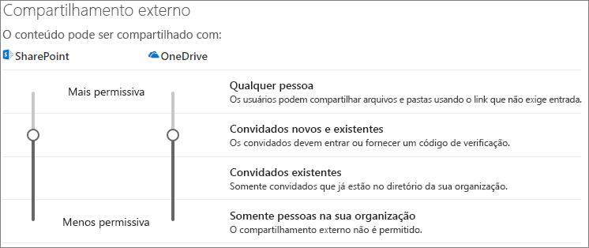
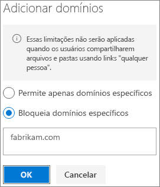

# Limitar a exposição acidental de arquivos em compartilhamentos com convidados

Ao compartilhar arquivos e pastas com convidados, há várias opções para reduzir as chances de compartilhar informações confidenciais acidentalmente. Você pode escolher a opção apresentada neste artigo que atenda melhor às necessidades da sua organização.

## Usar as práticas recomendadas para links para Qualquer pessoa

Se as pessoas em sua organização precisarem fazer compartilhamentos não autenticados, mas você está preocupado que convidados não autenticados façam modificações no conteúdo, leia [Práticas recomendadas para compartilhamento não autenticado](best-practices-anonymous-sharing.md) para obter diretrizes sobre como trabalhar com o compartilhamento não autenticado em sua organização.

## Desativar links para Qualquer pessoa

Recomenda-se deixar os links para *Qualquer pessoa* habilitados para o conteúdo apropriado porque essa é a maneira mais fácil de compartilhar, além de poder ajudar a reduzir o risco de usuários que buscam soluções diferentes e fora do controle do departamento de TI. Os links para *Qualquer pessoa* podem ser encaminhados a outras pessoas, mas o acesso aos arquivos só estará disponível para os usuários que tiverem o link.

Caso você queira que os convidados sempre façam sua autenticação ao acessar o conteúdo no SharePoint, Grupos ou no Teams, você pode desativar o compartilhamento a *Qualquer pessoa*. Isso impedirá usuários de compartilharem conteúdo não autenticado.

Mesmo desabilitando os links para *Qualquer pessoa*, os usuários continuarão podendo fazer compartilhamentos facilmente com convidados usando links para *Pessoas específicas*. Nesse caso, todos os convidados precisarão se autenticar para poder acessar o conteúdo compartilhado.

Dependendo das suas necessidades, você pode desabilitar links para *Qualquer pessoa* para sites específicos ou para toda a organização.

Para desativar os links para *Qualquer pessoa* da sua organização
1. No centro de administração do SharePoint, na navegação à esquerda, clique em **Compartilhamento**.
2. Defina as configurações de compartilhamento externo do SharePoint para **Convidados novos e existentes**. 
   
3. Clique em **Salvar**.

Para desativar os links para *Qualquer pessoa* de um site
1. No centro de administração do SharePoint, na navegação à esquerda, expanda a opção **Sites** e clique em **Sites ativos**.
2. Selecione o site da equipe que você acabou de criar.
3. Na faixa de opções, clique em **Compartilhamento**.
4. Verifique se o compartilhamento está definido como **Convidados novos e existentes**. 
   
5. Caso tenha feito alterações, clique em **Salvar**.

## Filtragem de domínios

Você pode usar as listas de permissão ou negação de domínio para determinar quais domínios podem receber convidados dos seus usuários.

Com uma lista de permissão, você pode criar uma lista de domínios específicos que podem receber convidados dos usuários da sua organização. Nos outros domínios, os convites ficam bloqueados. Se sua organização só colabora com convidados presentes em uma lista de domínios específicos, você pode usar esse recurso para impedir o compartilhamento com outros domínios.

Com uma lista de negação, você pode criar uma lista de domínios específicos que não podem receber convidados dos usuários da sua organização. Nos domínios presentes na lista, os convites ficam bloqueados. Isso pode ser útil, por exemplo, se você tiver concorrentes e quiser impedir que eles se tornem convidados em sua organização.

As listas de permissão e negação afetam apenas o compartilhamento com convidados autenticados. Os usuários continuarão podendo fazer compartilhamentos com convidados de domínios proibidos usando links para *Qualquer pessoa* caso você ainda não os tenha desabilitado. Para obter os melhores resultados com listas de permissão e negação de domínio, cogite desabilitar os links para *Qualquer pessoa* conforme descrito acima.

Para configurar uma lista de permissão ou negação de domínio para compartilhamento de convidados
1. No centro de administração do SharePoint, na navegação à esquerda, clique em **Compartilhamento**.
2. Em **Configurações avançadas para compartilhamento externo**, marque a caixa de seleção **Limitar compartilhamento externo por domínio**.
3. Clique em **Adicionar domínios**.
4. Selecione se deseja bloquear domínios, digite os domínios e clique em **OK.** 
   
5. Clique em **Salvar**.

Caso deseje limitar o compartilhamento por domínio em um nível superior ao SharePoint e ao OneDrive, você pode [permitir ou bloquear convites para usuários B2B de organizações específicas](https://docs.microsoft.com/azure/active-directory/b2b/allow-deny-list) no Azure Active Directory. (Você deve configurar a [integração do SharePoint e do OneDrive com a versão prévia do B2B do Azure AD](https://docs.microsoft.com/sharepoint/sharepoint-azureb2b-integration-preview) para que essas configurações se apliquem ao SharePoint e ao OneDrive).

## Limitar o compartilhamento de arquivos, pastas e sites por convidados a grupos de segurança específicos

Você pode restringir o compartilhamento de arquivos, pastas e sites por convidados a membros de um grupo de segurança específico. Isso será útil caso você queira habilitar o compartilhamento por convidados, mas com um fluxo de trabalho de aprovação ou processo de solicitação.

Para limitar o compartilhamento de convidados a membros de um grupo de segurança
1. No centro de administração do SharePoint, na navegação à esquerda, clique em **Compartilhamento**.
2. Em **Outras configurações** siga o link **Limitar o compartilhamento externo a específicos grupos de segurança**.
3. Em **Quem pode compartilhar fora da sua organização**, marque uma ou ambas as caixas de seleção: a. **Permitir que apenas os usuários dos grupos de segurança selecionados compartilhem com usuários externos autenticados** para especificar um grupo de segurança que pode fazer o compartilhamento com usuários autenticados; b. **Permitir que apenas os usuários dos grupos de segurança selecionados compartilhem com usuários externos autenticados e usando links anônimos** para especificar um grupo de segurança que pode fazer o compartilhamento com usuários autenticados e usando links para Qualquer pessoa.
4. Clique em **OK**.

Tenha em mente que isso se aplica a arquivos, pastas e sites, mas não a grupos do Office 365 ou Teams. Quando os membros convidarem pessoas para um grupo privado do Office 365 ou para uma equipe privada no Microsoft Teams, o convite será enviado ao proprietário do grupo ou da equipe para aprovação.

## Confira também

[Criar um ambiente seguro de compartilhamento de convidados](create-a-secure-guest-sharing-environment.md)

[Práticas recomendadas para compartilhar arquivos e pastas com usuários anônimos](best-practices-anonymous-sharing.md)