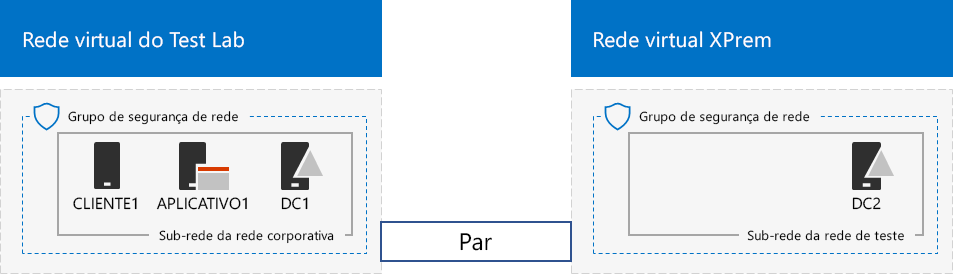
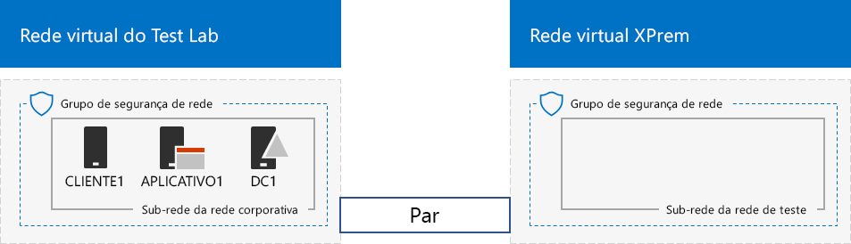

# <a name="simulated-cross-premises-virtual-network-in-azure"></a><span data-ttu-id="e02e0-103">Rede virtual simulado entre locais no Windows Azure</span><span class="sxs-lookup"><span data-stu-id="e02e0-103">Simulated cross-premises virtual network in Azure</span></span>

 <span data-ttu-id="e02e0-104">**Resumo:** Crie uma rede virtual de locais cruzados simulado in Microsoft Azure como um ambiente de desenvolvimento e teste.</span><span class="sxs-lookup"><span data-stu-id="e02e0-104">**Summary:** Create a simulated cross-premises virtual network in Microsoft Azure as a dev/test environment.</span></span>
  
<span data-ttu-id="e02e0-p101">Este artigo o orienta a criação de um ambiente de nuvem híbrida simulado com o Microsoft Azure using duas redes virtuais do Azure. Aqui está a configuração resultante.</span><span class="sxs-lookup"><span data-stu-id="e02e0-p101">This article steps you through creating a simulated hybrid cloud environment with Microsoft Azure using two Azure virtual networks. Here is the resulting configuration.</span></span> 
  

  
<span data-ttu-id="e02e0-108">Isso simula um ambiente de produção de nuvem do Windows Azure IaaS híbrida e consiste em:</span><span class="sxs-lookup"><span data-stu-id="e02e0-108">This simulates an Azure IaaS hybrid cloud production environment and consists of:</span></span>
  
- <span data-ttu-id="e02e0-109">Uma rede de simulado e simplificado local hospedada em uma rede virtual do Azure (a rede virtual do laboratório de teste).</span><span class="sxs-lookup"><span data-stu-id="e02e0-109">A simulated and simplified on-premises network hosted in an Azure virtual network (the TestLab virtual network).</span></span>
    
- <span data-ttu-id="e02e0-110">Uma rede virtual de locais cruzados simulado hospedada no Windows Azure (XPrem).</span><span class="sxs-lookup"><span data-stu-id="e02e0-110">A simulated cross-premises virtual network hosted in Azure (XPrem).</span></span>
    
- <span data-ttu-id="e02e0-111">Um relacionamento de VNet a correspondência entre as duas redes virtuais.</span><span class="sxs-lookup"><span data-stu-id="e02e0-111">A VNet peering relationship between the two virtual networks.</span></span>
    
- <span data-ttu-id="e02e0-112">Um controlador de domínio secundário na rede virtual XPrem.</span><span class="sxs-lookup"><span data-stu-id="e02e0-112">A secondary domain controller in the XPrem virtual network.</span></span>
    
<span data-ttu-id="e02e0-113">Isso oferece que uma base e iniciando comuns apontar a partir do qual você pode:</span><span class="sxs-lookup"><span data-stu-id="e02e0-113">This provides a basis and common starting point from which you can:</span></span> 
  
- <span data-ttu-id="e02e0-114">Desenvolver e testar aplicativos em um ambiente de nuvem simulado Azure IaaS híbrido.</span><span class="sxs-lookup"><span data-stu-id="e02e0-114">Develop and test applications in a simulated Azure IaaS hybrid cloud environment.</span></span>
    
- <span data-ttu-id="e02e0-115">Crie configurações de teste de computadores, alguns dentro da rede virtual do laboratório de teste e alguns dentro da rede virtual XPrem, para simular híbrido baseado em nuvem IT as cargas de trabalho.</span><span class="sxs-lookup"><span data-stu-id="e02e0-115">Create test configurations of computers, some within the TestLab virtual network and some within the XPrem virtual network, to simulate hybrid cloud-based IT workloads.</span></span>
    
<span data-ttu-id="e02e0-116">Há três fases principais para configurar esse ambiente de desenvolvimento/teste:</span><span class="sxs-lookup"><span data-stu-id="e02e0-116">There are three major phases to setting up this dev/test environment:</span></span>
  
1. <span data-ttu-id="e02e0-117">Configure a rede virtual do laboratório de teste.</span><span class="sxs-lookup"><span data-stu-id="e02e0-117">Configure the TestLab virtual network.</span></span>
    
2. <span data-ttu-id="e02e0-118">Crie a rede virtual entre locais.</span><span class="sxs-lookup"><span data-stu-id="e02e0-118">Create the cross-premises virtual network.</span></span>
    
3. <span data-ttu-id="e02e0-119">Configure DC2.</span><span class="sxs-lookup"><span data-stu-id="e02e0-119">Configure DC2.</span></span>
    
> [!NOTE]
> <span data-ttu-id="e02e0-120">Essa configuração requer uma assinatura paga de Azure.</span><span class="sxs-lookup"><span data-stu-id="e02e0-120">This configuration requires a paid Azure subscription.</span></span> 
  

  
> [!TIP]
> <span data-ttu-id="e02e0-122">Clique [aqui](http://aka.ms/catlgstack) para obter um mapa visual para todos os artigos na pilha de um Microsoft Cloud Test Lab Guide.</span><span class="sxs-lookup"><span data-stu-id="e02e0-122">Click [here](http://aka.ms/catlgstack) for a visual map to all the articles in the One Microsoft Cloud Test Lab Guide stack.</span></span>
  
## <a name="phase-1-configure-the-testlab-virtual-network"></a><span data-ttu-id="e02e0-123">Fase 1: Configurar a rede virtual do laboratório de teste</span><span class="sxs-lookup"><span data-stu-id="e02e0-123">Phase 1: Configure the TestLab virtual network</span></span>

<span data-ttu-id="e02e0-124">Use as instruções no [ambiente de desenvolvimento e teste de configuração básica](base-configuration-dev-test-environment.md) para configurar os computadores DC1, APP1 e CLIENT1 na rede virtual Azure chamada de laboratório de teste.</span><span class="sxs-lookup"><span data-stu-id="e02e0-124">Use the instructions in [Base Configuration dev/test environment](base-configuration-dev-test-environment.md) to configure the DC1, APP1, and CLIENT1 computers in the Azure virtual network named TestLab.</span></span>
  
<span data-ttu-id="e02e0-125">Esta é a configuração atual.</span><span class="sxs-lookup"><span data-stu-id="e02e0-125">This is your current configuration.</span></span> 
  

  
## <a name="phase-2-create-the-xprem-virtual-network"></a><span data-ttu-id="e02e0-127">Fase 2: Criar a rede virtual à XPrem</span><span class="sxs-lookup"><span data-stu-id="e02e0-127">Phase 2: Create the XPrem virtual network</span></span>

<span data-ttu-id="e02e0-128">Nesta fase, você cria e configurar a rede virtual à nova XPrem e se conectar à rede virtual laboratório de teste com VNet correspondência.</span><span class="sxs-lookup"><span data-stu-id="e02e0-128">In this phase, you create and configure the new XPrem virtual network and then connect it to the TestLab virtual network with VNet peering.</span></span>
  
<span data-ttu-id="e02e0-129">Em primeiro lugar, inicie um prompt do Azure PowerShell no computador local.</span><span class="sxs-lookup"><span data-stu-id="e02e0-129">First, start an Azure PowerShell prompt on your local computer.</span></span>
  
> [!NOTE]
> <span data-ttu-id="e02e0-p102">O comando a seguir define usar a versão mais recente do Azure PowerShell. Consulte a [Introdução ao cmdlets do PowerShell do Windows Azure](https://docs.microsoft.com/en-us/powershell/azureps-cmdlets-docs/).</span><span class="sxs-lookup"><span data-stu-id="e02e0-p102">The following command sets use the latest version of Azure PowerShell. See [Get started with Azure PowerShell cmdlets](https://docs.microsoft.com/en-us/powershell/azureps-cmdlets-docs/).</span></span> 
  
<span data-ttu-id="e02e0-132">Inscreva-se à sua conta do Windows Azure com o seguinte comando.</span><span class="sxs-lookup"><span data-stu-id="e02e0-132">Sign in to your Azure account with the following command.</span></span>
  
```
Login-AzureRMAccount
```

> [!TIP]
> <span data-ttu-id="e02e0-133">Clique [aqui](https://gallery.technet.microsoft.com/PowerShell-commands-for-7844edd0) para obter um arquivo de texto que contém todos os comandos do PowerShell neste artigo.</span><span class="sxs-lookup"><span data-stu-id="e02e0-133">Click [here](https://gallery.technet.microsoft.com/PowerShell-commands-for-7844edd0) to get a text file that contains all of the PowerShell commands in this article.</span></span>
  
<span data-ttu-id="e02e0-134">Para obter o nome de sua assinatura, use este comando.</span><span class="sxs-lookup"><span data-stu-id="e02e0-134">Get your subscription name using the following command.</span></span>
  
```
Get-AzureRMSubscription | Sort Name | Select Name
```

<span data-ttu-id="e02e0-p103">Defina sua assinatura do Windows Azure. Substituir tudo entre aspas, incluindo o \< e > caracteres, com os nomes corretos.</span><span class="sxs-lookup"><span data-stu-id="e02e0-p103">Set your Azure subscription. Replace everything within the quotes, including the \< and > characters, with the correct names.</span></span>
  
```
$subscrName="<subscription name>"
Get-AzureRmSubscription -SubscriptionName $subscrName | Select-AzureRmSubscription
```

<span data-ttu-id="e02e0-137">Em seguida, crie a rede virtual à XPrem e protegê-lo com um grupo de segurança de rede com esses comandos.</span><span class="sxs-lookup"><span data-stu-id="e02e0-137">Next, create the XPrem virtual network and protect it with a network security group with these commands.</span></span>
  
```
$rgName="<name of the resource group that you used for your TestLab virtual network>"
$locName=(Get-AzureRmResourceGroup -Name $rgName).Location
$Testnet=New-AzureRMVirtualNetworkSubnetConfig -Name "Testnet" -AddressPrefix 192.168.0.0/24
New-AzureRMVirtualNetwork -Name "XPrem" -ResourceGroupName $rgName -Location $locName -AddressPrefix 192.168.0.0/16 -Subnet $Testnet -DNSServer 10.0.0.4
$rule1=New-AzureRMNetworkSecurityRuleConfig -Name "RDPTraffic" -Description "Allow RDP to all VMs on the subnet" -Access Allow -Protocol Tcp -Direction Inbound -Priority 100 -SourceAddressPrefix Internet -SourcePortRange * -DestinationAddressPrefix * -DestinationPortRange 3389
New-AzureRMNetworkSecurityGroup -Name "Testnet" -ResourceGroupName $rgName -Location $locName -SecurityRules $rule1
$vnet=Get-AzureRMVirtualNetwork -ResourceGroupName $rgName -Name XPrem
$nsg=Get-AzureRMNetworkSecurityGroup -Name "Testnet" -ResourceGroupName $rgName
Set-AzureRMVirtualNetworkSubnetConfig -VirtualNetwork $vnet -Name "Testnet" -AddressPrefix 192.168.0.0/24 -NetworkSecurityGroup $nsg
```

<span data-ttu-id="e02e0-138">Em seguida, você cria o relacionamento de correspondência VNet entre o laboratório de teste e XPrem VNets com esses comandos.</span><span class="sxs-lookup"><span data-stu-id="e02e0-138">Next, you create the VNet peering relationship between the TestLab and XPrem VNets with these commands.</span></span>
  
```
$rgName="<name of the resource group that you used for your TestLab virtual network>"
$vnet1=Get-AzureRmVirtualNetwork -ResourceGroupName $rgName -Name TestLab
$vnet2=Get-AzureRmVirtualNetwork -ResourceGroupName $rgName -Name XPrem
Add-AzureRmVirtualNetworkPeering -Name TestLab2XPrem -VirtualNetwork $vnet1 -RemoteVirtualNetworkId $vnet2.Id
Add-AzureRmVirtualNetworkPeering -Name XPrem2TestLab -VirtualNetwork $vnet2 -RemoteVirtualNetworkId $vnet1.Id
```

<span data-ttu-id="e02e0-139">Esta é a configuração atual.</span><span class="sxs-lookup"><span data-stu-id="e02e0-139">This is your current configuration.</span></span> 
  

  
## <a name="phase-3-configure-dc2"></a><span data-ttu-id="e02e0-141">Fase 3: Configurar DC2</span><span class="sxs-lookup"><span data-stu-id="e02e0-141">Phase 3: Configure DC2</span></span>

<span data-ttu-id="e02e0-142">Nesta fase, você cria a máquina virtual do DC2 na rede virtual XPrem e, em seguida, configure-o como um controlador de domínio de réplica.</span><span class="sxs-lookup"><span data-stu-id="e02e0-142">In this phase, you create the DC2 virtual machine in the XPrem virtual network and then configure it as a replica domain controller.</span></span>
  
<span data-ttu-id="e02e0-p104">Primeiro, crie uma máquina virtual para DC2. Execute estes comandos no prompt de comando do PowerShell do Azure no computador local.</span><span class="sxs-lookup"><span data-stu-id="e02e0-p104">First, create a virtual machine for DC2. Run these commands at the Azure PowerShell command prompt on your local computer.</span></span>
  
```
$rgName="<your resource group name>"
$locName=(Get-AzureRmResourceGroup -Name $rgName).Location
$vnet=Get-AzureRMVirtualNetwork -Name XPrem -ResourceGroupName $rgName
$pip=New-AzureRMPublicIpAddress -Name DC2-PIP -ResourceGroupName $rgName -Location $locName -AllocationMethod Dynamic
$nic=New-AzureRMNetworkInterface -Name DC2-NIC -ResourceGroupName $rgName -Location $locName -SubnetId $vnet.Subnets[0].Id -PublicIpAddressId $pip.Id -PrivateIpAddress 192.168.0.4
$vm=New-AzureRMVMConfig -VMName DC2 -VMSize Standard_A1
$cred=Get-Credential -Message "Type the name and password of the local administrator account for DC2."
$vm=Set-AzureRMVMOperatingSystem -VM $vm -Windows -ComputerName DC2 -Credential $cred -ProvisionVMAgent -EnableAutoUpdate
$vm=Set-AzureRMVMSourceImage -VM $vm -PublisherName MicrosoftWindowsServer -Offer WindowsServer -Skus 2016-Datacenter -Version "latest"
$vm=Add-AzureRMVMNetworkInterface -VM $vm -Id $nic.Id
$vm=Set-AzureRmVMOSDisk -VM $vm -Name "DC2-OS" -DiskSizeInGB 128 -CreateOption FromImage -StorageAccountType "StandardLRS"
$diskConfig=New-AzureRmDiskConfig -AccountType "StandardLRS" -Location $locName -CreateOption Empty -DiskSizeGB 20
$dataDisk1=New-AzureRmDisk -DiskName "DC2-DataDisk1" -Disk $diskConfig -ResourceGroupName $rgName
$vm=Add-AzureRmVMDataDisk -VM $vm -Name "DC2-DataDisk1" -CreateOption Attach -ManagedDiskId $dataDisk1.Id -Lun 1
New-AzureRMVM -ResourceGroupName $rgName -Location $locName -VM $vm
```

<span data-ttu-id="e02e0-145">Em seguida, conecte-se para a nova máquina virtual DC2 a partir do [portal do Windows Azure](https://portal.azure.com) usando seu nome de conta de administrador local e a senha.</span><span class="sxs-lookup"><span data-stu-id="e02e0-145">Next, connect to the new DC2 virtual machine from the [Azure portal](https://portal.azure.com) using its local administrator account name and password.</span></span>
  
<span data-ttu-id="e02e0-p105">Em seguida, configure uma regra de Firewall do Windows para permitir o tráfego para testar a conectividade básica. A partir de um prompt de comando do Windows PowerShell de nível de administrador no DC2, execute estes comandos.</span><span class="sxs-lookup"><span data-stu-id="e02e0-p105">Next, configure a Windows Firewall rule to allow traffic for basic connectivity testing. From an administrator-level Windows PowerShell command prompt on DC2, run these commands.</span></span> 
  
```
Set-NetFirewallRule -DisplayName "File and Printer Sharing (Echo Request - ICMPv4-In)" -enabled True
ping dc1.corp.contoso.com
```

<span data-ttu-id="e02e0-p106">O comando ping deve resultar em quatro respostas bem-sucedidas 10.0.0.4 de endereço IP. Este é um teste de tráfego entre o relacionamento de correspondência VNet.</span><span class="sxs-lookup"><span data-stu-id="e02e0-p106">The ping command should result in four successful replies from IP address 10.0.0.4. This is a test of traffic across the VNet peering relationship.</span></span> 
  
<span data-ttu-id="e02e0-150">Em seguida, adicione o disco de dados extras como um novo volume com a letra da unidade f: com este comando no prompt de comando do Windows PowerShell no DC2.</span><span class="sxs-lookup"><span data-stu-id="e02e0-150">Next, add the extra data disk as a new volume with the drive letter F: with this command from the Windows PowerShell command prompt on DC2.</span></span>
  
```
Get-Disk | Where PartitionStyle -eq "RAW" | Initialize-Disk -PartitionStyle MBR -PassThru | New-Partition -AssignDriveLetter -UseMaximumSize | Format-Volume -FileSystem NTFS -NewFileSystemLabel "WSAD Data"
```

<span data-ttu-id="e02e0-p107">Em seguida, configure DC2 como um controlador de domínio de réplica para o domínio corp.contoso.com. Execute estes comandos no prompt de comando do Windows PowerShell no DC2.</span><span class="sxs-lookup"><span data-stu-id="e02e0-p107">Next, configure DC2 as a replica domain controller for the corp.contoso.com domain. Run these commands from the Windows PowerShell command prompt on DC2.</span></span>
  
```
Install-WindowsFeature AD-Domain-Services -IncludeManagementTools
Install-ADDSDomainController -Credential (Get-Credential CORP\\User1) -DomainName "corp.contoso.com" -InstallDns:$true -DatabasePath "F:\\NTDS" -LogPath "F:\\Logs" -SysvolPath "F:\\SYSVOL"
```

<span data-ttu-id="e02e0-153">Observe que você será solicitado a fornecer os dois CORP\\User1 senha e uma senha de modo de restauração de serviços de diretório (DSRM) e reiniciar DC2.</span><span class="sxs-lookup"><span data-stu-id="e02e0-153">Note that you are prompted to supply both the CORP\\User1 password and a Directory Services Restore Mode (DSRM) password, and to restart DC2.</span></span> 
  
<span data-ttu-id="e02e0-p108">Agora que a rede virtual à XPrem tem seu próprio servidor DNS (DC2), você deve configurar a rede virtual à XPrem para usar este servidor DNS. Execute esses comandos no prompt de comando do PowerShell do Windows Azure no computador local.</span><span class="sxs-lookup"><span data-stu-id="e02e0-p108">Now that the XPrem virtual network has its own DNS server (DC2), you must configure the XPrem virtual network to use this DNS server. Run these commands from the Azure PowerShell command prompt on your local computer.</span></span>
  
```
$vnet=Get-AzureRmVirtualNetwork -ResourceGroupName $rgName -name "XPrem"
$vnet.DhcpOptions.DnsServers="192.168.0.4" 
Set-AzureRmVirtualNetwork -VirtualNetwork $vnet
Restart-AzureRmVM -ResourceGroupName $rgName -Name "DC2"
```

<span data-ttu-id="e02e0-p109">Do portal do Windows Azure no computador local, se conecte ao DC1 com CORP\\User1 credenciais. Para configurar o domínio CORP para que os usuários e computadores usam seu controlador de domínio local para autenticação, execute estes comandos em um prompt de comando do Windows PowerShell de nível de administrador no DC1.</span><span class="sxs-lookup"><span data-stu-id="e02e0-p109">From the Azure portal on your local computer, connect to DC1 with the CORP\\User1 credentials. To configure the CORP domain so that computers and users use their local domain controller for authentication, run these commands from an administrator-level Windows PowerShell command prompt on DC1.</span></span>
  
```
New-ADReplicationSite -Name "TestLab" 
New-ADReplicationSite -Name "XPrem"
New-ADReplicationSubnet -Name "10.0.0.0/8" -Site "TestLab"
New-ADReplicationSubnet -Name "192.168.0.0/16" -Site "XPrem"
```

<span data-ttu-id="e02e0-158">Esta é a configuração atual.</span><span class="sxs-lookup"><span data-stu-id="e02e0-158">This is your current configuration.</span></span> 
  

  
<span data-ttu-id="e02e0-160">Seu ambiente de nuvem híbrida Azure simulado agora está pronta para teste.</span><span class="sxs-lookup"><span data-stu-id="e02e0-160">Your simulated Azure hybrid cloud environment is now ready for testing.</span></span>
  
## <a name="next-step"></a><span data-ttu-id="e02e0-161">Próxima etapa</span><span class="sxs-lookup"><span data-stu-id="e02e0-161">Next step</span></span>

<span data-ttu-id="e02e0-162">Use esse ambiente de desenvolvimento e teste para simular a um [farm do SharePoint Server 2016 intranet hospedado no Windows Azure](https://technet.microsoft.com/library/mt806351%28v=office.16%29.aspx).</span><span class="sxs-lookup"><span data-stu-id="e02e0-162">Use this dev/test environment to simulate a [SharePoint Server 2016 intranet farm hosted in Azure](https://technet.microsoft.com/library/mt806351%28v=office.16%29.aspx).</span></span>
  
## <a name="see-also"></a><span data-ttu-id="e02e0-163">Veja também</span><span class="sxs-lookup"><span data-stu-id="e02e0-163">See Also</span></span>

[<span data-ttu-id="e02e0-164">Ambiente de desenvolvimento e teste de configuração de base</span><span class="sxs-lookup"><span data-stu-id="e02e0-164">Base Configuration dev/test environment</span></span>](base-configuration-dev-test-environment.md)
  
[<span data-ttu-id="e02e0-165">Ambiente de desenvolvimento e teste do Office 365</span><span class="sxs-lookup"><span data-stu-id="e02e0-165">Office 365 dev/test environment</span></span>](office-365-dev-test-environment.md)
  
[<span data-ttu-id="e02e0-166">DirSync para seu ambiente de desenvolvimento e teste do Office 365</span><span class="sxs-lookup"><span data-stu-id="e02e0-166">DirSync for your Office 365 dev/test environment</span></span>](dirsync-for-your-office-365-dev-test-environment.md)
  
[<span data-ttu-id="e02e0-167">Segurança de aplicativo de nuvem para seu ambiente de desenvolvimento e teste do Office 365</span><span class="sxs-lookup"><span data-stu-id="e02e0-167">Cloud App Security for your Office 365 dev/test environment</span></span>](cloud-app-security-for-your-office-365-dev-test-environment.md)
  
[<span data-ttu-id="e02e0-168">Proteção de ameaça avançada para seu ambiente de desenvolvimento e teste do Office 365</span><span class="sxs-lookup"><span data-stu-id="e02e0-168">Advanced Threat Protection for your Office 365 dev/test environment</span></span>](advanced-threat-protection-for-your-office-365-dev-test-environment.md)
  
[<span data-ttu-id="e02e0-169">Adoção da nuvem e soluções híbridas</span><span class="sxs-lookup"><span data-stu-id="e02e0-169">Cloud adoption and hybrid solutions</span></span>](cloud-adoption-and-hybrid-solutions.md)


