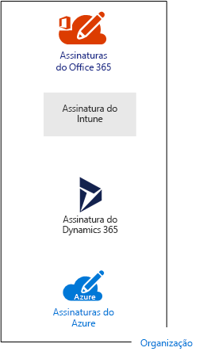
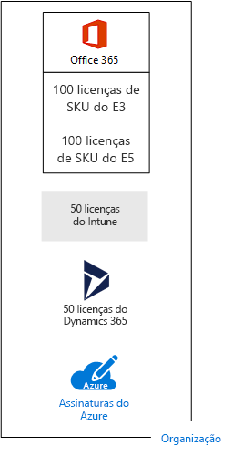
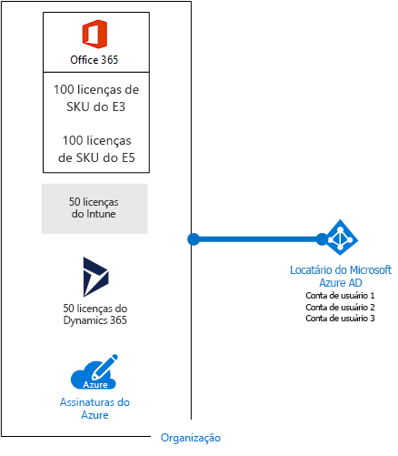
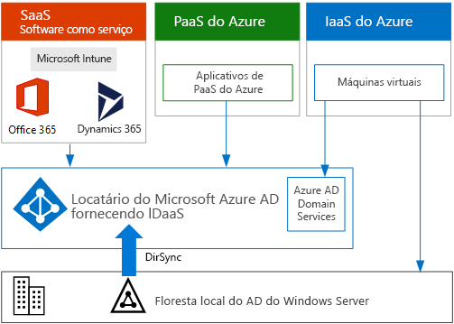

# Assinaturas, licenças, contas e locatários para ofertas de nuvem da MicrosoftSubscriptions, licenses, accounts, and tenants for Microsoft's cloud offerings

 **Resumo:** entenda as relações das organizações, assinaturas, licenças, contas de usuário e locatários para ofertas de nuvem da Microsoft.**Summary:** Understand the relationships of organizations, subscriptions, licenses, user accounts, and tenants across Microsoft's cloud offerings.
  
A Microsoft fornece uma hierarquia de organizações, assinaturas, licenças e contas de usuário para o uso consistente de identidades e cobrança para todas as ofertas de nuvem:Microsoft provides a hierarchy of organizations, subscriptions, licenses, and user accounts for consistent use of identities and billing across its cloud offerings:
  
- Microsoft Office 365Microsoft Office 365
    
    Confira os [planos de negócios e preços](https://products.office.com/business/compare-office-365-for-business-plans) para saber mais.See [business plans and pricing](https://products.office.com/business/compare-office-365-for-business-plans) for more information.
    
- Microsoft AzureMicrosoft Azure
    
    Confira os [preços do Azure](https://azure.microsoft.com/pricing/) para saber mais.See [Azure pricing](https://azure.microsoft.com/pricing/) for more information.
    
- Microsoft Intune e Enterprise Mobility + Security (EMS)Microsoft Intune and the Enterprise Mobility + Security (EMS)
    
    Confira os [preços do Intune](https://www.microsoft.com/cloud-platform/microsoft-intune-pricing) para saber mais.See [Intune pricing](https://www.microsoft.com/cloud-platform/microsoft-intune-pricing) for more information.
    
- Microsoft Dynamics 365Microsoft Dynamics 365
    
    Confira os [preços do Dynamics 365](https://dynamics.microsoft.com/) para saber mais.See [Dynamics 365 pricing](https://dynamics.microsoft.com/) for more information.
    
## Elementos da hierarquiaElements of the hierarchy

Aqui estão os elementos da hierarquia:Here are the elements of the hierarchy:
  
### OrganizaçãoOrganization

Uma organização representa uma entidade de negócios que usa ofertas de nuvem da Microsoft, geralmente identificadas por um ou mais nomes de domínio do Sistema de Nomes de Domínio (DNS), como contoso.com. A organização é um contêiner para assinaturas.An organization represents a business entity that is using Microsoft cloud offerings, typically identified by one or more public Domain Name System (DNS) domain names, such as contoso.com. The organization is a container for subscriptions.
  
### AssinaturasSubscriptions

Uma assinatura é um contrato com a Microsoft para usar uma ou mais plataformas ou serviços em nuvem da Microsoft, pelos quais se acumulam encargos com base em uma taxa de licença por usuário ou no consumo de recursos baseado em nuvem. As ofertas em nuvem de Software como Serviço (SaaS) da Microsoft (Office 365, Intune/EMS e do Dynamics 365) cobram taxas de licença por usuário. As ofertas em nuvem de Plataforma como Serviço (PaaS) e Infraestrutura como Serviço (IaaS) (Azure) da Microsoft são cobradas com base no consumo de recursos em nuvem.A subscription is an agreement with Microsoft to use one or more Microsoft cloud platforms or services, for which charges accrue based on either a per-user license fee or on cloud-based resource consumption. Microsoft's Software as a Service (SaaS)-based cloud offerings (Office 365, Intune/EMS, and Dynamics 365) charge per-user license fees. Microsoft's Platform as a Service (PaaS) and Infrastructure as a Service (IaaS) cloud offerings (Azure) charge based on cloud resource consumption.
  
Você também pode usar uma assinatura de avaliação, mas a assinatura expira após um quantidade específica de horas ou tarifas de consumo. Você pode converter uma assinatura de avaliação para uma assinatura paga.You can also use a trial subscription, but the subscription expires after a specific amount of time or consumption charges. You can convert a trial subscription to a paid subscription.
  
As organizações podem ter várias assinaturas para ofertas de nuvem da Microsoft. A Figura 1 mostra um exemplo.Organizations can have multiple subscriptions for Microsoft's cloud offerings. Figure 1 shows an example.
  
**Figura 1: Exemplo de várias assinaturas de uma organizaçãoFigure 1: Example of multiple subscriptions for an organization**

  
A Figura 1 mostra uma única organização com várias assinaturas do Office 365, uma assinatura do Intune, outra assinatura do Dynamics 365 e várias assinaturas do Azure.Figure 1 shows a single organization that has multiple Office 365 subscriptions, an Intune subscription, a Dynamics 365 subscription, and multiple Azure subscriptions.
  
### LicençasLicenses

Para ofertas da nuvem de SaaS da Microsoft, uma licença permite que uma determinada conta de usuário use a oferta de serviços de nuvem. Será cobrada uma taxa mensal fixa como parte da sua assinatura. Os administradores de atribuem licenças às contas de usuários individuais na assinatura. Por exemplo, na Figura 2, a Contoso Corporation tem uma assinatura do Office 365 Enterprise E5 com 100 licenças, o que permite que até 100 contas de usuários individuais usem os serviços e recursos do Enterprise E5.For Microsoft's SaaS cloud offerings, a license allows a specific user account to use the services of the cloud offering. You are charged a fixed monthly fee as part of your subscription. Administrators assign licenses to individual user accounts in the subscription. For the example in Figure 2, the Contoso Corporation has an Office 365 Enterprise E5 subscription with 100 licenses, which allows to up to 100 individual user accounts to use Enterprise E5 features and services.
  
**Figura 2: Licenças em assinaturas SaaS para uma organizaçãoFigure 2: Licenses within the SaaS-based subscriptions for an organization**

  
Para serviços de nuvem baseados em PaaS do Azure, as licenças de software são integradas ao preço do serviço.For Azure PaaS-based cloud services, software licenses are built into the service pricing.
  
Para máquinas virtuais baseadas em IaaS do Azure, talvez seja necessário ter licenças adicionais para usar o software ou aplicativo instalados em uma imagem de máquina virtual. Algumas imagens de máquinas virtuais têm versões licenciadas do software instalado e o custo é incluído na taxa por minuto para o servidor. Os exemplos são as imagens de máquinas virtuais do SQL Server 2014 e do SQL Server 2016.For Azure IaaS-based virtual machines, additional licenses to use the software or application installed on a virtual machine image might be required. Some virtual machine images have licensed versions of software installed and the cost is included in the per-minute rate for the server. Examples are the virtual machine images for SQL Server 2014 and SQL Server 2016. 
  
Algumas imagens máquina virtual tem versões de avaliação dos aplicativos instalados e precisam de licenças adicionais de aplicativos de software para uso além do período de avaliação. Por exemplo, a imagem de máquina virtual de avaliação do SharePoint Server 2016 inclui uma versão de avaliação pré-instalada do SharePoint Server 2016. Para continuar usando o SharePoint Server 2016 após a data de vencimento da avaliação, é necessário comprar uma licença do SharePoint Server 2016 e licenças de cliente da Microsoft. Esses encargos são separados da assinatura do Azure e a taxa por minuto para executar a máquina virtual ainda se aplica.Some virtual machine images have trial versions of applications installed and need additional software application licenses for use beyond the trial period. For example, the SharePoint Server 2016 Trial virtual machine image includes a trial version of SharePoint Server 2016 pre-installed. To continue using SharePoint Server 2016 after the trail expiration date, you must purchase a SharePoint Server 2016 license and client licenses from Microsoft. These charges are separate from the Azure subscription and the per-minute rate to run the virtual machine still applies.
  
### Contas de usuárioUser accounts

Contas de usuário para todas as ofertas da nuvem da Microsoft são armazenadas em um locatário do Azure Active Directory (AD) que contém os grupos e as contas de usuários. Um locatário do Azure AD pode ser sincronizado com suas contas existentes do Active Directory Domain Services (AD DS) usando o Azure AD Connect, um serviço baseado no Windows Server, algo conhecido como sincronização de diretórios (DirSync).User accounts for all of Microsoft's cloud offerings are stored in an Azure Active Directory (AD) tenant, which contains user accounts and groups. An Azure AD tenant can be synchronized with your existing Windows Server AD accounts using Azure AD Connect, a Windows server-based service. This is known as directory synchronization (DirSync).
  
A Figura 3 mostra um exemplo de várias assinaturas de uma organização usando um locatário comum do Azure AD que contém as contas da organização.Figure 3 shows an example of multiple subscriptions of an organization using a common Azure AD tenant that contains the organization's accounts.
  
**Figura 3: Várias assinaturas de uma organização que usam o mesmo locatário do Azure ADFigure 3: Multiple subscriptions of an organization that use the same Azure AD tenant**

  
### LocatáriosTenants

Para ofertas de nuvem de SaaS, o locatário é o local regional que engloba os servidores que fornecem serviços de nuvem. Por exemplo, a Contoso Corporation escolheu a região europeia para hospedar seus locatários do Office 365, do EMS e do Dynamics 365 para os 15.000 trabalhadores da sede de Paris.For SaaS cloud offerings, the tenant is the regional location that houses the servers providing cloud services. For example, the Contoso Corporation chose the European region to host its Office 365, EMS, and Dynamics 365 tenants for the 15,000 workers in their Paris headquarters.
  
Serviços de PaaS do Azure e as cargas de trabalho baseadas em máquina virtual hospedadas na infraestrutura como serviço do Azure podem ter locatários em qualquer datacenter do Azure do mundo. Especifique o datacenter do Azure, ou o local, ao criar o serviço ou o aplicativo de PaaS do Azure ou o elemento de uma carga de trabalho de IaaS.Azure PaaS services and virtual machine-based workloads hosted in Azure IaaS can have tenancy in any Azure datacenter across the world. You specify the Azure datacenter, known as the location, when you create the Azure PaaS app or service or element of an IaaS workload.
  
Um locatário do Azure AD é uma instância específica do Azure AD que contém contas e grupos. Assinaturas pagas ou de avaliação do Office 365, do Dynamics 365 ou do Intune/EMS incluem um locatário gratuito do Azure AD. Este locatário do Azure AD não inclui outros serviços do Azure e não é igual a uma assinatura paga ou de avaliação do Azure.An Azure AD tenant is a specific instance of Azure AD containing accounts and groups. Paid or trial subscriptions of Office 365, Dynamics 365, or Intune/EMS include a free Azure AD tenant. This Azure AD tenant does not include other Azure services and is not the same as an Azure trial or paid subscription.
  
### Resumo da hierarquiaSummary of the hierarchy

Veja aqui uma rápida recapitulação:Here is a quick recap:
  
- Uma organização pode ter várias assinaturasAn organization can have multiple subscriptions
    
  - Uma assinatura pode ter várias licençasA subscription can have multiple licenses
    
  - As licenças podem ser atribuídas a contas de usuários individuaisLicenses can be assigned to individual user accounts
    
  - As contas de usuário são armazenadas em um locatário do Azure ADUser accounts are stored in an Azure AD tenant
    
Aqui está um exemplo da relação das organizações, assinaturas, licenças e contas de usuários:Here is an example of the relationship of organizations, subscriptions, licenses, and user accounts:
  
- Uma organização identificada pelo nome de domínio público.An organization identified by its public domain name.
    
  - Uma assinatura do Office 365 Enterprise E3 com licenças de usuário.An Office 365 Enterprise E3 subscription with user licenses.
    
    Uma assinatura do Office 365 Enterprise E5 com licenças de usuário.An Office 365 Enterprise E5 subscription with user licenses.
    
    Uma assinatura EMS com licenças de usuário.An EMS subscription with user licenses.
    
    Uma assinatura Dynamics 365 com licenças de usuário.A Dynamics 365 subscription with user licenses.
    
    Várias assinaturas do Azure.Multiple Azure subscriptions.
    
  - Contas de usuários da organização em um locatário comum do Azure AD.The organization's user accounts in a common Azure AD tenant.
    
Várias assinaturas de oferta de nuvem da Microsoft podem usar o mesmo locatário do Azure AD, que atua como um provedor de identidade comum. Um locatário central do Azure AD, que contém as contas sincronizadas do AD DS local, fornece a Identidade como serviço (IDaaS) baseada em nuvem para a sua organização, o que é mostrado na Figura 4.Multiple Microsoft cloud offering subscriptions can use the same Azure AD tenant that acts as a common identity provider. A central Azure AD tenant that contains the synchronized accounts of your on-premises Windows Server AD provides cloud-based Identity as a Service (IDaaS) for your organization. This is shown in Figure 4.
  
**Figura 4: IDaaS e contas locais sincronizadas para uma organizaçãoFigure 4: Synchronized on-premises accounts and IDaaS for an organization**

  
A Figura 4 mostra como um locatário comum do Azure AD é usado por ofertas em nuvem da Microsoft para SaaS, aplicativos PaaS do Azure e máquinas virtuais no IaaS do Azure que usam o Azure AD Domain Services. O Azure AD Connect sincroniza da floresta do AD DS local com o locatário do Azure AD.Figure 4 shows how a common Azure AD tenant is used by Microsoft's SaaS cloud offerings, Azure PaaS apps, and virtual machines in Azure IaaS that use Azure AD Domain Services. Azure AD Connect synchronizes the on-premises Windows Server AD forest with the Azure AD tenant.
  
Para saber mais sobre a integração de identidade em ofertas da nuvem da Microsoft em [Identidade do Microsoft Cloud para arquitetos corporativos](https://aka.ms/cloudarchidentity).For more information about identity integration across Microsoft's cloud offerings, see [Microsoft Cloud Identity for Enterprise Architects](https://aka.ms/cloudarchidentity).
  
## Combinar as assinaturas de várias ofertas de nuvem da MicrosoftCombining subscriptions for multiple Microsoft cloud offerings

A tabela a seguir descreve como você pode combinar várias ofertas da nuvem da Microsoft com base em assinaturas que você já tenha para um tipo de oferta da nuvem (os rótulos que estão na primeira coluna) e como adicionar uma assinatura em uma oferta diferente da nuvem (que está em várias colunas).The following table describes how you can combine multiple Microsoft cloud offerings based on already having a subscription for one type of cloud offering (the labels going down the first column) and adding a subscription for a different cloud offering (going across the columns).
  
||**Office 365Office 365**|**AzureAzure**|**Intune/EMSIntune/EMS**|**Dynamics 365Dynamics 365**|
|:-----|:-----|:-----|:-----|:-----|
|**Office 365Office 365**   |N/DNA    |Adicione uma assinatura do Azure na sua organização no portal do Azure.You add an Azure subscription to your organization from the Azure portal.    |Adicionar uma assinatura do Intune/EMS para sua organização no centro de administração do Microsoft 365.You add an Intune/EMS subscription to your organization from the Microsoft 365 admin center.    |Adicionar uma assinatura do Dynamics 365 para sua organização no centro de administração do Microsoft 365.You add a Dynamics 365 subscription to your organization from the Microsoft 365 admin center.    |
|**AzureAzure**   |Adicione uma assinatura do Office 365 para sua organização.You add an Office 365 subscription to your organization.    |N/DNA    |Adicione uma assinatura do Intune/EMS para sua organização.You add an Intune/EMS subscription to your organization.    |Adicione uma assinatura do Dynamics 365 para sua organização.You add a Dynamics 365 subscription to your organization.    |
|**Intune/EMSIntune/EMS**   |Adicione uma assinatura do Office 365 para sua organização.You add an Office 365 subscription to your organization.    |Adicione uma assinatura do Azure para sua organização no portal do Azure.You add an Azure subscription to your organization from the Azure portal.    |N/DNA    |Adicione uma assinatura do Dynamics 365 para sua organização.You add a Dynamics 365 subscription to your organization.    |
|**Dynamics 365Dynamics 365**   |Adicione uma assinatura do Office 365 para sua organização.You add an Office 365 subscription to your organization.    |Adicione uma assinatura do Azure para sua organização no portal do Azure.You add an Azure subscription to your organization from the Azure portal.    |Adicione uma assinatura do Intune/EMS para sua organização.You add an Intune/EMS subscription to your organization.    |N/DNA    |
   
Uma maneira fácil de adicionar assinaturas de serviços baseados em SaaS da Microsoft para sua organização é por meio do centro de administração do Office 365:An easy way to add subscriptions to your organization for Microsoft SaaS-based services is through the Office 365 Admin center:
  
1. Entre no centro de administração do Microsoft 365 ([https://admin.microsoft.com](https://admin.microsoft.com)) com sua conta de administrador global.Sign in to the Microsoft 365 admin center ([https://admin.microsoft.com](https://admin.microsoft.com)) with your global administrator account.
    
2. Na navegação à esquerda da página inicial do \*\*centro de administração \*\*, clique em **Cobrança**e depois em **Serviços de compra**.From the left navigation of the **Admin center** home page, click **Billing**, and then **Purchase services**.
    
3. Na página **Serviços de compra**, compre as novas assinaturas.On the **Purchase services** page, purchase your new subscriptions.
    
O centro de administração do Office 365 atribui a organização e o locatário do Azure AD de sua assinatura do Office 365 para novas assinaturas das ofertas de SaaS baseadas em nuvem.The Office 365 Admin center assigns the organization and Azure AD tenant of your Office 365 subscription to the new subscriptions for SaaS-based cloud offerings.
  
Para adicionar uma assinatura do Azure com a mesma organização e locatário do Azure AD à sua assinatura do Office 365:To add an Azure subscription with the same organization and Azure AD tenant as your Office 365 subscription:
  
1. Entre no portal do Azure ([https://portal.azure.com](https://portal.azure.com)) com sua conta de administrador global do Office 365.Sign in to the Azure portal ([https://portal.azure.com](https://portal.azure.com)) with your Office 365 global administrator account.
    
2. Na navegação à esquerda, clique em **Assinaturas** e depois em **Adicionar**.In the left navigation, click **Subscriptions**, and then click **Add**.
    
3. Na página **Adicionar assinatura**, selecione uma oferta e complete as informações de pagamento e o contrato.On the **Add subscription** page, select an offer and complete the payment information and agreement.
    
Se você tiver comprado separadamente assinaturas do Azure e do Office 365 e deseja acessar o locatário do Azure AD do Office 365 de sua assinatura do Azure, confira as instruções em [Associar um locatário do Office 365 com uma assinatura do Azure](https://channel9.msdn.com/Series/Microsoft-Azure-Tutorials/Associate-an-Office-365-tenant-with-an-Azure-subscription).If you purchased Azure and Office 365 subscriptions separately and want to access the Office 365 Azure AD tenant from your Azure subscription, see the instructions in [Associate an Office 365 tenant with an Azure subscription](https://channel9.msdn.com/Series/Microsoft-Azure-Tutorials/Associate-an-Office-365-tenant-with-an-Azure-subscription).
  
## Confira TambémSee Also

[Recursos de arquitetura de TI do Microsoft CloudMicrosoft Cloud IT architecture resources](microsoft-cloud-it-architecture-resources.md)
  
[Guias do Laboratório de Teste (TLGs) para adoção de nuvemCloud adoption Test Lab Guides (TLGs)](cloud-adoption-test-lab-guides-tlgs.md)
  
[Modelos de arquitetura para SharePoint, Exchange, Skype for Business e LyncArchitectural models for SharePoint, Exchange, Skype for Business, and Lync](architectural-models-for-sharepoint-exchange-skype-for-business-and-lync.md)
  
[Soluções híbridasHybrid solutions](hybrid-solutions.md)
  
