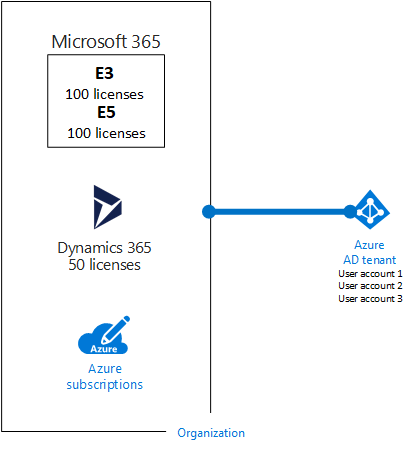

# Assinaturas, licenças, contas e locatários para ofertas de nuvem da Microsoft

 **Resumo:** entenda as relações das organizações, assinaturas, licenças, contas de usuário e locatários para ofertas de nuvem da Microsoft.
  
A Microsoft fornece uma hierarquia de organizações, assinaturas, licenças e contas de usuário para o uso consistente de identidades e cobrança para todas as ofertas de nuvem:
  
- Microsoft Office 365
    
    Confira os [planos de negócios e preços](https://products.office.com/business/compare-office-365-for-business-plans) para saber mais.
    
- Microsoft Azure
    
    Confira os [preços do Azure](https://azure.microsoft.com/pricing/) para saber mais.
    
- Microsoft Intune e Enterprise Mobility + Security (EMS)
    
    Confira os [preços do Intune](https://www.microsoft.com/cloud-platform/microsoft-intune-pricing) para saber mais.
    
- Microsoft Dynamics 365
    
    Confira os [preços do Dynamics 365](https://dynamics.microsoft.com/) para saber mais.
    
## Elementos da hierarquia

Aqui estão os elementos da hierarquia:
  
### Organização

Uma organização representa uma entidade de negócios que usa ofertas de nuvem da Microsoft, geralmente identificadas por um ou mais nomes de domínio do Sistema de Nomes de Domínio (DNS), como contoso.com. A organização é um contêiner para assinaturas.
  
### Assinaturas

Uma assinatura é um contrato com a Microsoft para usar uma ou mais plataformas ou serviços em nuvem da Microsoft, pelos quais se acumulam encargos com base em uma taxa de licença por usuário ou no consumo de recursos baseado em nuvem. As ofertas em nuvem de Software como Serviço (SaaS) da Microsoft (Office 365, Intune/EMS e do Dynamics 365) cobram taxas de licença por usuário. As ofertas em nuvem de Plataforma como Serviço (PaaS) e Infraestrutura como Serviço (IaaS) (Azure) da Microsoft são cobradas com base no consumo de recursos em nuvem.
  
Você também pode usar uma assinatura de avaliação, mas a assinatura expira após um quantidade específica de horas ou tarifas de consumo. Você pode converter uma assinatura de avaliação para uma assinatura paga.
  
As organizações podem ter várias assinaturas para ofertas de nuvem da Microsoft. A Figura 1 mostra um exemplo.
  
**Figura 1: Exemplo de várias assinaturas de uma organização**

  
A Figura 1 mostra uma única organização com várias assinaturas do Office 365, uma assinatura do Intune, outra assinatura do Dynamics 365 e várias assinaturas do Azure.
  
### Licenças

Para ofertas da nuvem de SaaS da Microsoft, uma licença permite que uma determinada conta de usuário use a oferta de serviços de nuvem. Será cobrada uma taxa mensal fixa como parte da sua assinatura. Os administradores de atribuem licenças às contas de usuários individuais na assinatura. Por exemplo, na Figura 2, a Contoso Corporation tem uma assinatura do Office 365 Enterprise E5 com 100 licenças, o que permite que até 100 contas de usuários individuais usem os serviços e recursos do Enterprise E5.
  
**Figura 2: Licenças em assinaturas SaaS para uma organização**

  
Para serviços de nuvem baseados em PaaS do Azure, as licenças de software são integradas ao preço do serviço.
  
Para máquinas virtuais baseadas em IaaS do Azure, talvez seja necessário ter licenças adicionais para usar o software ou aplicativo instalados em uma imagem de máquina virtual. Algumas imagens de máquinas virtuais têm versões licenciadas do software instalado e o custo é incluído na taxa por minuto para o servidor. Os exemplos são as imagens de máquinas virtuais do SQL Server 2014 e do SQL Server 2016. 
  
Algumas imagens máquina virtual tem versões de avaliação dos aplicativos instalados e precisam de licenças adicionais de aplicativos de software para uso além do período de avaliação. Por exemplo, a imagem de máquina virtual de avaliação do SharePoint Server 2016 inclui uma versão de avaliação pré-instalada do SharePoint Server 2016. Para continuar usando o SharePoint Server 2016 após a data de vencimento da avaliação, é necessário comprar uma licença do SharePoint Server 2016 e licenças de cliente da Microsoft. Esses encargos são separados da assinatura do Azure e a taxa por minuto para executar a máquina virtual ainda se aplica.
  
### Contas de usuário

Contas de usuário para todas as ofertas da nuvem da Microsoft são armazenadas em um locatário do Azure Active Directory (AD) que contém os grupos e as contas de usuários. Um locatário do Azure AD pode ser sincronizado com suas contas existentes do Windows Server Active Directory usando o Azure AD Connect, um serviço baseado no Windows Server, algo conhecido como sincronização de diretórios (DirSync).
  
A Figura 3 mostra um exemplo de várias assinaturas de uma organização usando um locatário comum do Azure AD que contém as contas da organização.
  
**Figura 3: Várias assinaturas de uma organização que usam o mesmo locatário do Azure AD**

  
### Locatários

Para ofertas de nuvem de SaaS, o locatário é o local regional que engloba os servidores que fornecem serviços de nuvem. Por exemplo, a Contoso Corporation escolheu a região europeia para hospedar seus locatários do Office 365, do EMS e do Dynamics 365 para os 15.000 trabalhadores da sede de Paris.
  
Serviços de PaaS do Azure e as cargas de trabalho baseadas em máquina virtual hospedadas na infraestrutura como serviço do Azure podem ter locatários em qualquer datacenter do Azure do mundo. Especifique o datacenter do Azure, ou o local, ao criar o serviço ou o aplicativo de PaaS do Azure ou o elemento de uma carga de trabalho de IaaS.
  
Um locatário do Azure AD é uma instância específica do Azure AD que contém contas e grupos. Assinaturas pagas ou de avaliação do Office 365, do Dynamics 365 ou do Intune/EMS incluem um locatário gratuito do Azure AD. Este locatário do Azure AD não inclui outros serviços do Azure e não é igual a uma assinatura paga ou de avaliação do Azure.
  
### Resumo da hierarquia

Veja aqui uma rápida recapitulação:
  
- Uma organização pode ter várias assinaturas
    
  - Uma assinatura pode ter várias licenças
    
  - As licenças podem ser atribuídas a contas de usuários individuais
    
  - As contas de usuário são armazenadas em um locatário do Azure AD
    
Aqui está um exemplo da relação das organizações, assinaturas, licenças e contas de usuários:
  
- Uma organização identificada pelo nome de domínio público.
    
  - Uma assinatura do Office 365 Enterprise E3 com licenças de usuário.
    
    Uma assinatura do Office 365 Enterprise E5 com licenças de usuário.
    
    Uma assinatura EMS com licenças de usuário.
    
    Uma assinatura Dynamics 365 com licenças de usuário.
    
    Várias assinaturas do Azure.
    
  - Contas de usuários da organização em um locatário comum do Azure AD.
    
Várias assinaturas de oferta de nuvem da Microsoft podem usar o mesmo locatário do Azure AD, que atua como um provedor de identidade comum. Um locatário central do Azure AD, que contém as contas sincronizadas do Windows Server AD local, fornece a Identidade como serviço (IDaaS) baseada em nuvem para a sua organização, o que é mostrado na Figura 4.
  
**Figura 4: IDaaS e contas locais sincronizadas para uma organização**

  
A Figura 4 mostra como um locatário comum do Azure AD é usado por ofertas em nuvem da Microsoft para SaaS, aplicativos PaaS do Azure e máquinas virtuais no IaaS do Azure que usam o Azure AD Domain Services. O Azure AD Connect sincroniza da floresta do AD do Windows Server local com o locatário do Azure AD.
  
Para saber mais sobre a integração de identidade em ofertas da nuvem da Microsoft em [Identidade do Microsoft Cloud para arquitetos corporativos](https://aka.ms/cloudarchidentity).
  
## Combinar as assinaturas de várias ofertas de nuvem da Microsoft

A tabela a seguir descreve como você pode combinar várias ofertas da nuvem da Microsoft com base em assinaturas que você já tenha para um tipo de oferta da nuvem (os rótulos que estão na primeira coluna) e como adicionar uma assinatura em uma oferta diferente da nuvem (que está em várias colunas).
  
||**Office 365**|**Azure**|**Intune/EMS**|**Dynamics 365**|
|:-----|:-----|:-----|:-----|:-----|
|**Office 365**   |N/D    |Adicione uma assinatura do Azure para sua organização no portal do Azure.    |Adicione uma assinatura do Intune/EMS para sua organização no portal do Office 365.    |Adicione uma assinatura do Dynamics 365 para sua organização no portal do Office 365.    |
|**Azure**   |Adicione uma assinatura do Office 365 para sua organização.    |N/D    |Adicione uma assinatura do Intune/EMS para sua organização.    |Adicione uma assinatura do Dynamics 365 para sua organização.    |
|**Intune/EMS**   |Adicione uma assinatura do Office 365 para sua organização.    |Adicione uma assinatura do Azure para sua organização no portal do Azure.    |N/D    |Adicione uma assinatura do Dynamics 365 para sua organização.    |
|**Dynamics 365**   |Adicione uma assinatura do Office 365 para sua organização.    |Adicione uma assinatura do Azure para sua organização no portal do Azure.    |Adicione uma assinatura do Intune/EMS para sua organização.    |N/D    |
   
Uma maneira fácil de adicionar assinaturas de serviços baseados em SaaS da Microsoft para sua organização é por meio do centro de administração do Office 365:
  
1. Entre no portal do Office 365 ([https://portal.office.com](https://portal.office.com)) com sua conta de administrador global e clique em **Administrador**.
    
2. Na navegação à esquerda da página inicial do **centro de administração **, clique em **Cobrança**e depois em **Serviços de compra**.
    
3. Na página **Serviços de compra**, compre as novas assinaturas.
    
O centro de administração do Office 365 atribui a organização e o locatário do Azure AD de sua assinatura do Office 365 para novas assinaturas das ofertas de SaaS baseadas em nuvem.
  
Para adicionar uma assinatura do Azure com a mesma organização e locatário do Azure AD à sua assinatura do Office 365:
  
1. Entre no portal do Azure ([https://portal.azure.com](https://portal.azure.com)) com sua conta de administrador global do Office 365.
    
2. Na navegação à esquerda, clique em **Assinaturas** e depois em **Adicionar**.
    
3. Na página **Adicionar assinatura**, selecione uma oferta e complete as informações de pagamento e o contrato.
    
Se você tiver comprado separadamente assinaturas do Azure e do Office 365 e deseja acessar o locatário do Azure AD do Office 365 de sua assinatura do Azure, confira as instruções em [Associar um locatário do Office 365 com uma assinatura do Azure](https://channel9.msdn.com/Series/Microsoft-Azure-Tutorials/Associate-an-Office-365-tenant-with-an-Azure-subscription).
  
## Confira também

[Recursos de arquitetura de TI do Microsoft Cloud](microsoft-cloud-it-architecture-resources.md)
  
[Guias do Laboratório de Teste (TLGs) para adoção de nuvem](cloud-adoption-test-lab-guides-tlgs.md)
  
[Modelos de arquitetura para SharePoint, Exchange, Skype for Business e Lync](architectural-models-for-sharepoint-exchange-skype-for-business-and-lync.md)
  
[Soluções híbridas](hybrid-solutions.md)
  
[Assinaturas, licenças e contas de usuários da Contoso Corporation](subscriptions-licenses-and-user-accounts-for-the-contoso-corporation.md)

