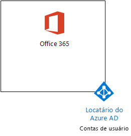
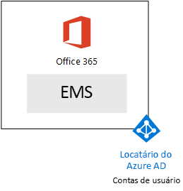
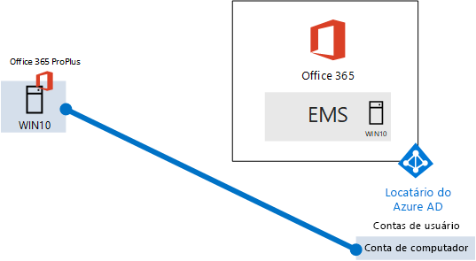

# <a name="the-microsoft-365-enterprise-devtest-environment"></a>O ambiente de desenvolvimento e teste da Microsoft 365 Enterprise

 **Resumo:** Use este guia de laboratório de teste para criar um ambiente de desenvolvimento e teste que inclui o Office 365 E5, Enterprise mobilidade + E5 de segurança (EMS) e um computador que executa o Windows 10 Enterprise.
  
Este artigo fornece instruções passo a passo para criar um ambiente simplificado para testar os recursos e funcionalidades do [Microsoft 365 Enterprise](https://www.microsoft.com/microsoft-365/enterprise).
  
## <a name="phase-1-create-your-office-365-e5-subscription"></a>Fase 1: Crie sua assinatura do Office 365 E5

Siga as etapas em fase 2 e a fase 3 do [ambiente de desenvolvimento e teste do Office 365](office-365-dev-test-environment.md) para criar um ambiente de desenvolvimento e teste de lightweight Office 365, conforme mostrado na Figura 1.
  
**Figura 1: Sua assinatura do Office 365 E5 com suas contas de usuário e de locatário do Azure Active Directory (AD)**


  
## <a name="phase-2-add-ems"></a>Fase 2: Adicionar EMS

Nesta fase, inscreva-se para a assinatura de avaliação do EMS E5 e adicioná-lo à mesma organização que sua assinatura de avaliação do Office 365 E5.
  
Primeiro, adicione a assinatura de avaliação do EMS E5 e atribuir uma licença do EMS à sua conta de administrador global.
  
1. Com uma instância particular de um navegador da Internet, entre no portal do Office 365 com suas credenciais de conta de administrador global. Para obter ajuda, consulte [Where entrar no Office 365](https://support.office.com/Article/Where-to-sign-in-to-Office-365-e9eb7d51-5430-4929-91ab-6157c5a050b4).
    
2. Clique no lado do **Admin** .
    
3. Na guia do **Centro de administração do Office** em seu navegador, no painel de navegação esquerdo, clique em **faturamento > Serviços de compra**.
    
4. Na página **Serviços de compra** , localize o item de **mobilidade corporativos + E5 de segurança** . Passe o ponteiro do mouse sobre ele e clique em **Iniciar a versão gratuita de avaliação**.
    
5. Na página **confirmar seu pedido** , clique em **tente agora**.
    
6. Na página **confirmação de ordem** , clique em **continuar**.
    
7. Na guia do **Centro de administração do Office 365** em seu navegador, no painel de navegação esquerdo, clique em **usuários > usuários ativos**.
    
8. Clique em sua conta de administrador global e, em seguida, clique em **Editar** para **licenças de produto**.
    
9. No painel de **licenças do produto** , ativar a licença do produto para **mobilidade corporativos + E5 de segurança** para **ativado**, clique em **Salvar** e, em seguida, clique duas vezes em **Fechar** .
    
> [!NOTE]
> A assinatura de avaliação do Enterprise Mobility + Security E5 dura 90 dias. Para um ambiente de desenvolvimento/teste permanente, crie uma nova assinatura paga com uma pequena quantidade de licenças. 
  
 ***Se você concluiu a fase 3 do*** [Ambiente de desenvolvimento e teste do office 365](office-365-dev-test-environment.md) , repita as etapas 8 e 9 do procedimento anterior para todas as suas contas (usuário 2, 3 do usuário, usuário 4 e 5 do usuário).
  
Seu ambiente de desenvolvimento e teste agora tem:
  
- Assinaturas de avaliação do Office 365 Enterprise E5 e do EMS que compartilham a mesma organização e o mesmo locatário do Azure AD com sua lista de contas de usuário.
    
- Todas as suas contas de usuário apropriada (administrador global ou todas as contas de usuário de cinco) estão habilitadas para usar o Office 365 E5 e EMS E5.
    
A Figura 2 mostra a configuração resultante, que adiciona EMS.
  
**Figura 2: Adicionar a assinatura de avaliação do EMS**


  
## <a name="phase-3-create-a-windows-10-enterprise-computer"></a>Fase 3: Criar um computador Windows 10 Enterprise

Nesta fase, você deve criar um computador autônomo que executa o Windows 10 Enterprise.
  
### <a name="physical-computer"></a>Computador físico

Obtenha um computador pessoal e instale o Windows 10 Enterprise contidas nela. Você pode baixar o Windows 10 Enterprise avaliação [aqui](https://www.microsoft.com/evalcenter/evaluate-windows-10-enterprise).
  
### <a name="virtual-machine"></a>Máquina virtual

Crie uma máquina virtual usando o hipervisor de sua escolha e instale o Windows 10 Enterprise contidas nela. Você pode baixar o Windows 10 Enterprise avaliação [aqui](https://www.microsoft.com/evalcenter/evaluate-windows-10-enterprise).
  
### <a name="virtual-machine-in-azure"></a>Máquina virtual no Windows Azure

Para criar uma máquina virtual de Windows 10 in Microsoft Azure, ***você deve ter uma assinatura com base no Visual Studio***, que tem acesso à imagem para Windows 10 Enterprise. Outros tipos de assinaturas do Azure, como assinaturas de avaliação e pagas, não têm acesso a essa imagem.
  
> [!NOTE]
> O comando a seguir define use a versão mais recente de te do Azure PowerShell. Consulte a [Introdução ao cmdlets do PowerShell do Windows Azure](https://docs.microsoft.com/powershell/azureps-cmdlets-docs/). Esses conjuntos de comando compilação uma máquina virtual de Windows 10 Enterprise denominado WIN10 e todas as sua infra-estrutura necessária, incluindo um grupo de recursos, uma conta de armazenamento e uma rede virtual. Se você já estiver familiarizado com os serviços de infraestrutura do Windows Azure, se adapte essas instruções de acordo com sua infraestrutura implantada no momento. 
  
Em primeiro lugar, inicie um prompt de Microsoft PowerShell.
  
Inscreva-se à sua conta do Windows Azure com o seguinte comando.
  
```
Login-AzureRMAccount
```

Para obter o nome de sua assinatura, use este comando.
  
```
Get-AzureRMSubscription | Sort Name | Select Name
```

Defina sua assinatura do Windows Azure. Substituir tudo entre aspas, incluindo o \< e > caracteres, com o nome correto.
  
```
$subscr="<subscription name>"
Get-AzureRmSubscription -SubscriptionName $subscr | Select-AzureRmSubscription
```

Depois, crie um novo grupo de recursos. Para determinar um nome exclusivo para o grupo de recursos, use este comando para listar os grupos de recursos existentes.
  
```
Get-AzureRMResourceGroup | Sort ResourceGroupName | Select ResourceGroupName
```

Crie seu novo grupo de recursos com esses comandos. Substituir tudo entre aspas, incluindo o \< e > caracteres, com os nomes corretos.
  
```
$rgName="<resource group name>"
$locName="<location name, such as West US>"
New-AzureRMResourceGroup -Name $rgName -Location $locName
```

Máquinas virtuais baseadas em Gerenciador de recursos exigem uma conta de armazenamento baseado em Gerenciador de recursos. Você deve escolher um nome globalmente exclusivo para a sua conta de armazenamento *que contém apenas números e letras minúsculas* . Você pode usar esse comando para listar as contas de armazenamento existente.
  
```
Get-AzureRMStorageAccount | Sort StorageAccountName | Select StorageAccountName
```

Use este comando para testar se o nome proposto para a conta de armazenamento é exclusivo.
  
```
Get-AzureRmStorageAccountNameAvailability "<proposed name>"
```

Crie uma nova conta de armazenamento para o novo ambiente de teste com estes comandos.
  
```
$rgName="<your new resource group name>"
$saName="<storage account name>"
$locName=(Get-AzureRmResourceGroup -Name $rgName).Location
New-AzureRMStorageAccount -Name $saName -ResourceGroupName $rgName -Type Standard_LRS -Location $locName
```

Em seguida, você cria uma nova rede virtual e a máquina virtual WIN10 com esses comandos. Quando solicitado, forneça o nome e a senha da conta de administrador local para WIN10 e armazená-los em um local seguro.
  
```
$corpnetSubnet=New-AzureRMVirtualNetworkSubnetConfig -Name Corpnet -AddressPrefix 10.0.0.0/24
New-AzureRMVirtualNetwork -Name "M365Ent-TestLab" -ResourceGroupName $rgName -Location $locName -AddressPrefix 10.0.0.0/8 -Subnet $corpnetSubnet
$rule1=New-AzureRMNetworkSecurityRuleConfig -Name "RDPTraffic" -Description "Allow RDP to all VMs on the subnet" -Access Allow -Protocol Tcp -Direction Inbound -Priority 100 -SourceAddressPrefix Internet -SourcePortRange * -DestinationAddressPrefix * -DestinationPortRange 3389
New-AzureRMNetworkSecurityGroup -Name Corpnet -ResourceGroupName $rgName -Location $locName -SecurityRules $rule1
$vnet=Get-AzureRMVirtualNetwork -ResourceGroupName $rgName -Name "M365Ent-TestLab"
$nsg=Get-AzureRMNetworkSecurityGroup -Name Corpnet -ResourceGroupName $rgName
Set-AzureRMVirtualNetworkSubnetConfig -VirtualNetwork $vnet -Name Corpnet -AddressPrefix "10.0.0.0/24" -NetworkSecurityGroup $nsg
$pip=New-AzureRMPublicIpAddress -Name WIN10-PIP -ResourceGroupName $rgName -Location $locName -AllocationMethod Dynamic
$nic=New-AzureRMNetworkInterface -Name WIN10-NIC -ResourceGroupName $rgName -Location $locName -SubnetId $vnet.Subnets[0].Id -PublicIpAddressId $pip.Id
$vm=New-AzureRMVMConfig -VMName WIN10 -VMSize Standard_D1_V2
$storageAcc=Get-AzureRMStorageAccount -ResourceGroupName $rgName -Name $saName
$cred=Get-Credential -Message "Type the name and password of the local administrator account for WIN10."
$vm=Set-AzureRMVMOperatingSystem -VM $vm -Windows -ComputerName WIN10 -Credential $cred -ProvisionVMAgent -EnableAutoUpdate
$vm=Set-AzureRMVMSourceImage -VM $vm -PublisherName MicrosoftVisualStudio -Offer Windows -Skus Windows-10-N-x64 -Version "latest"
$vm=Add-AzureRMVMNetworkInterface -VM $vm -Id $nic.Id
$osDiskUri=$storageAcc.PrimaryEndpoints.Blob.ToString() + "vhds/WIN10-TestLab-OSDisk.vhd"
$vm=Set-AzureRMVMOSDisk -VM $vm -Name WIN10-TestLab-OSDisk -VhdUri $osDiskUri -CreateOption fromImage
New-AzureRMVM -ResourceGroupName $rgName -Location $locName -VM $vm
```

## <a name="phase-4-join-your-windows-10-computer-to-azure-ad"></a>Fase 4: Ingressar seu computador 10 do Windows Azure AD

Após o física ou máquina virtual é criada, configurados com Windows 10 Enterprise e está em execução, entre com uma conta de administrador local.
  
> [!NOTE]
> Para uma máquina virtual no Windows Azure, conecte-se a ela usando [estas instruções](https://docs.microsoft.com/azure/virtual-machines/windows/connect-logon). Entrar com as credenciais da conta de administrador local. 
  
Em seguida, ingresse o computador WIN10 locatário do Azure AD de suas assinaturas do Office 365 e EMS.
  
1. Na área de trabalho do computador WIN10, clique em **Iniciar > Configurações > contas > acesso trabalho ou escola > conectar**.
    
2. Na caixa de diálogo **Configurar uma conta de trabalho ou da escola** , clique em **ingressar este dispositivo para o Windows Azure Active Directory**.
    
3. Em **trabalho ou escola conta**, digite o nome da conta de administrador global de sua assinatura do Office 365 e clique em **Avançar**.
    
4. Em **Digite a senha**, digite a senha da sua conta de administrador global e, em seguida, clique em **entrar**.
    
5. Quando solicitado a certificar-se de que esta é a sua organização, clique em **ingressar**e clique em **concluído**.
    
6. Feche a janela configurações.
    
Em seguida, instale o Office 2016 no computador WIN10
  
1. Abra o navegador Microsoft Edge e entrar no portal do Office 365 com suas credenciais de conta de administrador global. Para obter ajuda, consulte [Where entrar no Office 365](https://support.office.com/Article/Where-to-sign-in-to-Office-365-e9eb7d51-5430-4929-91ab-6157c5a050b4).
    
2. Na guia **Página inicial do Microsoft Office** , clique em **instalar Office 2016**.
    
3. Quando solicitado com o que fazer, clique em **Executar**e, em seguida, clique em **Sim** para **Controle de conta de usuário**.
    
4. Aguarde do Office completar sua instalação. Quando você vir **você estará pronto!**, clique duas vezes em **Fechar** .
    
A Figura 3 mostra seu ambiente resultante, que inclui o computador WIN10 que foi Unido locatário do Azure AD de suas assinaturas do Office 365 e EMS.
  
**Figura 3: Adicionando a conta de computador do WIN10 ao locatário do Azure AD.**


  
Agora você está pronto para experimentar os recursos adicionais do [Microsoft 365 Enterprise](https://www.microsoft.com/microsoft-365/enterprise).
  
## <a name="next-steps"></a>Próximas etapas

Use estes artigos adicionais para explorar os recursos do Microsoft 365 Enterprise:
  
- [Adicionar políticas de gerenciamento (MAM) do aplicativo móvel](https://technet.microsoft.com/library/mt764059.aspx)
    
- [Inscrever-se de dispositivos com Android e iOS](https://technet.microsoft.com/library/mt743077.aspx)
    
- [Configurar e testar o gerenciamento de segurança avançada](https://technet.microsoft.com/library/mt757250.aspx)
    
- [Configurar e testar a proteção de ameaça avançadas](https://technet.microsoft.com/library/mt490479.aspx)
    
## <a name="see-also"></a>Veja também

[O ambiente de desenvolvimento e teste de um Microsoft Cloud](the-one-microsoft-cloud-dev-test-environment.md)

[Documentação do Microsoft 365 Enterprise](https://docs.microsoft.com/microsoft-365-enterprise/)


