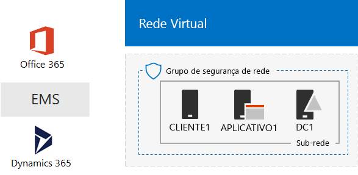
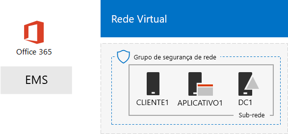

# O ambiente de desenvolvimento e teste de um Microsoft Cloud

 **Resumo:** Use este guia de laboratório de teste para criar um ambiente de desenvolvimento e teste que inclui todas as ofertas de nuvem da Microsoft.
  
Com as instruções deste artigo, você cria uma intranet simulada nos serviços de infraestrutura do Microsoft Azure e em seguida, adicione o Microsoft Office 365, Microsoft Enterprise mobilidade + segurança (EMS) e inscrições do Microsoft Dynamics 365. O resultado é uma organização simplificada que usa ofertas de nuvem da Microsoft todos ao mesmo tempo em um ambiente de desenvolvimento e teste único. 
  

  
Você pode usar a configuração resultante para:
  
- Experiência a integração entre as ofertas de nuvem da Microsoft, como a infraestrutura de identidade comuns fornecidos pelo Windows Azure AD (Active Directory).
    
- Avalie os cenários de ponta a ponta que incluem vários ofertas de Microsoft Cloud.
    
- Crie uma demonstração, prova de conceito ou configuração de desenvolvimento e teste que usa vários ofertas de Microsoft Cloud.
    
- Construa suas habilidades Microsoft Cloud para desenvolvimento profissional.
    
## Fase 1: Criar uma intranet simulada e adicionar o Office 365

Siga as instruções no [DirSync para seu ambiente de desenvolvimento e teste do Office 365](dirsync-for-your-office-365-dev-test-environment.md).
  
A Figura 1 mostra a configuração resultante, que inclui uma intranet simulada executando nos serviços de infraestrutura do Windows Azure e sincronização de diretório a partir de uma floresta do Windows Server AD (Active Directory) no local e o Office 365.
  
**Figura 1: Simulado intranet no Windows Azure com o Office 365**

  
> [!NOTE]
> Versão de avaliação do Azure é 30 dias. A assinatura de avaliação do Office 365 Enterprise E5 é 30 dias, que pode ser facilmente estendidos para outro 30 dias. Para um ambiente de desenvolvimento e teste permanente, crie um novo pagos de assinatura do Windows Azure e uma nova assinatura paga do Office 365 Enterprise E5 com um pequeno número de licenças. 
  
## Fase 2: Adicionar EMS

Nesta fase, inscreva-se para a assinatura de avaliação do EMS e adicione-a à mesma organização de sua assinatura de avaliação do Office 365.
  
1. Com um navegador em um computador desktop ou do CLIENT1, entrar no portal do Office 365 em [https://portal.office.com](https://portal.office.com) com as credenciais da sua conta de administrador global.
    
2. Clique no lado do **Admin** .
    
3. Na guia do **Centro de administração do Office** em seu navegador, no painel de navegação esquerdo, clique em **faturamento > Serviços de compra**.
    
4. Na página **Serviços de compra** , localize o item de **mobilidade corporativos + E5 de segurança** . Passe o ponteiro do mouse sobre ele e clique em **Iniciar a versão gratuita de avaliação**.
    
5. Na página **confirmar seu pedido** , clique em **tente agora**.
    
6. Na página **confirmação de ordem** , clique em **continuar**.
    
> [!NOTE]
> A assinatura de avaliação do Enterprise Mobility + Security E5 dura 90 dias. Para um ambiente de desenvolvimento/teste permanente, crie uma nova assinatura paga com uma pequena quantidade de licenças. 
  
Em seguida, habilite a mobilidade corporativos + licença E5 de segurança para todas as contas de usuário.
  
1. Na guia do **Centro de administração do Office 365** em seu navegador, no painel de navegação esquerdo, clique em **usuários > usuários ativos**.
    
2. Clique em sua conta de administrador global e, em seguida, clique em **Editar** para **licenças de produto**.
    
3. No painel de **licenças do produto** , ativar a licença do produto para **mobilidade corporativos + E5 de segurança** para **ativado**, clique em **Salvar** e, em seguida, clique duas vezes em **Fechar** .
    
4. Para todas as suas contas (User1, usuário 2, 3 do usuário, usuário 4 e 5 do usuário), siga as etapas 2 e 3.
    
Seu ambiente de desenvolvimento e teste agora tem:
  
- Uma intranet simulada em execução nos serviços de infraestrutura do Windows Azure.
    
- Assinaturas de avaliação do Office 365 Enterprise E5 e do EMS que compartilham a mesma organização e o mesmo locatário do Azure AD com sua lista de contas de usuário.
    
- Todas as suas contas de usuário habilitadas para usar o Office 365 E5 Enterprise e o EMS.
    
A Figura 2 mostra a configuração resultante, que adiciona EMS.
  
**Figura 2: Simulado intranet no Windows Azure com o Office 365 e EMS**

  
## Fase 3: Adicionar Dynamics 365

Nesta fase, inscreva-se para a assinatura de avaliação do Dynamics 365 e adicioná-lo à mesma organização que suas assinaturas de avaliação do Office 365 e EMS.
  
1. Usando um navegador em um computador desktop ou do CLIENT1, entrar no portal do Office 365 em [https://portal.office.com](https://portal.office.com) com as credenciais da sua conta de administrador global.
    
2. Clique no lado do **Admin** .
    
3. Na guia **Centro de administração do Office** , no painel de navegação esquerdo, clique em **faturamento > Serviços de compra**.
    
4. Na página **Serviços de compra** , encontre o item **Dynamics 365 planejar 1 Enterprise Edition** . Passe o ponteiro do mouse sobre ele e clique em **Iniciar a versão gratuita de avaliação**.
    
5. Na página **confirmar seu pedido** , clique em **tente agora**.
    
6. Na página **confirmação de ordem** , clique em **continuar**.
    
> [!NOTE]
> A assinatura de avaliação do Dynamics 365 planejar 1 Enterprise Edition é 30 dias. Você pode estender facilmente a assinatura de trilha para outro 30 dias. Para um ambiente de desenvolvimento e teste permanente, crie uma nova assinatura com um pequeno número de licenças paga. 
  
Use estas etapas para atribuir licenças do Dynamics 365 o administrador global, o usuário 2 e contas de usuário 3 e torná-los aos administradores de sistema.
  
1. Na guia do **Centro de administração do Office** , clique em **usuários > usuários ativos**.
    
2. Na lista de usuários ativos, clique em sua conta de administrador global e, em seguida, clique em **Editar** para **licenças de produto**.
    
3. No painel de **licenças do produto** , ativar a licença do produto para **Dynamics 365 planejar 1 Enterprise Edition** para **ativado**, clique em **Salvar** e, em seguida, clique duas vezes em **Fechar** .
    
4. Execute as etapas 2 e 3 para as contas de usuário 2 e 3 do usuário.
    
5. Feche a guia do **Centro de administração do Office** .
    
Use estas etapas para configurar as contas de usuário 2 e 3 do usuário como os administradores de sistema do Dynamics 365.
  
1. Na guia do **Centro de administração do Office** em seu navegador, no painel de navegação esquerdo, clique em **Admin centrais**e clique em **Dynamics 365**.
    
    Você pode precisar aguardar Dynamics 365 concluir o provisionamento antes do Dynamics 365 aparece no menu.
    
2. Na guia Dynamics 365, clique em **todos esses**e, em seguida, clique em **Concluir a instalação.**
    
    Aguarde concluir a instalação.
    
    Quando terminar a instalação, ele exibe um painel de atividade de vendas com base nos dados de amostra que faz parte da assinatura trilha. Levar alguns momentos para exibir o **Bem-vindo à sua avaliação** vídeo. Feche a janela de vídeo quando tiver concluído.
    
3. Na barra de ferramentas na parte superior, clique na seta ao lado de **vendas**, clique em **configurações**e, em seguida, clique em **segurança**.
    
4. Na página **segurança** , clique em **usuários**.
    
5. Na lista de usuários, clique em **usuário 2**.
    
6. Na barra de ferramentas, clique em **Gerenciar funções**.
    
7. Em **Gerenciar funções**, clique em **Administrador do sistema**e, em seguida, clique em **Okey**.
    
8. Na barra de ferramentas na parte superior, clique em **segurança**.
    
9. Repita as etapas 5 a 8 para a conta de usuário 3.
    
10. Fechar o **usuário: User3** guia.
    
> [!NOTE]
> Sua conta de administrador global do Office 365 foi atribuída automaticamente a função de administrador de sistema do Dynamics 365. 
  
Seu ambiente de desenvolvimento e teste agora tem:
  
- Uma intranet simulada em execução nos serviços de infraestrutura do Windows Azure.
    
- O Office 365 E5 Enterprise, EMS e Dynamics 365 assinaturas de avaliação da mesma organização e o mesmo inquilino do Azure AD de compartilhamento com sua lista de contas de usuário.
    
- Todas as suas contas de usuário habilitadas para usar o Office 365 E5 Enterprise e o EMS.
    
- Seu administrador corporativo global, o usuário 2 e contas de usuário 3 estão habilitadas para usar Dynamics 365 e são administradores de sistema do Dynamics 365.
    
A Figura 3 mostra a configuração resultante.
  
**Figura 3: Simulado intranet no Windows Azure com o Office 365, EMS e Dynamics 365**

  
## Próximas etapas

Agora, você pode experimentar seu ambiente de desenvolvimento e teste de um Microsoft Cloud. Aqui estão algumas ideias para experiências guiadas:
  
- [Configurar políticas de gerenciamento (MAM) do aplicativo móvel no EMS para aplicativos do Office 365](https://technet.microsoft.com/library/mt764059.aspx)
    
- [Demonstrar o Exchange Online no Office 365 integração com contatos Dynamics 365](https://technet.microsoft.com/library/mt798313.aspx)
    
- [Criar uma rede de locais cruzados simulado nos serviços de infraestrutura do Windows Azure para hospedar as cargas de trabalho baseado em servidor](https://technet.microsoft.com/library/mt745150.aspx)
    
## Veja também

[Guias do Laboratório de Teste (TLGs) para adoção de nuvem](cloud-adoption-test-lab-guides-tlgs.md)
  
[Recursos de arquitetura de TI do Microsoft](microsoft-cloud-it-architecture-resources.md)
  
[Soluções híbridas](hybrid-solutions.md)
  
[Soluções de segurança](security-solutions.md)

