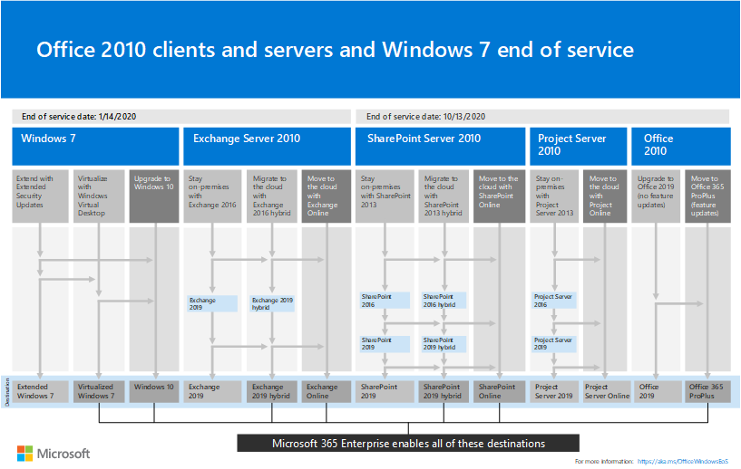

# Recursos para ajudá-lo a atualizar de clientes e servidores do Office 2010Resources to help you upgrade from Office 2010 servers and clients

Observe que:Note that:

- O Exchange Server 2010 atingirá o fim do suporte em **14 de janeiro de 2020**.Exchange Server 2010 will reach its end of support on **January 14, 2020**. 

- O Office 2010, o SharePoint 2010 e o Project Server 2010 atingirão o fim do suporte em **13 de outubro de 2020**.Office 2010, SharePoint 2010, and Project Server 2010 will reach their end of support on **October 13, 2020**. 

Enquanto você estiver planejando a atualização, este é um excelente momento para mudar para o Office 365.While you're planning your upgrade, this is a great time to consider moving to Office 365. 

- O Office 365 tem serviços baseados em nuvem para produtos de servidor do Office 2010, como o Exchange Server e o SharePoint Server e serviços como o Teams e o OneDrive for Business.Office 365 has cloud-based services for Office 2010 server products such as Exchange Server and SharePoint Server and services such as Teams and OneDrive for Business. 

- O Office 365 ProPlus, incluído no Office 365 E3 e E5 e no Microsoft 365 Enterprise, é o conjunto de aplicativos cliente do Office que você instala no seu dispositivo local.Office 365 ProPlus, included with Office 365 E3 and E5 and Microsoft 365 Enterprise, is the set of Office client apps that you install on your local device. Eles são atualizados com novos recursos de produtividade e segurança em uma base contínua do Microsoft Cloud.They are updated with new productivity and security features on an ongoing basis from the Microsoft cloud.

Para obter um resumo das opções de atualização, migração e movimentação para a nuvem para clientes e servidores do Office 2010 e Windows 7, baixe o [cartaz do fim do serviço](https://github.com/MicrosoftDocs/microsoft-365-docs/raw/public/microsoft-365/enterprise/media/migration-microsoft-365-enterprise-workload/Office2010Windows7EndOfService.pdf).For a summary of the upgrade, migrate, and move-to-the-cloud options for Office 2010 clients and servers and Windows 7, download the [end of service poster](https://github.com/MicrosoftDocs/microsoft-365-docs/raw/public/microsoft-365/enterprise/media/migration-microsoft-365-enterprise-workload/Office2010Windows7EndOfService.pdf).

Este cartaz de uma página é uma maneira rápida de entender os vários caminhos que você pode tomar para impedir que os produtos de servidor e cliente do Office 2010 e o Windows 7 atinjam o final do serviço, com caminhos e suporte de opções preferidos no Microsoft 365 Enterprise realçado.This one-page poster is a quick way to understand the various paths you can take to prevent Office 2010 client and server products and Windows 7 from reaching end of service, with preferred paths and option support in Microsoft 365 Enterprise highlighted.

Você pode imprimir este cartaz em formatos de carta, ofício ou tablóide (11 x 17).You can print this poster in letter, legal, or tabloid (11 x 17) formats.
      
## Planejamento de atualização de cliente e servidor do Office 2010Office 2010 client and server upgrade planning
  
|**Para este produto****For this product**|**Com este fim da data de suporte****With this end of support date**|**Confira este recurso****See this resource**|
|:-----|:-----|:-----|
|Office 2010 (incluindo Word 2010, Excel 2010, PowerPoint 2010 e Outlook 2010)Office 2010 (including Word 2010, Excel 2010, PowerPoint 2010, and Outlook 2010)    | 13 de outubro de 2020October 13, 2020 |[Roteiro de fim do suporte do Office 2010Office 2010 end of support roadmap](https://docs.microsoft.com/DeployOffice/office-2010-end-support-roadmap)   |
|Exchange Server 2010Exchange Server 2010    | 14 de janeiro de 2020January 14, 2020  |[Roteiro de fim do suporte do Exchange 2010Exchange 2010 end of support roadmap](exchange-2010-end-of-support.md)   |
|SharePoint 2010 ou SharePoint Server 2010SharePoint 2010 or SharePoint Server 2010    | 13 de outubro de 2020October 13, 2020 |[Atualizando do SharePoint 2010Upgrading from SharePoint 2010](upgrade-from-sharepoint-2010.md)   |
|Project Server 2010Project Server 2010   | 13 de outubro de 2020October 13, 2020 | [Roteiro de fim do suporte do Project Server 2010Project Server 2010 end of support roadmap](project-server-2010-end-of-support.md)   |
|Lync Server 2010Lync Server 2010   | 13 de abril de 2021April 13, 2021 | [Planejar a atualização para o Skype for Business ServerPlan to upgrade to Skype for Business Server](https://docs.microsoft.com/skypeforbusiness/plan-your-deployment/upgrade)   |
    
## Sou um usuário doméstico.I'm a home user. What do I do?What do I do?

Se você estiver usando produtos e aplicativos do Office 2010 em casa, confira [estas informações](plan-upgrade-previous-versions-office.md#im-a-home-user-what-do-i-do).If you're using Office 2010 products and applications at home, see [this information](plan-upgrade-previous-versions-office.md#im-a-home-user-what-do-i-do).

## Tópicos relacionadosRelated topics

[Grupo de aposentadoria do Office (comunidade de tecnologia da Microsoft)Office Retirement Group (Microsoft Tech Community)](https://go.microsoft.com/fwlink/?linkid=842065)
  
[Vídeo: o que é o Office 365?Video: What is Office 365?](https://support.office.com/article/847caf12-2589-452c-8aca-1c009797678b.aspx)
  
[Política de ciclo de vida da MicrosoftMicrosoft Lifecycle Policy](https://go.microsoft.com/fwlink/?linkid=865200)

[Planejar sua atualização do Office 2007 ou do Office 2010 servidores e clientesPlan your upgrade from Office 2007 or Office 2010 servers and clients](plan-upgrade-previous-versions-office.md)

