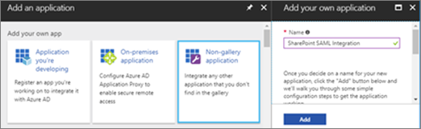
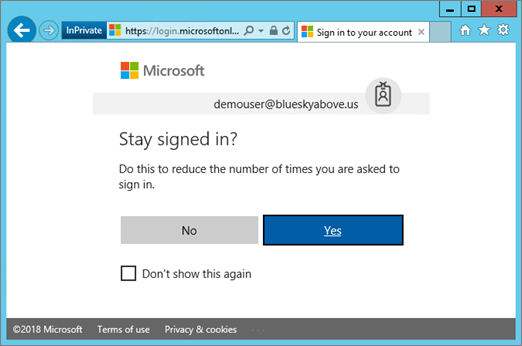

# <a name="using-azure-ad-for-sharepoint-server-authentication"></a>Usar o Azure AD para a autenticação do SharePoint Server

 **Resumo:** Saiba como autenticar seus usuários do SharePoint Server 2016 com o Azure Active Directory. 

<blockquote>
<p>Este artigo refere-se aos exemplos de código para interagir com o gráfico do Azure Active Directory. Você pode baixar os exemplos de código [aqui](https://github.com/kaevans/spsaml11/tree/master/scripts).</p>
</blockquote>

O SharePoint Server 2016 oferece a capacidade de autenticar usuários usando a autenticação baseada em declarações, facilitando o gerenciamento de seus usuários, Autenticando-os com diferentes provedores de identidade confiáveis, mas outra pessoa gerencia. Por exemplo, em vez de gerenciar a autenticação de usuário por meio do AD DS (serviços de domínio Active Directory), você pode permitir que os usuários autentiquem usando o Azure Active Directory (Azure AD). Isso permite a autenticação para usuários somente na nuvem com o sufixo onmicrosoft.com em seu nome de usuário, usuários sincronizados com um diretório local e convidados usuários convidados de outros diretórios. Também permite que você tire proveito dos recursos do Azure AD, como a autenticação multifator e recursos avançados de relatórios.

> [!IMPORTANT]
> A solução descrita neste artigo também pode ser usada com o SharePoint Server 2013; no entanto, tenha em mente que o SharePoint Server 2013 está se aproximando do fim do suporte básico. Para obter mais informações, consulte [política de ciclo de vida da Microsoft](https://support.microsoft.com/en-us/lifecycle/search?alpha=SharePoint%20Server%202013) e [política atualizada de manutenção do produto para o SharePoint 2013](https://technet.microsoft.com/library/684173bb-e90a-4eb7-b268-b8d7458bc802(v=office.16).aspx).

Este artigo explica como você pode usar o Azure AD em vez do AD DS local para autenticar os usuários. Nessa configuração, o Azure AD torna-se um provedor de identidade confiável para o SharePoint Server 2016. Essa configuração adiciona um método de autenticação de usuário separado da autenticação do AD DS usado pela própria instalação do SharePoint Server 2016. Para se beneficiar deste artigo, você deve estar familiarizado com o WS-Federation. Para obter mais informações, consulte Understanding [WS-Federation](https://go.microsoft.com/fwlink/p/?linkid=188052). Para obter informações detalhadas sobre a integração do SharePoint no local com o Active Directory do Azure, consulte o [tutorial dedicado](https://docs.microsoft.com/azure/active-directory/saas-apps/sharepoint-on-premises-tutorial).


Anteriormente, essa configuração teria exigido um serviço de Federação, como o serviço de controle de acesso (ACS) do Azure na nuvem ou um ambiente que hospede os serviços de Federação do Active Directory (AD FS) para transformar tokens de SAML 2,0 em SAML 1,1. Essa transformação não é mais necessária, já que o Azure AD agora permite emitir tokens SAML 1,1. O diagrama acima mostra como a autenticação funciona para usuários do SharePoint 2016 nesta configuração, demonstrando que não há mais necessidade de um intermediário para executar essa transformação.

> [!NOTE]
> Essa configuração funcionará se o farm do SharePoint estiver hospedado em máquinas virtuais do Azure ou no local. Não é necessário abrir outras portas de firewall além de garantir que os usuários possam acessar o Azure Active Directory do navegador.

Para obter informações sobre a acessibilidade do SharePoint 2016, consulte [Accessibility Guidelines in SharePoint Server 2016](https://go.microsoft.com/fwlink/p/?LinkId=393123).

## <a name="configuration-overview"></a>Visão geral da configuração

Siga estas etapas gerais para configurar seu ambiente para usar o Azure AD como um provedor de identidade do SharePoint Server 2016.

1. Crie um novo diretório do Azure AD ou use o diretório existente.
2. Verifique se a zona do aplicativo Web que você deseja proteger com o Azure AD está configurada para usar SSL.
3. Criar um novo aplicativo empresarial no Azure AD.
4. Configure um novo provedor de identidade confiável no SharePoint Server 2016.
5. Defina as permissões para o aplicativo Web.
6. Adicione uma diretiva de emissão de token 1,1 SAML no Azure AD.
7. Verifique o novo provedor.

As seções a seguir descrevem como realizar essas tarefas.

## <a name="step-1-create-a-new-azure-ad-directory-or-use-your-existing-directory"></a>Etapa 1: criar um novo diretório do Azure AD ou usar o diretório existente

No portal do Azure ([https://portal.azure.com](https://portal.azure.com)), crie um novo diretório. Forneça o nome da organização, o nome de domínio inicial e o país ou a região.

 

 Se você já tiver um diretório como o usado para o Microsoft Office 365 ou sua assinatura do Microsoft Azure, você poderá usar esse diretório. Você deve ter permissões para registrar aplicativos no diretório.

## <a name="step-2-ensure-the-zone-for-the-web-application-that-you-want-to-secure-with-azure-ad-is-configured-to-use-ssl"></a>Etapa 2: garantir que a zona do aplicativo Web que você deseja proteger com o Azure AD esteja configurada para usar SSL

Este artigo foi escrito usando a arquitetura de referência em [executar um farm do SharePoint Server 2016 de alta disponibilidade no Azure](https://docs.microsoft.com/en-us/azure/architecture/reference-architectures/sharepoint). Os scripts de acompanhamento do artigo usados para implantar a solução descrita neste [artigo](https://docs.microsoft.com/en-us/azure/architecture/reference-architectures/sharepoint) criam um site que não usa SSL.  

O uso do SAML exige que o aplicativo seja configurado para usar SSL. Se seu aplicativo Web do SharePoint não estiver configurado para usar SSL, use as etapas a seguir para criar um novo certificado autoassinado para configurar o aplicativo Web para SSL. Essa configuração só é destinada a um ambiente de laboratório e não se destina à produção. Ambientes de produção devem usar um certificado assinado.

1. Vá para**Gerenciamento** > de aplicativo da **Administração** > central**gerenciar aplicativos Web**e escolha o aplicativo Web que precisa ser estendido para usar SSL. Selecione o aplicativo Web e clique no botão **estender faixa** de opções. Estenda o aplicativo Web para usar a mesma URL, mas use SSL com a porta 443.<br/><br/>
2. No Gerenciador do IIS, clique duas vezes em **certificados do servidor**.
3. No painel ** Ações**, clique em **Criar certificado autoassinado**. Digite um nome amigável para o certificado na caixa especificar um nome amigável para o certificado e clique em **OK**.
4. Na caixa de diálogo **Editar Associação de site** , verifique se o nome do host é igual ao nome amigável, conforme ilustrado na imagem a seguir.<br/><br/>

Cada servidor Web front-end no farm do SharePoint exigirá a configuração do certificado para a associação de site no IIS.


## <a name="step-3-create-a-new-enterprise-application-in-azure-ad"></a>Etapa 3: criar um novo aplicativo empresarial no Azure AD

1. No portal do Azure ([https://portal.azure.com](https://portal.azure.com)), abra seu diretório do Azure AD. Clique em **aplicativos corporativos**e, em seguida, clique em **novo aplicativo**. Escolha **aplicativo não-Galeria**. Forneça um nome como *integração do SharePoint SAML* e clique em **Adicionar**.<br/><br/>
2. Clique no link logon único no painel de navegação para configurar o aplicativo. Altere o menu suspenso de **modo de logon único** para o **logon baseado em SAML** para revelar as propriedades de configuração da SAML para o aplicativo. Configure com as seguintes propriedades:<br/>
    - Identificação`urn:sharepoint:portal.contoso.local`
    - URL de resposta:`https://portal.contoso.local/_trust/default.aspx`
    - URL de entrada:`https://portal.contoso.local/_trust/default.aspx`
    - Identificador de usuário:`user.userprincipalname`<br/>
    - Observação: Lembre-se de alterar as URLs, substituindo *Portal. contoso. local* pela URL do site do SharePoint que você deseja proteger.<br/>
3. Configure uma tabela (semelhante à tabela 1 abaixo) que inclui as seguintes linhas:<br/> 
    - Realm
    - Caminho completo para o arquivo de certificado de assinatura SAML
    - URL do serviço de logon único do SAML (substituindo */saml2* por */WSFED*)
    - ID de objeto do aplicativo. <br/>
Copie o valor do *identificador* na ** Propriedade realm em uma tabela (consulte a tabela 1 abaixo).
4. Salve suas alterações.
5. Clique no link **Configurar (nome do aplicativo)** para acessar a página Configurar logon.<br/><br/> 
    -  Clique no link de **certificado de assinatura SAML-RAW** para baixar o certificado de assinatura SAML como um arquivo com a extensão. cer. Copie e cole o caminho completo para o arquivo baixado em sua tabela.
    - Copie e cole o link URL do serviço de logon único do SAML em seu, substituindo a parte */saml2* da URL por */WSFED*.<br/>
6.  Navegue até o painel de **Propriedades** do aplicativo. Copie e cole o valor de ID do objeto na tabela que você configurou na etapa 3.<br/><br/>
7. Usando os valores que você capturou, certifique-se de que a tabela que você configurou na etapa 3 seja semelhante à tabela 1 abaixo.


| Tabela 1: valores capturados  |  |
|---------|---------|
|Realm | `urn:sharepoint:portal.contoso.local` |
|Caminho completo para o arquivo de certificado de assinatura SAML | `C:/temp/SharePoint SAML Integration.cer`  |
|URL do serviço de logon único do SAML (substituir/saml2 por/WSFED) | `https://login.microsoftonline.com/b1726649-b616-460d-8d20-defab80d476c/wsfed` |
|ID do objeto de aplicativo | `a812f48b-d1e4-4c8e-93be-e4808c8ca3ac` |

> [!IMPORTANT]
> Substitua o valor */saml2* na URL por */WSFED*. O ponto de extremidade */saml2* processará tokens SAML 2,0. O ponto de extremidade */WSFED* permite o processamento de tokens SAML 1,1 e é necessário para a Federação SAML do SharePoint 2016.

## <a name="step-4-configure-a-new-trusted-identity-provider-in-sharepoint-server-2016"></a>Etapa 4: configurar um novo provedor de identidade confiável no SharePoint Server 2016

Entre no servidor do SharePoint Server 2016 e abra o Shell de gerenciamento do SharePoint 2016. Preencha os valores de $realm, $wsfedurl e $filepath da tabela 1 e execute os seguintes comandos para configurar um novo provedor de identidade confiável.

> [!TIP]
> Se você for novo usando o PowerShell ou quiser saber mais sobre como o PowerShell funciona, confira [SharePoint PowerShell](https://docs.microsoft.com/en-us/powershell/sharepoint/overview?view=sharepoint-ps). 

```
$realm = "<Realm from Table 1>"
$wsfedurl="<SAML single sign-on service URL from Table 1>"
$filepath="<Full path to SAML signing certificate file from Table 1>"
$cert = New-Object System.Security.Cryptography.X509Certificates.X509Certificate2($filepath)
New-SPTrustedRootAuthority -Name "AzureAD" -Certificate $cert
$map = New-SPClaimTypeMapping -IncomingClaimType "http://schemas.xmlsoap.org/ws/2005/05/identity/claims/name" -IncomingClaimTypeDisplayName "name" -LocalClaimType "http://schemas.xmlsoap.org/ws/2005/05/identity/claims/upn"
$map2 = New-SPClaimTypeMapping -IncomingClaimType "http://schemas.xmlsoap.org/ws/2005/05/identity/claims/givenname" -IncomingClaimTypeDisplayName "GivenName" -SameAsIncoming
$map3 = New-SPClaimTypeMapping -IncomingClaimType "http://schemas.xmlsoap.org/ws/2005/05/identity/claims/surname" -IncomingClaimTypeDisplayName "SurName" -SameAsIncoming
$ap = New-SPTrustedIdentityTokenIssuer -Name "AzureAD" -Description "SharePoint secured by Azure AD" -realm $realm -ImportTrustCertificate $cert -ClaimsMappings $map,$map2,$map3 -SignInUrl $wsfedurl -IdentifierClaim "http://schemas.xmlsoap.org/ws/2005/05/identity/claims/name"
```

Em seguida, siga estas etapas para habilitar o provedor de identidade confiável para seu aplicativo:
1. Na administração central, navegue para **gerenciar o aplicativo Web** e selecione o aplicativo Web que você deseja proteger com o Azure AD. 
2. Na faixa de opções, clique em **provedores de autenticação** e escolha a zona que você deseja usar.
3. Selecione **provedor de identidade confiável** e selecione o provedor de identificações que você acabou de registrar chamado *AzureAD*.  
4. Na configuração URL da página de entrada, selecione **página de entrada personalizada** e forneça o valor "/_trust/". 
5. Clique em **OK**.


> [!IMPORTANT]
> É importante seguir todas as etapas, incluindo a configuração da página de entrada personalizada para "/_trust/", conforme mostrado. A configuração não funcionará corretamente, a menos que todas as etapas sejam seguidas.

## <a name="step-5-set-the-permissions"></a>Etapa 5: definir as permissões

Os usuários que farão logon no Azure AD e acessar o SharePoint devem ter acesso ao aplicativo. 

1. No portal do Azure, abra o diretório do Azure AD. Clique em **aplicativos corporativos**e, em seguida, clique em **todos os aplicativos**. Clique no aplicativo que você criou anteriormente (integração SAML do SharePoint).
2. Clique em **usuários e grupos**. 
3. Clique em **Adicionar usuário** para adicionar um usuário ou grupo que terá permissões para fazer logon no SharePoint usando o Azure AD.
4. Selecione o usuário ou grupo e clique em **atribuir**.
 
O usuário recebeu permissão no Azure AD, mas também deve receber permissão no SharePoint. Use as etapas a seguir para definir as permissões para acessar o aplicativo Web.

1. Em Administração Central, clique em **Gerenciamento de Aplicativo**.
2. Na página **Gerenciamento de Aplicativo**, na seção **Aplicativos da Web**, clique em **Gerenciar aplicativos da Web**.
3. Clique no aplicativo da Web apropriado e, em seguida, clique em **Política do Usuário**.
4. Em política para aplicativo Web, clique em **Adicionar usuários**.<br/><br/>
5. Na caixa de diálolgo **Adicionar Usuários**, clique na zona apropriada em **Zonas**e, depois, em **Avança**.
6. Na caixa de diálogo **política para aplicativo Web** , na seção **escolher usuários** , clique no ícone **procurar** .
7. Na caixa de texto **Localizar** , digite o nome de entrada de um usuário em seu diretório e clique em **Pesquisar**. <br/>Exemplo: *demouser@blueskyabove.onmicrosoft.com*.
8. No cabeçalho AzureAD no modo de exibição de lista, selecione a propriedade nome e clique em **Adicionar** e clique em **OK** para fechar a caixa de diálogo.
9. Em permissões, clique em **controle total**.<br/><br/>
10. Clique em **Concluir**, e em **OK**.

## <a name="step-6-add-a-saml-11-token-issuance-policy-in-azure-ad"></a>Etapa 6: adicionar uma política de emissão de token do SAML 1,1 no Azure AD

Quando o aplicativo do Azure AD é criado no portal, ele usa o SAML 2,0 como padrão. O SharePoint Server 2016 requer o formato de token SAML 1,1. O script a seguir removerá a política padrão SAML 2,0 e adicionará uma nova política para emitir tokens SAML 1,1. 

> Este código requer o download dos exemplos que acompanham a [interação com o gráfico do Azure Active Directory](https://github.com/kaevans/spsaml11/tree/master/scripts). Se você baixar os scripts como um arquivo ZIP do GitHub para uma área de trabalho do Windows, certifique- `MSGraphTokenLifetimePolicy.psm1` se de desbloquear o arquivo `Initialize.ps1` de módulo de script e o arquivo de script (clique com o botão direito do mouse em Propriedades, escolha desbloquear, clique em OK). 


Depois que o script de exemplo for baixado, crie um novo script do PowerShell usando o código a seguir, substituindo o espaço reservado pelo `Initialize.ps1` caminho do arquivo do baixado no computador local. Substitua o espaço reservado de ID de objeto do aplicativo pela ID do objeto de aplicativo inserida na tabela 1. Depois de criado, execute o script do PowerShell. 

```
function AssignSaml11PolicyToAppPrincipal
{
    Param(
        [Parameter(Mandatory=$true)]
        [string]$pathToInitializeScriptFile, 
        [Parameter(Mandatory=$true)]
        [string]$appObjectid
    )

    $folder = Split-Path $pathToInitializeScriptFile
    Push-Location $folder

    #Loads the dependent ADAL module used to acquire tokens
    Import-Module $pathToInitializeScriptFile 

    #Gets the existing token issuance policy
    $existingTokenIssuancePolicy = Get-PoliciesAssignedToServicePrincipal -servicePrincipalId $appObjectid | ?{$_.type -EQ "TokenIssuancePolicy"} 
    Write-Host "The following TokenIssuancePolicy policies are assigned to the service principal." -ForegroundColor Green
    Write-Host $existingTokenIssuancePolicy -ForegroundColor White
    $policyId = $existingTokenIssuancePolicy.objectId

    #Removes existing token issuance policy
    Write-Host "Only a single policy can be assigned to the service principal. Removing the existing policy with ID $policyId" -ForegroundColor Green
    Remove-PolicyFromServicePrincipal -policyId $policyId -servicePrincipalId $appObjectid

    #Creates a new token issuance policy and assigns to the service principal
    Write-Host "Adding the new SAML 1.1 TokenIssuancePolicy" -ForegroundColor Green
    $policy = Add-TokenIssuancePolicy -DisplayName SPSAML11 -SigningAlgorithm "http://www.w3.org/2001/04/xmldsig-more#rsa-sha256" -TokenResponseSigningPolicy TokenOnly -SamlTokenVersion "1.1"
    Write-Host "Assigning the new SAML 1.1 TokenIssuancePolicy $policy.objectId to the service principal $appObjectid" -ForegroundColor Green
    Set-PolicyToServicePrincipal -policyId $policy.objectId -servicePrincipalId $appObjectid
    Pop-Location
}

#Only edit the following two variables
$pathToInitializeScriptFile = "<file path of Initialize.ps1>"
$appObjectid = "<Application Object ID from Table 1>"

AssignSaml11PolicyToAppPrincipal $pathToInitializeScriptFile $appObjectid
```
> [!IMPORTANT]
> Os scripts do PowerShell não estão assinados e você pode ser solicitado a definir a política de execução. Para obter mais informações sobre políticas de execução, consulte [sobre políticas de execução](http://go.microsoft.com/fwlink/?LinkID=135170). Além disso, talvez seja necessário abrir um prompt de comando com privilégios elevados para executar com êxito os comandos contidos nos scripts de exemplo.

Estes exemplos de comandos do PowerShell são exemplos de como executar consultas em relação à API do Graph. Para obter mais detalhes sobre as políticas de emissão de token com o Azure AD, consulte a [referência da API de gráfico para operações na política](https://msdn.microsoft.com/en-us/library/azure/ad/graph/api/policy-operations#create-a-policy).

## <a name="step-7-verify-the-new-provider"></a>Etapa 7: verificar o novo provedor

Abra um navegador na URL do aplicativo Web que você configurou nas etapas anteriores. Você é redirecionado para entrar no Azure AD.


Você será perguntado se deseja permanecer conectado.



Por fim, você pode acessar o site conectado como um usuário em seu locatário do Azure Active Directory.


## <a name="managing-certificates"></a>Gerenciando certificados
É importante entender que o certificado de autenticação que foi configurado para o provedor de identidade confiável na etapa 4 acima tem uma data de expiração e deve ser renovado. Confira o artigo [gerenciar certificados para logon único federado no Azure Active Directory](https://docs.microsoft.com/en-us/azure/active-directory/active-directory-sso-certs) para obter informações sobre a renovação de certificados. Depois que o certificado tiver sido renovado no Azure AD, baixe para um arquivo local e use o script a seguir para configurar o provedor de identidade confiável com o certificado de assinatura renovado. 

```
$filepath="<Full path to renewed SAML signing certificate file>"
$cert= New-Object System.Security.Cryptography.X509Certificates.X509Certificate2($filePath)
New-SPTrustedRootAuthority -Name "AzureAD" -Certificate $cert
Get-SPTrustedIdentityTokenIssuer "AzureAD" | Set-SPTrustedIdentityTokenIssuer -ImportTrustCertificate $cert
```
## <a name="configuring-one-trusted-identity-provider-for-multiple-web-applications"></a>Configurando um provedor de identidade confiável para vários aplicativos da Web
A configuração funciona para um único aplicativo Web, mas precisa de configuração adicional se você pretende usar o mesmo provedor de identidade confiável para vários aplicativos da Web. Por exemplo, supomos que estendemos um aplicativo Web para usar `https://portal.contoso.local` a URL e agora também deseja autenticar `https://sales.contoso.local` os usuários. Para fazer isso, precisamos atualizar o provedor de identidade para honrar o parâmetro WReply e atualizar o registro do aplicativo no Azure AD para adicionar uma URL de resposta.

1. No portal do Azure, abra o diretório do Azure AD. Clique em **registros de aplicativo**e, em seguida, clique em **Exibir todos os aplicativos**. Clique no aplicativo que você criou anteriormente (integração SAML do SharePoint).
2. Clique em **configurações**.
3. Na folha configurações, clique em **responder URLs**. 
4. Adicione a URL para o aplicativo Web adicional com `/_trust/default.aspx` acrescentado à URL (como `https://sales.contoso.local/_trust/default.aspx`) e clique em **salvar**. 
5. No servidor do SharePoint, abra o **Shell de gerenciamento do sharepoint 2016** e execute os seguintes comandos, usando o nome do emissor de token de identidade confiável que você usou anteriormente.

```
$t = Get-SPTrustedIdentityTokenIssuer "AzureAD"
$t.UseWReplyParameter=$true
$t.Update()
```
6. Na administração central, vá para o aplicativo Web e habilite o provedor de identidade confiável existente. Lembre-se também de configurar a URL da página de entrada como uma página `/_trust/`de entrada personalizada.
7. Na administração central, clique no aplicativo Web e escolha **política de usuário**. Adicione um usuário com as permissões apropriadas, conforme demonstrado anteriormente neste artigo.

## <a name="fixing-people-picker"></a>Corrigindo o seletor de pessoas
Agora, os usuários podem fazer logon no SharePoint 2016 usando identidades do Azure AD, mas ainda há oportunidades de aperfeiçoamento para a experiência do usuário. Por exemplo, a pesquisa de um usuário apresenta vários resultados de pesquisa no seletor de pessoas. Há um resultado de pesquisa para cada um dos 3 tipos de declaração que foram criados no mapeamento de declarações. Para escolher um usuário usando o seletor de pessoas, você deve digitar o nome de usuário exatamente e escolher o resultado da declaração de **nome** .


Não há validação nos valores que você procura, o que pode levar a erros ortográficos ou usuários escolhendo acidentalmente o tipo de declaração incorreto para atribuir como a declaração de **sobrenome** . Isso pode impedir que os usuários acessem com êxito os recursos.

Para ajudar nesse cenário, há uma solução de código-fonte aberto chamada [AzureCP](https://yvand.github.io/AzureCP/) que fornece um provedor de declarações personalizado para o SharePoint 2016. Ele usará o gráfico do Azure AD para resolver o que os usuários inserem e realizarão a validação. Saiba mais em [AzureCP](https://yvand.github.io/AzureCP/). 

## <a name="additional-resources"></a>Recursos adicionais

[Noções básicas sobre o WS-Federation](https://go.microsoft.com/fwlink/p/?linkid=188052)
  
[Adoção da nuvem e de soluções híbridas](cloud-adoption-and-hybrid-solutions.md)
  
## <a name="join-the-discussion"></a>Ingressar na discussão

|**Fale conosco**|**Descrição**|
|:-----|:-----|
|**De qual conteúdo sobre adoção da nuvem você precisa?** <br/> |Estamos criando conteúdo para adoção da nuvem que engloba diversas plataformas e serviços de nuvem da Microsoft. Para solicitar um conteúdo específico ou dar opiniões sobre nosso conteúdo de adoção da nuvem, envie um email para [cloudadopt@microsoft.com](mailto:cloudadopt@microsoft.com?Subject=[Cloud%20Adoption%20Content%20Feedback]:%20).<br/> |
|**Participe do debate sobre a adoção da nuvem** <br/> |Se você gosta de soluções em nuvem, considere ingressar no Cloud Adoption Advisory Board (CAAB) para se conectar com uma comunidade maior e vibrante de desenvolvedores de conteúdo da Microsoft, profissionais do setor e clientes de todo o mundo. Para participar, adicione-se como membro do espaço [CAAB (Cloud Adoption Advisory Board)](https://aka.ms/caab) da Microsoft Tech Community e envie um email rápido para [CAAB@microsoft.com](mailto:caab@microsoft.com?Subject=I%20just%20joined%20the%20Cloud%20Adoption%20Advisory%20Board!). Qualquer pessoa pode ler o conteúdo relacionado à comunidade no [blog do CAAB](https://blogs.technet.com/b/solutions_advisory_board/). No entanto, os membros do CAAB recebem convites para webinars particulares que descrevem novas soluções e recursos de adoção da nuvem.<br/> |
|**Obtenha a arte que você vê aqui** <br/> |Se você quiser uma cópia editável da arte vista neste artigo, teremos o maior prazer em enviá-la. Envie sua solicitação por email, incluindo a URL e o título da arte, para [cloudadopt@microsoft.com](mailto:cloudadopt@microsoft.com?subject=[Art%20Request]:%20).<br/> |
   

