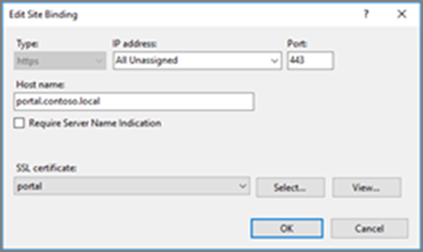
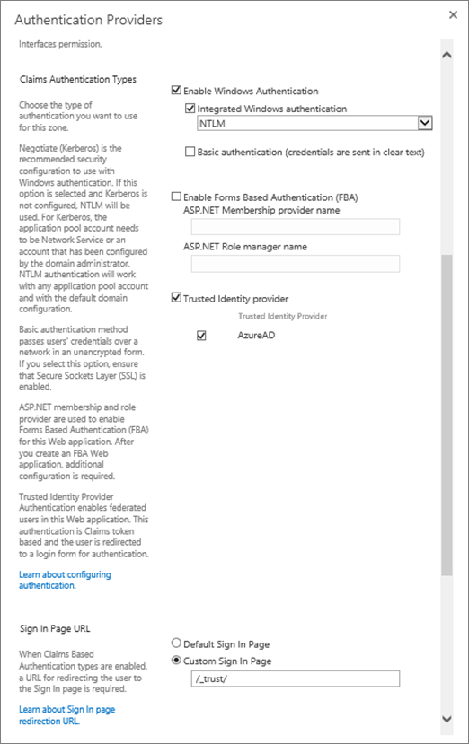
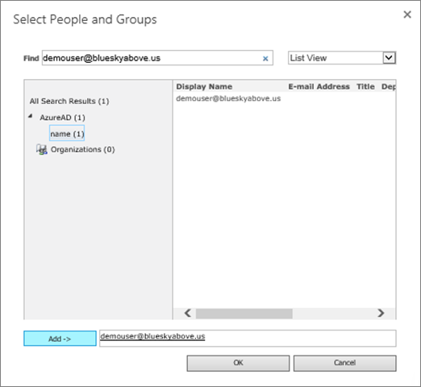

# <a name="using-azure-ad-for-sharepoint-server-authentication"></a>Usar o Azure AD para a autenticação do SharePoint Server

 **Resumo:** Saiba como autenticar os usuários do SharePoint Server 2016 com o Windows Azure Active Directory. 

<blockquote>
<p>Este artigo refere-se para as amostras de código para interagir com o gráfico do Azure Active Directory. Você pode baixar os exemplos de código [aqui](https://github.com/kaevans/spsaml11/tree/master/scripts).</p>
</blockquote>

SharePoint Server 2016 fornece a capacidade de autenticar os usuários que usam autenticação baseada em declarações, facilitando a gerenciar seus usuários, autenticando-los com diferentes provedores de identidade que gerencia a outra pessoa, mas você confia. Por exemplo, em vez de gerenciar autenticação de usuário por meio de serviços de domínio Active Directory (AD DS), você pode permitir que os usuários se autentiquem usando o Azure Active Directory (AD Azure). Isso permite que a autenticação para usuários somente na nuvem com o sufixo onmicrosoft.com em seu nome de usuário, os usuários sincronizados com um diretório local e usuários convidados de outros diretórios de convidados. Ele também permite que você se beneficiar dos recursos do Windows Azure AD, como a autenticação multifator e recursos avançados de relatórios.

> [!IMPORTANT]
> A solução descrita neste artigo também pode ser usada com o SharePoint Server 2013; No entanto, tenha em mente que a SharePoint Server 2013 está se aproximando o fim do suporte indispensável. Para obter mais informações, consulte [Diretiva de ciclo de vida da Microsoft](https://support.microsoft.com/en-us/lifecycle/search?alpha=SharePoint%20Server%202013) e [Atualizado política de manutenção de produtos do SharePoint 2013](https://technet.microsoft.com/library/684173bb-e90a-4eb7-b268-b8d7458bc802(v=office.16).aspx).

Este artigo explica como você pode usar o Windows Azure AD para autenticar os usuários, em vez de seu local AD DS. Nesta configuração, o Azure AD se torna um provedor de identidade confiável para o SharePoint Server 2016. Essa configuração adiciona um método de autenticação de usuário que é separado da autenticação de AD DS usada pela instalação do SharePoint Server 2016 em si. Para se beneficiar deste artigo, você deve estar familiarizado com WS-Federation. Para obter mais informações, consulte [Understanding WS-Federation](https://go.microsoft.com/fwlink/p/?linkid=188052).


Anteriormente, essa configuração exigiria um serviço de federação como o Azure Access Control Service (ACS) em nuvem ou em um ambiente que hospeda os serviços de Federação do Active Directory (AD FS) transformar tokens do SAML 2.0 para o SAML 1.1. Essa transformação não é mais necessária conforme o Azure AD agora permite a emissão de tokens de SAML 1.1. O diagrama acima mostra como funciona a autenticação para usuários do SharePoint 2016 nesta configuração, demonstrando que não existe mais um requisito para um intermediário para realizar essa transformação.

> [!NOTE]
> Essa configuração funciona se o farm do SharePoint é hospedado nas máquinas virtuais do Azure ou local. Ele não requer a abertura de portas de firewall adicional que não seja, garantindo que os usuários pode acessar o Azure Active Directory do seu navegador.

Para obter informações sobre a acessibilidade 2016 do SharePoint, consulte [As diretrizes de acessibilidade no SharePoint Server 2016](https://go.microsoft.com/fwlink/p/?LinkId=393123).

## <a name="configuration-overview"></a>Visão geral da configuração

Siga estas etapas gerais para configurar seu ambiente para usar o Windows Azure AD como um provedor de identidade 2016 do SharePoint Server.

1. Criar um novo diretório Azure AD ou usar seu diretório existente.
2. Certifique-se de que a zona para o aplicativo web que você deseja seguro com o Azure AD está configurada para usar SSL.
3. Crie um novo aplicativo empresarial no Azure AD.
4. Configure um novo provedor de identidade confiável no SharePoint Server 2016.
5. Defina as permissões para o aplicativo web.
6. Adicione uma política de emissão de tokens de SAML 1.1 no Azure AD.
7. Verifique se o novo provedor.

As seções a seguir descrevem como executar essas tarefas.

## <a name="step-1-create-a-new-azure-ad-directory-or-use-your-existing-directory"></a>Etapa 1: Criar um novo diretório Azure AD ou usar seu diretório existente

No Portal do Windows Azure ([https://portal.azure.com](https://portal.azure.com)), crie um novo diretório. Forneça o nome da organização, o nome de domínio inicial e o país ou região.

 

 Se você já tiver um diretório como aquele usado para o Microsoft Office 365 ou sua assinatura do Microsoft Azure, você pode usar nesse diretório. Você deve ter permissões para registrar aplicativos no diretório.

## <a name="step-2-ensure-the-zone-for-the-web-application-that-you-want-to-secure-with-azure-ad-is-configured-to-use-ssl"></a>Etapa 2: Verifique se a zona para o aplicativo web que você deseja seguro com o Azure AD está configurada para usar SSL

Este artigo foi escrito usando a arquitetura de referência, na caixa [executar uma farm do SharePoint Server 2016 no Azure de alta disponibilidade](https://docs.microsoft.com/en-us/azure/architecture/reference-architectures/sharepoint). Scripts acompanha deste artigo, usados para implantar a solução descrita [neste](https://docs.microsoft.com/en-us/azure/architecture/reference-architectures/sharepoint) artigo criam um site que não usam SSL.  

O uso de SAML exige que o aplicativo a ser configurado para usar SSL. Se seu aplicativo web do SharePoint não estiver configurado para usar SSL, use as etapas a seguir para criar um novo certificado autoassinado para configurar o aplicativo web para SSL. Essa configuração somente é destinada a um ambiente de laboratório e destina-se não produção. Ambientes de produção devem usar um certificado assinado.

1. Vá até **A Administração Central** > **Gerenciamento de aplicativos** > **Gerenciar aplicativos Web**e escolha o aplicativo web que precisa ser estendido para usar SSL. Selecione o aplicativo web e clique no botão da **faixa de opções Extend** . Estenda o aplicativo web para usar a mesma URL mas usar SSL com a porta 443.<br/><br/>
2. No Gerenciador do IIS, clique duas vezes em **Certificados de servidor**.
3. No painel **ações** , clique em **Criar certificado autoassinado**. Digite um nome amigável do certificado na especificar um nome amigável para a caixa de certificado e, em seguida, clique em **Okey**.
4. Na caixa de diálogo **Editar associação de Site** , verifique se o nome do host é o mesmo que o nome amigável, como ilustrado na imagem a seguir.<br/><br/>

Cada um dos servidores web front-end no farm do SharePoint exigirá Configurando o certificado para a ligação do site no IIS.


## <a name="step-3-create-a-new-enterprise-application-in-azure-ad"></a>Etapa 3: Criar um novo aplicativo empresarial no Azure AD.

1. No Portal do Windows Azure ([https://portal.azure.com](https://portal.azure.com)), abra o seu diretório do Windows Azure AD. Clique em **Aplicativos empresariais**, clique em **novo aplicativo**. Escolha **o aplicativo de não-Galeria**. Forneça um nome, como *Integração de SAML do SharePoint* e clique em **Adicionar**.<br/><br/>
2. Clique no link de logon único no painel de navegação para configurar o aplicativo. Altere a lista suspensa **modo de logon único** para **baseada em SAML Sign-on** para revelar as propriedades de configuração de SAML para o aplicativo. Configure com as seguintes propriedades:<br/>
    - Identificador:`urn:sharepoint:portal.contoso.local`
    - URL de resposta:`https://portal.contoso.local/_trust/default.aspx`
    - URL de Sign-on:`https://portal.contoso.local/_trust/default.aspx`
    - Identificador de usuário:`user.userprincipalname`<br/>
    - Observação: Não se esqueça altere as URLs, substituindo *portal.contoso.local* com a URL do site do SharePoint que você deseja proteger.<br/>
3. Configure uma tabela (semelhante a tabela 1 abaixo) que inclui as seguintes linhas:<br/> 
    - Realm
    - Caminho completo para o arquivo de certificado de assinatura de SAML
    - SAML Single Sign-On URL do serviço (substituindo */saml2* pelo */wsfed*)
    - ID do objeto de aplicativo. <br/>
Copiar o valor do *identificador* para a propriedade *Realm* em uma tabela (consulte Tabela 1 abaixo).
4. Salve suas alterações.
5. Clique no link **Configurar (nome de aplicativo)** para acessar a página Configurar logon.<br/><br/> 
    -  Clique no link de **SAML certificado de assinatura - brutos** para baixar o certificado de autenticação SAML como um arquivo com a extensão. cer. Copie e cole o caminho completo para o arquivo baixado em sua tabela.
    - Copie e cole o link de SAML Single Sign-On Service URL em seu, substituindo a parte */saml2* da URL por */wsfed*.<br/>
6.  Navegue até o painel de **Propriedades** para o aplicativo. Copie e cole o valor de ID de objeto para a tabela que você configurou na etapa 3.<br/><br/>
7. Usando os valores que você capturou, verifique se a tabela que você configurou na etapa 3 se parece com a tabela 1 abaixo.


| Tabela 1: Valores capturados  |  |
|---------|---------|
|Realm | `urn:sharepoint:portal.contoso.local` |
|Caminho completo para o arquivo de certificado de assinatura de SAML | `C:/temp/SharePoint SAML Integration.cer`  |
|URL do serviço single sign-on SAML (substitua /saml2 /wsfed) | `https://login.microsoftonline.com/b1726649-b616-460d-8d20-defab80d476c/wsfed` |
|ID de objeto do aplicativo | `a812f48b-d1e4-4c8e-93be-e4808c8ca3ac` |

> [!IMPORTANT]
> Substitua o valor de */saml2* na URL */wsfed*. O ponto de extremidade */saml2* processará tokens de SAML 2.0. O ponto de extremidade */wsfed* permite que os tokens de SAML 1.1 de processamento e é necessário para federação de SharePoint 2016 SAML.

## <a name="step-4-configure-a-new-trusted-identity-provider-in-sharepoint-server-2016"></a>Etapa 4: Configurar um novo provedor de identidade confiável no SharePoint Server 2016

Inscreva-se para o servidor do SharePoint Server 2016 e abra o Shell de gerenciamento do SharePoint 2016. Preencha os valores de $realm, $wsfedurl e $filepath da tabela 1 e execute os seguintes comandos para configurar um novo provedor de identidade confiável.

> [!TIP]
> Se você não estiver familiarizado com o uso do PowerShell ou quer saber mais sobre o funcionamento do PowerShell, consulte [SharePoint PowerShell](https://docs.microsoft.com/en-us/powershell/sharepoint/overview?view=sharepoint-ps). 

```
$realm = "<Realm from Table 1>"
$wsfedurl="<SAML single sign-on service URL from Table 1>"
$filepath="<Full path to SAML signing certificate file from Table 1>"
$cert = New-Object System.Security.Cryptography.X509Certificates.X509Certificate2($filepath)
New-SPTrustedRootAuthority -Name "AzureAD" -Certificate $cert
$map = New-SPClaimTypeMapping -IncomingClaimType "http://schemas.xmlsoap.org/ws/2005/05/identity/claims/name" -IncomingClaimTypeDisplayName "name" -LocalClaimType "http://schemas.xmlsoap.org/ws/2005/05/identity/claims/upn"
$map2 = New-SPClaimTypeMapping -IncomingClaimType "http://schemas.xmlsoap.org/ws/2005/05/identity/claims/givenname" -IncomingClaimTypeDisplayName "GivenName" -SameAsIncoming
$map3 = New-SPClaimTypeMapping -IncomingClaimType "http://schemas.xmlsoap.org/ws/2005/05/identity/claims/surname" -IncomingClaimTypeDisplayName "SurName" -SameAsIncoming
$ap = New-SPTrustedIdentityTokenIssuer -Name "AzureAD" -Description "SharePoint secured by Azure AD" -realm $realm -ImportTrustCertificate $cert -ClaimsMappings $map,$map2,$map3 -SignInUrl $wsfedurl -IdentifierClaim "http://schemas.xmlsoap.org/ws/2005/05/identity/claims/name"
```

Em seguida, siga estas etapas para habilitar o provedor de identidade confiável para o seu aplicativo:
1. Na Administração Central, navegue até **Gerenciar aplicativos da Web** e selecione o aplicativo web que você deseja assegurar com o Azure AD. 
2. Na faixa de opções, clique em **Provedores de autenticação** e escolha a zona que você deseja usar.
3. Selecione o **provedor de identidade confiável** e selecione o provedor de identidade que você acabou de ser registrado chamado *AzureAD*.  
4. Na configuração do URL de página de entrada, selecione **personalizado entrar em página** e fornecer o valor "/_trust/". 
5. Clique em **OK**.



> [!IMPORTANT]
> É importante seguindo todas as etapas, incluindo a definição de entrada personalizada da página como "/_trust/", conforme mostrado. A configuração não funcionará corretamente, a menos que todas as etapas são seguidas.

## <a name="step-5-set-the-permissions"></a>Etapa 5: Definir as permissões

Os usuários que irá fizer logon no Windows Azure AD e acessar o SharePoint devem ser concedidos acesso ao aplicativo. 

1. No Portal do Windows Azure, abra o diretório do Windows Azure AD. Clique em **Aplicativos empresariais**, clique em **todos os aplicativos**. Clique no aplicativo que você criou anteriormente (integração de SAML do SharePoint).
2. Clique em **usuários e grupos**. 
3. Clique em **Adicionar usuário** para adicionar um usuário ou grupo que terá permissões para entrar no SharePoint usando o Windows Azure AD.
4. Selecione o usuário ou grupo e clique em **atribuir**.
 
O usuário já tem permissão no Azure AD, mas também deve ter a permissão no SharePoint. Use as etapas a seguir para definir as permissões para acessar o aplicativo web.

1. Em Administração Central, clique em **Gerenciamento de Aplicativo**.
2. Na página **Gerenciamento de aplicativos** , na seção **Aplicativos Web** , clique em **Gerenciar aplicativos da web**.
3. Clique no aplicativo da Web apropriado e, em seguida, clique em **Política do Usuário**.
4. Em política para aplicativo Web, clique em **Adicionar usuários**.<br/><br/>
5. Na caixa de diálolgo **Adicionar Usuários**, clique na zona apropriada em **Zonas**e, depois, em **Avança**.
6. Na caixa de diálogo **política para aplicativo Web** , na seção **Escolher usuários** , clique no ícone **Procurar** .
7. Na caixa de texto **Localizar** , digite o nome de entrada para um usuário em seu diretório e clique em **Pesquisar**. <br/>Exemplo: *demouser@blueskyabove.onmicrosoft.com*.
8. Sob o título AzureAD na exibição de lista, selecione a propriedade name e clique em **Adicionar** e clique em **Okey** para fechar a caixa de diálogo.
9. Em permissões, clique em **Controle total**.<br/><br/>
10. Clique em **Concluir** e então clique em **OK**.

## <a name="step-6-add-a-saml-11-token-issuance-policy-in-azure-ad"></a>Etapa 6: Adicionar uma política de emissão de tokens de SAML 1.1 no Azure AD.

Quando o aplicativo do Azure AD é criado no portal, o padrão é usar SAML 2.0. SharePoint Server 2016 requer o formato de token de SAML 1.1. O script a seguir removerá a política de SAML 2.0 padrão e adicionar uma nova política aos tokens de SAML 1.1 do problema. 

> Este código requer baixando as acompanha [amostras demonstrar a interação com o Windows Azure Active Directory Graph](https://github.com/kaevans/spsaml11/tree/master/scripts). Se você baixar os scripts como um arquivo ZIP do GitHub uma área de trabalho do Windows, certifique-se desbloquear o `MSGraphTokenLifetimePolicy.psm1` arquivo de script do módulo e o `Initialize.ps1` arquivo de script (clique com o botão Propriedades, selecione Desbloquear, clique em Okey). 

Depois que o script de exemplo é baixado, crie um novo script PowerShell usando o seguinte código, substituindo o espaço reservado com o caminho de arquivo do baixada `Initialize.ps1` em sua máquina local. Substitua o espaço reservado ID de objeto do aplicativo com a ID de objeto do aplicativo que você inseriu na tabela 1. Depois de criado, execute o script do PowerShell. 

```
function AssignSaml11PolicyToAppPrincipal
{
    Param(
        [Parameter(Mandatory=$true)]
        [string]$pathToInitializeScriptFile, 
        [Parameter(Mandatory=$true)]
        [string]$appObjectid
    )

    $folder = Split-Path $pathToInitializeScriptFile
    Push-Location $folder

    #Loads the dependent ADAL module used to acquire tokens
    Import-Module $pathToInitializeScriptFile 

    #Gets the existing token issuance policy
    $existingTokenIssuancePolicy = Get-PoliciesAssignedToServicePrincipal -servicePrincipalId $appObjectid | ?{$_.type -EQ "TokenIssuancePolicy"} 
    Write-Host "The following TokenIssuancePolicy policies are assigned to the service principal." -ForegroundColor Green
    Write-Host $existingTokenIssuancePolicy -ForegroundColor White
    $policyId = $existingTokenIssuancePolicy.objectId

    #Removes existing token issuance policy
    Write-Host "Only a single policy can be assigned to the service principal. Removing the existing policy with ID $policyId" -ForegroundColor Green
    Remove-PolicyFromServicePrincipal -policyId $policyId -servicePrincipalId $appObjectid

    #Creates a new token issuance policy and assigns to the service principal
    Write-Host "Adding the new SAML 1.1 TokenIssuancePolicy" -ForegroundColor Green
    $policy = Add-TokenIssuancePolicy -DisplayName SPSAML11 -SigningAlgorithm "http://www.w3.org/2001/04/xmldsig-more#rsa-sha256" -TokenResponseSigningPolicy TokenOnly -SamlTokenVersion "1.1"
    Write-Host "Assigning the new SAML 1.1 TokenIssuancePolicy $policy.objectId to the service principal $appObjectid" -ForegroundColor Green
    Set-PolicyToServicePrincipal -policyId $policy.objectId -servicePrincipalId $appObjectid
    Pop-Location
}

#Only edit the following two variables
$pathToInitializeScriptFile = "<file path of Initialize.ps1>"
$appObjectid = "<Application Object ID from Table 1>"

AssignSaml11PolicyToAppPrincipal $pathToInitializeScriptFile $appObjectid
```
> [!IMPORTANT]
> Os scripts do PowerShell não estiver conectados e você pode ser solicitado para definir a diretiva de execução. Para obter mais informações sobre políticas de execução, consulte [Sobre políticas de execução](http://go.microsoft.com/fwlink/?LinkID=135170). Além disso, você pode precisar abra um prompt de comando elevado com êxito, execute os comandos contidos nos scripts de exemplo.

Esses comandos do PowerShell de amostra são exemplos de como executar consultas em API do gráfico. Para obter mais detalhes sobre as diretivas de emissão Token com o Azure AD, consulte a [referência de API do gráfico para operações na política](https://msdn.microsoft.com/en-us/library/azure/ad/graph/api/policy-operations#create-a-policy).

## <a name="step-7-verify-the-new-provider"></a>Etapa 7: Verificar o novo provedor

Abra um navegador para a URL do aplicativo web que você configurou nas etapas anteriores. Você é redirecionado para entrar no Azure AD.


Você será solicitado que se deseja manter-se conectado.


Finalmente, você pode acessar o site logado como um usuário de seu locatário do Azure Active Directory.


## <a name="managing-certificates"></a>Gerenciando certificados
É importante entender que o certificado de assinatura que foi configurado para o provedor de identidade confiável na etapa 4 acima tem uma data de validade e deve ser renovado. Consulte o artigo [Gerenciar certificados de federados single sign-on no Windows Azure Active Directory](https://docs.microsoft.com/en-us/azure/active-directory/active-directory-sso-certs) para obter informações sobre a renovação de certificados. Depois que o certificado foi renovado no Azure AD, baixe para um arquivo local e usar o script a seguir para configurar o provedor de identidade confiável com o certificado de assinatura renovado. 

```
$filepath="<Full path to renewed SAML signing certificate file>"
$cert= New-Object System.Security.Cryptography.X509Certificates.X509Certificate2($filePath)
New-SPTrustedRootAuthority -Name "AzureAD" -Certificate $cert
Get-SPTrustedIdentityTokenIssuer "AzureAD" | Set-SPTrustedIdentityTokenIssuer -ImportTrustCertificate $cert
```
## <a name="configuring-one-trusted-identity-provider-for-multiple-web-applications"></a>Configurando um provedor de identidade confiável para vários aplicativos da web
A configuração funciona para um único aplicativo web, mas precisa configuração adicional se você pretende usar o mesmo provedor de identidade confiável para vários aplicativos da web. Por exemplo, suponha que um aplicativo web para usar a URL estendida `https://portal.contoso.local` e agora deseja autenticar os usuários `https://sales.contoso.local` também. Para fazer isso, é necessário atualizar o provedor de identidade para honram o parâmetro WReply e atualizar o registro de aplicativo no Windows Azure AD para adicionar uma URL de resposta.

1. No Portal do Windows Azure, abra o diretório do Windows Azure AD. Clique em **registros de aplicativo**, clique em **Exibir todos os aplicativos**. Clique no aplicativo que você criou anteriormente (integração de SAML do SharePoint).
2. Clique em **configurações**.
3. No blade configurações, clique em **URLs de resposta**. 
4. Adicione a URL para o aplicativo web adicionais com `/_trust/default.aspx` acrescentados à URL (como `https://sales.contoso.local/_trust/default.aspx`) e clique em **Salvar**. 
5. No servidor do SharePoint, abra o **Shell de gerenciamento do SharePoint 2016** e execute os seguintes comandos, usando o nome do emissor de token de identidade confiável que você usou anteriormente.

```
$t = Get-SPTrustedIdentityTokenIssuer "AzureAD"
$t.UseWReplyParameter=$true
$t.Update()
```
6. Na Administração Central, vá para o aplicativo web e habilitar o provedor de identidade confiável existente. Lembre-se também configurar a URL da página de entrada como uma página de entrada personalizada `/_trust/`.
7. Na Administração Central, clique no aplicativo web e escolha a **Política de usuário**. Adicione um usuário com as permissões apropriadas, conforme demonstrado anteriormente neste artigo.

## <a name="fixing-people-picker"></a>Corrigindo seletor de pessoas
Os usuários agora podem fazer logon em 2016 do SharePoint usando as identidades do Azure AD, mas ainda existem oportunidades de aprimoramento para a experiência do usuário. Por exemplo, procurando por um usuário apresenta vários resultados de pesquisa no seletor de pessoas. Não há um resultado de pesquisa para cada um dos tipos de 3 declaração que foram criados no mapeamento de declaração. Para escolher um usuário usando o seletor de pessoas, você deve digitar seu nome de usuário exatamente e escolha o **nome** do resultado de declaração.


Não há nenhuma validação nos valores de pesquisa, que pode resultar em erros ortográficos ou a declaração de usuários acidentalmente escolhendo errado declaração de tipo a ser atribuído como o **Sobrenome** . Isso pode impedir que os usuários acessem os recursos com êxito.

Para auxiliar nesse cenário, há uma fonte de abrir solução chamada [AzureCP](https://yvand.github.io/AzureCP/) que fornece um provedor de declarações personalizados para 2016 do SharePoint. Ele usará o gráfico do Windows Azure AD para resolver o que os usuários inserir e executam validação. Saiba mais em [AzureCP](https://yvand.github.io/AzureCP/). 

## <a name="additional-resources"></a>Recursos adicionais

[Noções básicas sobre WS-Federation](https://go.microsoft.com/fwlink/p/?linkid=188052)
  
[Adoção da nuvem e soluções híbridas](cloud-adoption-and-hybrid-solutions.md)
  
## <a name="join-the-discussion"></a>Ingressar na discussão

|**Fale conosco**|**Descrição**|
|:-----|:-----|
|**De qual conteúdo sobre adoção da nuvem você precisa?** <br/> |Estamos criando conteúdo para adoção da nuvem que engloba diversas plataformas e serviços de nuvem da Microsoft. Para solicitar um conteúdo específico ou dar opiniões sobre nosso conteúdo de adoção da nuvem, envie um email para [cloudadopt@microsoft.com](mailto:cloudadopt@microsoft.com?Subject=[Cloud%20Adoption%20Content%20Feedback]:%20).<br/> |
|**Participe do debate sobre a adoção da nuvem** <br/> |Se você gosta de soluções em nuvem, considere ingressar no Cloud Adoption Advisory Board (CAAB) para se conectar com uma comunidade maior e vibrante de desenvolvedores de conteúdo da Microsoft, profissionais do setor e clientes de todo o mundo. Para participar, adicione-se como membro do espaço [CAAB (Cloud Adoption Advisory Board)](https://aka.ms/caab) da Microsoft Tech Community e envie um email rápido para [CAAB@microsoft.com](mailto:caab@microsoft.com?Subject=I%20just%20joined%20the%20Cloud%20Adoption%20Advisory%20Board!). Qualquer pessoa pode ler o conteúdo relacionado à comunidade no [blog do CAAB](https://blogs.technet.com/b/solutions_advisory_board/). No entanto, os membros do CAAB recebem convites para webinars particulares que descrevem novas soluções e recursos de adoção da nuvem.<br/> |
|**Obtenha a arte que você vê aqui** <br/> |Se você quiser uma cópia editável da arte vista neste artigo, teremos o maior prazer em enviá-la. Envie sua solicitação por email, incluindo a URL e o título da arte, para [cloudadopt@microsoft.com](mailto:cloudadopt@microsoft.com?subject=[Art%20Request]:%20).<br/> |
   

