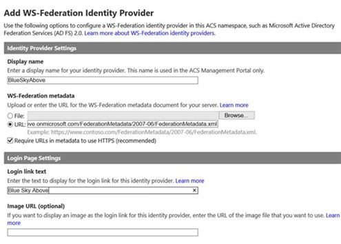
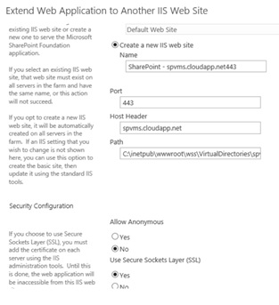
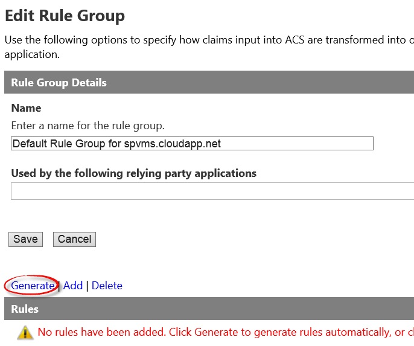
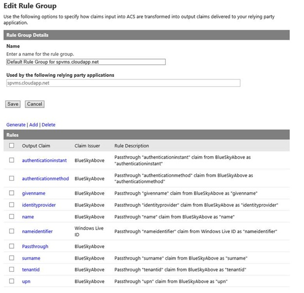
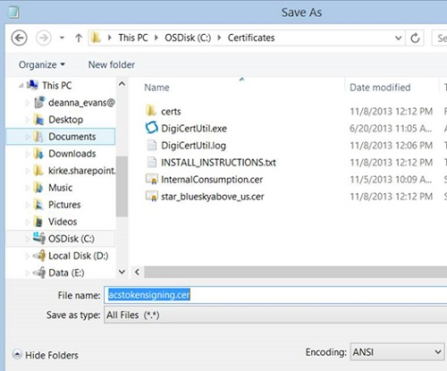
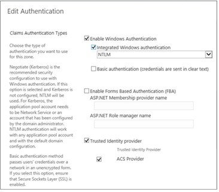

# <a name="using-microsoft-azure-active-directory-for-sharepoint-2013-authentication"></a>Usando o Microsoft Azure Active Directory para autenticação do SharePoint 2013

 **Resumo:** Saiba como usar o serviço de controle de acesso do Windows Azure para autenticar os usuários do SharePoint Server 2013 com o Windows Azure Active Directory.
  
Pode ser mais fácil gerenciar seus usuários, autenticando-los com provedores de identidade diferente. Considere como pode ser prático para usar um provedor de identidade que você confia, mas gerencia a outra pessoa. Por exemplo, você poderia ter um tipo de autenticação para usuários que acessam o SharePoint Server 2013 na nuvem e outro para usuários do SharePoint 2013 no seu ambiente local. O serviço de controle de acesso do Windows Azure possibilita a essas escolhas. 
  
Este artigo explica como você pode usar o serviço de controle de acesso do Windows Azure para autenticar os usuários do SharePoint 2013 com o Azure AD, em vez de seu local no Active Directory. Nesta configuração, o Azure AD se torna um provedor de identidade confiável para o SharePoint 2013. Essa configuração adiciona um método de autenticação de usuário que é separado da autenticação do Active Directory usada pela instalação do SharePoint 2013 em si. Para se beneficiar deste artigo, você deve estar familiarizado com WS-Federation. Para obter mais informações, consulte [Understanding WS-Federation](https://go.microsoft.com/fwlink/p/?linkid=188052).
  
A figura a seguir mostra como funciona a autenticação para usuários do SharePoint 2013 nessa configuração.
  

  
O exemplo usado neste artigo é fornecido pelo Pedro Evans, Microsoft Architect para o Centro de excelência do Azure. 
  
Para obter informações sobre a acessibilidade do SharePoint 2013, consulte [acessibilidade do SharePoint 2013](https://go.microsoft.com/fwlink/p/?LinkId=393123).
  
## <a name="configuration-overview"></a>Visão geral da configuração

Siga estas etapas gerais para configurar seu ambiente para usar o Windows Azure AD como um provedor de identidade do SharePoint 2013.
  
1. Criar um novo inquilino do Azure AD e o namespace.
    
2. Adicione um provedor de identidade do WS-Federation.
    
3. Adicione o SharePoint como um aplicativo confiável de terceiros.
    
4. Crie um certificado autoassinado a ser usada para SSL.
    
5. Crie um grupo de regra para autenticação baseada em declarações.
    
6. Configure o certificado x. 509.
    
7. Crie um mapeamento de declaração.
    
8. Configure o SharePoint para o novo provedor de identidade.
    
9. Defina as permissões.
    
10. Verifique se o novo provedor.
    
## <a name="create-azure-ad-tenant-and-namespace"></a>Crie o namespace e locatário do Azure AD.

Use as etapas a seguir para criar um novo inquilino do Azure AD e um namespace associado. Neste exemplo, usamos o namespace "blueskyabove". 
  
1. No Portal de gerenciamento do Windows Azure, clique em **Active Directory**e, em seguida, crie um novo inquilino do Azure AD.
    
2. Clique em **Namespaces de controle de acesso**e criar um novo namespace. 
    
3. Na barra de ferramentas inferior, clique em **Gerenciar** . Isso deve abrir este local, https://blueskyabove.accesscontrol.windows.net/v2/mgmt/web.
    
4. Abra o Windows PowerShell. Use o Microsoft Online Services Module for Windows PowerShell, que é um pré-requisito para instalar os cmdlets do Windows Azure para o Windows PowerShell.
    
5. No prompt de comando do Windows PowerShell, digite o comando: `Connect-Msolservice`e digite suas credenciais.
    
    > [!NOTE]
    > Para obter informações adicionais sobre como usar os cmdlets do Windows Azure para o Windows PowerShell, consulte [Gerenciar o Azure AD usando o Windows PowerShell](https://go.microsoft.com/fwlink/p/?LinkId=393124). 
  
6. Em um prompt de comando do Windows PowerShell, digite os seguintes comandos:
    
  ```
  Import-Module MSOnlineExtended -Force
  ```

  ```
  $replyUrl = New-MsolServicePrincipalAddresses -Address "https://blueskyabove.accesscontrol.windows.net/"
  ```

  ```
  New-MsolServicePrincipal -ServicePrincipalNames @("https://blueskyabove.accesscontrol.windows.net/") -DisplayName "BlueSkyAbove ACS Namespace" -Addresses $replyUrl
  ```

    A figura a seguir ilustra o resultado de saída.
    
     
  
## <a name="add-a-ws-federation-identity-provider-to-the-namespace"></a>Adicionar um provedor de identidade do WS-Federation ao namespace

Use as etapas a seguir para adicionar um novo provedor de identidade do WS-Federation ao namespace blueskyabove.
  
1. Do portal de gerenciamento do Azure, vá para o **Active Directory** > **Namespaces de controle de acesso**, clique em **criar uma nova instância**e, em seguida, clique em **Gerenciar**.
    
2. No portal do controle de acesso do Windows Azure, clique em **Provedores de identidade** > **Add**, conforme ilustrado na figura a seguir.
    
     
  
3. Clique em **provedor de identidade do WS-Federation**, conforme ilustrado na figura a seguir e clique em **Avançar**.
    
     
  
4. Preencher o texto do link logon e o nome de exibição e, em seguida, clique em **Salvar**. Para a URL de metadados do WS-Federation, digite https://accounts.accesscontrol.windows.net/blueskyabove.onmicrosoft.com/FederationMetadata/2007-06/FederationMetadata.xml. A figura a seguir ilustra a configuração.
    
     
  
## <a name="add-sharepoint-as-a-relying-party-application"></a>Adicionar SharePoint como um aplicativo confiável de terceiros

Use as etapas a seguir para adicionar o SharePoint como um aplicativo confiável de terceiros.
  
Para obter informações adicionais sobre as configurações do aplicativo de terceira parte confiável, consulte [Terceira aplicativos de terceiros](https://go.microsoft.com/fwlink/p/?LinkId=393125).
  
1. Do portal do controle de acesso do Windows Azure, clique em **aplicativos de terceiros de confiança**e clique em **Adicionar**, conforme ilustrado na figura a seguir.
    
     
  
## <a name="create-a-self-signed-certificate-to-use-for-ssl"></a>Criar um certificado autoassinado a ser usada para SSL

Use as etapas a seguir para criar um certificado autoassinado, de novo a ser usado para comunicações seguras via SSL.
  
1. Estenda o aplicativo web para usar a mesma URL como PublishingSite, mas usar SSL com a porta 443, conforme ilustrado na figura a seguir.
    
     
  
2. No Gerenciador do IIS, clique duas vezes em **Certificados de servidor**.
    
3. No painel **ações** , clique em **Criar certificado autoassinado**. Digite um nome amigável do certificado na caixa **especificar um nome amigável do certificado** e, em seguida, clique em **Okey**.
    
4. Na caixa de diálogo **Editar associação de Site** , verifique se que o nome do host é o mesmo que o nome amigável, conforme ilustrado nas figuras a seguir.
    
     
  
     
  
5. Do portal de gerenciamento do Azure, clique na máquina virtual que você deseja configurar e clique em **pontos de extremidade**.
    
6. Clique em **Adicionar**e, em seguida, clique em **-->** (para Avançar).
    
7. Em **nome**, digite um nome para o ponto de extremidade.
    
8. Em **Porta pública** e **Privada porta**, digite os números de porta que você deseja usar e clique para concluir a marca de seleção. Esses números podem ser diferentes. Para os fins deste artigo, estamos usando 443, conforme ilustrado na figura a seguir.
    
     
  
    > [!NOTE]
    > Para obter informações adicionais sobre como adicionar um ponto de extremidade para uma máquina virtual no Windows Azure, consulte [como definir backup pontos de extremidade para uma máquina Virtual](https://go.microsoft.com/fwlink/p/?LinkId=393126). 
  
9. Do portal de serviços do controle de acesso, adicione uma terceira parte confiável, conforme ilustrado na figura a seguir.
    
     
  
## <a name="create-a-rule-group-for-claims-based-authentication"></a>Criar um grupo de regra para a autenticação baseada em declarações

Use as etapas a seguir para criar um novo grupo de regra para controlar a autenticação baseada em declarações.
  
1. No painel esquerdo, clique em **grupos de regra**e clique em **Adicionar**.
    
2. Digite um nome para o grupo de regras, clique em **Salvar**e, em seguida, clique em **Gerar**. Para os fins deste artigo, estamos usando o **grupo de regra padrão loop for spvms.cloudapp.net**, conforme ilustrado na figura a seguir.
    
     
  
     
  
    > [!NOTE]
    > Para obter informações adicionais sobre como criar grupos de regras, consulte [grupos de regras e regras](https://go.microsoft.com/fwlink/p/?LinkId=393128). 
  
3. Clique no grupo de regra que você deseja alterar e, em seguida, clique na regra de declaração que você deseja alterar. Para os fins deste artigo, adicionamos uma regra de declaração no grupo para passar o **nome** como **upn**, conforme ilustrado na figura a seguir.
    
     
  
4. Excluir a regra de declaração existente chamada **upn**e deixar a regra de **Declaração nome UPN** , conforme ilustrado na figura a seguir.
    
     
  
## <a name="configure-the-x509-certificate"></a>Configurar o certificado x. 509

Use as seguintes etapas para configurar o certificado x. 509 a ser usado para autenticação de token.
  
1. No painel de serviço de controle de acesso, **desenvolvimento**, clique em **integração de aplicativos**.
    
2. Na **Referência de ponto de extremidade**, localize o **Federation** que está associado ao seu locatário do Azure e copie o local na barra de endereços de um navegador.
    
3. No arquivo **Federation** , localize a seção **RoleDescriptor** e copie as informações a partir do _<X509Certificate>_ elemento, conforme ilustrado na figura a seguir.
    
     
  
4. Partindo da raiz da unidade c:\\, crie uma pasta chamada **certificados**.
    
5. Salvar a informação de X509Certificate até a pasta c:\\certificados com o nome de arquivo, **AcsTokenSigning.cer**.
    
    > [!NOTE]
    > O nome de arquivo deve ser salvo com uma extensão. cer. 
  
     
  
## <a name="create-a-claim-mapping-by-using-windows-powershell"></a>Criar um mapeamento de declarações usando o Windows PowerShell

Use as etapas a seguir para criar um mapeamento de declarações usando o Windows PowerShell.
  
Verifique se você possui as seguintes associações:
  
1. função de servidor fixa **securityadmin** na instância do SQL Server.
    
2. função de banco de dados fixa **db_owner** em todos os bancos de dados que serão atualizados.
    
3. Grupo de administradores no servidor no qual você está executando os cmdlets do Windows PowerShell.
    
Um administrador pode usar o cmdlet **Add-SPShellAdmin** para conceder permissões para usar cmdlets do SharePoint 2013.
  
> [!NOTE]
> Se você não tiver permissões, contate o administrador da instalação ou o administrador do SQL Server para solicitar permissões. Para obter informações adicionais sobre as permissões do Windows PowerShell, consulte [Add-SPShellAdmin](http://technet.microsoft.com/library/2ddfad84-7ca8-409e-878b-d09cb35ed4aa.aspx). 
  
1. No menu **Iniciar** , clique em **Todos os programas**.
    
2. Clique em **Produtos Microsoft SharePoint 2013**.
    
3. Clique em **Shell de gerenciamento do SharePoint 2013**.
    
4. No prompt de comando do Windows PowerShell, digite os comandos a seguir para criar um mapeamento de declaração:
    
  ```
  $cert = New-Object System.Security.Cryptography.X509Certificates.X509Certificate2("c:\\certificates\\AcsTokenSigning.cer")
  ```

  ```
  New-SPTrustedRootAuthority -Name "ACS BlueSkyAbove Token Signing" -Certificate $cert
  ```

  ```
  $map = New-SPClaimTypeMapping -IncomingClaimType "http://schemas.xmlsoap.org/ws/2005/05/identity/claims/upn" -IncomingClaimTypeDisplayName "UPN" -SameAsIncoming
  ```

  ```
  $map2 = New-SPClaimTypeMapping -IncomingClaimType "http://schemas.xmlsoap.org/ws/2005/05/identity/claims/givenname" -IncomingClaimTypeDisplayName "GivenName" -SameAsIncoming
  ```

  ```
  $map3 = New-SPClaimTypeMapping -IncomingClaimType "http://schemas.xmlsoap.org/ws/2005/05/identity/claims/surname" -IncomingClaimTypeDisplayName "SurName" -SameAsIncoming
  ```

  ```
  $realm = "urn:sharepoint:spvms"
  ```

  ```
  $ap = New-SPTrustedIdentityTokenIssuer -Name "ACS Provider" -Description "SharePoint secured by SAML in ACS" -realm $realm -ImportTrustCertificate $cert -ClaimsMappings $map,$map2,$map3 -SignInUrl "https://blueskyabove.accesscontrol.windows.net/v2/wsfederation" -IdentifierClaim "http://schemas.xmlsoap.org/ws/2005/05/identity/claims/upn"
  ```

## <a name="configure-sharepoint-for-the-new-identity-provider"></a>Configurar o SharePoint para o novo provedor de identidade

Use as etapas a seguir para configurar sua instalação do SharePoint para o novo provedor de identidade para o Azure AD.
  
1. Verifique se a conta de usuário que está executando esse procedimento é membro do grupo Administradores de Farm do SharePoint.
    
2. Na Administração Central, na home page, clique em **Gerenciamento de aplicativos**.
    
3. Na página **Gerenciamento de aplicativos** , na seção **Aplicativos Web** , clique em **Gerenciar aplicativos da web**.
    
4. Clique no aplicativo Web apropriado.
    
5. Na faixa de opções, clique em **Provedores de autenticação**.
    
6. Em **zona**, clique no nome da zona. Por exemplo, **Default**.
    
7. Na página **Editar autenticação** , na seção **Tipos de autenticação de declarações** , selecione o **provedor de identidade confiável**e, em seguida, clique no nome do seu provedor, que é **Um provedor ACS**para fins deste artigo. Clique em **Okey**.
    
8. A figura a seguir ilustra a configuração de **Provedor confiável** .
    

  
## <a name="set-the-permissions"></a>Definir as permissões

Use as etapas a seguir para definir as permissões para acessar o aplicativo web.
  
1. Na Administração Central, na home page, clique em **Gerenciamento de aplicativos**.
    
2. Na página **Gerenciamento de aplicativos** , na seção **Aplicativos Web** , clique em **Gerenciar aplicativos da web**.
    
3. Clique no aplicativo web apropriado e clique em **Política de usuário**.
    
4. Em **política para aplicativo Web**, clique em **Adicionar usuários**.
    
5. Na caixa de diálogo **Adicionar usuários** , clique na zona apropriada em **zonas**e clique em **Avançar**.
    
6. Na caixa de diálogo **Adicionar usuários** , typeuser2@blueskyabove.onmicrosoft.com (ACS provedor).
    
7. Em **permissões**, clique em **Controle total**.
    
8. Clique em **Concluir** e então clique em **OK**.
    
A figura a seguir ilustra a seção **Adicionar usuários** de um aplicativo web existente.
  

  
## <a name="verify-the-new-provider"></a>Verifique se o novo provedor

Use as etapas a seguir para verificar se o novo provedor de identidade está funcionando, garantindo que o novo provedor de autenticação é exibida no prompt de entrada.
  
1. Entrar usando o novo provedor chamado **Azul celeste acima**, conforme ilustrado na figura a seguir.
    
     
  
## <a name="additional-resources"></a>Recursos adicionais

[Noções básicas sobre WS-Federation](https://go.microsoft.com/fwlink/p/?linkid=188052)
  
[Adoção da nuvem e soluções híbridas](cloud-adoption-and-hybrid-solutions.md)
  
## <a name="join-the-discussion"></a>Ingressar na discussão

|**Entre em contato conosco**|**Descrição**|
|:-----|:-----|
|**Qual conteúdo de adoção de nuvem faça você precisa?** <br/> |Estamos criando conteúdo para a adoção de nuvem que abrange várias plataformas de nuvem da Microsoft e serviços. Fale conosco pensar em nosso conteúdo de adoção de nuvem ou pedir enviando e-mails para [cloudadopt@microsoft.com](mailto:cloudadopt@microsoft.com?Subject=[Cloud%20Adoption%20Content%20Feedback]:%20)conteúdo específico.<br/> |
|**Participe da discussão de adoção de nuvem** <br/> |Se você estiver entusiasmados pela sobre soluções baseadas em nuvem, considere ingressando a nuvem adoção consultoria placa (CAAB) para se conectar com uma comunidade amplos, vibrante de desenvolvedores de conteúdo Microsoft, profissionais do setor e clientes de todo o mundo. Para ingressar, adicione si mesmo como um membro do [espaço CAAB (placa de consultoria da adoção nuvem)](https://aka.ms/caab) da Microsoft Tech comunidade e envie-em um email rápido em [CAAB@microsoft.com](mailto:caab@microsoft.com?Subject=I%20just%20joined%20the%20Cloud%20Adoption%20Advisory%20Board!). Qualquer pessoa pode ler o conteúdo relacionado à comunidade no [blog CAAB](https://blogs.technet.com/b/solutions_advisory_board/). No entanto, os membros CAAB obtém convites para seminários na Web privados que descrevem os novos recursos de adoção de nuvem e soluções.<br/> |
|**Obtenha a arte que aparece aqui** <br/> |Se você quiser uma cópia editável da arte que você vê neste artigo, voltaremos felizes em enviá-lo. Envie sua solicitação, incluindo a URL e o título da arte, como [cloudadopt@microsoft.com](mailto:cloudadopt@microsoft.com?subject=[Art%20Request]:%20).<br/> |
   

