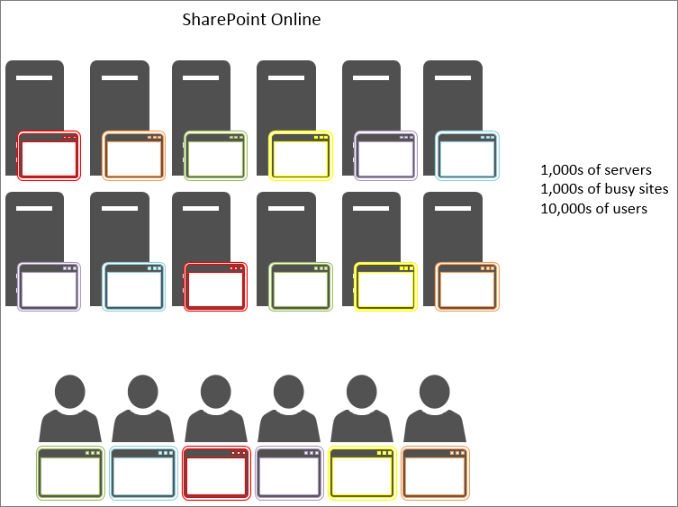

# Usando o cache de objetos com o SharePoint OnlineUsing the object cache with SharePoint Online

Este artigo explica a diferença entre usar o cache de objetos no SharePoint Server 2013 no local e o SharePoint Online.This article explains the difference between using the object cache in SharePoint Server 2013 on-premises and SharePoint Online.
  
Há um impacto negativo significativo em depender do cache de objetos na implantação do SharePoint Online. Qualquer dependência do cache de objetos no SharePoint Online reduzirá a confiabilidade da sua página.There is significant negative impact of relying on the object cache in SharePoint Online deployment. Any dependency on object cache in SharePoint Online will reduce the reliability of your page. 
  
## Como o SharePoint Online e o SharePoint Server 2013 objeto cache funcionaHow the SharePoint Online and SharePoint Server 2013 object cache works

Quando o SharePoint Server 2013 estiver hospedado no local, o cliente tem servidores web front-end privada que hospedam o cache de objetos. Isso significa que o cache é dedicado a um cliente e é limitado apenas pela quantidade de memória está disponível e ser alocado para o cache de objetos. Porque apenas um cliente sejam atendido no cenário local nos servidores web front-end geralmente têm usuários fazendo solicitações para os mesmos sites repetidamente. Isso significa que o cache obtém completo rapidamente e permanece completo dos resultados de consulta de lista e objetos do SharePoint que seus usuários estão solicitando regularmente.When SharePoint Server 2013 is hosted on-premises, the customer has private front-end web servers that host the object cache. This means the cache is dedicated to one customer and is only limited by how much memory is available and allocated to the object cache. Because only one customer is served in the on-premises scenario the front-end web servers typically have users making requests to the same sites over and over. This means that the cache gets full quickly and remains full of the list query results and SharePoint objects that your users are requesting on a regular basis.
  

  
Como resultado, na segunda vez que um usuário visita uma página, o tempo de carregamento da página aumenta. Após um mínimo de quatro carregamentos da mesma página, ela é armazenada em cache em todos os servidores front-end da Web.As a result, the second time a user visits a page, the page load time improves. After a minimum of four loads of the same page, the page is cached on all of the front-end web servers.
  
Por outro lado, no SharePoint Online, há muitos mais servidores, mas também muitos sites mais. Todos os usuários podem se conectar a um servidor web front-end diferente que não tem o cache preenchido. Ou então, talvez o cache obter preenchido para um servidor, mas o próximo usuário para que solicitações de servidor web front-end uma página de um site diferente. Ou, mesmo se o próximo usuário solicita a mesma página nos seus visita anterior, eles estarão com balanceamento de carga para um servidor web front-end diferente que não tem essa página em seu cache. Nesse último caso, o cache não ajuda os usuários em todas as.In contrast, in SharePoint Online there are many more servers but also many more sites. Each user may connect to a different front-end web server that doesn't have the cache populated. Or, perhaps the cache does get populated for a server, but the next user to that front-end web server requests a page from a different site. Or, even if the next user requests the same page as on their previous visit, they are load-balanced to a different front-end web server that doesn't have that page in its cache. In this last case, caching doesn't help the users at all.
  
Na figura a seguir, cada ponto representa uma página que um usuário está solicitando e onde ela é armazenada em cache. Cores diferentes representam diferentes clientes fazendo uso compartilhado da infraestrutura SaaS.In the following figure, each dot represents a page that a user is requesting and where it cached. Different colors represent different customers making shared use of the SaaS infrastructure.
  

  
Como você pode ver do diagrama, as chances de qualquer usuário determinado do visitando um servidor com a versão em cache da sua página são mínimas. Além disso, devido ao fato de que os servidores são compartilhados entre muitos sites e taxa de transferência grande, o cache não dura tempo, desde que apenas um pouco espaço para armazenar em cache está disponível.As you can see from the diagram, the chances of any given user hitting a server with the cached version of their page are slim. Also, due to the large throughput and fact that the servers are shared between many sites, the cache doesn't last long since there is only so much space for caching available.
  
Por todos esses motivos, confiar que os usuários obtenham objetos em cache não é uma maneira eficaz de assegurar uma experiência de usuário e um carregamento de página de qualidade no SharePoint Online.For all of these reasons, relying on users getting cached objects is not an effective way to ensure a quality user experience and page load times in SharePoint Online.
  
## Se não é possível confiar no cache de objetos para melhorar o desempenho no SharePoint Online, o que devemos usar?If we can't rely on the object cache to improve performance in SharePoint Online, what do we use instead?

Já que não é possível confiar no cache no SharePoint Online, você deve avaliar as abordagens de design alternativo para personalizações do SharePoint que usam o cache de objetos. Isso significa usar abordagens para problemas de desempenho que não dependem do cache de objetos para produzir bons resultados para os usuários. Isso é descrito em alguns outros artigos desta série e inclui:Since you shouldn't rely on caching in SharePoint Online, you should evaluate alternative design approaches for SharePoint customizations that use the object cache. This means using approaches for performance issues which do not rely on the object caching in order to produce good results for users. This is described in some of the other articles in this series and include:
  
- [Opções de navegação para o SharePoint OnlineNavigation options for SharePoint Online](navigation-options-for-sharepoint-online.md)
    
- [Minificação e agrupamento no SharePoint OnlineMinification and bundling in SharePoint Online](minification-and-bundling-in-sharepoint-online.md)
    
- [Usando redes de distribuição de conteúdoUsing content delivery networks](using-content-delivery-networks-with-sharepoint-online.md)
    
- [Atraso no carregamento de imagens e JavaScript no SharePoint OnlineDelay loading images and JavaScript in SharePoint Online](delay-loading-images-and-javascript-in-sharepoint-online.md)
    

