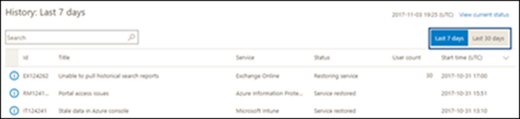

# Como verificar a integridade do serviço do Office 365How to check Office 365 service health

Você pode exibir a integridade do Office 365, do Yammer, do Microsoft Dynamics CRM e dos serviços de nuvem do Microsoft Intune na página **integridade do serviço** do Office 365 no centro de [administração do Microsoft 365](https://admin.microsoft.com).You can view the health of Office 365, Yammer, Microsoft Dynamics CRM, and Microsoft Intune cloud services on the Office 365 **Service health** page in the [Microsoft 365 admin center](https://admin.microsoft.com). Se tiver problemas com um serviço em nuvem, poderá verificar a integridade do serviço para determinar se é um problema conhecido com uma resolução em andamento, antes de chamar o suporte ou perder tempo na solução de problemas.If you are experiencing problems with a cloud service, you can check the service health to determine whether this is a known issue with a resolution in progress before you call support or spend time troubleshooting. 

Se você não conseguir entrar no portal de serviço, poderá usar a [página status do serviço](https://status.office365.com) para verificar se há problemas conhecidos, impedindo o login no locatário.If you are unable to sign in to the service portal, you can use the [service status page](https://status.office365.com) to check for known issues preventing you from logging into your tenant.
  
### Como verificar a integridade do serviçoHow to check service health

1. Acesse [https://portal.office.com/adminportal/home](https://portal.office.com/adminportal/home#/homepage) e entre com uma conta de administrador.Go to [https://portal.office.com/adminportal/home](https://portal.office.com/adminportal/home#/homepage) and sign in with an admin account. 
    
    > [!NOTE]
    > As pessoas às quais a função de administrador global ou do serviço é atribuída podem visualizar a integridade do serviço. Para permitir que os administradores do Exchange, SharePoint e Skype for Business visualizem a integridade do serviço, eles também devem receber a função de administrador do serviço.People who are assigned the global admin or service administrator role can view service health. To allow Exchange, SharePoint, and Skype for Business admins to view service health, they must also be assigned the Service admin role.
  
2. Para abrir a integridade do serviço, no centro de administração, vá para**integridade do serviço**de **integridade** > ou clique no **cartão de integridade do serviço** no **painel inicial**.To open service health, in the admin center, go to **Health** > **Service health**, or click the **Service health card** on the **Home dashboard**. O cartão do painel indica se existe um problema de serviço ativo e links para a página de integridade do serviço detalhada.The dashboard card indicates whether there is an active service issue and links to the detailed service health page.
    
    
  
3. O estado de integridade de cada serviço da nuvem é mostrado em um formato de tabela com um ícone para indicar possíveis estados.The health state of each cloud service is shown in a table format with an icon to indicate possible states.
    
> [!TIP]
> Você também pode usar o [aplicativo de administração do Office 365](https://go.microsoft.com/fwlink/p/?linkid=627216) no seu dispositivo móvel para visualizar a integridade do serviço, o que é uma ótima maneira de se manter atualizado com as notificações por push.You can also use the [Office 365 Admin app](https://go.microsoft.com/fwlink/p/?linkid=627216) on your mobile device to view Service health, which is a great way to stay current with push notifications. 
  
### Exibir detalhes da integridade do serviço postadoView details of posted service health

No modo de exibição padrão, todos os serviços e seu estado de integridade atual são exibidos.In the default view, all services and their current health state are displayed. Para filtrar o modo de exibição para serviços que estão experimentando um incidente, selecione **incidentes** da barra sombreada à esquerda.To filter your view to services currently experiencing an incident, select **Incidents** from the shaded bar on the left. A \*\*\*\* seleção de comunicados mostrará apenas os serviços que têm um comunicado publicado no momento.Selecting **Advisories** will show only services that currently have an advisory posted. No modo de exibição **todos os serviços** , clicar no estado de serviço exibido abrirá um modo de exibição de resumo do comunicado ou incidente.From the **All services** view, clicking the displayed service state will open a summary view of the advisory or incident. 
  

  
O resumo do aviso ou incidente fornece as seguintes informações:The advisory or incident summary provides the following information: 
  

  
1. Um identificador de problemas e uma declaração resumida do problema.An issue identifier and summary statement of the problem.
    
2. O status atual. Veja as definições de status neste artigo para obter uma explicação de cada status potencial.The current status. See status definitions in this article for an explanation of each potential status.
    
3. Uma descrição de como esse problema pode afetar os usuários.A description of how this issue can affect users.
    
4. O horário em que o problema foi iniciado e a última vez que a mensagem de integridade do serviço foi atualizada. Durante um problema, publicamos mensagens frequentes para que você saiba o progresso que estamos fazendo na aplicação de uma solução.The time that the issue was started and the last time that the service health message was updated. Throughout the duration of an issue we post frequent messages to let you know the progress that we're making in applying a solution.
    
5. Selecione o link **Mostrar detalhes** para ver mais detalhes sobre o problema, inclusive o histórico de todas as mensagens postadas enquanto trabalhamos em uma solução.Select the **Show details** link to see more details about the issue, including the history of all messages posted while we work on a solution. 
    
### Traduzir dados da integridade do serviçoTranslate service health details

Como as explicações de integridade do serviço são postadas em tempo real, elas não são traduzidas automaticamente para o seu idioma, e os detalhes de um evento de serviço estão apenas em inglês. Para traduzir a explicação, siga estas etapas:Because service health explanations are posted in real-time, they are not automatically translated to your language and the details of a service event are in English only. To translate the explanation, follow these steps:
  
1. Acesse [Tradutor](https://www.bing.com/translator/).Go to [Translator](https://www.bing.com/translator/).
    
2. Na página **Integridade do Serviço**, selecione um incidente ou aviso. Em **Mostrar Detalhes**, copie o texto sobre o problema.On the **Service health** page, select an incident or advisory. Under **Show details**, copy the text about the issue.
    
3. No Tradutor, cole o texto e escolha **Traduzir**.In Translator, paste the text and choose **Translate**.
    
### DefiniçõesDefinitions

A maioria dos serviços de tempo aparecerá como íntegro sem mais informações. Quando um serviço está com um problema, ele é identificado como um aviso ou um incidente e mostra um status atual.Most of the time services will appear as healthy with no further information. When a service is having a problem, the issue is identified as either an advisory or an incident and shows a current status.
  
> [!TIP]
> Os eventos de manutenção planejados não são exibidos na integridade do serviço. Você pode acompanhar os eventos de manutenção planejados atualizando-se com o **Centro de Mensagens**. Filtre para mensagens categorizadas como Preparar-se para a mudança para descobrir quando a mudança acontecerá, seu efeito e como se preparar para isso. Confira mais detalhes no [Centro de Mensagens no Office 365](https://support.office.com/article/38fb3333-bfcc-4340-a37b-deda509c2093).Planned maintenance events aren't shown in service health. You can track planned maintenance events by staying up to date with the **Message center**. Filter to messages categorized as Plan for change to find out when the change is going to happen, its effect, and how to prepare for it. See [Message center in Office 365](https://support.office.com/article/38fb3333-bfcc-4340-a37b-deda509c2093) for more details. 
  
### Incidentes e avisosIncidents and advisories

|||
|:-----|:-----|
||Quando um serviço exibe um aviso, estamos cientes de um problema que está afetando alguns usuários, mas o serviço ainda está disponível. Em um aviso, muitas vezes há uma solução para o problema, e o problema pode ser intermitente ou ter alcance e impacto limitados no usuário.If a service has an advisory shown, we are aware of a problem that is affecting some users, but the service is still available. In an advisory, there is often a workaround to the problem and the problem may be intermittent or is limited in scope and user impact.    |
||Quando um serviço exibe um incidente ativo, esse é um problema crítico, e o serviço ou uma função principal do serviço está indisponível. Por exemplo, os usuários podem não conseguir enviar e receber emails, ou não é possível entrar. Os incidentes terão um impacto perceptível nos usuários. Quando há um incidente em andamento, fornecemos atualizações sobre a investigação, os esforços de atenuação e a confirmação de resolução no painel de Integridade do serviço.If a service has an active incident shown, it's a critical issue and the service or a major function of the service is unavailable. For example, users may be unable to send and receive email or unable to sign-in. Incidents will have noticeable impact to users. When there is an incident in progress, we will provide updates regarding the investigation, mitigation efforts, and confirmation of resolution in the Service health dashboard.    |
   
### Definições de statusStatus definitions

|**Status****Status**|**Definição****Definition**|
|:-----|:-----|
|**Investigando****Investigating** | Estamos cientes de um possível problema e reunindo mais informações sobre o que está acontecendo e o escopo de impacto.We're aware of a potential issue and are gathering more information about what's going on and the scope of impact. |
|**Degradação do serviço****Service degradation** | Confirmamos que existe um problema que pode afetar o uso de um serviço ou recurso. Talvez você veja esse status se um serviço apresentar um desempenho mais lento do que o normal, se houver interrupções intermitentes ou se um recurso não estiver funcionando, por exemplo.We've confirmed that there is an issue that may affect use of a service or feature. You might see this status if a service is performing more slowly than usual, there are intermittent interruptions, or if a feature isn't working, for example. |
|**Interrupção do serviço****Service interruption** | Você verá esse status se determinarmos que um problema afeta a capacidade dos usuários de acessar o serviço. Neste caso, a questão é significativa e pode ser reproduzida de forma consistente.You'll see this status if we determine that an issue affects the ability for users to access the service. In this case, the issue is significant and can be reproduced consistently. |
|**Restaurando o serviço****Restoring service** | A causa do problema foi identificada, sabemos quais ações corretivas devem ser tomadas e estamos no processo de retomar o estado de integridade do serviço.The cause of the issue has been identified, we know what corrective action to take, and are in the process of bringing the service back to a healthy state. |
|**Recuperação estendida****Extended recovery** | Esse status indica que uma ação corretiva está em andamento para restaurar o serviço para a maioria dos usuários, mas levará algum tempo para alcançar todos os sistemas afetados. Você também poderá ver esse status se tivermos feito uma correção temporária para reduzir o impacto enquanto aguardamos para aplicar uma correção permanente.This status indicates that corrective action is in progress to restore service to most users but will take some time to reach all the affected systems. You might also see this status if we've made a temporary fix to reduce impact while we wait to apply a permanent fix. |
|**Investigação suspensa****Investigation suspended** | Se a nossa investigação detalhada de um problema potencial resultar em uma solicitação de informações adicionais de clientes para nos permitir investigar mais, você verá esse status. Se precisarmos de você para prosseguir, informaremos quais dados ou logs precisamos.If our detailed investigation of a potential issue results in a request for additional information from customers to allow us to investigate further, you'll see this status. If we need you to act, we'll let you know what data or logs we need. |
|**Serviço restaurado****Service restored** | Confirmamos que a ação corretiva solucionou o problema subjacente, e o serviço foi restaurado para um estado íntegro. Para descobrir o que deu errado, confira os detalhes do problema.We've confirmed that corrective action has resolved the underlying problem and the service has been restored to a healthy state. To find out what went wrong, view the issue details. |
|**Relatório de pós-incidente publicado****Post-incident report published** | Publicamos um relatório de incidente de postagem para um problema específico que inclui informações de causa raiz e próximas etapas para garantir que um problema semelhante não ocorra.We’ve published a Post Incident Report for a specific issue that includes root cause information and next steps to ensure a similar issue doesn’t reoccur. |
   
## HistóricoHistory

A integridade do serviço permite que você examine o status de integridade atual e visualize o histórico de qualquer comunicados de serviço e incidentes que impactaram o locatário nos últimos 30 dias.Service health lets you look at current health status and view the history of any service advisories and incidents that have impacted your tenant in the past 30 days. Para visualizar o estado de integridade anterior de todos os serviços, selecione **Exibir Histórico** na página **Integridade do Serviço**.To view the past health of all services, select **View history** on the **Service health** page. 
  

  
Uma lista de todas as mensagens de integridade de serviço postadas no cronograma selecionado é exibida, conforme mostrado abaixo:A list of all service health messages posted in the selected timeframe is displayed, as shown below:
  

  
Você pode visualizar o histórico de integridade dos últimos 7 dias ou dos últimos 30 dias.You may view the health history for either the last 7 days or last 30 days. Selecione qualquer linha para exibir mais detalhes sobre esse problema.Select any row to view more details about that issue.
  
Para obter mais informações sobre nosso compromisso com o tempo de atividade, consulte [operações transparentes do Office 365](https://go.microsoft.com/fwlink/?linkid=848695).For more information about our commitment to uptime, see [Transparent operations from Office 365](https://go.microsoft.com/fwlink/?linkid=848695).
  
## Deixar comentáriosLeave feedback

Nosso objetivo é garantir que as informações que fornecemos a você sobre um problema em andamento sejam oportunas, precisas e úteis. Para nos dizer como estamos trabalhando, selecione uma classificação por estrelas. Depois de nos dar uma pontuação de 1 a 5 estrelas, você pode fazer comentários sobre qualquer detalhe específico. Usaremos seus comentários para ajustar o nosso sistema de integridade do serviço.Our goal is to make sure that the information we provide to you about an ongoing issue is timely, accurate, and useful. To tell us how we're doing, select a star rating. After you give us a score from 1 to 5 stars, you can give feedback on any specific details. We'll use your feedback to fine-tune our service health system.
  
## Confira tambémSee also

[Relatórios de atividades no centro de administração do Microsoft 365Activity Reports in the Microsoft 365 admin center](https://support.office.com/article/0d6dfb17-8582-4172-a9a9-aed798150263)