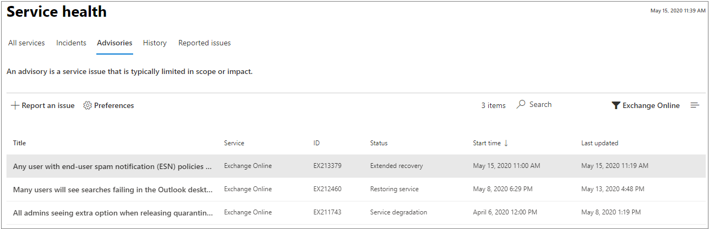

# Como verificar a integridade do serviço do Office 365How to check Office 365 service health

Você pode exibir a integridade de seus serviços da Microsoft, incluindo o Office na Web, o Yammer, o Microsoft Dynamics CRM e os serviços de nuvem do Microsoft Intune, na página **integridade do serviço** do Office 365 no [centro de administração](https://go.microsoft.com/fwlink/p/?linkid=2024339).You can view the health of your Microsoft services, including Office on the web, Yammer, Microsoft Dynamics CRM, and Microsoft Intune cloud services, on the Office 365 **Service health** page in the [admin center](https://go.microsoft.com/fwlink/p/?linkid=2024339). Se tiver problemas com um serviço em nuvem, poderá verificar a integridade do serviço para determinar se é um problema conhecido com uma resolução em andamento, antes de chamar o suporte ou perder tempo na solução de problemas.If you are experiencing problems with a cloud service, you can check the service health to determine whether this is a known issue with a resolution in progress before you call support or spend time troubleshooting.

Se você não conseguir entrar no portal de serviço, poderá usar a [página status do serviço](https://status.office365.com) para verificar se há problemas conhecidos, impedindo o login no locatário.If you are unable to sign in to the service portal, you can use the [service status page](https://status.office365.com) to check for known issues preventing you from logging into your tenant.
  
### Como verificar a integridade do serviçoHow to check service health

1. Vá para o centro de administração [https://admin.microsoft.com](https://go.microsoft.com/fwlink/p/?linkid=2024339)em e entre com uma conta de administrador.Go to the admin center at [https://admin.microsoft.com](https://go.microsoft.com/fwlink/p/?linkid=2024339), and sign in with an admin account.

    > [!NOTE]
    > As pessoas às quais a função de administrador global ou do serviço é atribuída podem visualizar a integridade do serviço.People who are assigned the global admin or service administrator role can view service health. Para permitir que os administradores do Exchange, SharePoint e Skype for Business visualizem a integridade do serviço, eles também devem receber a função de administrador do serviço.To allow Exchange, SharePoint, and Skype for Business admins to view service health, they must also be assigned the Service admin role. Para obter mais informações sobre as funções que podem exibir a integridade do serviço, consulte [about admin Roles](https://docs.microsoft.com/office365/admin/add-users/about-admin-roles?view=o365-worldwide#roles-available-in-the-microsoft-365-admin-center).For more information about roles that can view service health, see [About admin roles](https://docs.microsoft.com/office365/admin/add-users/about-admin-roles?view=o365-worldwide#roles-available-in-the-microsoft-365-admin-center).
  
2. Se você não estiver usando o novo centro de administração, na Home Page, marque a opção **Experimente o novo centro de administração** alternar no canto superior direito.If you are not using the new admin center, on the Home page, select the **Try the new admin center** toggle in the upper-right corner.

3. Para exibir a integridade do serviço, no centro de administração, vá para**integridade do serviço**de **integridade** > ou selecione o cartão de **integridade do serviço** no **painel inicial**.To view service health, in the admin center, go to **Health** > **Service health**, or select the **Service health** card on the **Home dashboard**. O cartão de painel indica se há um problema de serviço ativo e links para a página de **integridade do serviço** detalhada.The dashboard card indicates whether there is an active service issue and links to the detailed **Service health** page.
  
4. Na página **integridade do serviço** , o estado de integridade de cada serviço de nuvem é mostrado em um formato de tabela.On the **Service health** page, the health state of each cloud service is shown in a table format.

   

A guia **todos os serviços** (o modo de exibição padrão) mostra todos os serviços e seu estado de integridade atual.The **All services** tab (the default view) shows all services and their current health state. Um ícone e a coluna **status** indicam o estado de cada serviço.An icon and the **Status** column indicate the state of each service. Para filtrar o modo de exibição para serviços que estão experimentando um incidente, selecione a guia **incidentes** na parte superior da página.To filter your view to services currently experiencing an incident, select the **Incidents** tab at the top of the page. Selecionar a guia **avisos** mostrará apenas os serviços que atualmente têm um comunicado Postado.Selecting the **Advisories** tab will show only services that currently have an advisory posted. A guia **histórico** mostra o histórico de incidentes e avisos que foram resolvidos.The **History** tab shows the history of incidents and advisories that have been resolved.

Se você estiver tendo um problema que não aparece na lista, selecione **relatar um problema**, preencha o formato curto para nos dizer sobre o problema e selecione **Enviar**.If you're experiencing an issue that doesn't appear on the list, select **Report an issue**, complete the short form to tell us about the problem, and then select **Submit**.

> [!TIP]
> Você também pode usar o [aplicativo de administração do Office 365](https://go.microsoft.com/fwlink/p/?linkid=627216) no seu dispositivo móvel para visualizar a integridade do serviço, o que é uma ótima maneira de se manter atualizado com as notificações por push.You can also use the [Office 365 Admin app](https://go.microsoft.com/fwlink/p/?linkid=627216) on your mobile device to view Service health, which is a great way to stay current with push notifications. 
  
### Exibir detalhes da integridade do serviço postadoView details of posted service health

No modo de exibição **todos os serviços** , selecionar o status do serviço abrirá um modo de exibição de Resumo de comunicados ou incidentes.On the **All services** view, selecting the service status will open a summary view of advisories or incidents.
  

O resumo do aviso ou incidente fornece as seguintes informações:The advisory or incident summary provides the following information:

- **Título** -um resumo do problema.**Title** - A summary of the problem.
- **Service** -o nome do serviço afetado.**Service** - The name of the affected service.
- **ID** -um identificador numérico para o problema.**ID** - A numeric identifier for the problem.
- **Status** -como esse problema afeta o serviço.**Status** - How this problem affects the service.
- **Hora de início** – o horário em que o problema foi iniciado.**Start time** - The time when the issue started.
- **Última atualização** -a última vez que a mensagem de integridade do serviço foi atualizada.**Last updated** - The last time that the service health message was updated. Publicamos mensagens frequentes para que você saiba o progresso que estamos fazendo na aplicação de uma solução.We post frequent messages to let you know the progress that we're making in applying a solution.

Selecione o título do problema para ver a página detalhes do problema, que mostra mais informações sobre o problema, incluindo o [histórico](#history) de todas as mensagens postadas enquanto trabalhamos em uma solução.Select the issue title to see the issue detail page, which shows more information about the issue, including the [history](#history) of all messages posted while we work on a solution.

### Traduzir dados da integridade do serviçoTranslate service health details

Como as explicações de integridade do serviço são postadas em tempo real, elas não são traduzidas automaticamente para o seu idioma, e os detalhes de um evento de serviço estão apenas em inglês. Para traduzir a explicação, siga estas etapas:Because service health explanations are posted in real-time, they are not automatically translated to your language and the details of a service event are in English only. To translate the explanation, follow these steps:
  
1. Acesse [Tradutor](https://www.bing.com/translator/).Go to [Translator](https://www.bing.com/translator/).

2. Na página **Integridade do Serviço**, selecione um incidente ou aviso. Em **Mostrar Detalhes**, copie o texto sobre o problema.On the **Service health** page, select an incident or advisory. Under **Show details**, copy the text about the issue.

3. No Tradutor, cole o texto e escolha **Traduzir**.In Translator, paste the text and choose **Translate**.

### DefiniçõesDefinitions

Na maioria das vezes, os serviços serão exibidos como íntegros sem mais informações.Most of the time, services will appear as healthy with no further information. Quando um serviço está com um problema, ele é identificado como um aviso ou um incidente e mostra um status atual.When a service is having a problem, the issue is identified as either an advisory or an incident and shows a current status.
  
> [!TIP]
> Os eventos de manutenção planejados não são exibidos na integridade do serviço. Você pode acompanhar os eventos de manutenção planejados atualizando-se com o **Centro de Mensagens**. Filtre para mensagens categorizadas como Preparar-se para a mudança para descobrir quando a mudança acontecerá, seu efeito e como se preparar para isso. Confira mais detalhes no [Centro de Mensagens no Office 365](https://support.office.com/article/38fb3333-bfcc-4340-a37b-deda509c2093).Planned maintenance events aren't shown in service health. You can track planned maintenance events by staying up to date with the **Message center**. Filter to messages categorized as Plan for change to find out when the change is going to happen, its effect, and how to prepare for it. See [Message center in Office 365](https://support.office.com/article/38fb3333-bfcc-4340-a37b-deda509c2093) for more details.
  
### Incidentes e avisosIncidents and advisories

|||
|:-----|:-----|
||Quando um serviço exibe um aviso, estamos cientes de um problema que está afetando alguns usuários, mas o serviço ainda está disponível. Em um aviso, muitas vezes há uma solução para o problema, e o problema pode ser intermitente ou ter alcance e impacto limitados no usuário.If a service has an advisory shown, we are aware of a problem that is affecting some users, but the service is still available. In an advisory, there is often a workaround to the problem and the problem may be intermittent or is limited in scope and user impact.    |
||Quando um serviço exibe um incidente ativo, esse é um problema crítico, e o serviço ou uma função principal do serviço está indisponível. Por exemplo, os usuários podem não conseguir enviar e receber emails, ou não é possível entrar. Os incidentes terão um impacto perceptível nos usuários. Quando há um incidente em andamento, fornecemos atualizações sobre a investigação, os esforços de atenuação e a confirmação de resolução no painel de Integridade do serviço.If a service has an active incident shown, it's a critical issue and the service or a major function of the service is unavailable. For example, users may be unable to send and receive email or unable to sign-in. Incidents will have noticeable impact to users. When there is an incident in progress, we will provide updates regarding the investigation, mitigation efforts, and confirmation of resolution in the Service health dashboard.    |

### Definições de statusStatus definitions

|**Status****Status**|**Definição****Definition**|
|:-----|:-----|
|**Investigando****Investigating** | Estamos cientes de um possível problema e reunindo mais informações sobre o que está acontecendo e o escopo de impacto.We're aware of a potential issue and are gathering more information about what's going on and the scope of impact. |
|**Degradação do serviço****Service degradation** | Confirmamos que existe um problema que pode afetar o uso de um serviço ou recurso. Talvez você veja esse status se um serviço apresentar um desempenho mais lento do que o normal, se houver interrupções intermitentes ou se um recurso não estiver funcionando, por exemplo.We've confirmed that there is an issue that may affect use of a service or feature. You might see this status if a service is performing more slowly than usual, there are intermittent interruptions, or if a feature isn't working, for example. |
|**Interrupção do serviço****Service interruption** | Você verá esse status se determinarmos que um problema afeta a capacidade dos usuários de acessar o serviço. Neste caso, a questão é significativa e pode ser reproduzida de forma consistente.You'll see this status if we determine that an issue affects the ability for users to access the service. In this case, the issue is significant and can be reproduced consistently. |
|**Restaurando o serviço****Restoring service** | A causa do problema foi identificada, sabemos quais ações corretivas devem ser tomadas e estamos no processo de retomar o estado de integridade do serviço.The cause of the issue has been identified, we know what corrective action to take, and are in the process of bringing the service back to a healthy state. |
|**Recuperação estendida****Extended recovery** | Esse status indica que uma ação corretiva está em andamento para restaurar o serviço para a maioria dos usuários, mas levará algum tempo para alcançar todos os sistemas afetados. Você também poderá ver esse status se tivermos feito uma correção temporária para reduzir o impacto enquanto aguardamos para aplicar uma correção permanente.This status indicates that corrective action is in progress to restore service to most users but will take some time to reach all the affected systems. You might also see this status if we've made a temporary fix to reduce impact while we wait to apply a permanent fix. |
|**Investigação suspensa****Investigation suspended** | Se a nossa investigação detalhada de um problema potencial resultar em uma solicitação de informações adicionais de clientes para nos permitir investigar mais, você verá esse status. Se precisarmos de você para prosseguir, informaremos quais dados ou logs precisamos.If our detailed investigation of a potential issue results in a request for additional information from customers to allow us to investigate further, you'll see this status. If we need you to act, we'll let you know what data or logs we need. |
|**Serviço restaurado****Service restored** | Confirmamos que a ação corretiva solucionou o problema subjacente, e o serviço foi restaurado para um estado íntegro. Para descobrir o que deu errado, confira os detalhes do problema.We've confirmed that corrective action has resolved the underlying problem and the service has been restored to a healthy state. To find out what went wrong, view the issue details. |
|**Relatório de pós-incidente publicado****Post-incident report published** | Publicamos um relatório de incidente de postagem para um problema específico que inclui informações de causa raiz e próximas etapas para garantir que um problema semelhante não ocorra.We’ve published a Post Incident Report for a specific issue that includes root cause information and next steps to ensure a similar issue doesn’t reoccur. |

### HistóricoHistory

A integridade do serviço permite que você examine o status de integridade atual e visualize o histórico de quaisquer comunicados de serviço e incidentes que afetaram seu locatário nos últimos 30 dias.Service health lets you look at current health status and view the history of any service advisories and incidents that have affected your tenant in the past 30 days. Para exibir a integridade passada de todos os serviços, selecione **Exibir histórico** na página detalhes do problema.To view the past health of all services, select **View history** on the issue detail page.
  

  
Uma lista de todas as mensagens de integridade de serviço postadas no cronograma selecionado é exibida, conforme mostrado abaixo:A list of all service health messages posted in the selected timeframe is displayed, as shown below:
  

  
Expanda qualquer linha para exibir mais detalhes sobre o problema.Expand any row to view more details about the issue.
  
Para obter mais informações sobre nosso compromisso com o tempo de atividade, consulte [operações transparentes do Office 365](https://go.microsoft.com/fwlink/?linkid=848695).For more information about our commitment to uptime, see [Transparent operations from Office 365](https://go.microsoft.com/fwlink/?linkid=848695).
  
## Deixar comentáriosLeave feedback

Nosso objetivo é garantir que as informações que fornecemos a você sobre um problema em andamento sejam oportunas, precisas e úteis. Para nos dizer como estamos trabalhando, selecione uma classificação por estrelas. Depois de nos dar uma pontuação de 1 a 5 estrelas, você pode fazer comentários sobre qualquer detalhe específico. Usaremos seus comentários para ajustar o nosso sistema de integridade do serviço.Our goal is to make sure that the information we provide to you about an ongoing issue is timely, accurate, and useful. To tell us how we're doing, select a star rating. After you give us a score from 1 to 5 stars, you can give feedback on any specific details. We'll use your feedback to fine-tune our service health system.
  
## Confira tambémSee also

[Relatórios de atividades no centro de administração do Microsoft 365Activity Reports in the Microsoft 365 admin center](https://support.office.com/article/0d6dfb17-8582-4172-a9a9-aed798150263)